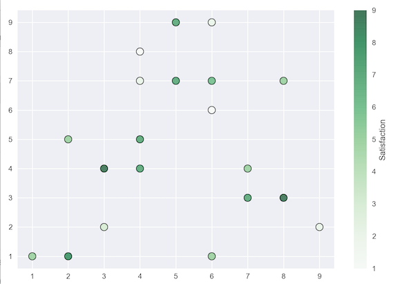
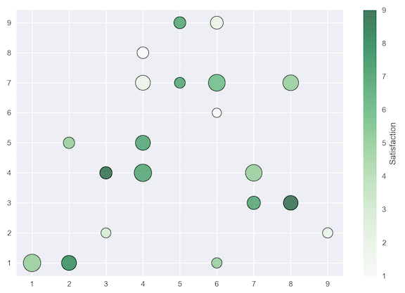

# Matplotlib Tutorial: Scatter Plots

## Quick start scatter plots

```
import pandas as pd
from matplotlib import pyplot as plt

plt.style.use('seaborn')

x = [5, 7, 8, 5, 6, 7, 9, 2, 3, 4, 4, 4, 2, 6, 3, 6, 8, 6, 4, 1]
y = [7, 4, 3, 9, 1, 3, 2, 5, 2, 4, 8, 7, 1, 6, 4, 9, 7, 7, 5, 1]

colors = [7, 5, 9, 7, 5, 7, 2, 5, 3, 7, 1, 2, 8, 1, 9, 2, 5, 6, 7, 5]

sizes = [209, 486, 381, 255, 191, 315, 185, 228, 174,
         538, 239, 394, 399, 153, 273, 293, 436, 501, 397, 539]
         
plt.scatter(x,y, s=100, c=colors, edgecolors='black', cmap='Greens', sizes=sizes, linewidths=1, alpha=0.75)

cbar = plt.colorbar()
cbar.set_label('Satisfaction')

plt.tight_layout()

plt.show()
```

* `plt.scatter()` **Draws the scatter plot**
* **Color-map**: `cmap='Greens'` 
* **size of of scatter**: `sizes=sizes`
* **color changes** : `alpha=0.75` 
* **add colorbar**: `plt.colorbar()` and set label for colorbar `cbar.set_label('Satisfaction')`



## Readl data plot

```
import pandas as pd
from matplotlib import pyplot as plt

plt.style.use('seaborn')

data = pd.read_csv('Code_in_SAP/data4.csv')
view_count = data['view_count']
likes = data['likes']
ratio = data['ratio']

plt.scatter(view_count, likes, c=ratio, cmap='summer',
            edgecolor='black', linewidth=1, alpha=0.75)
# colors 

cbar = plt.colorbar()
cbar.set_label('Like/Dislike Ratio')

plt.xscale('log')
plt.yscale('log')
# Add log style

plt.title('Trending YouTube Videos')
plt.xlabel('View Count')
plt.ylabel('Total Likes')

plt.tight_layout()

plt.show()
```

* **Add the log style to plot** `plt.xscale('log')` and `plt.yscale('log')`




