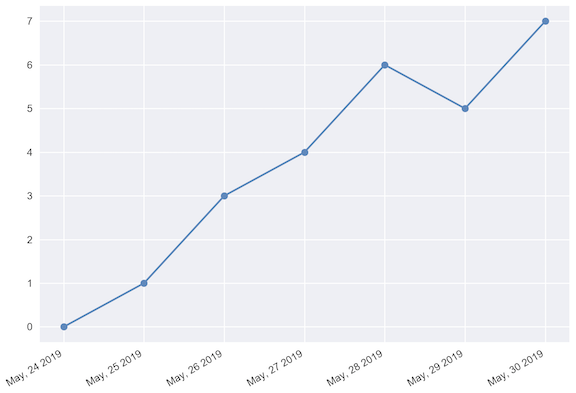
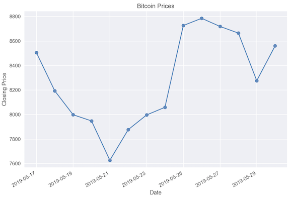

# Matplotlib Tutorial: Plotting Time Series Data

## Quick Start a Time Series Plot

```
import pandas as pd
from datetime import datetime, timedelta
from matplotlib import pyplot as plt
from matplotlib import dates as mpl_dates

plt.style.use('seaborn')

dates = [
    datetime(2019, 5, 24),
    datetime(2019, 5, 25),
    datetime(2019, 5, 26),
    datetime(2019, 5, 27),
    datetime(2019, 5, 28),
    datetime(2019, 5, 29),
    datetime(2019, 5, 30)
]

y = [0, 1, 3, 4, 6, 5, 7]

plt.plot_date(dates, y, linestyle='solid')
plt.gcf().autofmt_xdate()
# rotate and align the tick labels so they look better

date_format = mpl_dates.DateFormatter('%b, %d %Y')
plt.gca().xaxis.set_major_formatter(date_format)

plt.tight_layout()

plt.show()
```

* **Draw the date time series plot** `plt.plot_date(dates, y, linestyle='solid')`
* `plt.gcf().autofmt_xdate()` **rotate and align the tick labels so they look better**
* `from matplotlib import dates as mpl_dates` **import date formatter**
* `date_format = mpl_dates.DateFormatter('%b, %d %Y')` **Set date time format**
* **Set the formatter of the major ticker.** 




## Real world data analysis

```
import pandas as pd
from datetime import datetime, timedelta
from matplotlib import pyplot as plt
from matplotlib import dates as mpl_dates

plt.style.use('seaborn')

data = pd.read_csv('Code_in_SAP/data5.csv')

data['Date'] = pd.to_datetime(data['Date'])
data.sort_values('Date', inplace=True)
# Panda to sort the date value

price_date = data['Date']
price_close = data['Close']

plt.plot_date(price_date, price_close, linestyle='solid')

plt.gcf().autofmt_xdate()

plt.title('Bitcoin Prices')
plt.xlabel('Date')
plt.ylabel('Closing Price')

plt.tight_layout()

plt.show()
```

* `data.sort_values()`  **Panda to sort the date value**

 


