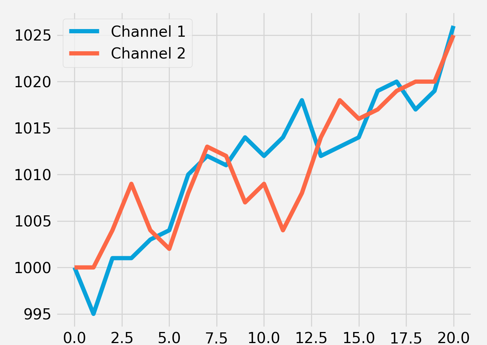
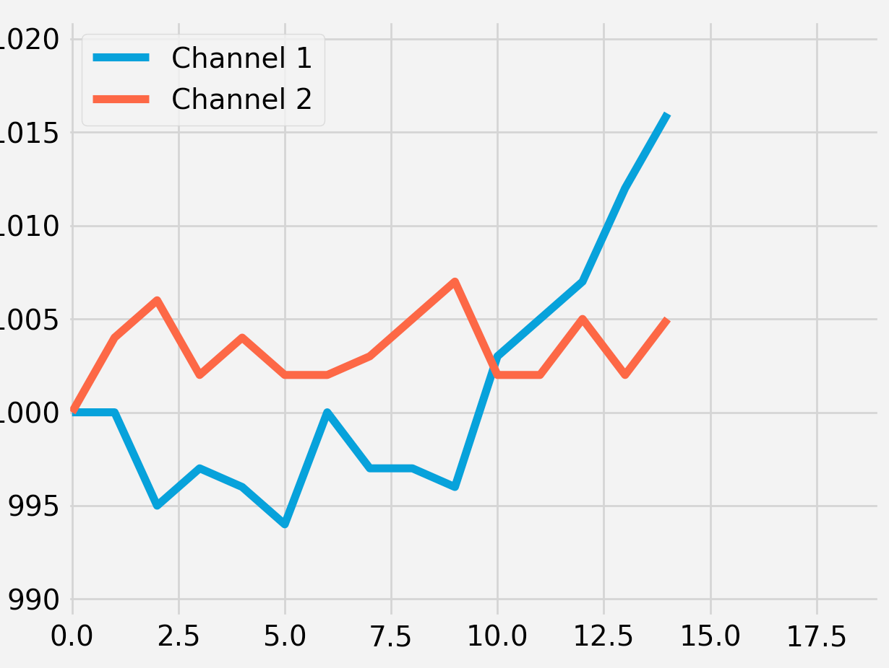

# Matplotlib Tutorial: Plotting Live Data in Real-Time

### Generate real import data

```
import csv
import random
import time

x_value = 0
total_1 = 1000
total_2 = 1000

fieldnames = ["x_value", "total_1", "total_2"]


with open('data6.csv', 'w') as csv_file:
    csv_writer = csv.DictWriter(csv_file, fieldnames=fieldnames)
    csv_writer.writeheader()

while True:

    with open('data6.csv', 'a') as csv_file:
        csv_writer = csv.DictWriter(csv_file, fieldnames=fieldnames)

        info = {
            "x_value": x_value,
            "total_1": total_1,
            "total_2": total_2
        }

        csv_writer.writerow(info)
        print(x_value, total_1, total_2)

        x_value += 1
        total_1 = total_1 + random.randint(-6, 8)
        total_2 = total_2 + random.randint(-5, 6)

    time.sleep(1)
```

**`data6.csv`**

```x_value,total_1,total_2
0,1000,1000
1,1000,1004
2,995,1006
3,997,1002
4,996,1004
.,.,.
```


## Start real-time chart

```
import random
from itertools import count
import pandas as pd
import matplotlib.pyplot as plt
from matplotlib.animation import FuncAnimation

plt.style.use('fivethirtyeight')

x_vals = []
y_vals = []

index = count()


def animate(i):
    data = pd.read_csv('Code_in_SAP/data6.csv')
    x = data['x_value']
    y1 = data['total_1']
    y2 = data['total_2']

    plt.cla()

    plt.plot(x, y1, label='Channel 1')
    plt.plot(x, y2, label='Channel 2')

    plt.legend(loc='upper left')
    plt.tight_layout()


ani = FuncAnimation(plt.gcf(), animate, interval=1000)

plt.tight_layout()
plt.show()
```

 

## Final Code

```
# Another way to do it without clearing the Axis
from itertools import count
import pandas as pd
import matplotlib.pyplot as plt
from matplotlib.animation import FuncAnimation

plt.style.use('fivethirtyeight')

x_vals = []
y_vals = []

plt.plot([], [], label='Channel 1')
plt.plot([], [], label='Channel 2')


def animate(i):
    data = pd.read_csv('Code_in_SAP/data6.csv')
    x = data['x_value']
    y1 = data['total_1']
    y2 = data['total_2']

    ax = plt.gca()
    line1, line2 = ax.lines

    line1.set_data(x, y1)
    line2.set_data(x, y2)

    xlim_low, xlim_high = ax.get_xlim()
    ylim_low, ylim_high = ax.get_ylim()

    ax.set_xlim(xlim_low, (x.max() + 5))

    y1max = y1.max()
    y2max = y2.max()
    current_ymax = y1max if (y1max > y2max) else y2max

    y1min = y1.min()
    y2min = y2.min()
    current_ymin = y1min if (y1min < y2min) else y2min

    ax.set_ylim((current_ymin - 5), (current_ymax + 5))


ani = FuncAnimation(plt.gcf(), animate, interval=1000)

plt.legend()
plt.tight_layout()
plt.show()
```

 


