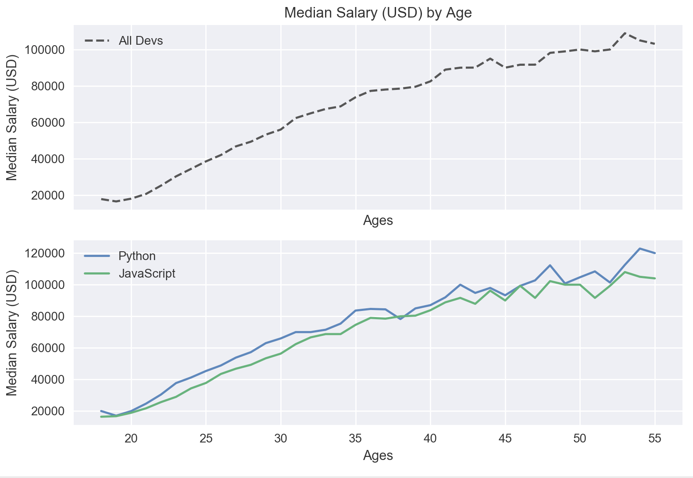

# Matplotlib Tutorial: Subplots

```
import pandas as pd
from matplotlib import pyplot as plt

plt.style.use('seaborn')

# plt.gcf() # get current figure
# plt.gca() # get current axis

data = pd.read_csv('Code_in_SAP/data7.csv')
ages = data['Age']
dev_salaries = data['All_Devs']
py_salaries = data['Python']
js_salaries = data['JavaScript']

fig, (ax1, ax2) = plt.subplots(nrows=2, ncols=1, sharex=True)   
# figure and axis / two rows and one cols in one figure
# sharex=True, two plot share one same X axis
# print(ax)


ax2.plot(ages, py_salaries, label='Python')
ax2.plot(ages, js_salaries, label='JavaScript')

ax1.plot(ages, dev_salaries, color='#444444',
         linestyle='--', label='All Devs')

ax1.legend()
ax1.set_title('Median Salary (USD) by Age')
ax1.set_xlabel('Ages')
ax1.set_ylabel('Median Salary (USD)')


ax2.legend()
ax2.set_xlabel('Ages')
ax2.set_ylabel('Median Salary (USD)')

plt.tight_layout()

plt.show()
```

* `fig, (ax1, ax2) = plt.subplots(nrows=2, ncols=1, sharex=True) `  
* `ax1.plot()`
* `ax1.set_title()`, `ax1.set_xlabel()`, `ax1.set_ylabel()`

 
