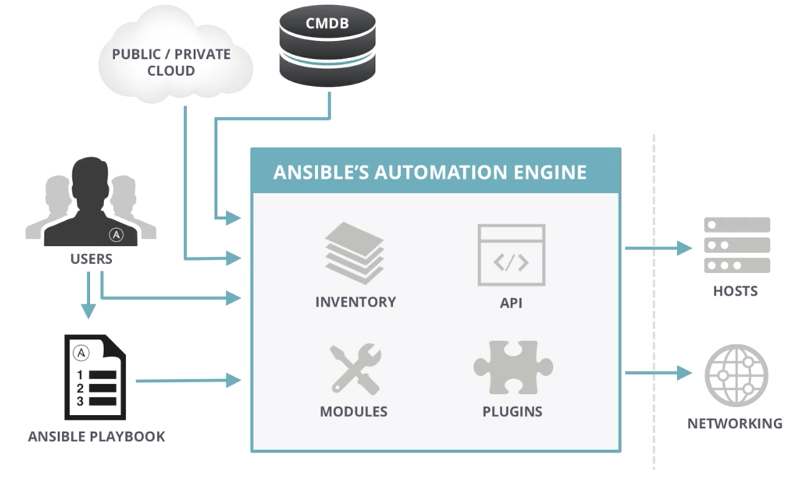
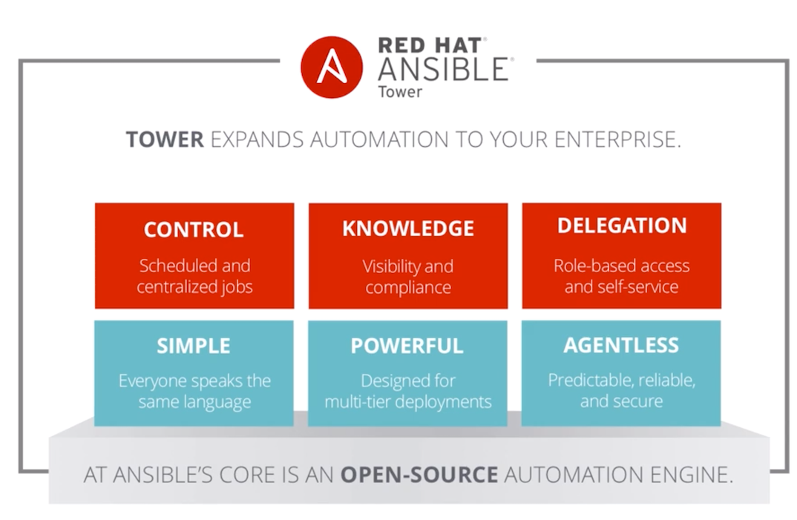

# Ansible Introduction

## What is Ansible

It's a **simple automation language** that can perfectly describe an IT application infrastructure in Ansible Playbooks. 


It's an **automation engine** that runs Ansible Playbooks. 

Ansible Tower by Red Hat is an **enterprise framework** for controlling, securing and managing your Ansible automation with a **UI and restful API**. 

## Why Ansible

### Simple

* Human readable automation
* No special coding skills needed
* Tasks executed in order
* **Get executed quickly**

### Powerful

* App deployment
* Configuration management
* Workflow orchestration
* **Orchestrate the app life cycle**

### Agentless 

* Agentless architecture
* Uses OpenSSH $ WinRM
* No agent to exploit or update
* **More efficient & more secure**

## What Can I use ansible to do

* **Config management**
* **App Deployment**
* **Provision**
* **Continuous Delivery**
* **Security & Compliance**
* **Orchestration**


## Ansible Architecture



### MODULES

* **Modules control systems resources, packages, files or nearly anything else** 
* Over 450 ship with Ansible 
* Enable regular users to easily work with complex systems 
* But more on these later... 

## Where go get it and how to install

### Os packages

* EPEL
* APT

### Also from 

* Pypi
* Sources (via Github)


## Ansible lanaguage basics

### playbooks

* **Plain-text YAML files that describe the desired state of something** 
* **Human and machine readable** 
* **Can be used to build entire application environments**

### variables

There are many different ways to source variables

* Playbooks
* Files
* **Inventories(group vars, host vars)**
* Command line
* Discovered variables(fact)
* Ansible Tower

### Inventories

* Static lines of servers
* Ranges
* Other custom things
* Dynamic list of servers: AWS, Azure, GCP. etc

### Basic of playbooks

* **Playbooks** contain plays
* Plays contain **tasks**
* Tasks call **modules**

* **Tasks** run **sequentially**

* Handlers are tiggered by tasks, and are run once, at the end of plays


```
---
- name: install and start apache 
  hosts: web 
  remote_user: justin 
  become_method: sudo  
  become_user: root
  vars: 
    http_port: 80 
    max_clients: 200 

  tasks: 
  - name: install httpd 
    yum: name=httpd state=latest 
  - name: write apache config file 
    template: src=srv/httpd.j2 dest=/etc/httpd.conf 
    notify: 
    - restart apache 
  - name: start httpd 
    service: name=httpd state=running 

  handlers: 
  - name: restart apache 
  service: name=httpd state=restarted 
```

### MODULES 

There are over 450 Ansible-provided modules that automate nearly every part of your environment 


Standard structure: 

`module: directivel=value directive2=value `

http://docs.ansible.com/ansible/modules_by_category.html 

## Ansible Simple Usage

###  Advanced Ansible Playbook Capabilities

Ansible has many different ways to **alter how Playbooks run**: 

```
with items, failed when, changed when, until, ignore errors 
```

`http://docs.ansible.com/ansible/playbooks_specialiopics.html `


**Ansible Roles** are a special **kind of Playbook** that are **fully self-contained** with `tasks`, `variables`, `configurations templates`, and `other supporting files`. 


`http://docs.ansible.tom/ansible/playbooks_roles.html`

 
### Using AD-Hoc Commands

**Runs a command** or **calls module** directory from the **command line**, no Playbook required

```
$ ansible <inventory> <options> 
$ ansible web -a /bin/date 
$ ansible web -m ping 
$ ansible web -m yum -a "name=openssl state=latest" 
```
### Running Playbooks

**Runs a playbook** on selected inventories from the **command line**

```
$ ansible-playbook <options> 
$ ansible-playbook my-playbook.yml 
```

### CHECK MODE `-C`

**Dry-run** for ad-hoc commands and Playbooks 

**Validate** Playbook runs **before making state changes** on target systems 

```
$ ansible web -C -m yum -a "name=httpd state=latest" 
$ ansible-playbook -C my-playbook.yml 
```

### Ansible Tower




## Ansible Galaxy

* Source of **community** and **vendor-provided** Ansible Roles to **help you get started faster.** 
* **Learn from others** that are automating with Ansible. 
* Galaxy Roles are often **directly runnable** with little modification. 

