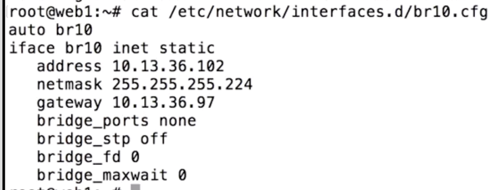
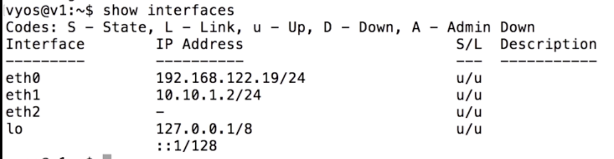

# Network Management with Ansible


## `netaddr`

```
---
- hosts: localhost
  connection: local
  vars:
    net1: 10.0.0.0/24
    net2gw: 10.10.0.1
    net2nm: 255.255.0.0
  tasks:
  - set_fact: net2="{{net2gw}}/{{net2nm}}"
  - set_fact: net2gw={{net2|ipaddr('host/prefix')}}
  - debug:
      msg: "net2 is {{net2}}, gateway is {{net2gw}}"
```

*  `set_fact` – Set host facts from a task
 
```
$ ansible-playbook -i ../inventory.ini 5-1netaddr.yaml --check
```

```
fatal: [localhost]: FAILED! => {"msg": "The ipaddr filter requires python's netaddr be installed on the ansible controller"}
```

**Fix problem:**

```
$ pip3 install netaddr
```

```
ok: [localhost] => {
    "msg": "net2 is 10.10.0.1/255.255.0.0, gateway is 10.10.0.1/16"
}
```

### ipaddr filter

`ipaddr()` is a Jinja2 filter designed to provide an interface to the `netaddr` Python package from within Ansible. It can operate on strings or lists of items, test various data to check if they are valid IP addresses, and manipulate the input data to extract requested information. `ipaddr()` works with both IPv4 and IPv6 addresses in various forms. There are also additional functions available to manipulate IP subnets and MAC addresses.


## `netaddr_incremenet`

```
---
- hosts: localhost
  connection: local
  vars:
    netgw: 10.10.0.1
    netnm: 255.255.255.224
  tasks:
  - set_fact: net2="{{netgw}}/{{netnm}}"
  - set_fact: net2gw="{{net2|ipaddr('host/prefix')}}"
  - debug:
      msg: "net2 is {{net2}}, gateway is {{net2gw}}"
  - set_fact: net2int="{{netgw|ipaddr('int') + 1}}"
  - set_fact: net2="{{net2int|ipv4('address')}}/{{net2gw|ipaddr('prefix')}}"
  - debug:
      msg: "net2 is now {{net2}}"
```

```
$ ansible-playbook -i ../inventory.ini 5-2increment.yaml --check
```

```
...
TASK [debug] ****************************************************************************************
ok: [localhost] => {
    "msg": "net2 is 10.10.0.1/255.255.255.224, gateway is 10.10.0.1/27"
}
...
TASK [debug] ****************************************************************************************
ok: [localhost] => {
    "msg": "net2 is now 10.10.0.2/27"
}
```


## `Network interface config for hosts`

### `hostint.yaml`

```
---
- hosts: web
  vars:
    network: 10.13.36.96/27
    host: 6
  tasks:
  - set_fact: hostint="{{network|ipaddr('network')|ipaddr('int')}}"
  - set_fact: addrint="{{host+hostint|int()}}"
  - set_fact: address="{{addrint|ipv4('address')}}"
  - set_fact: netmask="{{network|ipaddr('netmask')}}"
  - set_fact: gatewayint={{hostint|int()+1}}
  - set_fact: gateway="{{gatewayint|ipv4('address')}}"
  - name: ensure network file is set to use interfaces.d
    lineinfile:
      dest: /etc/network/interfaces
      regexp: "^source /etc/network/interfaces.*$"
      line: "source /etc/network/interfaces.d/*.cfg"
      insertafter: EOF
    tags:
      - create
  - name: upload network template for internal bridge
    template:
      src: templates/br10.j2
      dest: /etc/network/interfaces.d/br10.cfg
    tags:
      - create
  - name: install bridge utils
    apt:
      name: bridge-utils
      state: installed
    tags:
      - create
```

### `tempaltes/br10.j2`


```
auto br10
iface br10 inet static
   address {{address}}
   netmask {{netmask}}
   gateway {{gateway}}
   bridge_ports none
   bridge_stp off
   bridge_fd 0
   bridge_maxwait 0
```

```
$ ansible-playbook -i ../inventory.ini 5-3hostint.yaml --check
```




## Network device interface config

**vyos_config – Manage VyOS configuration on remote device**


**VyOS** is a fully open source network OS that runs on a wide range of hardware, virtual machines, and cloud providers and offers features for any networks, small and large.

```
---
- hosts: all
  connection: local
  become: true
  vars:
    tenone: 10.10.1.0/24
  tasks:
  - set_fact: vonenetint="{{tenone|ipaddr('network')}}"
  - set_fact: vonenm="{{tenone|ipaddr('prefix')}}"
  - set_fact: tenoneaddrint="{{vonenetint|ipaddr('int')+id}}"
  - set_fact: tenoneaddr="{{tenoneaddrint|ipv4('address')}}/{{vonenm}}"
  - debug: var=tenoneaddr
  - vyos_config:
     provider:
       username: vyos
       password: vyos
       host: '{{hostvars[inventory_hostname].host}}'
     lines:
       - set interface ethernet eth1 address {{tenoneaddr}}
```

`invetory-vyos.ini`

```
[vyos]
v1 host=192.168.122.19 id=2
v2 host=192.168.122.120 id=3
```

```
$ ansible-playbook -i ../inventory-vyos.ini 5-4vyos_ip.yml
```

