# AWS IAM权限策略管理

* `AWS IAM`简介
	* AWS Identity and Access Management (IAM)
	* 访问`AWS`的方式
	* AWS IAM策略概览
	* `Principal` – 举例
	* `Action` – 举例
	* `Resource` – 举例
	* `Condition` - 举例
	* 访问控制策略的类型 
	*  `AWS IAM`策略的执行过程
	*  锁定对`Amazon EC2`实例的访问
* 利用标签(`Tag`)功能实现`ABAC`(Attribute Based Access Control)
	*  单账号，通过 `AWS IAM` 和 `Amazon VPC `隔离
	*  多账号设计
	*  AWS Landing Zone解决方案
* AWS IAM权限管控场景实践
	* 使用案例 1 - 用户通过SSO访问 AWS 账户和资源
	* 案例2延伸: 应用程序的用户直接访问AWS资源
	* 使用案例 3 - 用户访问您自己的应用程序
	* 使用案例 4 – 跨账号访问AWS资源

##  AWS IAM简介

###  AWS Identity and Access Management (IAM)

`AWS Identity and Access Management (IAM)` 是一种 Web 服务，可以帮助您安全地控制对 `Amazon Web Services (AWS)` 资源的访问。您可以使用 `IAM` 控制对 哪个用户进行身份验证 (登录) 和授权 (具有权限) 以使用资源。

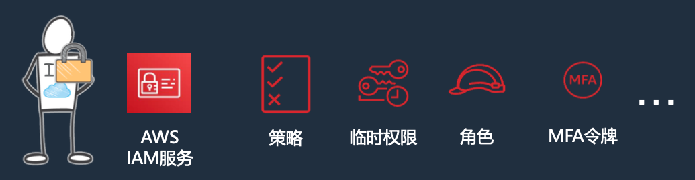

### 访问AWS的方式

* `Web Console` → 用户名密码
* `API, CLI, SDK` → `Access keys`

### AWS IAM策略概览

策略指定允许用户和系统在哪些资源上执行的`AWS`服务操作

> 注意: 默认情况下是Access is denied

* `JSON`格式的文档规范
* 包含指定的语句(权限):
	* `AWS IAM`主体可以采取什么行动
	* 可以访问哪些资源

```
{ 
 "Statement":[{
	"Effect":"effect",
	"Principal":"principal",      # P
	"Action":"action",            # A
	"Resource":"arn",            # R
	"Condition":{.                  # C
		"condition":{ 
			"key":"value" }
			}
 		}
	] 
}
```
> 支持多段`statement`语句，每段语句都包含`PARC`


###  Principal – 举例

* 允许或拒绝访问资源的实体
* 通过`ARN`来表示 (` Amazon Resource Name` )

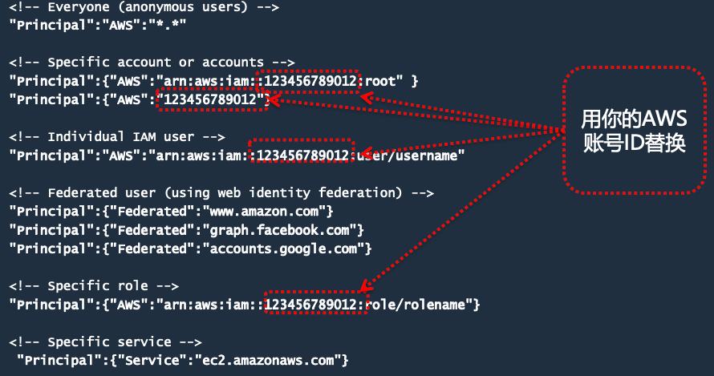

### Action – 举例

* 描述应允许或拒绝的访问类型 
* 您可以在文档中找到这些内容，或使用策略编辑器获取下拉列表 
* 语句必须包含`Action`或`NotAction`元素

```
<!-- EC2 action -->
"Action":"ec2:StartInstances"

<!-- IAM action -->
"Action":"iam:ChangePassword"

<!– Amazon S3 action -->
"Action":"s3:GetObject"

<!-- Specify multiple values for the Action element-->
"Action":["sqs:SendMessage","sqs:ReceiveMessage"]

<-- Wildcards (* or ?) in the action name. Below covers create/delete/list/update-->
"Action":"iam:*AccessKey*"
```

**Action的四种访问级别**:

* List – 查看资源列表
* Read – 读取资源中的内容
* Write – 创建，删除或修改资源
* Permissions – 授予或修改资源权限

### Resource – 举例

* 正在请求的一个或多个对象
* 语句必须包含`Resource`或`NotResource`元素

```
<-- S3 Bucket -->
 "Resource":"arn:aws:s3:::my_corporate_bucket/*"
 
<-- Amazon SQS queue-->
"Resource":"arn:aws:sqs:us-west-2:123456789012:queue1"

<-- Multiple Amazon DynamoDB tables -->
"Resource":["arn:aws:dynamodb:us-west- 2:123456789012:table/books_table",
"arn:aws:dynamodb:us-west- 2:123456789012:table/magazines_table"]

<-- All EC2 instances for an account in a region -->
"Resource": "arn:aws:ec2:us-east-1:123456789012:instance/*"
```

###  Condition - 举例 

如果您想限制对时间范围和`IP`地址范围的访问，该怎么办?

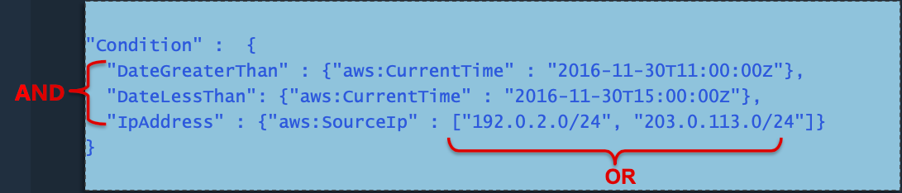


允许用户在以下条件下访问资源:

* The time is after 11:00 A.M. on 11/30/2016 AND
* The time is before 3:00 P.M. on 11/30/2016 AND
* The request comes from an IP address in the `192.0.2.0/24` OR `203.0.113.0/24` range 必须

**满足所有条件才能使语句评估为TRUE.**

###  访问控制策略的类型

#### 基于IAM策略

**绑定在IAM user, group, role上.**

* Managed policies 
* Inline polices

#### 基于资源的策略

**绑定在`resource`上.**

* Amazon S3 buckets
* Amazon Glacier vaults 
* Amazon SNS topics
* Amazon SQS queues 
* Amazon VPC Endpoint Policy

#### 策略生成器:

https://awspolicygen.s3.amazonaws.com/policygen.html

###  AWS IAM策略的执行过程

AWS IAM策略的逻辑和顺序，如下图

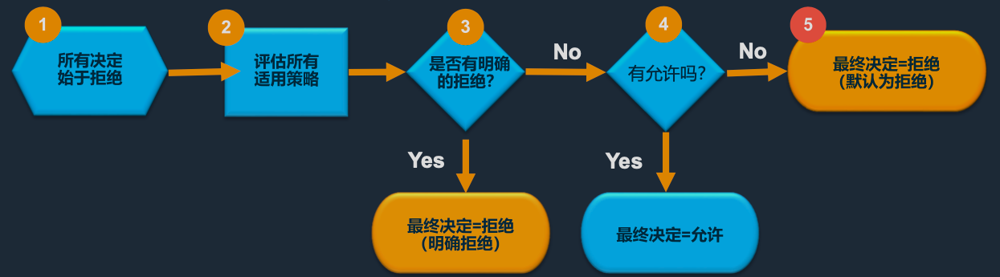

1. 用户权限策略检查——检查该`IAM`实体是否被授予权限 
2. 资源权限策略检查——检查存储桶所有者是否已授予权限(1，2是OR的关系) 
3. 具体策略检查——查找策略中明确的“允许” 

> 策略执行: 任何策略中的明确拒绝均会覆盖所有允许条件

###  锁定对`Amazon EC2`实例的访问
```
{
"Version": "2012-10-17", "Statement": [
        {
            "Effect": "Allow",
            "Action": [
                "ec2:Describe*",
                "ec2:GetConsole*".   # 允许从EC2控制台查看所有内容
            "Resource": "*"
        },
        {
            "Sid": "THISLIMITSACCESSTOOWNINSTANCES",
            "Effect": "Allow",
            "Action": [
		   "ec2:RebootInstances", 
		   "ec2:StartInstances", 
		   "ec2:StopInstances", 
		   "ec2:TerminateInstances"
   	 	],
		"Resource": "arn:aws:ec2:*:123456789012:instance/*",
		"Condition": {                 #  仅在此标记条件为真时才允许
			   "StringEquals": {
			   	  "ec2:ResourceTag/OwnerTag": "${aws:username}"  # 在此处指定键值(使用标签)和值(变量)
			 }
		  }
	    }  	
     ] 
}}
```

##  利用标签(`Tag`)功能实现`ABAC`(Attribute Based Access Control)

`Anders` 的`IAM`策略里赋予他访问所有带有`Project=Blue` 标签的`EC2`实例的所有`API`操作

```
 
{
	"Version": "2012-10-17", 
	"Statement": [
	 {
		"Effect": "Allow", 
		"Action": "ec2:*", 
		"Resource": "*", 
		"Condition": {
			"StringEquals": { 
				"ec2:ResourceTag/Project" : "Blue"
	  } 			
	 }
	} 
   ]
}
```

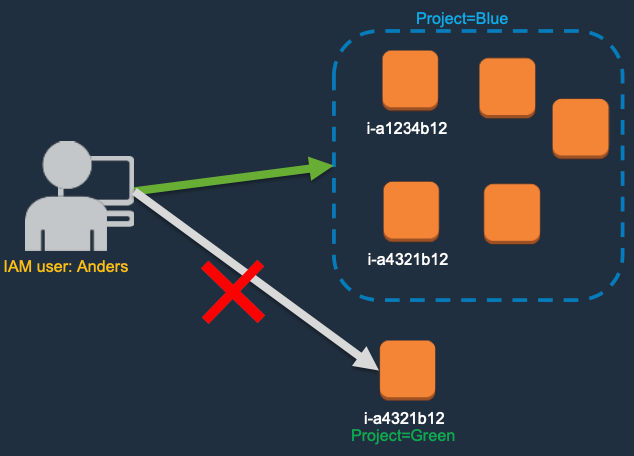

###  Top 11 AWS IAM 最佳实践

0. `Users` – 为每个用户创建单独的`IAM User`.
1. `Permissions `– 最小权限原则.
2. `Groups` – 利用`IAM Group`简化用户组权限管理.
3. `Conditions` – 利用`Conditions`实现精细化权限管控.
4. `Auditing` – 开启 `AWS CloudTrail` 以记录所有AWS API访问.
5. `Password` – 配置强密码策略.
6. `Rotate` – 定期轮换密钥.
7. `MFA` – 为高权限用户开启 MFA 认证.
8. `Sharing` – 利用`IAM Role`共享权限.
9. `Role`s – 利用 `IAM roles`赋予和控制某服务访问其他服务的权限.
10. `Root` – 根用户禁止用于日常运维.

##  AWS 多账号权限管理

###   AWS 账号

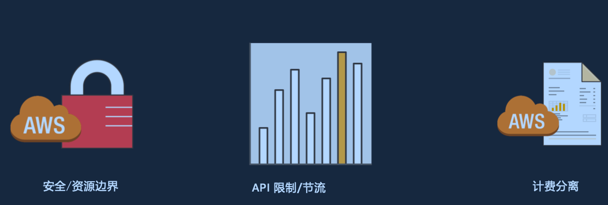

### 为什么一个账号不够


###  单账号，通过 `AWS IAM` 和 `Amazon VPC `隔离

* “灰色”边界 
* 逐渐变得复杂和混乱 
* 资源难以追踪 
* 用户之间可能互相影响

###  我应该创建什么账号?

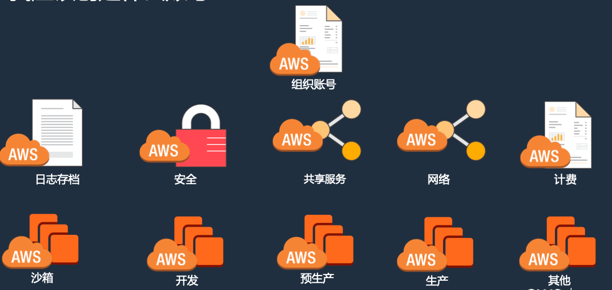

###  多账号设计

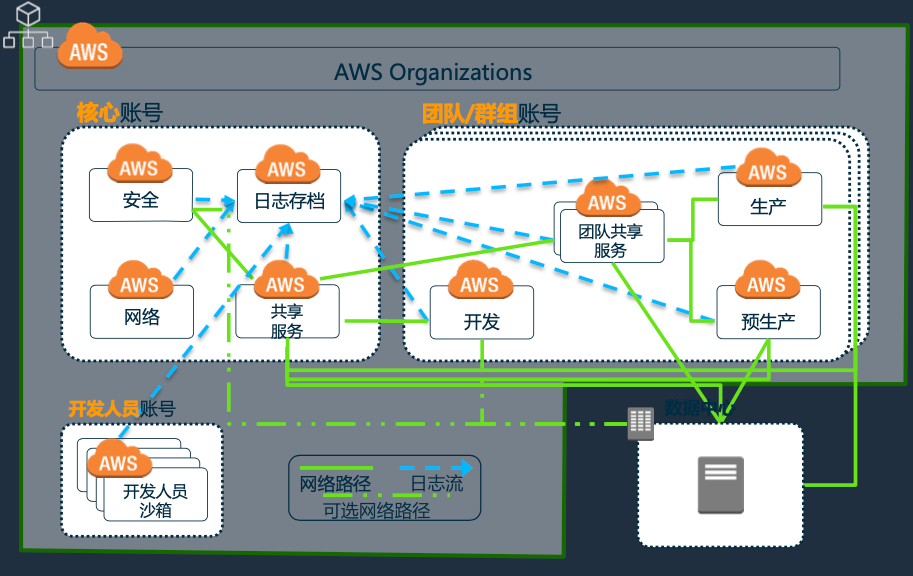

* 组织:账号管理
* 日志存档:安全日志 
* 安全:安全工具、AWS Config 规则 
* 共享服务:目录、限值监控 
* 网络:`AWS Direct Connect` 
* 开发沙箱: 实验、学习
* Dev:开发
* `Pre-Prod`: Staging
* `Prod`: 生产
* **团队共享服务**: 团队共享服务、数据湖

###  AWS Landing Zone解决方案

一种易于部署的解决方案，可自动启用如下设置

**AWS 多账户新环境**

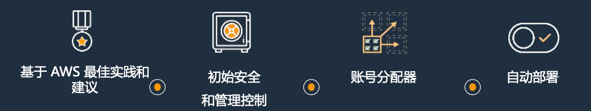

####  AWS Landing Zone架构

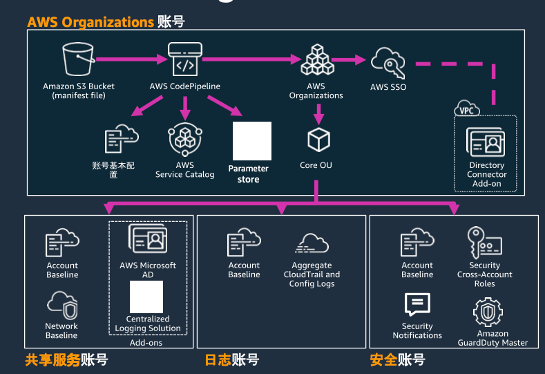

* **`Organizations` 账号**
	*  新账号创建/准备
	*  账号登录管理(`SSO`)
* **共享服务账号**
	* Active Directory 
	* 日志分析
* **日志账号**
	*  安全日志存储
* **安全账号**
	*  审计、安全管控

##  AWS IAM权限管控场景实践

###  使用案例 1 - 用户通过SSO访问 AWS 账户和资源

* 用户使用自己现有的企业凭证登录AWS账户:

	* 使用`AWS IAM`配置对您的各个AWS账户的联合SSO访问 
	* `AWS SSO`帮您在AWS范围内创建本地用户和群体，连接至现有用户目录，设置权限并集中管理用户对多个`AWS` 账户和应用程序的访问。

* 使用IAM策略在您的AWS账户中定义精细用户权限
* AWS Organizations帮您管理多个AWS账户对AWS服务API的使用 情况
* AWS中国区用户可采用`SAML`集成与企业`AD`域进行集成，实现AD账号登录AWS控制台。

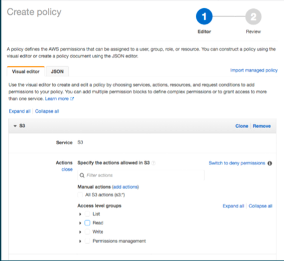

### 使用案例 2 - 应用程序访问数据和资源

* 避免在源代码中嵌入安全凭证
* 您可以使用`IAM Role`替代:
	* IAM 角色与 `Amazon EC2/Amazon EC2` 容器以及`AWS Lambda` 函数配合使用

**AWS Secrets Manager**使您能够轻松地在整个生命周期轮换、管理和检索数据库安全凭证、API 密钥和其他密钥。

您可以使用 IAM 策略定义对 AWS 资源的精细访问权限

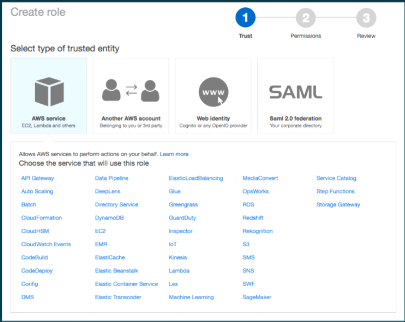

###  案例2延伸: 应用程序的用户直接访问AWS资源

**需求:**

* 不同用户不同权限
* 与企业现有`SSO`集成客户端直接与`S3/DynamoDB`交互以提升性能 
 
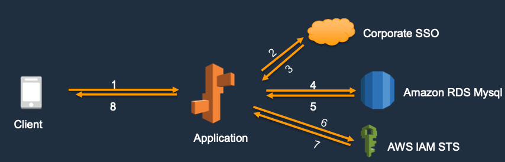

1. `Client` 访问应用登录页面
2. `Client`浏览器重定向到企业`SSO`登录页, 用户输入企业用户名密码登录;
3. 登录成功后，`SSO`返回`token`给到应用程序;
4. 应用程序向`Amazon RDS`数据库查询用户权限;
5. 数据库返回;
6. 应用调用`AWS IAM STS API` 获取`AWS`临时凭证;
7. `STS `返回临时凭证给应用;
8. 应用返回`token`和`AWS`临时凭证给`Client.`

###  使用案例 3 - 用户访问您自己的应用程序

**利用`Amazon Cognito`,使用户携带来自于社会和企业身份供应商的自身身份**

* `Facebook`、Google及Amazon内置集成
* 与支持 `OAuth 2.0`、`SAML 2.0` 以及 `OpenID Connect (OIDC)` 的企业身份供应商相集成
* `AWS`中国区用户可利用`AWS Cognito Identity Pool`与微信、微博等集成实现`OpenID`认证登录。

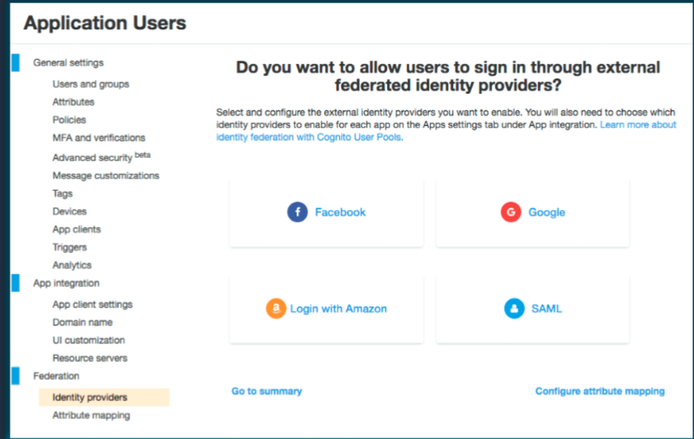

###  使用案例 4 – 跨账号访问AWS资源

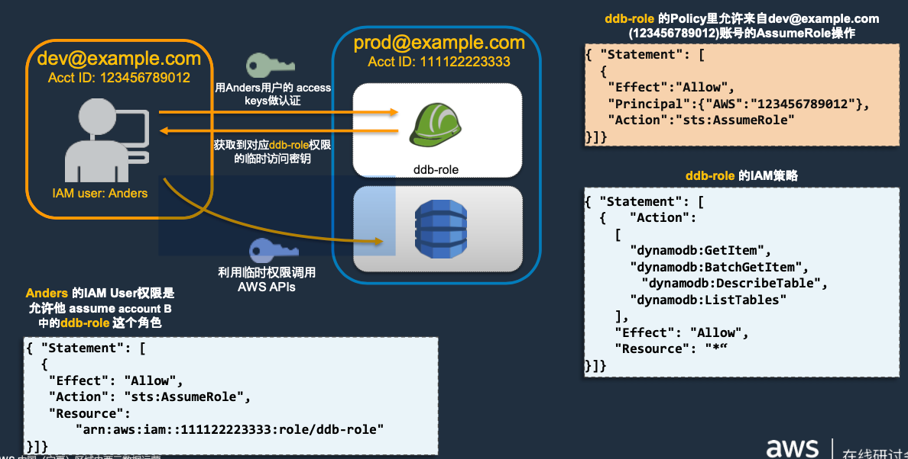
