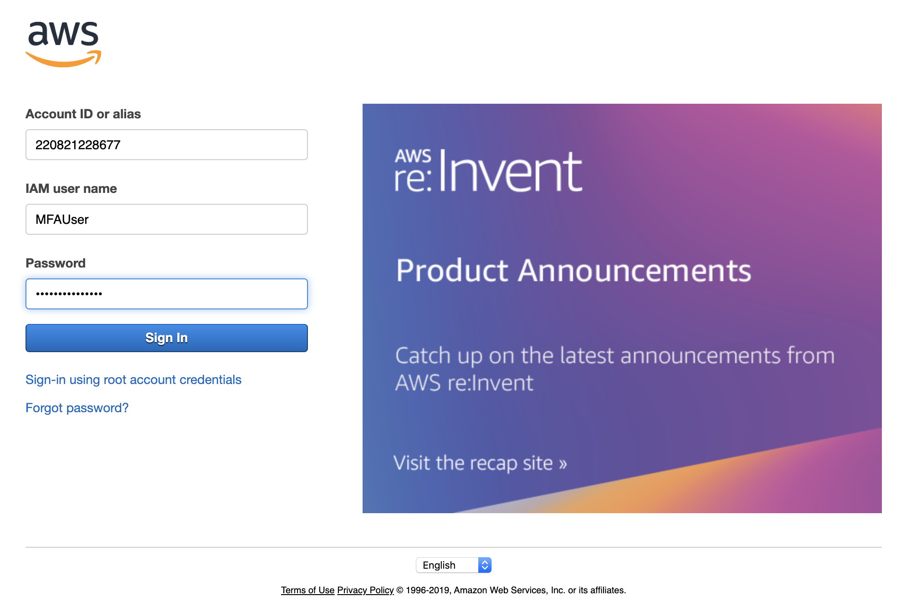

# Enable MFA-Authenticated IAM Users in AWS

## Create New IAM User with forced MFA

**Add this newly created user to `Force_MFA` group and other groups necessary**


Make sure this user inside this `Force_MFA` group


### First login without MFA token 



You cannot access any AWS service and get **"Access denied" Error**, The user has no permissions to do anything.

> For example, when access s3 bucket page


### Enable Multi-factor Authentication (MFA)

In the navigation bar on the upper right, choose the MFAUser user name, and then choose **My Security Credentials**.


Now add an MFA device. In the **Multi-factor Authentication (MFA)** section, choose **Assign MFA device**.


For this tutorial, we use a **virtual (software-based) MFA device**, such as the `Google Authenticator app` or `DUO` on a mobile phone. Choose Virtual MFA device, and then click Continue.


IAM generates and displays configuration information for the virtual MFA device, including a QR code graphic. The graphic is a representation of the secret configuration key that is available for manual entry on devices that do not support QR codes.

Open your virtual MFA app. (For a list of apps that you can use for hosting virtual MFA devices, see [Virtual MFA Applications](Virtual MFA Applications](https://aws.amazon.com/iam/features/mfa/).) If the virtual MFA app supports multiple accounts (multiple virtual MFA devices), choose the option to create a new account (a new virtual MFA device).


Choose Show QR code. Then use the app to scan the QR code. For example, you might choose the camera icon or choose an option similar to Scan code, and then use the device's camera to scan the code.

When you are finished, the virtual MFA device starts generating one-time passwords.


In the Manage MFA Device wizard, in the MFA Code 1 box, type the one-time password that currently appears in the virtual MFA device. **Wait up to 30 seconds for the device to generate a new one-time password.** Then type the second one-time password into the MFA Code 2 box. Choose Assign MFA


The virtual MFA device is now ready to use with AWS.

Now you can see your assigned aws MFA ARN here. **This MFA ARN will be used in aws login in terminal**


Sign out of the console and then sign in as **MFAUser** again. This time AWS prompts you for an MFA code from your phone. When you get it, type the code in the box and then choose **Submit**.


List S3 bucket again


Note that this time you can see all the information and perform any actions you want


## Replace or "Rotate" a Virtual MFA Device

You can have only one MFA device assigned to a user at a time. If the user loses a device or needs to replace it for any reason, you must first deactivate the old device. Then you can add the new device for the user.

* To deactivate the device currently associated with another IAM user, see [Deactivating MFA Devices](https://docs.aws.amazon.com/IAM/latest/UserGuide/id_credentials_mfa_disable.html).

* To add a replacement virtual MFA device for another IAM user, follow the steps in the procedure [Enable a Virtual MFA Device for an IAM User (Console) above](https://docs.aws.amazon.com/IAM/latest/UserGuide/id_credentials_mfa_enable_virtual.html#enable-virt-mfa-for-iam-user).

* To add a replacement virtual MFA device for the AWS account root user, follow the steps in the procedure Enable a Virtual MFA Device for Your [AWS Account Root User (Console)](https://docs.aws.amazon.com/IAM/latest/UserGuide/id_credentials_mfa_enable_virtual.html#enable-virt-mfa-for-root) earlier in this topic.


## AWS login on terminal

### Option one: AWS Way

Run **get-session-token**

[https://docs.aws.amazon.com/cli/latest/reference/sts/get-session-token.html](https://docs.aws.amazon.com/cli/latest/reference/sts/get-session-token.html)

**Make sure `aws configure` in right aws env**

Then run the command below

```
$ aws sts get-session-token --serial-number arn:aws:iam::220821228677:mfa/MFA_test --token-code 844272
{
    "Credentials": {
        "AccessKeyId": "ASIATG2P...",
        "SecretAccessKey": "+X78xMlTiwI...",
        "SessionToken": "FwoGZXIvYXdzECkaDHp3LqifG/L4tCiq6SKGAao1fn5BvWcMZpMFtd+eowY9bgd2m4pHVFkwkDC0u5ySzkXkBJyvLXgnu5tcaieHhTBuAEU4Nn6+zST
VcDtnmuqx9Cmn1DDyQmk8nR1ITRvOtnIF1l7ZfQk//nXXTtacbL9imLGzhIlOcala/br1TCEYbuuOJnwfKByN2ralN9pPrOgQs1DaKPLc3O8FMigJFhbmVhCWk9ZZ3fazTFvHGg3By/g
bOlEsMWWbAj1kSa7cgWvvPFEk",
        "Expiration": "2019-12-16T19:12:50Z"
    }
}

export AWS_ACCESS_KEY_ID = ASIATG2P...
export AWS_SECRET_ACCESS_KEY=+X78xMlTiwI...
export AWS_SESSION_TOKEN=FwoGZXIvYXdzECkaDHp3LqifG/L4tCiq6SKGAao1fn5BvWcMZpMFtd+eowY9bgd2m4pHVFkwkDC0u5ySzkXkBJyvLXgnu5tcaieHhTBuAEU4Nn6+zSTVcDtnmuqx9Cmn1DDyQmk8nR1ITRvOtnIF1l7ZfQk//nXXTtacbL9imLGzhIlOcala/br1TCEYbuuOJnwfKByN2ralN9pPrOgQs1DaKPLc3O8FMigJFhbmVhCWk9ZZ3fazTFvHGg3By/gbOlEsMWWbAj1kSa7cgWvvPFEk
```

### Option two: bash way

* Please download bash script firstly [mfa.sh](mfa.sh)
* Run script with `source` or change mode of script run `sudo chmod 755 mfa.sh` and run `./mfa.sh `
* Enter your Assigned MFA device ARN
* Enter your 6 digit token from phone

```
$ source mfa.sh
*******************************************************
This Script is for Single deafult AWS IAM User only! 
Please make sure you're in correct AWS environment
*******************************************************
Info: Enter AWS Assigned MFA device ARN from the console(Security credentials -> Assigned MFA device) here 
You can find Your Assigned MFA device ARN (https://console.aws.amazon.com/iam/home?region=us-east-2#/security_credentials):

Enter your AWS Assigned MFA device ARN here: arn:aws:iam::220821228677:mfa/MFA_test
Input serial-number is : arn:aws:iam::220821228677:mfa/MFA_test
Enter your AWS MFA Virutal Device token here:825575

Running fowllowing commands below line by line if you run the script without source
*******************************************************
export AWS_ACCESS_KEY_ID=ASIATG2P...
export AWS_SECRET_ACCESS_KEY=+X78xMlTiwI...
export AWS_SESSION_TOKEN=FwoGZXIvYXdzEFsaDJAx/+7x74InDXEz1yKGAbgxj3xGPzkophjFn5ubHlgJ+malPf3LmQubxi6x7+fQqMPALq1guZm2Ivq2zSQY9skEkxpASJurSBJxN/Ow5UUCflfzCnxPqfnFQ5/VJ7aRigC0ZjCJdLfQioNrXe4dxnaV+T72V/jQang75egVEPSBtaB4yckaUj7WwrYImqEORVyQAdORKIrr5+8FMijXwQ5S7c1nLTWHpgRH7KoCI/lJSlp1p/XezesJgIBtqpiMAxzerNb4
*******************************************************
This aws session will expired in 24h!, Happy AWSing
```


### Reference:

* [Tutorial: Enable Your Users to Configure Their Own Credentials and MFA Settings](https://docs.aws.amazon.com/IAM/latest/UserGuide/tutorial_users-self-manage-mfa-and-creds.html)
* [AWS: Allows MFA-Authenticated IAM Users to Manage Their Own Credentials on the My Security Credentials Page](https://docs.aws.amazon.com/IAM/latest/UserGuide/reference_policies_examples_aws_my-sec-creds-self-manage.html)


