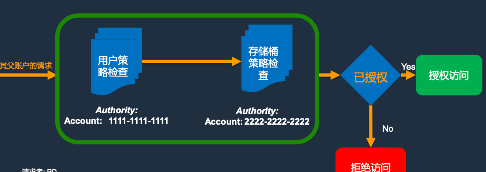
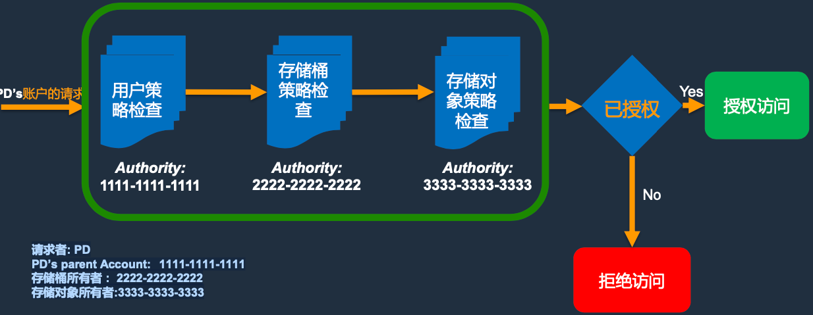

# 1. S3存储桶安全策略配置与纵深防御架构实践基础篇

*  1—AWS S3的访问控制机制
*  2—AWS S3禁止公共访问(S3 Block Public Access)
*  3—AWS S3加密设置(Encryption)
*  4—AWS S3对象合规锁定(`S3 Object Lock`)
*  5—`Access Analyzer`监视、查看和保护S3
*  最佳实践


##  1—AWS S3的访问控制机制

S3访问控制策略的逻辑和顺序，如下图

* 1) 用户权限策略检查——检查上级帐户是否被授予权限 
* 2)存储桶权限策略检查——检查存储桶所有者是否已授予权限 
* 3)存储对象访问策略检查——查找策略中明确的“允许” 

**策略执行:任何政策中的明确拒绝均会覆盖所有允许条件**

 

###  1.1— AWS S3 –访问控制策略处理流程

 

**场景1-存储桶拥有者请求的存储桶操作**

 

* 请求者: AWS 账户:  `1111-1111-1111 `
* PD’s 有 root 凭证:  `1111-1111-1111`
* 存储桶所有者 Owner:  `1111-1111-1111`

**场景2:IAM用户请求的存储桶操作(由其父账户同时也是存储桶拥有者)**


 

* 请求者: PD (IAM 用户) 
* PD’s parent Account:  1111-1111-1111 
* 存储桶所有者 : 1111-1111-1111

**场景3:`IAM`用户请求的存储桶操作(其父AWS账户不是存储桶拥有者)**

 

* 请求者: PD
* PD’s parent Account:  `1111-1111-1111`
* 存储桶所有者 :   `2222-2222-2222`

**场景4:对象操作的授权请求**

 


* 请求者: PD
* PD’s parent Account: `1111-1111-1111 `
* 存储桶所有者 : `2222-2222-2222` 
* 存储对象所有者:`3333-3333-3333`

###  AWS S3是如何管理跨账户进行角色继承访问控制

 

其他帐户中的用户继承了`AccountARole`这个角色

```
{
	"Version": "2012-10-17", 
	"Statement": {
		"Effect": "Allow", "
		Action": "sts:AssumeRole", 
		"Resource":
			"arn:aws:iam::AccountA:role/AccountARole"
	 }
}
```

### 1.2—S3的6种访问控制策略的脚本示例

**1 IAM用户安全策略**

 

**2 S3 存储桶安全策略**

 

**3 S3 目录访问策略(ACLs)**

 

**4 S3 组织访问策略**

 

**5 S3 VPC Endpoint 策略**

 

**6 预签名URLs**

* 使用创建`URL`的`lAM`用户／角色的权限 
* 要生成`URL`，请提供您的安全凭证，存储桶名称，对象密钥，`HTTP`方法（`GET`或`PUT`)以及到期日期和时间 
* 仅有效期至到期时间
* 注意：具有`URL`的任何人都可以执行这些操作 

 

###  示例1、AWS IAM 用户 policy

**用户策略允许该特定用户将对象存储在用户存储桶中**

 

### 示例2、AWS S3 存储桶 policy

存储桶策略允许AWS账户`1111111111`中的主体从用户存储桶中读取对象，但条件将其限制为具有特定`Tag`值的对象

 

###  示例3:限制对特定存储桶的访问

 

### 示例4:限制对组织中主体的访问

 

###  示例5:限制对特定Endpoint的访问

 

**使用 S3 VPCE后**

1. 使用S3专用端点访问S3，而不使用NAT或网关 
2. 限制从`VPC`外部访问`S3`存储桶

 

##  2—AWS S3禁止公共访问(S3 Block Public Access)

**Demo1:如何设置`帐户级别`S3阻止公共访问**

 

**Demo2:如何设置`存储桶级别`S3阻止公共访问**

 

**Demo3:如何使用`Trusted Advisor`自动监控并告警S3开放公共访问权限**

##  3—AWS S3加密设置(Encryption)

### 示例1:如何设置S3服务端加密文件和数据

启用后，使用`AES256`加密的新`PUT`对象

* `SSE-S3`:由`S3`管理的主密钥加密的对象密钥
* `SSE-KMS`:由`AWS Key Management Service(KMS)`管理的对象密钥(单独的密钥访问策略); 由`AWS KMS` 客户主密钥(`CMK`)加密的对象密钥，可以由客户提供;需要`SigV4`和`TLS`才能进行`GET`和`PUT`
* `SSE-C`必须在`PUT&GET`请求中提供密钥;密钥不是由AWS存储的

### 示例2:如何设置S3客户端加密文件和数据

许多应用程序处理敏感数据，并要求安全地存储和检索该数据。适用于`Java`的`AWS`开发工具包提供了一个易于使用的 `Amazon S3`客户端，使您可以将敏感数据安全地存储在`Amazon S3`中。

当上传到`Amazon S3`时，`SDK`在客户端自动 对数据加密，并在检索到数据后自动为客户端解密数据。您的数据以加密方式存储在`Amazon S3`中-没有您的私有加密密钥，任何人都无法对其解密。

* 可以从http://aws.amazon.com/sdkforjava下载适用于Java的AWS开发工具包。
* 如果您是Eclipse用户，则还可以通过从 http://aws.amazon.com/eclipse安装适用于`Eclipse`的`AWS Toolkit`来获取`SDK `。

##  4—AWS S3对象合规锁定(`S3 Object Lock`)

* Demo1:如何设置`S3`服务端对象锁定的**监控模式**
* Demo2:如何设置`S3`服务端对象锁定的**合规模式**

##  5—Access Analyzer监视、查看和保护S3

**启用**

在开始使用`S3`管理控制台之前，访问`IAM`控制台以启用`Access Analyzer`访问分析器。

执行此操作后，`S3`的`Access Analyzer`将自动在`S3`管理控制台中可见。用于`S3`的`Access Analyzer`评估您的存储桶访问策略，并使您能够发现和快速修复具有潜在意外访问权限的存储桶。

**Demo**

 

## 最佳实践

1. 始终遵循最小特权原则
2. **大多数用例不需要公共访问权限–建议打开AmazonS3Block公共访问设置**
3. 授权:所有决定始于拒绝 授权:明确的拒绝将覆盖所有允许
4. 使用默认加密来保护您的数据
5. 使用`AWSTrustedAdvisor`，`AWSConfig`，`AWSCloudTrail`和S3清单之类的工具监视和审核数据