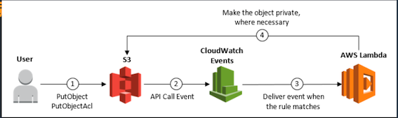
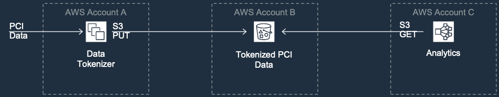
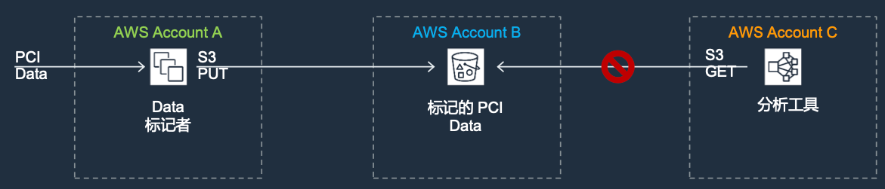
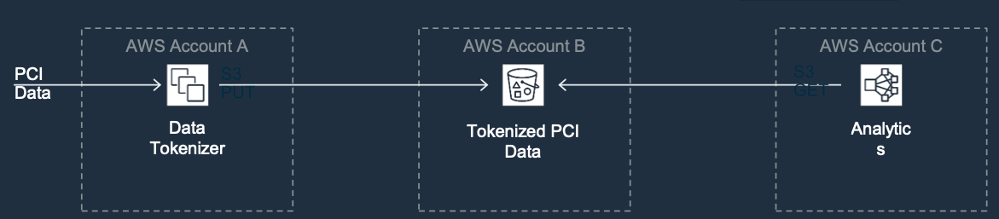
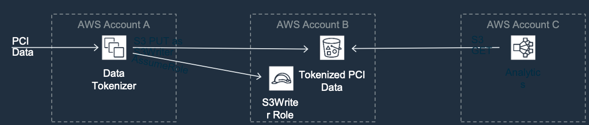
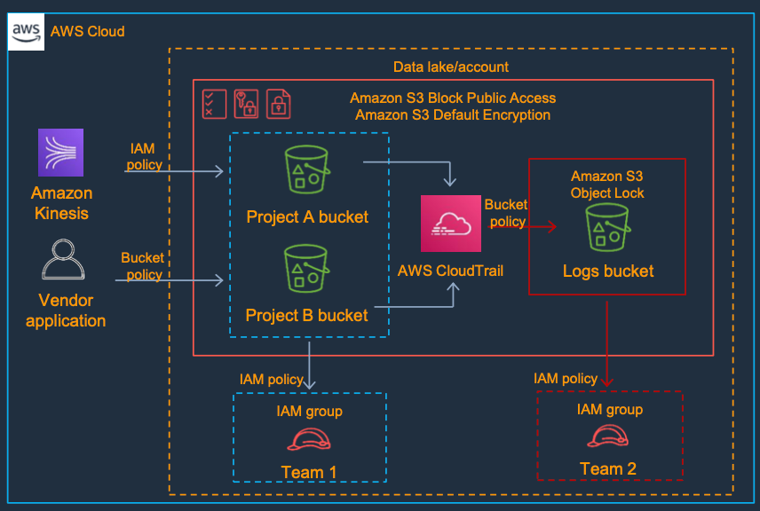

# 2 S3存储桶安全策略配置与纵深防御架构实践提高篇

* 方案1:如何使用`CloudWatch Events`检测和自动补救` S3`对象`ACL`中的意外权限
* 方案2:如何使用`AWS Config`自动修复`S3`存储桶合规性
* 方案3:如果使用`S3`存储桶符合`PCI-DSS`要求
* 方案4: `S3 Datalake`的安全参考架构

##  方案1:如何使用`CloudWatch Events`检测和自动补救` S3`对象`ACL`中的意外权限

### 场景

某客户的AWS账户中的对象和用户数量很大，安全管理员需要确保将正确配置的ACL附加 到对象上，这是一个有挑战工作，还有很多潜在安全调用和非授权访问的风险。例如，如 果用户要对应该为私有，但是已公开的对象调用`PutObjectAcl API`，该怎么办呢?或者， 如果用户使用可选的Acl参数设置为`public-read`来调用`PutObject`，从而以公开可读 的方式上传机密文件，该怎么办呢?

### 方案:

方案是使用 `CloudWatch Events`几乎实时地检测`PutObject`和`PutObjectAcl API`调用，并通过自动执行来帮助客户确保对象保持私有，必要时调用`PutObjectAcl`。

### 说明:

此方案是一种被动方法，是对主动方法的补充，在主动方法中，客户可使用AWS身份和访问 管理(`IAM`)的策略条件来强制用户设置具有私有访问权限的对象。此被动方法是针对“以防 万一”的情况，其中`S3`的存储桶的`ACL`的更改是偶然的，所以需要监控，而且必须进行修复。

### 架构

 

### 说明:

1. 对客户帐户中的`IAM`或`root`用户进行`PutObjectAcl `或`PutObject`调用。
2. `S3`几乎实时将相应的`API`调用事件发送到`CloudTrail`和`CloudWatch Events`。
3. `CloudWatch Events`规则将事件传递到`Lambda`函数。
4.  如果对象位于所有对象都需要私有的存储桶中，而该对象不再是私有的，则`Lambda`函数将对 `S3`调用`PutObjectAcl`以将`S3`中对象设置成私有。


## 方案2:如何使用AWS Config自动修复S3存储桶合规性

### 场景:

某客户启用`AWS Config`规则检查自己`S3`存储桶是否已启用日志记录，检查`IAM`用户是否已启用`MFA`等。 由于`Config`规则使用`Lambda`函数执行合规性评估，并将评估资源的合规性状态返回后，必须为每个不符合要求的资源手动执行补救措施，效率比较低下; 所以，迫 切需要自动实施补救措施来补救不符合安全规则的资源。那么如何才能实现自动补救不合规项，以提高安全合规能力呢?

### 方案:

方案是`AWS Config`自动修复功能会自动修复由`Config`规则评估的不合规资源。客户只要将补救措施与 `Config`规则相关联，并选择自动执行它们，即可以解决不符合要求的资源，而无需人工干预。

### 说明

此方案是一种被动方法，但对于合规可以看作为主动方法。补救措施，可以从预填充列表中 选择要关联的补救措施;也可以使用 `Systems Manager Automation`文档创建您自己的自定义补救措施。


### 架构

使用 `Config`自动修复功能目前支持`4`个`S3`相关规则，用来自动修复`S3`不合规项

1. 启用`s3-bucket-logging`
2. 启用`s3-bucket`服务器端加密
3. `s3-bucket`公开阅读禁止
4. `s3-bucket`公开写禁止

### 说明:

这些`AWS Config`规则用作防止任何不符合规定的`S3`活动的控件。先决条件包括:

1. 客户必须在自己的	`AWS`账户中启用`AWS Config`。
2. 客户在`AWS Config`中创建补救操作时，必须对该角色具有通过角色的权限，并且该角色必须具有足够权限。例如，` s3:PutEncryptionConfiguration`或特定于API调用的其他内容。
3. (可选):在设置补救措施时，如果要将不符合要求的资源的资源`ID`传递给补救措施，请选择`Resource ID`参数。如果选择，则在运行时将该参数替换为要修复的资源的ID。每个参数都有一个静态值或一个动态值。

##  方案3:如果使用S3存储桶符合`PCI-DSS`要求

 

**Account A:**

* 完全“适用于” PCI数据安全标准(DSS)
* 需要外部审核员进行年度审核

**Account B:**

* 没有PCI数据
* 连接到`PCI`帐户需要完全符合`PCI DSS`
* 需要内部审核员进行年度审 核

**Account C:**

* 已标记的`PCI data`的使用者
* 不在PCI数据安全标准`DSS`的授权范围内

### 错误的方法

 

**Account A:**

标记的数据被`PUT`到账户B的存储桶中

**Account B:**

存储桶策略允许帐户`A`中标记员的`PUT`，允许帐户`C`中分析员的`GET`

**Account C:**

该存储桶中对象所有者是帐户`A`，即使存储桶位于帐户`B`中，账户`C`的`GET`也是失败的

### ACL 方法

 

**Account A:**

* 被标记的数据被存放到帐户 B中的存储桶中
* 标记成器将对象的`ACL x- amz-grant-read-acp`设置为帐户`C`的`ID`

**Account B:**

* 存储桶策略允许帐户A中的标记者的PUT操作
* 不需要通过存储桶策略，允许从帐户`C`中分析者的`GET`操作

**Account C:**

允许从帐户`C`中的分析者的`GET`操作 ，但是允许此对象ACL的操 作在某些环境中可能会有风险。 `IAM`不能限制为一小组帐户`ID`

### 正确方法

 

**Account A:**

* 令牌生成器在帐户B中扮演 `S3Writer`
* 已标识的数据通过S3Writer AssumeRole 角色操作被存入帐户`B`中的存储桶

**Account B:** 

* `S3Writer`的信任策略允许帐户A中的令牌生成器去继承角色`AssumeRole`
* 存储桶策略允许账户`B` `S3Writer`角色的和账户`C`中分析器的`GETs`

**Account C:**

* 来自账户`C`的分析器的`GET` 被允许

##  方案4: `S3 Datalake`的安全参考架构

### Features


* 多个数据源
* 多个数据使用者
* 最小特权原则
* 特有用户高数据集
* 允许在适当的地方访问

 

###  有用的政策摘要–条件

```
Require TLS
 (Deny) "Bool": { "aws:SecureTransport": "false" }
 
Require SigV4
(Deny) "StringNotEquals": { "s3:signatureversion": "AWS4-HMAC-SHA256" }

Source IP address restrictions
(Allow) "IpAddress": {"aws:SourceIp": "54.240.143.0/24"}

Require multi-factor authentication
 (Deny) "Null": { "aws:MultiFactorAuthAge": true }
 
Require Amazon VPC endpoint and specific VPC
(Deny) "StringNotEquals": { "aws:sourceVpc": "vpc-111bbb22" }
```