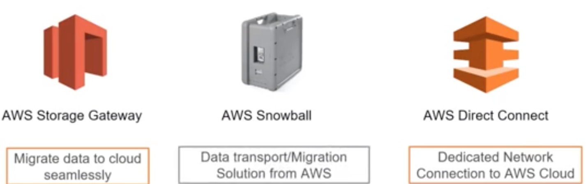
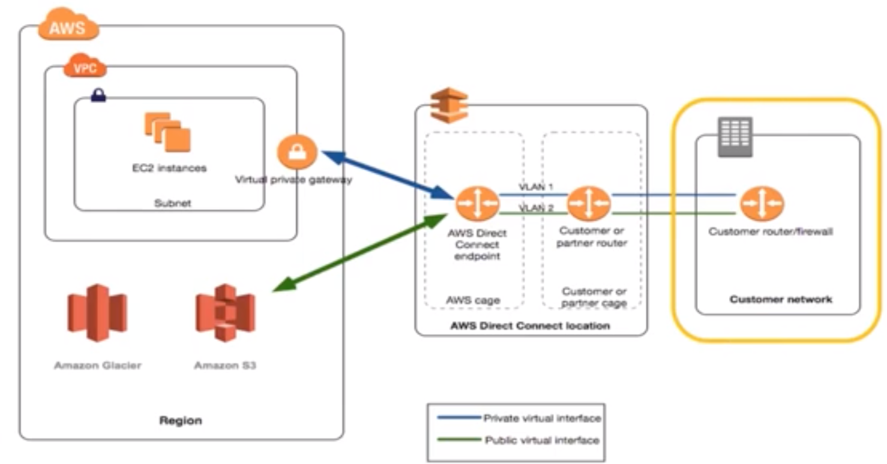
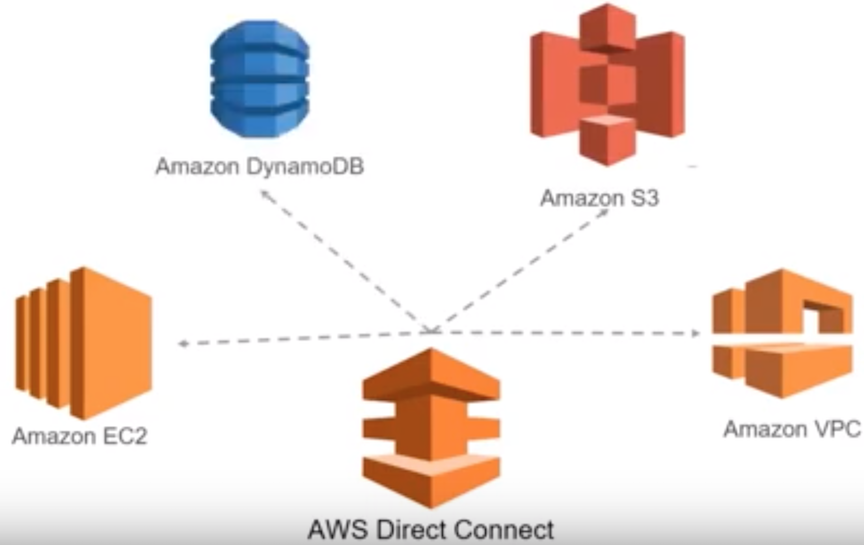
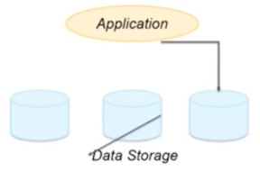
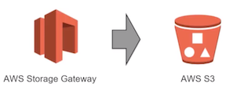
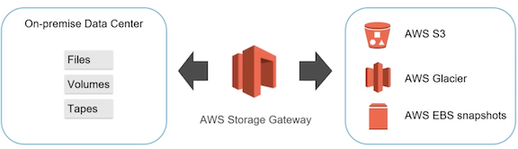
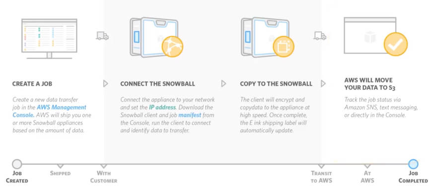
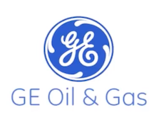

# Data Movement on AWS

### Objective

* Explain the concept of Data movement into and out of AWS 
* Explain the following data transfer mechanisms:
  * AWS Direct Connect 
  * AWS Storage Gateway
  * AWS Snowball

### Data Movement on AWS: An Overview 

* **Data Transfer from on premise to cloud** 
* **Data Transfer within the cloud**  

## Data Transfer from on premise to cloud

## AWS Direct Connect 

* AWS Direct Connect is a service which helps you to **create a dedicated network from your organization to AWS VPC** 
* Using AWS Direct Connect, **data wont be transferred now via internet**, instead will now **be delivered through a private network connection**. 

### AWS Direct Connect: Service Integration

Direct Connect can be used with many services

### Network Requirement

* Your network must use single mode fiber with a `1000BASE-LX` (1310nm) transceiver for 1 gigabit Ethernet, or a `10GBASE-LR` (1310nm) transceiver for 10 gigabit Ethernet. 
* Auto-negotiation for the port must be disabled. Port speed and full-duplex mode must be configured manually. 
* `802.10` VLAN encapsulation must be supported across the entire connection, including intermediate devices. 
* Your device must support `Border Gateway Protocol (BGP)` and `BGP tvID5` authentication. 
* You can configure `Bidirectional Forwarding Detection (BED)` on your network. Asynchronous BFD is automatically enabled for AWS Direct Connect virtual interfaces, but will not take effect until you configure it on your router. 

### AWS Direct Connect: Benefit

* Reduce costs 
* Provide a more consistent network experience than Internet-based connections •
* Private Connectivity to your Amazon VPC 
* Highly Elastic 
* Simple 

## AWS Storage Gateway: An overview

**Storage Gateway is a service that helps migrate data from your on premise data center on to AWS Cloud,** 

Scenario: 

* Lots of data storage is required for applications 
   * to run smoothly or 
   * to ensure that data is backed up and secure 
* As applications or business grow, you will require more and more data storage 

* AWS Storage Gateway cuts the cost, maintenance and scaling requirements while running primary backup or archive storage environments 
* Securely upload data to AWS Cloud for cost-effective backup and quick disaster recovery 
* Extends existing data storage infrastructure by provisioning supplementary place in cloud for data/backup snapshots 

### AWS Storage Gateway: Features

* Durably uploads and stores data in Amazon S3 
* Creates regular backup point-in-time snapshots of on-premises application data to Amazon S3 
* Restore data from AWS S3 for future recovery 

### AWS Storage Gateway: Integration

### AWS Storage Gateway: Benefits

* Standard storage protocols integrate with on premise applications 
* Local caching for low-latency access to frequently used data 
* Efficient data transfer with buffering and bandwidth management 
* Native data storage in AWS 
* Integrated with AWS management and security 
* Pay only for what you use with no long-term commitments 

## AWS Snowball

* Snowball is a data migration service which is petabyte-scale and is highly secure to transfer large amounts of data into and out of the AWS Cloud. 
* Snowball mitigates the challenges of network costs, long transfer times, and security concerns. 
* No purchases has to be made, just from the console, create a job and snowball is shipped to your place. 
 
### AWS Snowball: Usecase

* To migrate: 
   * analytics data 
   * genomics data 
   * video libraries 
   * image repositories 
   * backups 

* To archive part of data center shutdowns 
* For tape replacement or application migration projects 

### AWS Snowball: Benefits

* High speed 
* Extremely scalable 
* Tamper resistant and secure 
* Simple and compatible 
* Low cost
* Easy data retrieval 

### AWS Snowball: working

### AWS Snowball: Case study

#### About GE Oil and Gas

GE Oil & Gas is a business unit of global conglomerate General Electric with energy-related operations around the world. 

**Benefits:**

1. Eliminated legacy processes 
2. Lower IT costs 
3. Greater speed to market 
4. More agility to compete even better in an industry experiencing immense market challenges. 

GE Oil & Gas used the AWS Import/Export Snowball appliance to transfer more than 750 terabytes of data from pipeline inspection machinery to AWS. 

**Benefits:**

* Increased Speed of Data transfer 
* Scalability was not a concern 
* Tamper resistant and secure 
* Simple and compatible 
* Low cost 

