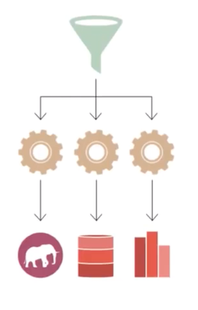
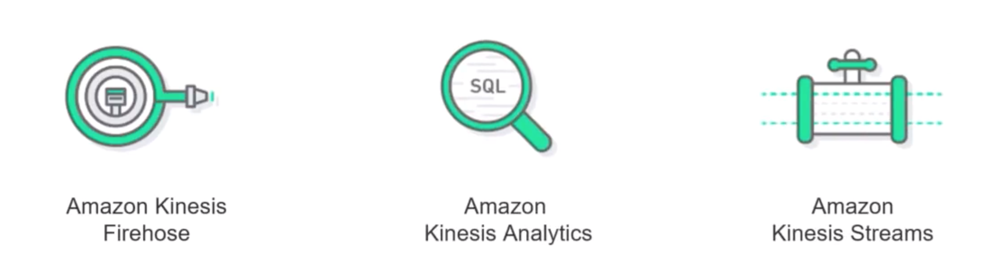
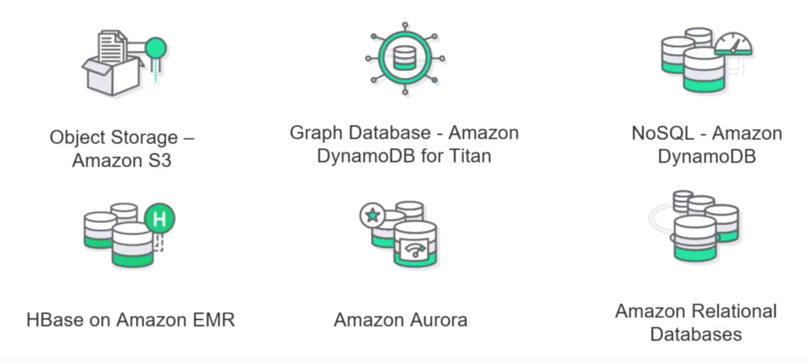
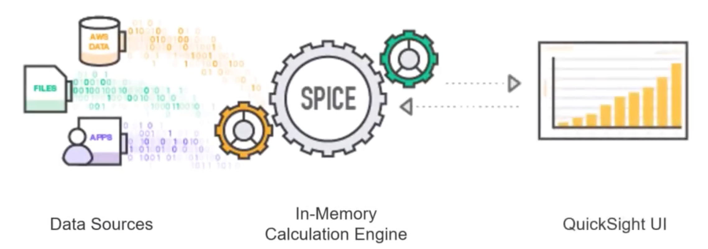
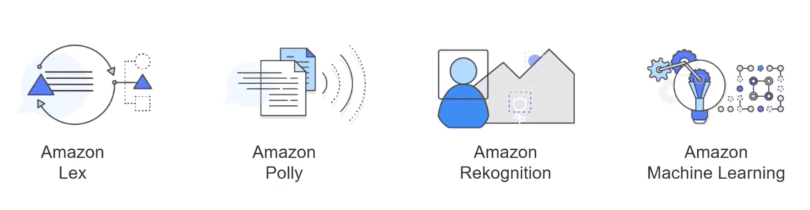
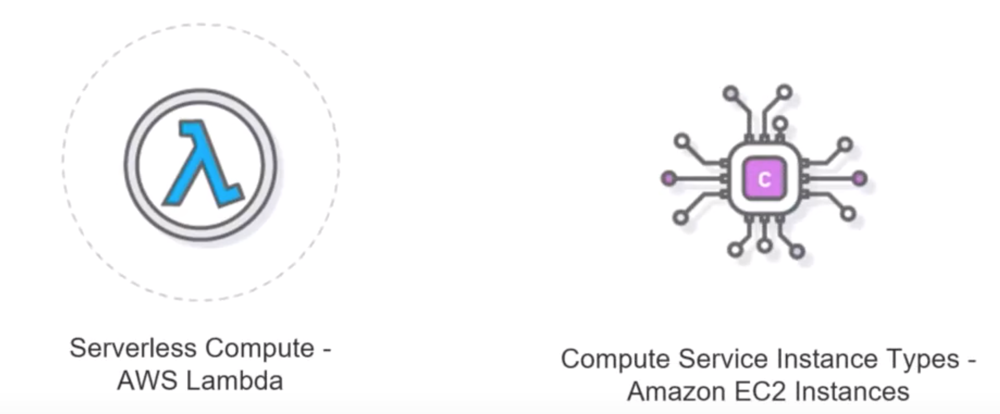
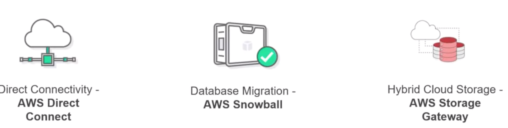

# Overview of Big Data On AWS

## Objectives

#### Get an overview of Big Data on AWS 

#### An understanding of: 

* **Big Data Analytic Frameworks** 
* **Real-time Big Data Analytics** 
* **Big Data Storage & Databases** 
* **Data Warehousing** 
* **Business Intelligence** 
* **Artificial Intelligence** 
* **Compute** 
* **Data Movement**

### Big data on AWS: An ovewview

AWS provides ability to build virtually any big data analytics application; support any workload regardless of **Volume**, **Velocity**, and **Variety** of data.
 
With 50+ services and hundreds of features added every year, AWS provides everything you need to **collect, store, process, analyse, and visualize big data on the cloud**.

## Big data Anlytic Framework

### Hadoop & Spark - AWS EMR

Amazon EMR is the industry leading cloud-native big data platform, allowing teams to process vast amounts of data quickly, and cost-effectively at scale. Using open source tools such as `Apache Spark`, `Apache Hive`, `Apache HBase`, `Apache Flink`, and `Presto`, coupled with the dynamic scalability of Amazon EC2 and scalable storage of `Amazon S3`, `EMR` gives analytical teams the engines and elasticity to run Petabyte-scale analysis for a fraction of the cost of traditional on-premise clusters. 

### Interactive Query Service - Amazon Athena

**Amazon Athena** is an `interactive query service` that makes it easy to analyze data in `Amazon S3` using **`standard SQL`**. 

**Athena is serverless**, so there is no infrastructure to manage, and you pay only for the queries that you run.

Athena is easy to use. Simply point to your data in **Amazon S3**, define the schema, and start querying using standard SQL.

Most results are delivered within seconds. With Athena, there’s no need for complex **ETL jobs** to prepare your data for analysis. This makes it easy for anyone with SQL skills to quickly analyze large-scale datasets.

### Elasticsearch - Amazon Elasticsearch service

Amazon Elasticsearch Service is a fully managed service that makes it easy for you to deploy, secure, and operate Elasticsearch at scale with zero down time. 

The service offers open-source **Elasticsearch APIs**, **managed Kibana**, and integrations with **Logstash** and other AWS Services, enabling you to securely ingest data from any source and search, analyze, and visualize it in real time. Amazon Elasticsearch Service lets you pay only for what you use – there are no upfront costs or usage requirements. With Amazon Elasticsearch Service, you get the ELK stack you need, without the operational overhead.

## Real-time Big data Analytics

**Big Data has become quite trendy while analyzing the streaming data.**
 
**Streaming data** 

When the live data is captured from varied sources and start analyzing them while the data is still travelling from the source to the target. 

**AWS helps in analyzing the real time data or the streaming data and the kinesis services.**

### 1. Amazon Kinesis Firehose 

**Amazon Kinesis Data Firehose** is the easiest way to reliably load streaming data into **data lakes**, **data stores** and **analytics tools**. 

It can capture, transform, and load streaming data into **Amazon S3**, **Amazon Redshift**, **Amazon Elasticsearch Service**, and **Splunk**, enabling near real-time analytics with existing business intelligence tools and dashboards you’re already using today. 

### 2. Amazon Kinesis Analytics

Amazon Kinesis Data Analytics is the easiest way to analyze streaming data, gain actionable insights, and respond to your business and customer needs in real time. Amazon Kinesis Data Analytics reduces the complexity of building, managing, and integrating streaming applications with other AWS services. 

**SQL users can easily query streaming data or build entire streaming applications using templates and an interactive SQL editor.** 

**Java developers can quickly build sophisticated streaming applications using open source Java libraries and AWS integrations to transform and analyze data in real-time.**

### 3. Amazon Kinesis Streams

**Amazon Kinesis Data Streams (KDS) is a massively scalable and durable real-time data streaming service.**

KDS can continuously capture gigabytes of data per second from hundreds of thousands of sources such as website clickstreams, database event streams, financial transactions, social media feeds, IT logs, and location-tracking events. 

## Big Data Storage & Databases

* **Store huge amount of data**
* **Create Databases that help analyze (pull and push) the data with ease**

## Data Warehousing (Amazon Redshift)

For storing huge volume if historical data you always require Data Warehouse. 

**A pita-byte scale data warehousing solution.** 

**Create a data warehouse without bothering about managing the huge servers and huge database.(Amazon Redshift)**

## Big Intelligence (Amazon QuickSight)

**Extracting the data from varied sources, transforming the data, visualizing the data and then loading it into various other sources.**

**Amazon QuickSight** provides a fast cloud powered BI solution for `1/10th` the cost of the traditional set up of the BI tools. 

* QuickSight allows you to connect to the various AWS Data Services and upload the data and the files to the QuickSight solution. 
* Provides in-memory calculation engine. 
* Provides a UI where you can visualize data and do the trend analysis. 

## Artifical Intelligence

AWS provides cloud native **Machine Learning** and **Deep Learning** techniques to address broad set of use cases and various needs. 

## Compute 

For doing any kind of analysis you would require a Compute application. 

**Compute is a platform where computations will be done.**

## Data Movement

Movement of data into the cloud and around the cloud

