# Big Data Storage on AWS

### Objectives

*  Get an overview of Big Data Storage 
*  Explain the following concepts provided by AWS to store big data: 
   * Amazon S3 
   * DynamoDB 
   * Amazon Relational Database Service (RDS) 
   * Apache HBase 


### Big Data Storage 

**Object Storage:** 

* For storing immutable/static objects. 
* Example - huge files, logs, images, videos etc. 

**Database Storage**: 

For storing the data in organized way so that its easy to query and fetch results 

* Relational Database 
* Non Relational / No SQL Database 


### Block Storage vs. Object Storage


#### Block Storage:

* Data is stored in sectors and blocks 
* Data can be modified at any point of time 
* Accessible as volumes and can be accessed directly by the operating system 


#### Object Storage:

* Data is stored in the form of buckets 
* Works very well for unstructured data sets 
* Data cannot be modified 
* Large datasets can be stored easily 


## S3 overview

* S3 provides a secure, durable, highly scalable storage. 
* Stores unlimited data, with no restrictions on data format. 
* An object is a combination of a file and any metadata that describes 
that file. 
* S3 objects are stored in S3 bucket. Object sizes can vary from **0 bytes 
to 5 TB.** 
* Amazon S3 bucket must have a unique name as it shares a global name space. S3 supports access control policies and access logs. 


### S3: Data Lakes & Big Data Analytics

* Whether you are storing pharmaceutical data or financial data, multimedia files such as photos and videos, **Amazon S3 can be used as your data lake for Big Data analytics.**
  
* Amazon Web Services provides variety of services to help you manage Big Data by reducing costs and increasing scalability. 


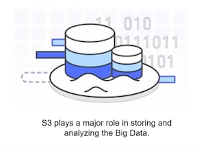


### S3 security options

Amazon S3 offers numbers security options

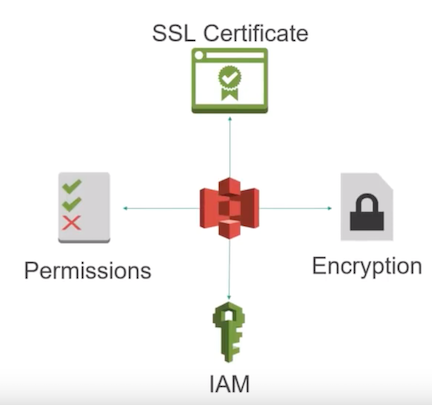

## Database

### SQL vs NoSQL

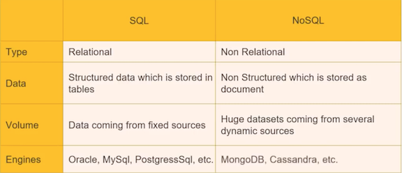

#### No SQL example

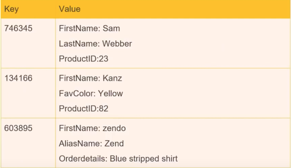


### DynamnoDB

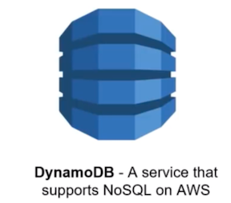

* Provides fast single-digit milliseconds latency performance 
* Allows Easy administration and is cost-effective 
* **Supports partitioning data over multiple instances** 
* **Integrates with AWS IAM for fine grain access control** 
* Fits great for mobile, gaming, and Internet of Things (IoT) 

#### Components for DynamnoDB

* **Data in DynamoDB will be a NoSQL / unstructured Data**
* Data from wide varity of source with no relation with each other.
* **Tables, items and Attributes are three core components of DynamoDB**

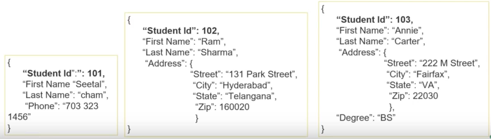


#### Capacity Management

* **Stores and manages any amount of data and traffic** 
* **Provides high performance and less latency** 
* **Replicates data across three data centers automatically** 

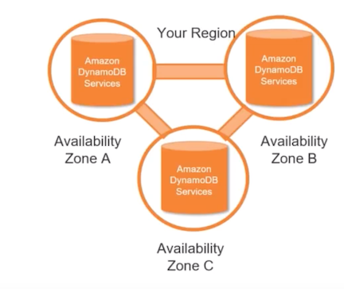


#### Provisioned throughput

* How will it provision the underlined resources for you? 
* How many number of partitions should be there? 

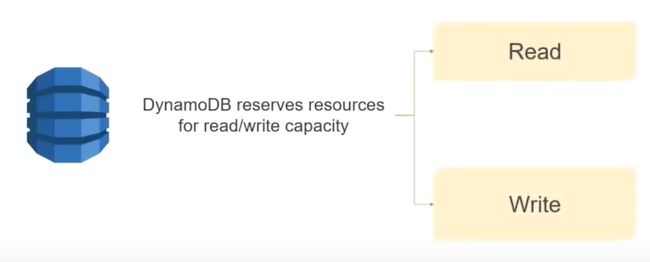


#### Read Operation and Consistency

* `Helps to read an item from a DynamoDB table` 
* `Requires the whole key while using composite key`  
* `Performs eventually consistent reads by default` 
* **`Consumes additional read capacity units for strongly consistent reads`** 
* **`Consumes half-read capacity for eventually consistent reads`**

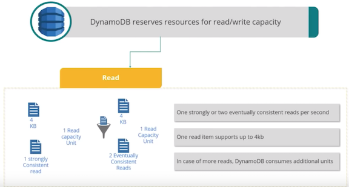

#### Read Capacity Units

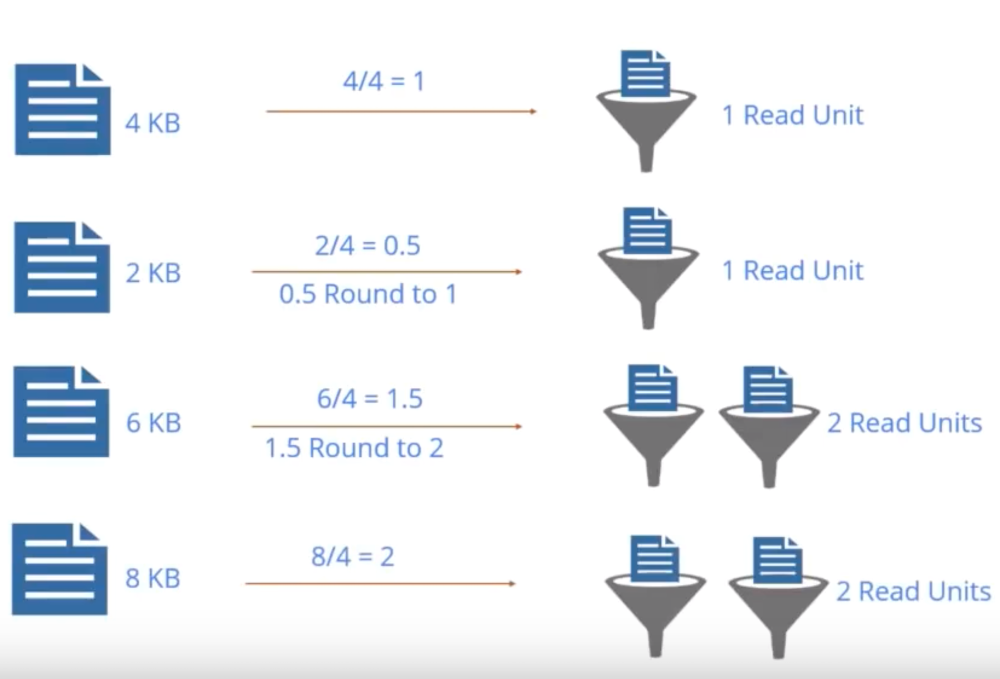

#### Read Capacity Units - Example 1


**Solution**

1. Number of read capacity units required `per item = 6 KB/ 4 = 1.5` 
2. Round up `1.5` to the nearest whole `number = 2` Read units per item 
3. <mark>Total units needed for **strongly consistent reads** `= 100 items * 2 = 200` Units </mark>
4. Total units needed for **eventually consistent reads** = `100 items/2 = 100` Units 

**You want to perform 100 strongly consistent reads per second, where the items are 6 KB in size. How many read capacity units do you need?**


* 1 strong consitent reads ---- 1 read capacity 
* 100 = 100 read capacity units 

* 4 kb --- 1 read capacity 
* 6kb --- 2 read capacity units 

`100*2 = 200 read capacity units` 

### Demo: Creating table in DynamoDB 

In this demo, you will: 

* Create a DynamoDB table. 
* While creating the table, calculate the provision that a throughput required to store a table with write capacity of 20 items with 4 KB size and read capacity of 80 
items of 4KB strongly consistent. 
* Insert Items into it and query the DB. 

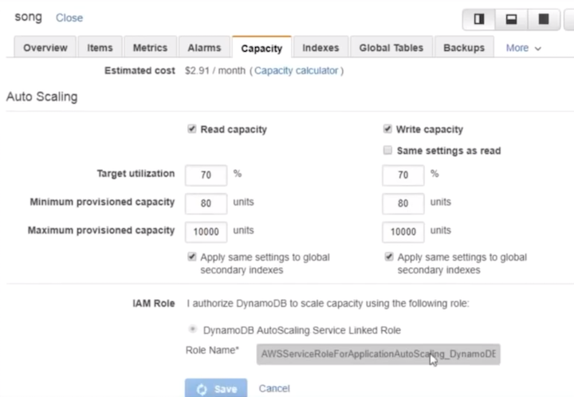

* write capacity of 20 items with 4 KB size and read capacity of 80 items of 4KB strongly consistent 

* `20 * 4 = 80` **write capacity units** 
* `80 * 1*1= 80` **reads**


### Amazon Relational Database Service (RDS) 

* In DynamoDB, it is a service that provides you a space to store your data. 
* Amazon RDS can be easily setup, operate, and scale a relational database in the cloud. 
 
**You need to choose from six familiar database engines:** 

1. Oracle 
2. Microsoft SQL Server 
3. PostgreSQL 
4. MySQL 
5. MariaDB 
6. Amazon's Aurora 

#### RDS Characteristics 

Two options to establish relational database in cloud: 

1. **Manually install - Infrastructure as a Service (IaaS)** 
2. **Management and Installation are automated and no manual intervention**

```
• Supports automated backups 
• Facilitates primary and secondary instances during failover 
• Highly integrated with IAM 
• Control over RDS access 
• Supports security group configurations 
```

#### DB management activities

**Activities Include**

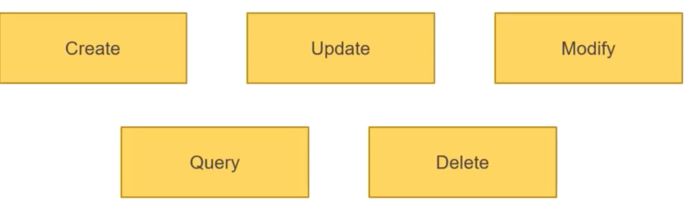

It uses AWS command line interface / Amazon RDS API / AWS Management Console

#### DB Engine feattures

* support familiar DB engines
* Each DB engine supports a set of features and parameters

**Example: Data encryptionin Mysql is different from Oracle**


#### RDS Class

* RDS is further divided into classes. 
* Classes can be defined as instance type on which your engine you require to be established. 
* Class indicates memory capacity and computational offerings 
* Class can be changed as required 

#### Support Storage Class

* Supports 5GB to 6TB data storage •
* Types supported: 
  * Magnetic / General Purpose SSD 
  * Provisioned POPS SSD 


## Apacahe Hbase


* It is an **open source**, **non-relational**, **distributed database** developed as part of the **Apache Software Foundation's Hadoop project**.
* It runs on top of **Hadoop Distributed File System (HDFS)** to provide non-relational database capabilities for the Hadoop ecosystem.
* HBase is included with **Amazon EMR release** version 4.6.0 and later. 
* It also integrates with **Apache Hive**, enabling **SQL-like queries over HBase tables**, **joins with Hive-based tables**, and **support for Java Database Connectivity (JDBC)**. 


### Apacahe Hbase Features

* Apache HBase can be integrated with Apache Phoenix. 
* Apache HBase has tight integration with **Apache Hadoop**, **Apache Hive**, and **Apache Pig**. 
* **Apache HBase's data model**, throughput, and fault tolerance are a good match for workloads. 
* **Apache HBase is natively supported in Amazon EMR**. 

* Fast Performance at scale 
* Run Analytics Workloads on HBase Tables 
* Flexible Data Model 
* Integration with Amazon EMR Feature Set 
* **Amazon S3 Storage for Hbase** 

### Hbase on S3

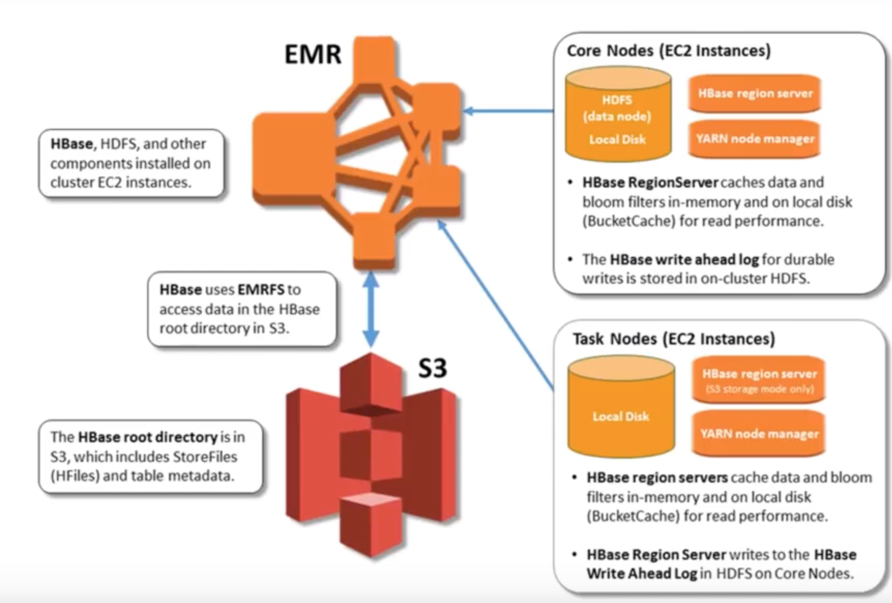


### <mark>Case study: Airbnb</mark>

#### Challenges they faced and solutions

* Data was growing exponentially and company was running out of space -- **Amazon S3**
* More Data-warehouses were required to analyze the data -- **Amazon Redshift**
* No SQL data storage was required without maintenance of servers -- **Amazon Dynamo DB**
* Website needed to include huge videos related to property rentals, which were again on web servers and company had a space crunch -- **Amazon S3**
* For ramping up more servers each time they had to contact someone and several usage commitments with their on-premise vendor - **AWS**

#### More benefits

* 200 EC2 instances as webservers 
* ELB service for load Balancing 
* To easily process and analyze 50 Gigabytes of data - Amazon EMR 
* Amazon S3 to house backups and static files, including 10 terabytes of user pictures 
* To monitor all of its server resources- Amazon CloudWatch 
* Moved its main MySQL database to Amazon RDS 

