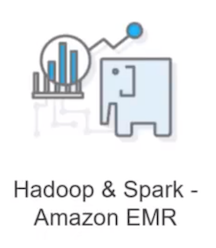

# Big Data Analytic Frameworks

**Using AWS EMR, Athena and ElasticSearch**

### Objects

* Get an overview of Big Data Analytics Frameworks
* Explain the following concepts
  * **Amazon EMR**
  * **Amazon Athena**
  * **Amazon Elasticsearch**

### Why use big data Analytic Framework?

#### Big Data Analytics: An Overview 

* Big Data Analytics refer to the set of functions that can be performed on big data to reach to certain analysis. 

* **Framework to analyse big data enables data scientist or data modelers to analyse huge volumes of unstructured data easily**. 

### Why Big Data Analytics on Cloud

#### Cost

* Infrastructure cost 
* Maintenance cost 
* Framework Cost 
* Licensing Cost 
* Pay as you go pricing model 

#### Infrastructure

* Fast Deployments 
* No Maintenance headaches 
* Elasticity and Flexibility 
* Virtualization ease 
* Scalable Infra 

#### Ease of Accesss

* Access from anywhere across globe 
* Optimal Network access 
* Platform independent 

### Big Data Analytics Framework

*  
*  
* 

## AWS EMR

### Amazon EMR: An overview

Amazon EMR is a managed cluster platform that simplifies running big 
data frameworks, such as **Apache Hadoop** and **Apache Spark**, on 
AWS to process and analyse vast amounts of data. 

You can use Amazon EMR to transform and move large amounts of 
data into and out of other AWS data stores and databases, such as 
**Amazon Simple Storage Service (Amazon S3)** and **Amazon 
DynamoDB**. 

#### Flow of EMR data transformation

#### Amazon EMR: Architecture

### Amazon EMR: Use Cases

**On AWS you can use EMR to get the Cloud benefits. EMR can be used on Premise as well**

### Amazon EMR: Layer

* Storage Layer
* Cluster Resource Management 
* Data Processing Framework

#### EMR Layer - Storage layer

There are various file systems which are used with your clusters to store the data like: 

* **Hadoop Distributed File System** - Distributes the data across Hadoop clusters and makes sure that your data is highly available by creating multiple copies of it. 
* **EMR File System** - Using EMRFS, Amazon EMR extends Hadoop to add the ability to directly access data stored in Amazon S3 as if it were a file system like HDFS. 
* **Local File System** - This system refers to a locally connected disk. When you create a **Hadoop cluster**, each node is created from an Amazon EC2 instance that comes with a preconfigured block of **pre-attached disk storage called an `instance store`**. 

#### EMR Layer - Cluster Resource Management

* The resource management layer is responsible for managing cluster resources and scheduling the jobs for processing data. 
* **YARN (Yet Another Resource Negotiator)** a component of `Apache Hadoop 2.0` to centrally manage cluster resources for multiple data processing frameworks. 
* **Amazon EMR** also has an agent on each node that administers YARN components, keeps the cluster healthy and communicates with the Amazon EMR service. 

#### Data Processing - Framework

* This layer is used to process and analyse the data. Different frameworks are available for different kinds of processing needs, **such as batch, interactive, in-memory, streaming, and so on**. 
* This impacts the languages and interfaces available from the application layer, which is the layer used to interact with the data you want to process. 
* The main processing frameworks available for **Amazon EMR** are **Hadoop MapReduce** and **Spark**. 

### EMR - Demo

To calculate the total number of requests per operating system over a specified timeframe 

In the demo you are going to use a EMR cluster with hive script that: 

1. Creates a Hive table named cloudfront _logs. 
2. Reads the CloudFront log files from Amazon S3 using EMRFS and parses the CloudFront log files using the regular expression serializer/deserializer (RegEx SerDe). 
3. Writes the parsed results to the Hive table `cloudfront_logs`. 
4. Submits a HiveQL query against the data to retrieve the total requests per operating system for a given time frame. 
5. Writes the query results to your Amazon S3 output bucket. 

## Amazon Athena: An Overview

* Amazon Athena is an interactive query service that makes it easy to **analyze data in Amazon S3 using standard SQL**. 
* **Athena is serverless, so there is no infrastructure to manage.** and you pay only for the queries that you run. 
* Athena is easy to use. Simply point to your data in Amazon S3, **define the schema, and start querying using standard SQL.** 
* Most results are delivered within seconds. With Athena, **there's no need for complex ETL jobs to prepare your data for analysis.** 
* This makes it easy for anyone with SQL skills to quickly analyze large-scale datasets. 

### Why Athena

* Athena helps you analyse unstructured, semi-structured, and 
structured data stored in Amazon S3. 
* Examples: CSV, JSON, or columnar data formats such as `Apache Parquet` and `Apache ORC` 
* You can use **Athena to run ad-hoc queries using ANSI SQL**, without the need to aggregate or load the data into Athena. 

### Athena Features

* **Start Querying instantly**
* **Pay per Query**
* **Open, Powerful, Standard**
* **Very fast**

### Tables, Databases in Athena

* Tables and databases are containers for the metadata definitions that define a schema for underlying source data. For each dataset, a table needs to exist in Athena. 
* **The metadata in the table tells Athena where the data is located in Amazon S3**. and specifies the structure of the data, for example, column names. data types, and the name of the table. 
* For each dataset that you'd like to query, Athena must have an underlying table it will use for obtaining and returning query results. Therefore, before querying data, a table must be registered in Athena. 

### Demo - Analyze a sample dataset using Amazon Athena 

**In this demo we are going to:** 

1. Create a S3 bucket and upload a sample data file in it. Sample data will have some population data to be analyzed. 
2. We will then use Athena to create database, table and then analyze the data. 

## Amazon Elasticsearch

### What is Elasticsearch?

* Elasticsearch is a highly scalable open-source analytics engine 
* It is a full text engine which is real time with a minimal latency of 1 second for your change to become searchable 
* One can store, search, and analyze big volumes of data in near real time 
* Elastic search is a open source search server 
* Its written in Java which makes it interoperable 
* Connects with any source to pull the data and analyze it 
* **The underlying database is document type (JSON) i.e. non relational**

### Terminologies of Elasticsearch

* **Near Realtime**
* **Work with cluster (Collection of Nodes)** 
* **Index - Collection of documents** 
* **Type - Within one index, there are types of documents like file, movie, product** 
* **Mapping - similar to database schema that contains metadata of fields** 
* **Shards - division of indexes in multiple streams** 
* **Replica - A copy of a shard for high availability**

### Why Elasticsearch on AWS

* Amazon Elasticsearch Service makes it easy to deploy, secure. operate, and scale Elasticsearch for **log analytics, full text search, application monitoring, and more.** 
* **Amazon Elasticsearch Service is a fully managed service that delivers Elasticsearch's easy-to-use APIs** and real-time analytics capabilities alongside the availability, scalability, and security that production workloads require 
* Cloud Benefits like infrastructure set up, scalability, cost management etc. 

### AWS Elastcsearch - Features

* With Amazon Elasticsearch Service, you only pay for what you use. **There is no minimum fee or usage requirement.** 
* The service automatically detects and replaces failed Elasticsearch nodes, reducing the overhead, associated with self-managed infrastructure and the Elasticsearch software. 
* It's easy to get started with Amazon Elasticsearch Service. 
* **You can set up and configure petabyte-scale Amazon Elasticsearch Service domains in minutes from the AWS Management Console**. 

### AWS Elasticsearch - Version Support 

Amazon ES currently supports the following Elasticsearch versions: 

### YELP — Case Study 

**Big Data Tasks to be handled:**
 
* Enable an automated review filter to identify suspicious content and minimize exposure to the consumer (150 million average views). 
* To come up with some features that help people discover new businesses (lists, special offers, and events), and communicate with each other. 
* To enable business owners and managers are able to set up free accounts to post special offers, upload photos, and message customers. 
* The company has also been focused on developing mobile apps and was recently voted into the iTunes Apps Hall of Fame. 

#### Challenges

* On-premise cluster maintenance
* Cluster set up
* Scalability
* High time to market
* Developer time and effort

#### Solutions - AWS Service

* Yelp replaced the RAIDs with Amazon S3 and immediately transferred all Hadoop jobs to Amazon Elastic MapReduce 
* It uses Amazon S3 to store daily logs and photos, generating around 1.2TB of logs per day without worrying about the space 
* High availability 
* Scalability 
* Pay for what you use  

**The company also uses Amazon EMR to power approximately 20 separate batch scripts. most of those processing the logs.**

**Features powered by Amazon Elastic MapReduce include:** 

* People Who Viewed this Also Viewed 
* Review highlights 
* Auto complete as you type on search 
* Search spelling suggestions 
* Top searches 
* Ads  
