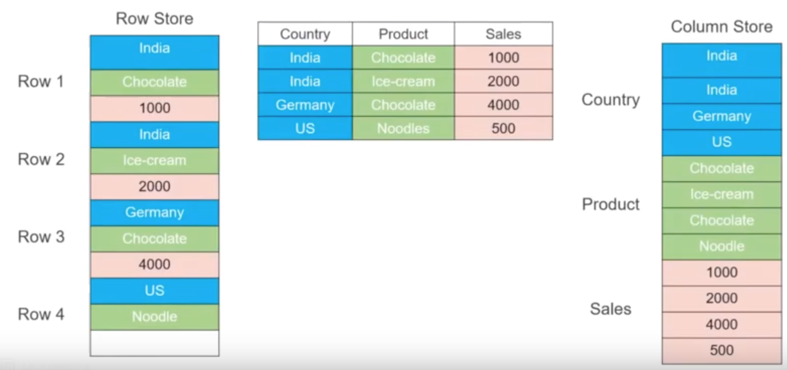
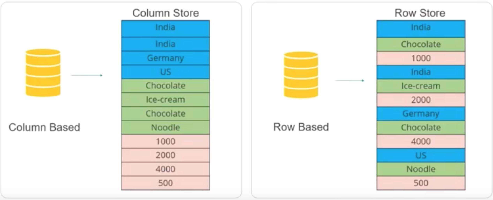
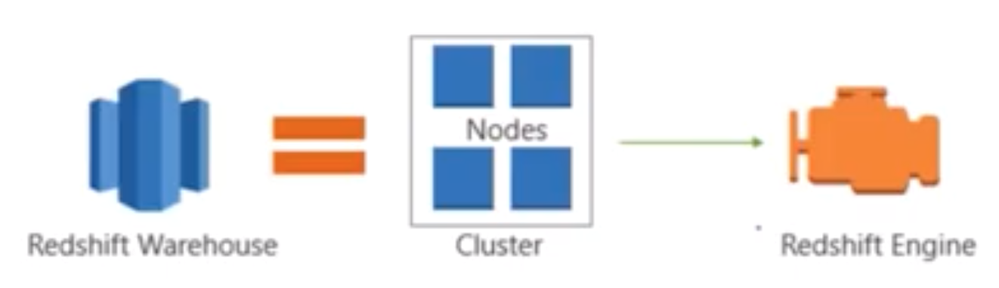
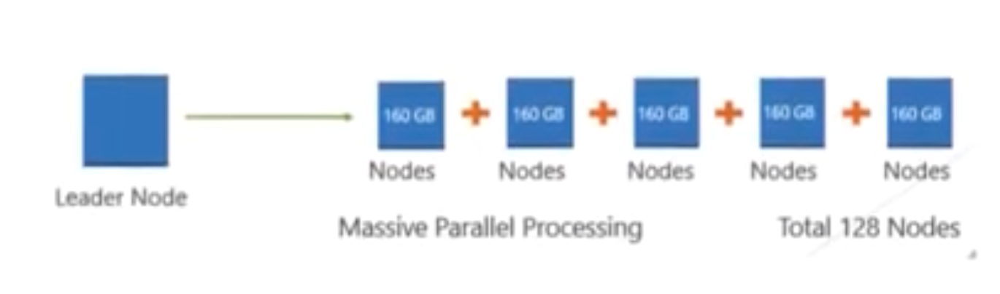

# Data Warehousing on AWS

## Objectives

* Explain the following concepts
  *  Data Warehousing
  *  Amazon Redshift

## Data Warehousing
 
### What is a Data Warehouse

* A data warehouse stores data **from multiple source for analytical pourposes**
* Small databases from where the data is aggregated into a bigger database called **data warehouse**

## OLTP Vs. OLAP

### OLTP 

`OLTP` ---- `Online Transactional Processing` ---- `normalized` ---- `Small Tables`

* Customer tables
* Customer address
* Order table
* Preference table
* Custom order history table

### OLAP

`OLAP` ---- `Online Analytical Processing` ---

`size of table increase`

Data warehouses are designed for OLAP (Online Analytical Processing), **which is used to integrate copies of transactional data from other systems and use it for analytical purposes.**

## Amazon Redshift

#### A data warehosuing solution on AWS

* Is a fast, fully-managed, petabyte scale data warehouse that makes it simple and cost-effective to analyze all your data using your existing business intelligence tools. 

* A great choice if your database is overloaded due to OLAP transactions.  

#### Features

* Compatible with your exsiting business tools
* Cost-effective
* Simple
* Fast
* Fully managed
* petabyte-scale data warehouse

#### OLAP and Columns

 

 
#### OALP and Columns

**Columnar data is stored sequentially in the storage. It requires less reads to get all the data.**

 
 

### Nodes

**Data Warehouse is a clustered storage, not one compute Node that is stroing all your data**

 

**An Amazon Redshift Data Warehouse is a collection of computing resources called Nodes.** 

**Nodes are organized into a group called a Cluster. Each cluster runs in Amazon Redshift engine that contains one or more databases.**

 

### Redshift Demo

In this demo we going to: 

* Create a Redshift cluster in one AZ. 
* Create a snapshot for that cluster and copy it to another region 

#### Case study - Johnson & Johnson

About Johnson & Johnson

* Johnson & Johnson sells consumer health, pharmaceutical and bioinformatics products in more than 175 countries 
* Worlds 6th largest consumer health company 
* Largest Medical devices and diagnostic Business 
* More than 270 small companies work with J&J brand 

**Challenges:**

* Thousand of Servers - Slow provisioning and deployment , low utilization 
* Complex IT Operations - Manual Provisioning and checklist driven operations 
* Business Risks — High fixed cost, opaque allocation 
* Historical Data Management — Huge data management in a petite way to analyze it with various tools 

**Benefits by opting Redshift as data-warehouse solution:**

* Server reduction 
* Automated IT 
* Business Automation 
* Faster Performance 
* Easy to Set up, Deploy, and Manage 
* Cost-effective 
* Scale quickly to meet your needs 
* Query your Data Lake 
 
