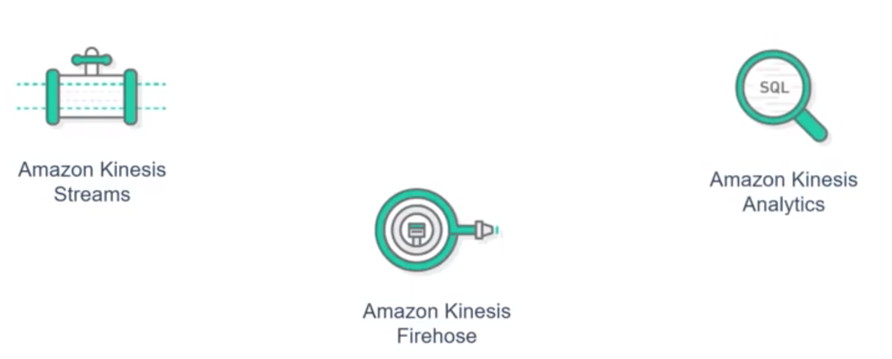
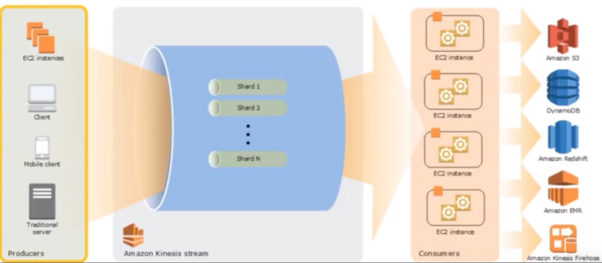
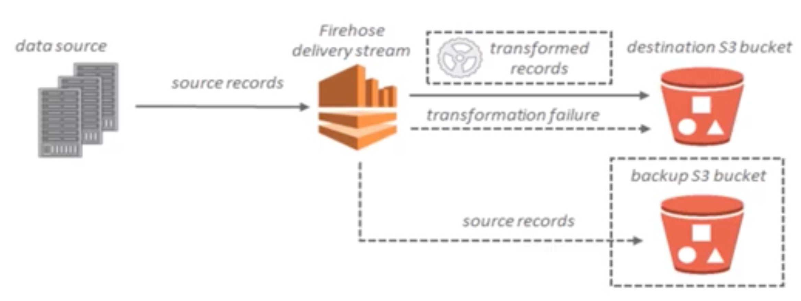
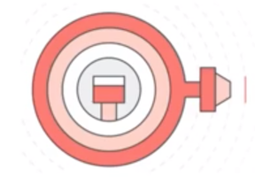
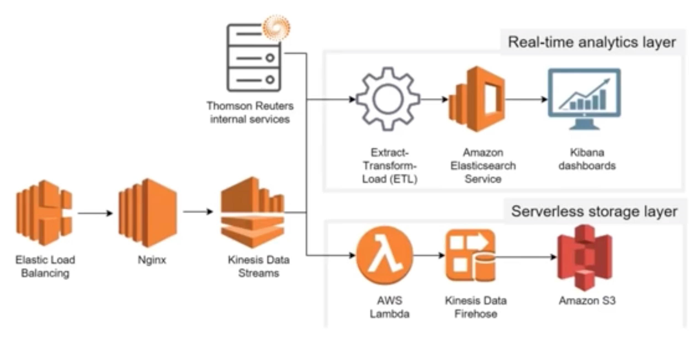

# Real-time Big data analytics on AWS

### Objective

* Get an overview of Real-time data streaming 
* Explain Real-time analytics with AWS 
* **Get an overview of Amazon Kinesis and its architecture**

## Real-time data streaming: An overview

* **Traditional database model the data is first collected, then stored and later analysed.** 
* Real-time processing refers to running the analysis queries on the data that's being just pulled

### What is streaming data?

Data that is generated continuously by thousands of data sources, which typically send in the data records simultaneously, and in small sizes (order of Kilobytes) - **Streaming Data**

### Souce of streaming data

#### Streaming data includes a wide variety of a data such

* log files generated by customers using their mobile or web applications 
* ecommerce purchases 
* in-game player activity
* information from social networks 
* financial trading floors, etc. 

### Streaming Data Use Cases

#### Use case1

Sensors in transportation vehicles, industrial equipment, and farm machinery send data to a streaming application. The application monitors performance, detects any potential defects in advance, and places a spare part order automatically preventing equipment down time. 

#### Use case2

Sensors in transportation vehicles, industrial equipment, and farm machinery send data to a streaming application. The application monitors performance, detects any potential defects in advance, and places a spare part order automatically preventing equipment down time. 

#### Use case3

A real-estate website tracks a subset of data from consumers' mobile devices and makes Real-time property recommendations of properties to visit based on their geo-location. 

## Kinesis

Amazon Kinesis makes it easy to **collect, process, and analyse real-time data** so that you can get timely insights and react quickly to new information in order to make your business flexible. 

**Kinesis helps with:** 

* Infrastructure Setup 
* Maintenance 
* Scalability 

### Kinesis Service

* **Amazon Kinesis Service**
* **Amazon Kinesis Firehose**
* **Amazon Kinesis Analytics**

 

### Amazon Kinesis Architecture

 

### Amazon Kinesis Terminologies

**Data Record**: 

A data record is the unit of data stored in a Kinesis data stream. 

**Data records** are composed of a sequence number, partition key, and data blob, which is an immutable sequence of bytes. 

**Shard:**

Collection of similar data records that can be easily identified are known as **Shards** and many such **shards make a Data stream.** 

**Partition Key:**

**A partition key is used to group data by shard within a stream.**

The Kinesis Data Streams service segregates the data records belonging to a stream into multiple shards, using the partition key associated with each data record to determine which shard a given data record belongs to. 

### Amazon Kinesis Firehose

 

#### Kinesis Firehose； Features

 

* Firehose collects the data ,transforms it and loads it to desired destination such as S3, Elasticsearch Redshift, Splunk etc. 
* It works on data record which is the data of interest that your data producer sends to a Kinesis data delivery stream. A record can be as large as 1.000 
KB. 
* Firehose works on the data sent by Kinesis stream. 

### Amazon Kinesis Analytics

With Amazon Kinesis Data Analytics, you can process and analyze streaming data using **standard SQL**. The service enables you to quickly author and run powerful SQL code against streaming sources to perform time series analytics, feed Real-time dashboards, and create Real-time metrics. 

Kinesis Analytics is used to: 

* **Generate time-series analytics** - You can calculate metrics over time windows, and then stream values to Amazon S3 or Amazon Redshift through a Kinesis data delivery stream. 
* **Feed Real-time dashboards** - You can send aggregated and processed streaming data results downstream to feed Real-time dashboards. 
* **Create Real-time metrics** - You can create custom metrics and triggers for use in Real-time monitoring, notifications, and alarms. 

### Demo

* Create a data producer that puts simulated visitor counts from various URLs into a Kinesis data stream. 
* Create a data stream which durably stores these data records in the order they are remived. 
* Finally, create a data consumer that gets these records from the stream, and then calculates how many visitors originated from a particular URL. 

#### Thomas Reuters

Thomson Reuters offers hundreds of digital products and services for customers ranging from law firms to banks to consumers. 
In 2016, Thomson Reuters decided to build a solution that would enable it to capture, analyze, and visualize analytics data generated by its offerings, providing insights to help product teams continuously improve the user experience. 

#### Thomas Reuters - Case Study

 