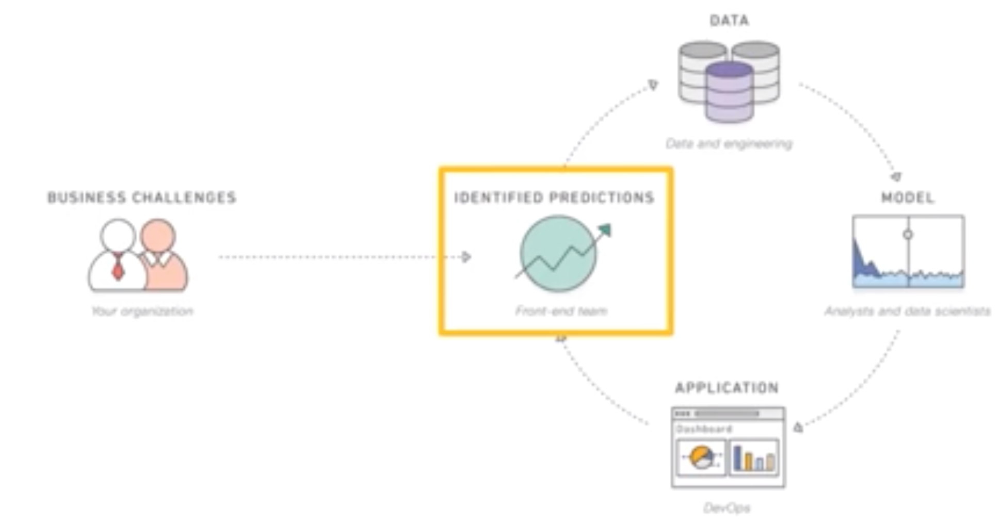
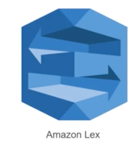
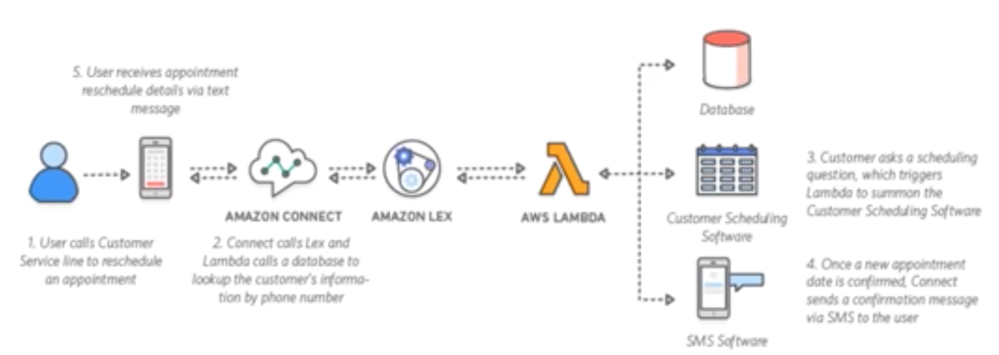
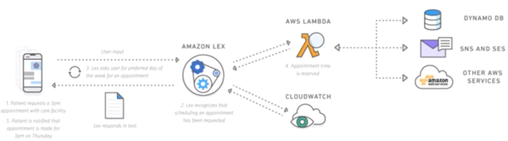
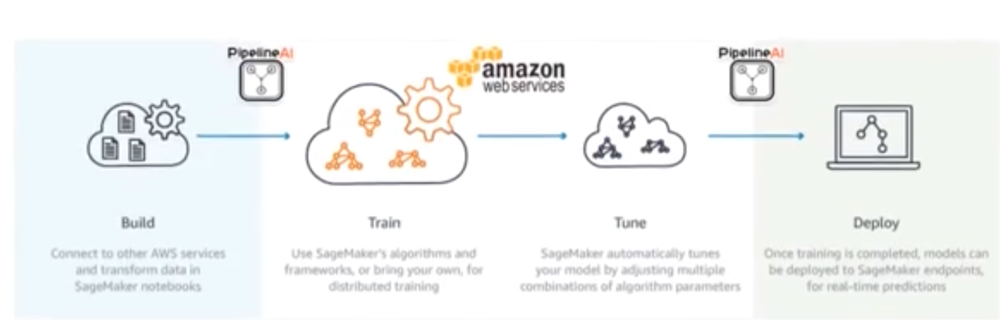
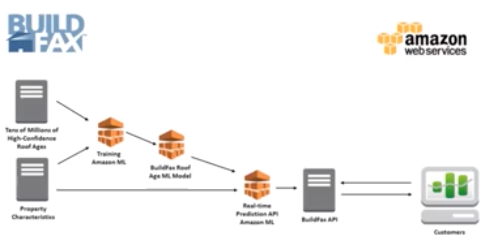

# Artifical Intellgence - Machine Learning

## Objectives

* Explain AI and ML in AWS 
* Explain the following concepts: 
  * Amazon Lex 
  * Amazon Polly 
  * Amazon Rekognition 
* Explain Amazon Mxnet and SageMaker 
 
### What is Artifical Intellgience

*Artificial Intelligence (Al) is the science of making machine do the things which would require intelligence if done my men.*

### What is Machine Learning

* Machine learning is an important aspect of AI. 
* It is a field of computer science that gives computers the ability to learn without being explicitly programmed. Machine learning is 
most widely used in businesses. 
* It learns patterns from the past data and make a model. The model is used to make predictions for the new data. 
 
### Other Aspects of AI
 
* **Natural Language Processing (NLP)**: AI systems can understand, interpret and communicate in human languages. 
* **Robotics**: AI brings intelligent behavior to the robot to be able to provide services to humans in unpredictable and changing environments. 
* **Expert Systems**: These are designed to solve complex problems by reasoning through bodies of knowledge. 
* **Vision** A machine can see objects around it like humans. 
* **Speech Analytics**: It is the ability to process speech or convert written information to speech. 

**AI and ML on Premise**
 
* AI and ML technologies have been implemented on Premise. 
* There are several steps involved in successful implementation of AI and making ML in a business. 

 

## Why ML or AI on AWS

* AWS offers machine learning services and tools tailored to meet your needs and level of expertise. 
* Developers can easily add intelligence to any application with a diverse selection of pre-trained services that provide computer vision, speech, language analysis. and chatbot functionality. 
* AWS supports all the major machine learning frameworks, including TensorFlow, Caffe2. and Apache MXNet, so that you can bring or develop any model you choose.
* AWS provides you with loads of options in categories of GPU and FPGAs instance types. 
* No minimum commitment and simple pay per use model. 

### AI on AWS

AI is implemeneted on AWS using three services

 

## Amazon Lex

 

* Lex is a service used for making machine understand human speech and respond to it in a friendly manner-example — Alexa, Chatbots etc. 

* Lex provides the advanced deep learning functionalities: 
  * **Automatic speech recognition (ASR)** for converting speech to text 
  * **Natural language understanding (NLU)** to analyze text and guess the motive behind the same 
  * To provide best in class user conversational experience

  
### Amazon Lex: Use Cases

**Call center bots - Using a Chat bot to schedule an appointment**

 

**Informational Bots**

 

## Amazon Polly

Amazon polly is a Text-to-speech service that uses advanced deep learning technogies to synthsize speech that sounds like human speech

 

With dozens of lifelike voices across a variety of languages, you can select the ideal voice and build speech-enabled applications that work in different geographies. 

### Amazon Polly: Benefits

* Natural Sounding Voices 
* Store and Redistribute Speech 
* Real-time Streaming 
* Customize and Control Speech Output 
* Low Cost 

## Amazon Rekognition

 

* Amazon Rekognition recognizes the videos and images and help you analyze them. 
* You need to give any sample video to Rekognition and it will identify image, text, people and any in apt content. 

### Amazon Rekognition: Benefits

* Simple Integration 
* Continuous learning 
* Fully Managed 
* Low Cost 
* Real time Analysis 

### Amazon Rekognition: Use Case

* Public Safety 
* Searchable Video Library 
* Detect Unsafe Video 
* Image Moderation 
* User Verification 

## Amazon SageMaker

**Amazon SageMaker** is a service that helps developers and data scientists to build, train, and deploy machine learning models without worrying about scalability. 

 

Amazon SageMaker removes the complexity that holds back developer success with each of these steps:
 
1. Collecting and preparing your training data to discover which elements of your data set are important. 
2. Selecting which algorithm and framework you'll use. 
3. Teaching the model how to make predictions by training, which requires a lot of compute. 
4. Tuning the model so it delivers the best possible predictions, which is often a tedious and manual effort. 

#### Amazon Sagemaker: How does it works

 

### Amazon Sagemaker: Benefits

* Get to Production with Machine Learning Quickly 
* Choose Any Framework or Algorithm
* One-Click Training and Deployment 
* Easily Integrate With Your Existing Workflow •
* Easy Access to Trained Models 
* Optimized for Speed 

### Amazon Sagemaker: Use cases

* Ad Targeting 
* Credit Default Prediction 
* Supply Chain and Demand Forecasting 
* Click-through Prediction 

### Apache MXNet

 

* A framework for machine learning which is highly scalable training and inference platform, 
* It has got excellent machine learning API which is simple to use 
* MXNet provides a Gluon interface that help users from all backgrounds to develop deep learning on cloud, mobile apps etc. 
* With small and precise Gluon code, you can build: 
 * linear regression 
 * convolutional networks 
 * recurrent LSTMs for object detection, speech recognition, recommendation. and personalization 

#### Apache MXNet: benefits

* Easy to Use 
* Great Performance 
* For IOT and edge 
* Highly Flexible 

### Case Study - AI and ML

BuildFax started in 2008 by aggregating dispersed building permit data from across the United States and providing it to other businesses, such as insurance companies, building inspectors, and economic analysts. 

Today it provides solutions tailored to those professions along with a variety of services, including indices that track trends like housing remodels and new commercial construction. 

#### Challenges

* BuildFax's core customer base is insurance companies, which spend billions of dollars annually on roof losses. The company provides estimates on the age and condition of roofs to help its customers establish policies and premiums. 
* BuildFax initially built predictive models based on ZIP codes and other general data using Python and R languages, but building the models was complex and the results did not provide enough differentiators to boost the business. •
* BuildFax needed a solution that was easier to use and would support faster, more accurate modeling for property-specific estimates. 

 

* The image above shows the machine learning process used by BuildFax. 
* Amazon ML's real-time prediction engine then takes in property characteristics for buildings for which roof age is not known and makes roof-age predictions based on the models. 
* BuildFax provides these age predictions to its customers through the BuildFax API. 

#### Additional benenfits

* The best practices and ease of use built into Amazon Machine Learning dramatically streamline the process of building predictive models.
* Models that previously took six months or longer to create are now complete in four weeks or less. 
* BuildFax can provide customers with easy, programmatic access to predictions through APIs. 
* Creates opportunities for new data analytics services that BuildFax can offer to customers, such as text analysis in Amazon ML to estimate job costs with 80 percent accuracy. 