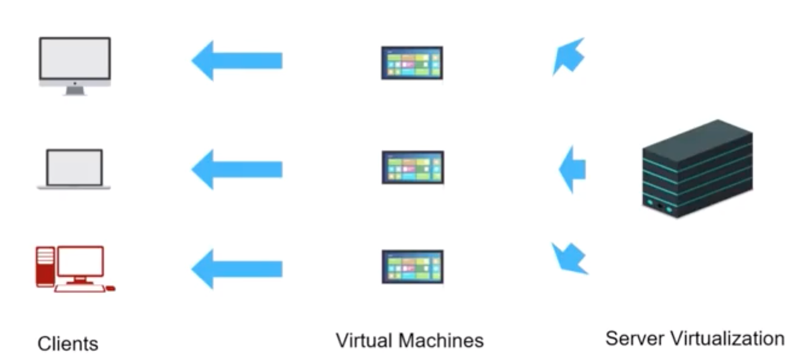
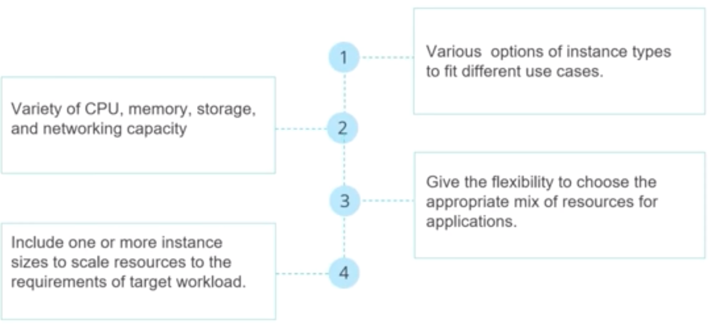

# Big data Compute on AWS

### Objective

* Define EC2 and Virtualization 
* Discuss web hosting on EC2 instances 
* Explain EC2 Instance Types 

### What is Elastic Cloud Compute? 

**Amazon EC2 helps you launch Virtual Machines (VMs) in AWS cloud.**
 
* When you require any server for website hosting. or install certain things on any of the servers either to make it a webserver or a database server or for any computation need, you may have to launch a VM in the cloud. The service that helps you achieve this is called Amazon EC2 service. 
 
**With this service you can launch, manage and scale your VMs based on your choice of OS, infrastructure type.**
 
**You can launch and operate these servers from anywhere across globe.**

### Virtualization 

* Virtual version of a system like a server, an OS. a storage device or network resources 
* Technique that abstracts the underlying resources 
* One machine is shown as multiple virtual machines 

#### A Virtual Machine (VM) 

* The simulated environment created using virtualization is called a VM. 

#### Benefits of EC2

* Elastic Web-Scale Computing
* Flexible Cloud Hosting Service
* AWS Integration
* Reliable and Secure
* Low Cost

#### Virtual Machine Images

 

#### Amazon Machine Images(AMI)

**The software information:** 

* OS information    
* Volume Information  `-------` **Snapshot of the volume**  
* Permissions  

**types**
 
1. Predefined images `----` templates already there provided by Amazon 
2. Custom Images `----` customer's own image 

## Amazon Machine Image 

* **Amazon Machine Image (AMI)** is a template required to launch a virtual server in the cloud. 

**AMI consists of:**
 
* An operating system information, an application server, and applications details 
* Launch permissions to manage access on AMI to launch instances
* A block device mapping that points to the volumes for the data 

## EC2 instance Types

 

### Instance Types for Big data

* **Compute Optimized (C5,C4) Compute intensive applications**. ML inferences and scientific modelling 
* **Memory Optimized (R4) High performance databases**, In memory analytics 
* **Storage Optimized (D3)** Creating distributed file systems 
* **GPU Enabled (G3) 3-D parallel processing**, graphic intensive applications 

## EC2 Purchasing Options 

* **On-Demand Instances** - Pay, by the second, for the instances that you launch. 
* **Reserved Instances** - Purchase, at a significant discount. instances that are always available, for a term from one to three years. 
* **Scheduled Instances** - Purchase instances that are always available on the specified recurring schedule, for a one-year term. 
* **Spot Instances** - Request unused EC2 instances, which can lower your Amazon EC2 costs significantly 
* **Dedicated Hosts** - Pay for a physical host that is fully dedicated to running your instances, and bring your existing per-socket, per-core, or per-VM software licenses to reduce costs. 
* **Dedicated Instances** - Pay, by the hour, for instances that run on single-tenant hardware. 

### Storage types

* **Ephemeral Storage** `---` non persistent storage `--` data on ephemeral storage will be lost if we delete or stop an instance 
* **Elastic Block Store** `-- `stays in the same AZ where we have our EC2 instance . Stays even if we terminate the instance 

## Expedia Case Study

 

Expedia Inc. is a leading online travel company, providing leisure and business travel to customers worldwide. 

Expedia.com, one of the world's largest full service online travel agencies, with sites localized for more than 20 countries: 

They have `hotels.com`, the hotel specialist with sites in more than 60 countries; Hotwire.com, hotel specialist with sites in more than 60 countries. and other travel brands. 

### Chanlleneges 

**Launching ESS:**

* A new service was supposed to be launched within three months. 
* ESS uses algorithms based on customer location and aggregated shopping and booking data from past customers to display suggestions when a customer starts typing. 
* They wanted it across three geographic locations step by step. 
* Infrastructure scale up was the biggest challenge in this. 

**Latency was biggest issue**

* Expedia was unable to improve service to customers in the Asia Pacific region as well as Europe. 

### How AWS Helped

* Using AWS EC2, they deployed and delivered ESS within one month. Scalability was no more an issue with autoscaling service of EC2 
* They replicated infra in other regions using cloudformation service 
* Use Cloudfront to reduce the latency from 700 ms to 50ms 

### Other AWS services used by Expedia

* Expedia provisions Hadoop clusters using **Amazon EMR** to analyze and process streams of data coming from Expedia's global network of websites, primarily clickstream, user interaction. and supply data. which is stored on **Amazon S3**. 
* Expedia processes approximately 240 requests per second. The advantage of AWS is that we can use **autoscaling** service to match load demand instead of having to maintain capacity for peak load in traditional datacenters. 
* To simplify the management of GDE, Expedia developed an identity federation broker that uses **AWS IAM** and the **AWS Security Token Service**. 
