# Azure Administration: Manage Identities


## Azure Active Directory overview

**The Microsoft identity management solution in the Cloud**

**Microsoft Services Using AAD** 

* Office 365 
* Dynamics CRM 
* Azure 

**Single Sign-On for Cloud Apps** 

* Over 2,600 SaaS apps already available 
* Internal line of business apps 
* Reporting on application usage 

**Integrates with On-Premises Server Active Directory** 

* Synchronize accounts between Server AD and Azure AD 
* <span style="color:red">Password synchronization</span> 
* Single sign-on (SSO) via **Active Directory Federation Services (AD FS)** 


**Identity Management** 

* Multi-Factor Authentication (MFA)
* Self-service password reset 
* Self-service group management
* Device registration
* Role-based access control (RBAC)
* Application usage monitoring
* Auditing and alerting
* Security monitoring
* Privileged account management

**How does Azure Active Directory Work**

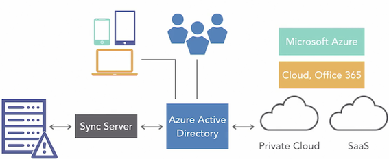

**Azure Active Directory Editions** 

* Free 
* Basic 
* Premium P1 
* Premium P2 

**Free**

* Up to 500,000 directory objects 
* Up to 10 apps for single sign-on 
* B2B collaboration 
* Self-service password change (cloud users only) 
* Azure AD Connect 
* Basic reporting 

**Basic** 

* Free+ 
* Self-service password reset (cloud users only) 
* Company branding 
* Application Proxy 
* Group-based access management and provisioning 
* Service Level Agreement (SLA) 


**Premium P1** 

* Self-service password reset/unlock/ change and password writeback 
* Self-service group management
* Self-service app management 
* Multi-Factor Authentication 
* MIM CAL and MIM server 
* Cloud App Discovery 
* Connect Health 
* Automatic password rollover for group accounts 
* Device synchronization 
* Conditional access based on location and group 
* Conditional access based on device state 
* Advanced reporting 


**Premium P2** 

* Identity Protection 
* Privileged Identity Management 
* Access reviews 


### Add a custom domain name

**Considerations**

* Only a global administrator can manage domains in Azure AD 
* Up to 900 managed domain names per Azure AD tenant 
* Up to 450 domains for federation using on-premises AD 
* **Subdomains are automatically verified** 
* `production.bennettbiz.ca` 

> Example here: `production.bennettbiz.ca` would be automatically verified if `bennettbiz.ca` was also verified


**You must have alrady purchased this domain through register**

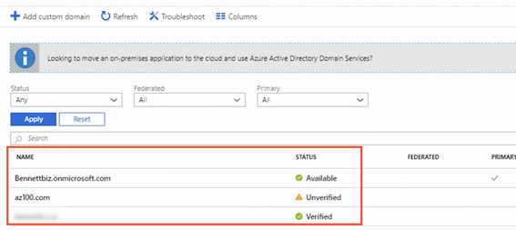

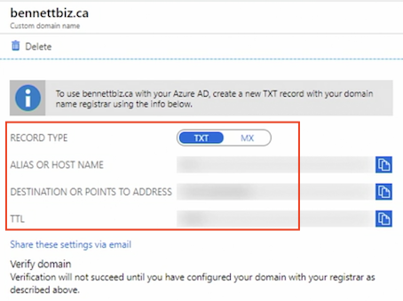


### Configure self-service password reset

**Password reset - properties**

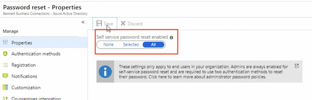

> By default, password reset with multi-factor authentication is enabled by admins

**Authenticate methods**

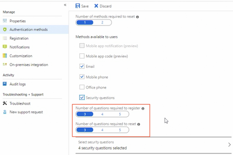

**Notifications:**

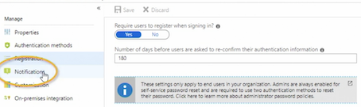

> Notifications are optional will let the user know the password's been reset, set it to let the administrators know when other admins reset their password

**Customization**

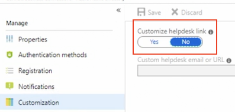

> In Customization dekstop can provide helpdesk link for more information if they run into trouble

**On-premise integration**

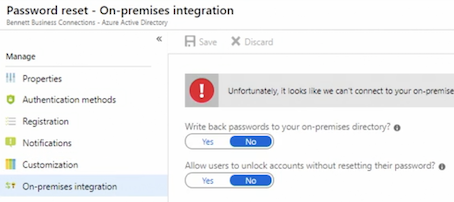

Finally, if you are using Azure Active Directory connect to synchronize on-premises identities with Azure Active Directory, you can enable write back passwords to your on-premises directory and allow users to unlock accounts without reseting their password

**Administrators will always have two-factor authentication applied when they reset passwords**


### Manage multiple directories

**Azure AD Overview**

* A domain name can only be used by a single Azure AD 
* The creator of the tenant is a global administrator 
* Other administrators do not have access to the directory unless granted permission
*  Deleting the subscription does not delete the directory 


**Delete an Azure AD** 

* Delete all users 
* Delete all applications 
* Disable MFA 
* Remove all subscriptions for other Microsoft Online services 
* Must have a one global administrator who can delete the directory 

**Switch Directory**

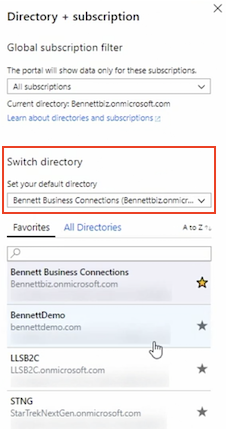

**Delete Directory**

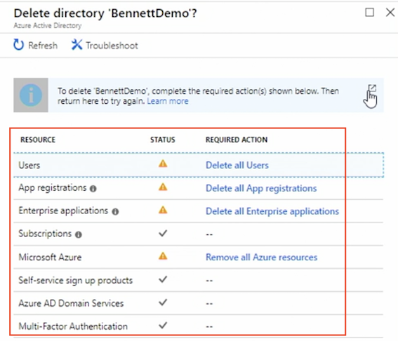

### Azure AD Join overview

**Device Management Options**

* Registering 
* Joining 
* Hybrid Azure AD joined 


**Device Registration** 

* Register to Azure AD 
* Identity is assigned to the device  
* Authenticate the device to Azure AD 
* Enable or disable the device 
* Combine with mobile device management (MDM) for conditional access 

**Device Joining** 

* Extension of registering 
* Changes the state of the device 
	* Users sign in with an organization or school account instead 
of a personal account 
* Windows 10 only 

**Joining Benefits** 

* Single sign-on to SaaS apps and services 
* Enterprise State Roaming 
* Windows Hello 
* Restrict access based on compliance policy 
* Access to device on-premises if a domain controller (DC) is available 
* Windows Store for Business access 

**Hybrid Azure AD** 

* Used when devices are joined to AD on-premises 
* Windows 7 and later 
* Registration is automatic 

**Comparison**

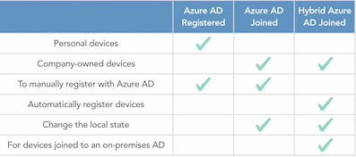

**Enterprise State Romaing**

Which provide a seamless experience for your users accross their windows devices 

**Enterprise State Roaming Overview** 

* Settings and app data are synchronized across devices 
* Windows 10 only 
* Reduces time needed to configure new device 
* Supports separation of corporate and consumer data in their cloud accounts 
* Azure Rights Management ensures data is automatically encrypted before leaving the device 
* Azure AD Premium 
* Enterprise Mobility + Security 
* Device must authenticate using an Azure AD identity 

### Configure device settings

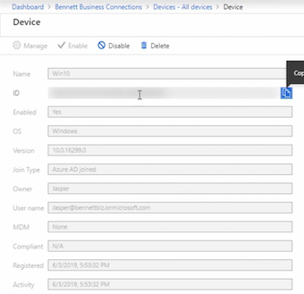

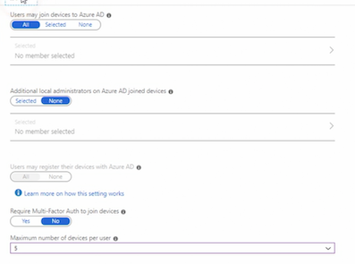

### Quiz

1. You need to allow selected users only to use Enterprise State Roaming. Which Azure AD SKU must you purchase?
	* Azure AD Premium P1 or P2

2. A user reports that they are unable to sync their settings and apps across their Window 8 tablets. How can this be resolved?
	* Upgrade or replace the devices to Windows 10.
	* Enterprise State Roaming only applies to Windows 10 devices.
3. If a subscription is deleted, the Azure AD can still be accessed using which method?
	* Azure Graph API
	* Office 365 Admin Center
	* PowerShell
4. What is the maximum number of MFA methods that can be required for a user to reset their password?	
	* 2
5. What is the minimum role that manage domains in Azure AD?
	* Global Administrator
6. If the Azure administrator needs to allow users to reset their own passwords, what is the minimum version of Azure AD they must purchase?
	* Basic
	* `The free version only allows for changing the password, not resetting it`.


## 2. Manage Azure AD Users and Groups


### Create and manage users

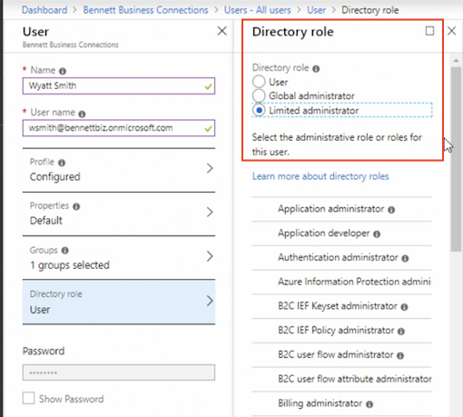

* **User role**: standard role for most of users
* **Global Administration role**: User will have full control over all directory resources
* **Limited Administrative roles**: 

**General User Settings**

* App registrations
* Administration portal
* Linkedln account connection
* External users

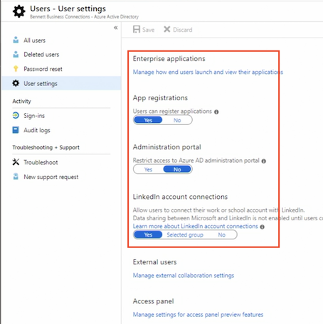


### Create and manage groups

**Group types**

* **Security**: Group within Azure 
* **Office 365**: Provide office 365 access to shared mailbox, calendar, files, sharepoint as well as other services are available in Office 365 and Office 365 group will support users that are outside of the organization

**Members type**

* Assigned 
* dynamic user
* dynamic device

**Add rules for members**

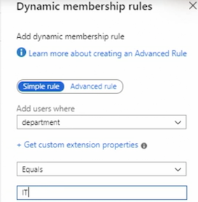

> I'm unable to add memebers to this group and that is because it's **Dynamic Group**
> 
> But I can add owners in **Owners section**
> 
> We can created **Nested Groups in Azure**, I could add this group to another group, 

**Configure Group management**

> You must have an Azure Active Premium subscription, in order to use this feature

* Self Service Group management
* Security group
* office 365 groups

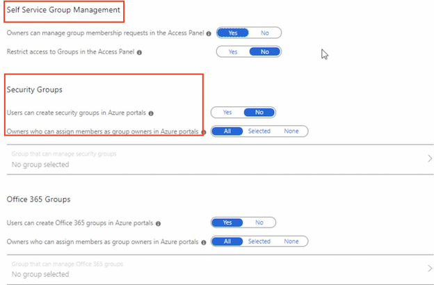

**Enable renewal notification**

> How many days the group must exist before it needs to be renewed

<span style="color:red">The minimum number of days is 31</span>

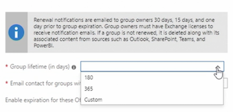


### Create users and groups using PowerShell

```
# Create a User & Group, Assign Members to Group 

# Create the Password Profile 
$PasswordProfile = New-Object -TypeName Microsoft.Open.AzureAD.Model.PasswordProfile 
$PasswordProfile Password "Uew657!*CS" 

# Creates the user 
New-AzureADUser -DisplayName "Wanda smith"` 
	-PasswordProfiLe $PasswordProfile  `
	-UserPrincipalName "Wanda@bennettbiz.onmicrosoft.com"  `
	-AccountEnabled $true  `
	-MailNickName "Wanda"  `
	-Department "Production" 

#Create a Group 
New-AzureADGroup -DisplayName "Production"  `
	-MailEnabled $false `
	-SecurityEnabled $true `
	-MailNickName "Production" 
	
#Add Member and owner to a Group 

#Get User 
Get-AZADUser -UserPrincipalName "wandaftennettbiz.onmicrosoft.com" 

#Get Group 
Get-AZADGroup -DisplayNamestartswith "Production" 

#Add a member to a group 
Add-AzureADGroupMember -objected ""  `
-RefObjectld ""

#Add Walter as owner of the group 
Add-AzureADGroupOwner -objectid "" `
-Refobjectid "a5be686a-330d-4846-9681-2bc7f42d2db6" 

#view group members 
Get-AzureADGroupMember -Objected "1a819c65-29ff-4a8b-9627-799adb168869" 

#view group members 
Get-AzureADGroupOwner -objectid "1a819c65-29ff-4a8b-9627-799adb168869" 
```


### Import bulk users

```
# Import Bulk Users 

# variables 
$Directory = "bennettbiz.onmicrosoft.com" 
$NewUserPassword = "ChangeMeNow!" 
$CsvFilePath = "C:\Users\Sharon Bennett\Desktop\Manage IDs\NewUsers.csv" 

# Create the Password Profile 
$PasswordProfile = New-Object -TypeName microsoft.open.Azureamodel.PasswordProfile 
$PasswordProfile.Password  = $NewuserPassword 

# Import the csv file. 
$Newusers = import-csv -Path $CsvFilePath 

Foreach ($NewUser in $NewUsers) 
	# Construct the User 
	$UPN = $NewUser.FirstName + "." $NewUser.LastName + "@" + $Directory 
	$DisplayName = $NewUser.FirstName + " " + $NewUser.LastName 	$MailNickName = $NewUser.FirstName + "." + $NewUser.LastName 
	
	# Add the user 
	New-AzureADUser -UserPrincipalName 
	-AccountEnabled $true `
	-DisplayName $DisplayName `
	-MailNickName $mailNickName `
	-PasswordProfile $PasswordProfile 
} 
```

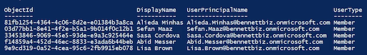


### Manage guest accounts

> To have outside contrator access certain resource, but you dont want them to have access to everything. In this case, you can add the user as guest user

`Azure AD > Organizational Relationships > Settings`


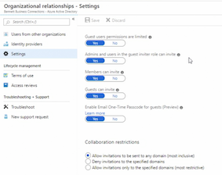


### Quiz

1. You want to limit the access a guest user has to Azure AD. Where do you enable this setting?

	* `Azure AD > Organizational Relationships > Settings`

2. To add a new user to Azure AD using PowerShell, which cmdlet would you use?

	* `New-AzureADUser`
3. To add a user to a group using PowerShell, which cmdlet would you use?
	* `Add-AzureADGroupMember -ObjectId -RefObjectId`
4. As the Azure administrator, you want to reduce the manual process of adding users to groups. What type of group can you use to meet this requirement?
	* Dynamic User Group (A Dynamic group can contain users or devices, not both.)
5. Users report that their data is not syncing between Microsoft and LinkedIn. You confirm the integration is enabled for all users. How is this resolved?
	*  The user must consent to the sharing of the data between the accounts.
	*  The user must manually connect their Office 365 and LinkedIn accounts.

## 3. Implement and Manage Hybrid Identities

### Azure Active Directory Connect overview

**Azure Active Directory Connect**

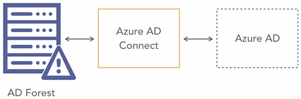

**Azure AD Connect** 

* Authentication 
	* Users 
* Synchronization 
	* Users, groups, and more 
* Health monitoring 

**Hybrid Identity and Azure AD Authentication Methods** 

* Cloud authentication 
	* Password hash synchronization (PHS) 
	* Pass-through authentication (PTA)
* Federation (AD FS) 
* All provide single sign on for domain joined devices that are on the corporate network 

**Password hash synchronization (PHS)**

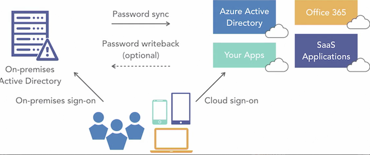
 
**Password Hash Synchronization (PHS)** 

* Syncs on-premises password to Azure AD 
* Use the same password for both on-premises and in the cloud 
* **Password hashes are stored in Azure AD** 
* **Password writeback, if enabled**, will write the password back to on-premises AD if the password is changed in the cloud 
* Default authentication when using Azure AD Connect Express 

**Pass-through authentication (PTA)** 

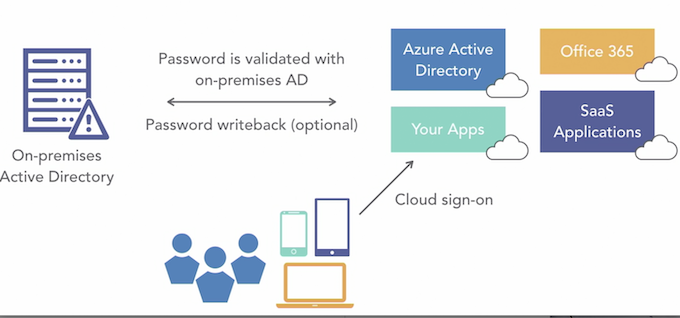

* Users can sign in to on-premises or cloud-based applications using the same password 
* Password writeback, if enabled, will write the password back to on-premises Active Directory if the password is changed in the cloud 
* **Password hashes are not stored in the cloud** 
* Passwords are checked against the on-premises Active Directory for increased security 
* **Microsoft recommends configuring for high availably** 


**Federation (AD FS)**

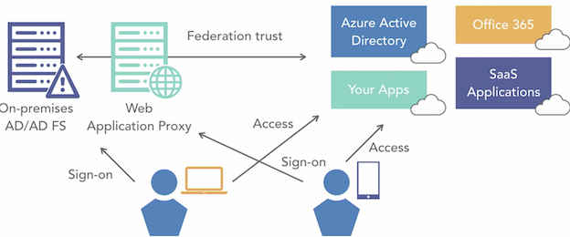

* Authentication occurs on-premises 
* **Once authenticated user is granted access to the cloud resources** 

**On-Premises AD Requirements** 

* Forest functional level must be Server 2003 or later 
* **Password writeback requires the DC to Server 2008 R2 or later** 
* AD schema version must be Server 2003 or later 
* **The DC must be writeable** — read-only domain controller (RODC) is not supported 
* NetBIOS names cannot include a period 
* Microsoft recommends enabling the AD Recycle Bin 

**Azure AD Connect Server Requirements** 

* Windows Server only — not Small Business Server (SBS) or Essentials 
* Install on a member server not on a DC 
* Full GUI not supported on Server Core 
* Server 2008 R2 or later 
* Group Managed Service Account requires Server 2012 or later 

**Federation (AD FS)** 

* A federation server Server 2012 R2 
* A Web Application Proxy - Server 2012 R2 
* **An SSL (Secure Sockets Layer) certificate**
* Configure name resolution 


### Azure Active Directory Connect: Express installation

**Connect to Azure AD**

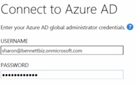

**Configure Complete**

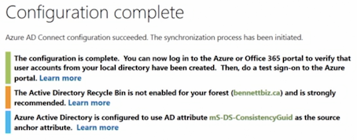


### Azure Active Directory Connect: Custom installation

**Connnect your directories**

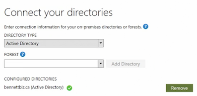

**Azure AD sign-configuration**

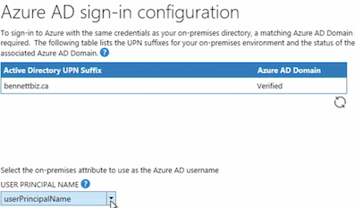

**Domain and Ou filtering**

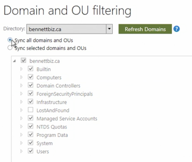

**Uniquely identifying your users**

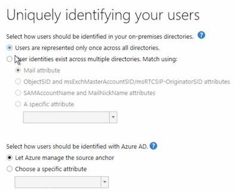

**Filter users and devices**

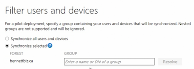

**Azure AD apps**

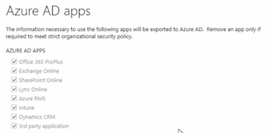

**optional features**

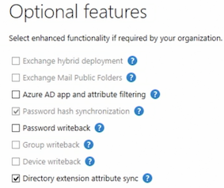


### Manage Azure AD Connect

**Configure after Express installation**

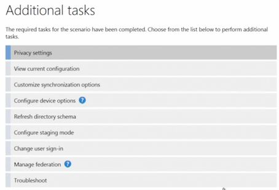

### Quiz

1. You notice Azure AD Connect has not been syncing for several hours after you opened and turned on a configuration option in the Azure AD Connect agent. How do you correct this issue?
	* In the Azure AD Connect agent, finalize the configuration changes.
	* The Azure AD Connect agent must be closed before a sync will occur.
2. Why would you choose a custom installation of Azure AD Connect?
 * You need to use an existing SQL server for the installation.
 * You need to specify a custom installation location.
 * You have multiple forests that need to be synchronized.
3. What is the default authentication method when using the Express setup in Azure AD Connect?
 * Password Hash authentication (password hash synchronization)
4. What does Microsoft recommend configuring when implementing Pass-Through Authentication (PTA)?
 * High availability
 * Microsoft recommends implementing high availability, ensuring users can still authenticate.

## 4. Implement Multifactor Authentication (MFA)


### Configure user accounts for MFA

**Azure MFA Versions**

* MFA in the cloud 
	* Cloud only users and apps 
* MFA Server on-premises 

**Cloud MFA Options** 

* Multi-Factor Authentication for **Office 365 or Microsoft 365 Business** 
* Multi-Factor Authentication for **Azure AD Global Administrators** 
* Azure Multi-Factor Authentication (full version) 
	* Azure AD Premium 


### Configure MFA settings

**MFA - Account Lockout** 

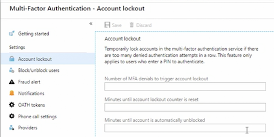

**One-time bypass to skip MFA for special user** 

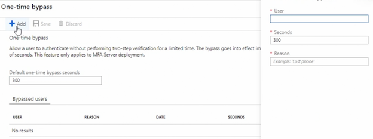

### Configure MFA service settings

**Multi-factor authentication service settings**

* App passwords
* Trusted Ip for skip
* Verfication options

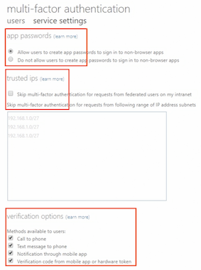

### Quiz

1. Users are complaining about having to use MFA when they're in the office. You're asked to remove this requirement. How do you do this?
	*  Configure the office IP address as a trusted IP in MFA service settings.
2. Abid is working in a location where cell service is unavailable for the next three hours, so he can't use MFA to authenticate. What can the Azure administrator configure to ensure Abid doesn't need to use MFA for the next three hours?
	* `Enable one-time bypass`
3. You are importing MFA status updates for bulk users, and some statuses have not been applied to the user. How do you correct the issue?
	* Create the user first in Azure AD.
	* **MFA status updates can't be applied if the user doesn't exist.**


