#  Load Balancers and Application Gateways

## 1. Implementing Azure Load Balancers

### Load balancer overview

**What Is a Load Balancer**

* Azure resource 
* Distribute inbound requests to pools of systems 
* Check for service health 

**How Do Load Balancers Work?**

* Front-end and back-end 
* Layer 4 (transport) rules 
* Network Address Translation (NAT) rules 
* Basic and standard SKUs 
* TCP, HTTP, and HTTPS health probes 


* **The front end** 
	* Public IP
	* Private Azure IP that could be used as a **private load balancer**. 

* **The back end（Receive the requests from the client）** 
	* Pool of servers,
	* App services
	* Scale sets

* **Set of layer 4 (transport) rules** which the load balancer uses to decide to which servers those requests should be sent to

* **Network Address Translation rules** let the load balancer decide when a request is sent to a specific port, if it should be sent to one of the servers specifically in the back end.

* **HTTPS health probes to check** if the back end servers are up and running or if they should be not used for traffic redirection

**Load-Balanced Communication**

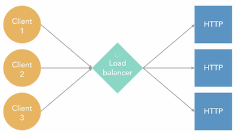

### External and internal load balancers

**External load balancers**

* Maps public IP address and ports to internal tagrets
* Applies load balancing rules
* Uses Port Address Translation(PAT)
* Typically used for websites and similar services

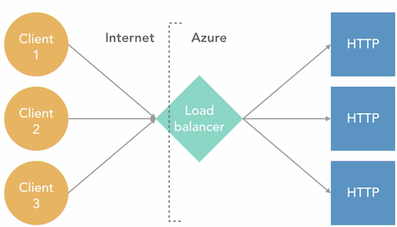

* ELB  will receive communications from the different clients that are on the internet, and send those requests to internal targets like a **web server, or a scale set**.
*  **Port Address Translation** which lets the load balancer modify the port where the client is connecting. 
*  So on the external side where the load balancer has the public IP address, **it could be receiving connections to the Port 80 but then those connections could be re-sent to the Port 8080 on the back-end**.


**Internal Load Balancers** 

* Directs traffic only between internal resources 
* There is no outgoing IP address translation 
* Typical uses include 
	* Connections between virtual machines (VMs) in the same virtual network (vnet)
	* Multitier applications 

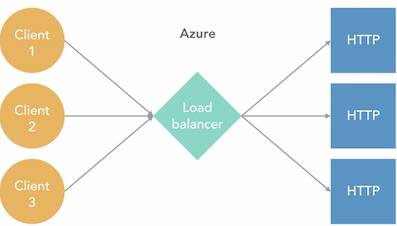


### Configure a load balancer front-end

**Add frontend IP Address**


### Configure a load balancer back-end

* Availability Set
* Single Virtual Machine
* Virtual Machine scale set

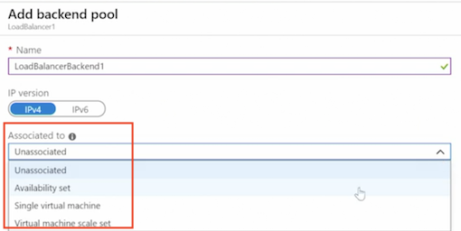


### Configure a load balancer health probe

> health probe used to check if the backend pools are working correctly

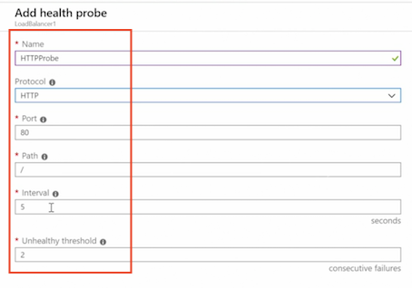


### Configure load balancing rules

**forend Port => Backend Port** 

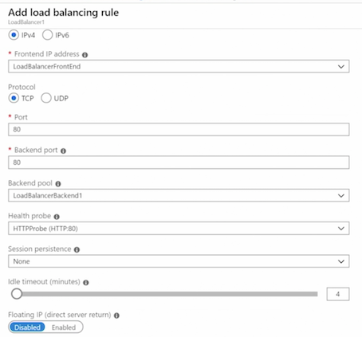

### Configure NAT port-forwarding rules

**Add inbound NAT rule**

* Protocol
* Port: 3389
* Target virtual machine
* Network Ip configuration

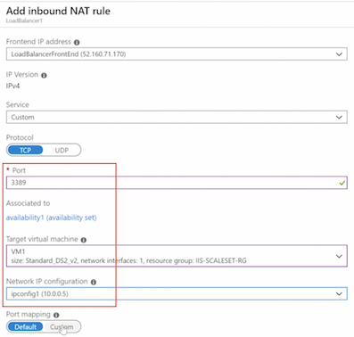


### Create a load balancer using PowerShell

```
$RG = New-AzResourceGroup -ResourceGroupName "LoadBalancer-RG" -Location "WestUS" 
$IP = New-AzPublicIpAddress -ResourceGroupName "LoadBalancer-RG" -Location "WestUS" -Name "LoadBalancerPubIP" 

$frontEnd = New-AzLoadBalancerFrontendlpConfig -Name "FrontEnd1" -PubliclPAddress $IP 

$backEnd New-AzLoadBalancer8ackendAddressPoolConfig -Name "BackEnd1" 

$healthProbe New-AzLoadBalancerProbeConfig -Name "HTTP-Probe" `
	-RequestPath "/" -Protocol HTTP -Port 80 -IntervalInSeconds 30 -ProbeCount 2 
	
$loadbBalancerRule = Now-AzLoadBalancerRuleConfig -Name "LBRulel" `
	-FrontendlpConfiguration $frontEnd -BackendAddressPool $backEnd `
	-Protocol TCP -FrontendPort 80 -BackendPort 80 -Probe $healthProbe 

$LoadBalancer = New-AzLoadBalancer -Name "PS-LoadBalancer" -ResourceGroupName "LoadBalancer-RG" -Location "WestUS" `
	-FrontEndIpConfiguration $frontEnd -BackendAddressPool $backEnd -Probe $healthProbe -LoadBalancingRule $loadbBalancerRule 
```


### Configure a load balancer using PowerShell

```
$loadBalancer = get-azloadbalancer -Name "PS-Loadbalancer" 

$backend = Get-AzLoadBalancerBackendAddressPoolConfig -Name "BackEnd1" -LoadBalancer $loadBalancer 

$loadBalancer | Add-AzLoadBalancerInboundNatRuleConfig -Name "RemoteDesktopVMlRule" `
	-FrontendIpConfiguration $loadBalancer.FrontendIpConfigurations[0] -Protocol "Tcp" `
	-FrontendPort 33890 -BackendPort 3389 

$availabilitySet = Get-AzAvailabilitySet -ResourceGroupName "IIS-ScaleSet-RG" -Name "Availability1" 

ForEach ($vm in $availabilitySet.VirtualMachinesReferences) { 
	$networkInterface = Get-AzNetworklnterface | Where-Object {$_.VirtualMachine.id - like $vm.id} 	
	$networkInterface.IpConfigurations[0].LoadBalancerBackendAddressPools = $backend 

	Set-AzNetworkInterface -NetworkInterface $networkInterface 
}


$loadBalancer | Set-AzLoadBalancer 
$loadBalancer | Remove-AzLoadBalancer 
```

## 2. Implementing Azure Application Gateways


### Application gateway overview

**What Is an Application Gateway?** 

* Web traffic load balancer 
* Operates on OSI Layer 7 (application) 
	* Which means they understand the packets that go from the clients to the servers. And they see, for example, the URL paths that they are using 
* Route requests based on URI path and host headers 


**Some Application Gateway Features** 

* Redirection, multihosting, and URL-based routing 
	* Also multihosting and URL-based routing, in case an Application Gateway is hosting more than a single website
* **SSL/TLS termination** 
* Autoscaling and zone redundancy (**Prevent downtime in the case an actual data center fails**)
* Session affinity (attach a client to a specific server in the back end)
* AKS ingress controller (**In the case you are using Kubernetes in your deployments**)


### Create an application gateway using the portal

**Tier:**

* Stanard1 WAF1
* Stanard2 WAF2

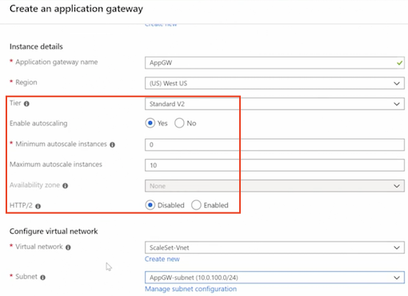

* FrontEnds
* Routing Rules
* Backend pools

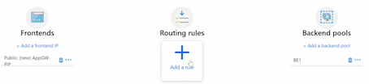


### Implement an application gateway IP configuration

**AppGW - Configuration**

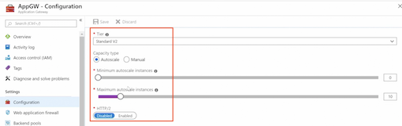

* Maximum: **125 instances**

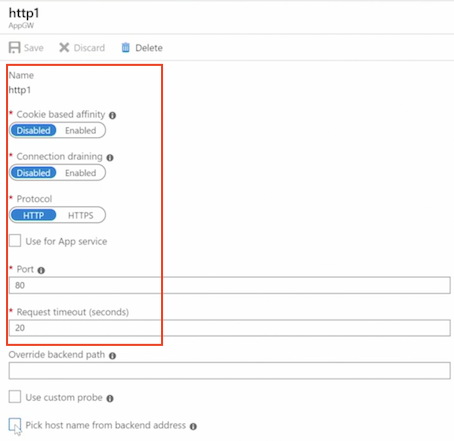

* **The cookie based afinity**: Which means all of the clients that come with the same cookie will be directed to the same servers.
* **Connection draining**: Prevent that servers are keeping certain connections open for too long. 
* Enable or disable HTTPS and use it for the app service
* The time out for the connections and the back in path, in case one connection comes from a specific port.


### Configure an application gateway backend pool

* Ip address or hostname
* Virtual Machine
* VMSS
* App services

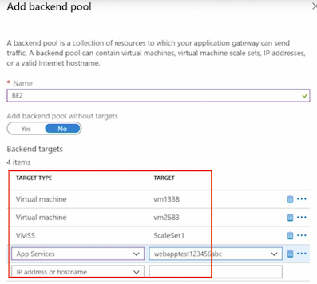


### Configure an application gateway listener

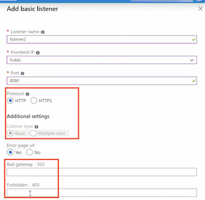

**Enable SSL**

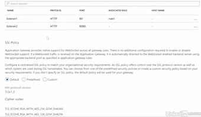


### Configure an application gateway health probe


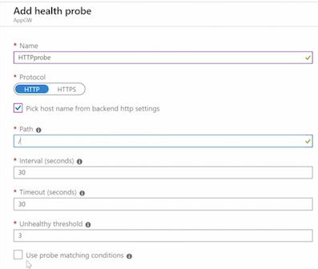


### Configure application gateway routing rules

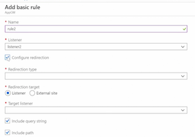


### Create an application gateway using PowerShell

```
$vnet = Get-AzVirtualNetwork -Name "ScaleSet-Vnet" -ResourceGroupName "IIS-ScaleSet-RG" 
$subnet = Get-AzVirtualNetworkSubnetConfig -Name "AppGW-subnet" -VirtualNetwork $vnet 

$VMinterface1 = Get-AzNetworklnterface -ResourceGroupName "IIS-ScaleSet-RG" -Name "vm1338" 
$VMinterface1IP = $VMinterface1.IpConfigurations[0].PrivateIpAddress 

$VMinterface2 = Get-AzNetworkInterface -ResourceGroupName "IIS-ScaleSet-RG" -Name "vm2683" 
$VMinterface2IP = $VMinterface2.IpConfigurations[0].PrivateIpAddress 

## 

$RG = New-AzResourceGroup -ResourceGroupName "AppGW-RG" -Location "WestUS" 

$IP = New-AzPublicIpAddress -ResourceGroupName "AppGW-RG" -Location "WestUS" -Name "AppGW-PIP" 

$internalIP = New-AzApplicationGatewayIPConfiguration -Name "internalIP" -Subnet $subnet 

$frontend = New-AzApplicationGatewayFrontendIPConfig -Name "Frontend1" -PublicIPAddress $IP 

$frontendPort = New-AzApplicationGatewayFrontendPort -Name "FrontendPort1" -Port 80 

$backend = New-AzApplicationGatewayBackendAddressPool -Name "Backend1" -BackendIPAddresses $VMinterface1IP, $VMinterface2IP 

$backendSettings = New-AzApplicationGatewayBackendkttpSetting -Name "backendlSettings"  `
	-Port 80 -Protocol Http -CookieBasedAffinity Disabled -RequestTimeout 60 

$listener = New-AzApplicationGatewayHttpListener -Name "listener1" -Protocol HTTP ` 
	-FrontendIPConfiguration $frontend -FrontendPort $frontendPort 

$frontendRule = New-AzApplicationGatewayRequestRoutingRule -Name "rule1" -RuleType Basic `
	HttpListener $listener -BackendAddressPool $backend -BackendHttpSettings $backendSettings 
	
##

$appGatewaySKU = New-AzApplicationGatewaySku -Name Standard_v2 -Tier Standard_v2 -Capacity 2 

$appGateway = New-AzApplicationGateway -Name "PS-AppGW" -ResourceGroupName "AppGW-RG" -Location "WestUS" `
	-FrontEndIpConfiguration $frontEnd -FrontendPorts $frontendPort -RequestRoutingRules $frontendRule  `
	-GatewaylPConfigurations $internalIP -BackendAddressPool $backEnd -HttpListeners $listener -Sku $appGatewaySKU -backendhttpsettingscollection $backendsettings 
```


### Configure an application gateway using PowerShell

```
$appGw = Get-AzApplicationGateway -Name "PS-AppGW" 

$appGw | Add-AzApplicatiomGatewayProbeConfig -Name "probel" -Protocol Http `
 	-PickHostNameFromeackendHttp5ettings -Path "/" -UnhealthyThreshold S -Interval 60 -Timeout 60 

$appGw | Set-AzApplicationGatewaySku -Name Standard_v2 -Tier Standard_v2 
$appGw | Set-AzApplicationGatewayAutoscaleConfiguration -MinCapacity 3 -MaxCapacity 15 

$appGw | Set-AzApplicationGateway 
```


### Web application firewall overview

**What Is a Web Application Firewall?** 

* Special version of an application gateway 
* Prevents common exploits of web applications 
* Based on OWASP (Open Web Application Security Project) core rule sets 
* Detection and prevention modes 


### Configure a web application firewall

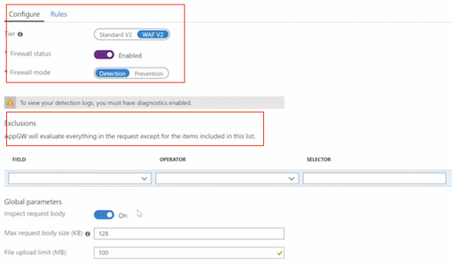


### Configure a web application firewall using PowerShell

```
$appGw = Get-AzApplicationGateway -Name "PS-AppGW" 

$appGw | Set-AzApplicationGatewaySku -Name WAF_v2 -Tier WAF_v2 

Set-AzApplicationGatewayWebApplicationFirewallConfiguration -ApplicationGateway $appGw `
	-Enabled $true -FirewallMode "Detection" -RuleSetType "OWASP" -RuleSetVersion "3.0" 
	
$appGw | Set-AzApplicationGateway 
```