# Azure Administrator认证学习 （1）


## 1. 不同角色

作为Azure管理员，若要管理`Azure`资源的访问权限，必须具有相应的管理员角色。`Microsoft Azure` 有一个称为基于角色的访问控制 (`RBAC`) 的授权系统，其中包含了你可以选择的多个内置角色。 **可以在不同的作用域（例如，管理组、订阅或资源组）分配这些角色**。

首先，我们先了解下Microsoft Azure中不同的角色。


 熟悉Azure的朋友都知道，Microsoft Azure平台有两种资源使用模型，一种称之为**”Azure服务管理”**，另一种称之为**”Azure资源管理”**[本文不做两者区别介绍]，因此在角色管理上，主要有三种管理类型：
 
* **经典订阅管理员角色**
* **Azure基于角色的访问控制(RBAC)角色**
* **Azure Active Directory (Azure AD)管理员角色**

Azure最初发布时，对资源的访问权限只是通过以下三种管理员角色进行管理：**帐户管理员、服务管理员和共同管理员**。后来，针对Azur资源添加了基于角色的访问控制 (RBAC)。 Azure RBAC是一个较新的授权系统，它针对Azure 资源提供精细的访问管理。`RBAC`包括许多内置角色，可在不同的范围进行分配，并允许你创建自己的自定义角色。若要管理Azure AD中的资源（例如用户、组和域），可以使用多种Azure AD管理员角色。

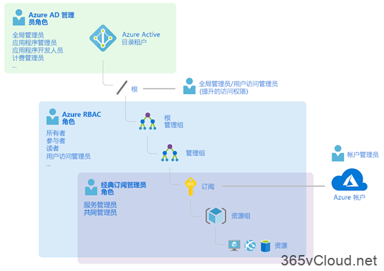

### 经典订阅管理员角色

**帐户管理员、服务管理员和协同管理员是Azure中的`三种经典订阅管理员角色`**。 

经典订阅管理员对`Azure`订阅拥有完全访问权限。他们可以使用Azure门户、Azure资源管理器API和经典部署模型API来管理资源。用于注册Azure的帐户会自动同时设置为帐户管理员和服务管理员。 然后，可以添加其他协同管理员。 服务管理员和共同管理员拥有在订阅范围内分配有”所有者”角色（Azure RBAC 角色）的用户的等效访问权限。


下表描述了这三种经典订阅管理角色之间的差别。


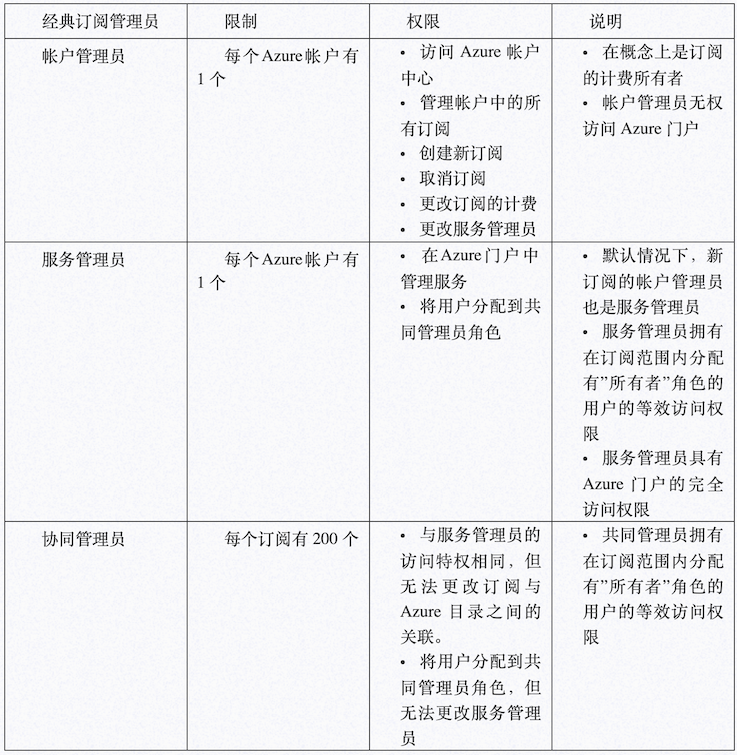

### Azure 帐户和 Azure 订阅

**Azure帐户代表计费关系**。**一个Azure帐户代表一个用户标识、一个或多个 Azure订阅和一组关联的Azure资源**。创建帐户的人员是该帐户中创建的所有订阅的帐户管理员。此人也是订阅的默认服务管理员。

**`Azure`订阅可帮助你管理Azure资源的访问权限。** 它们还可帮助控制如何根据资源使用量生成报告、计费及付费。每个订阅可以采用不同的计费和付款设置，因此，**根据公司、业务部门、项目等因素，可以采用不同的订阅和不同的计划。 每个服务属于一个订阅，执行编程操作时可能需要订阅ID。**

### Azure RBAC 角色

Azure RBAC是基于Azure资源管理器构建的授权系统，它针对Azure资源（例如计算和存储）提供精细的访问权限管理。Azure RBAC包括70多个内置角色。有四个基本的RBAC角色。前三个角色适用于所有资源类型：

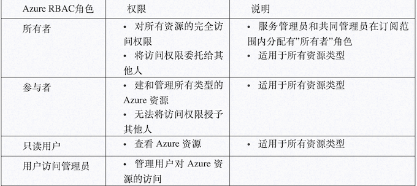

   剩余的内置角色允许管理特定的Azure资源。例如，虚拟机参与者角色允许用户创建和管理虚拟机。

只有Azure门户和Azure资源管理器API支持Azure RBAC。分配有RBAC角色的用户、组和应用程序无法使用Azure经典部署模型API。

### Azure AD管理员角色

**Azure AD管理员角色用于管理目录中的Azure AD资源**，例如，创建或编辑用户、将管理角色分配给其他人、重置用户密码、管理用户许可证以及管理域。 下表描述了几个更重要的Azure AD管理员角色。

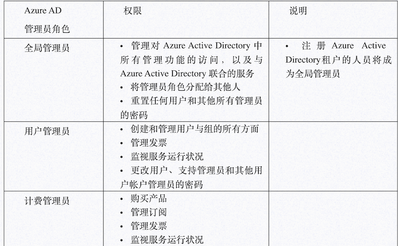


### `Azure RBAC`角色与`Azure AD管`理员角色之间的差别比较

从顶层设计角度看，**`Azure RBAC`角色控制`Azure`的管理权限**，而`Azure AD`管理员角色控制`Azure Active Directory`资源的管理权限


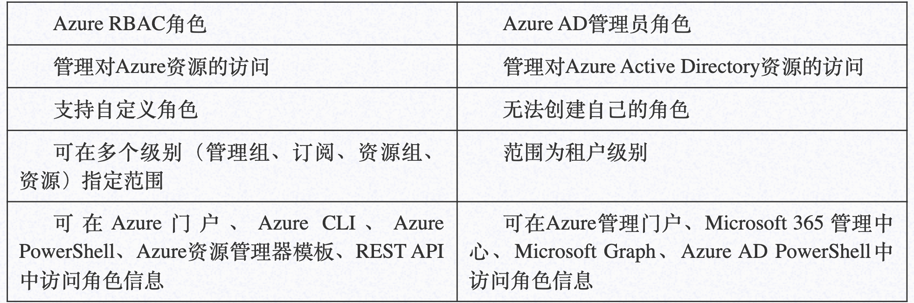

默认情况下，**`Azure RBAC`角色和`Azure AD`管理员角色不会跨越Azure与 Azure AD。**


但是，如果全局管理员通过在`Azure`门户中选择**”全局管理员可以管理`Azure`订阅和管理组”**开关提升了自己的访问权限，则会针对特定租户的所有订阅为全局管理员授予用户访问管理员角色（一种 RBAC角色）。”用户访问管理员”角色允许用户向其他用户授予对`Azure`资源的访问权限。此开关可帮助重新获取订阅的访问权限。


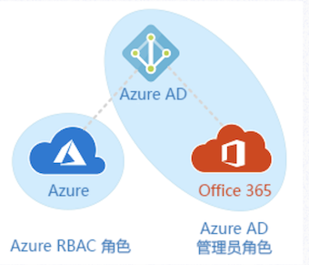


## 2.Azure订阅资源限制和配额


Microsoft Azure云平台资源是无限可扩展的，您可以根据您的需要在几秒钟或几分钟内启动Microsoft Azure云中的新VM或者其他资源，但是”云”实际上由服务器，机架，网络交换机，电源和构成任何数据中心的其他计算硬件组成,这个存在了一定限制。

同样，为了不浪费资源，**Azure订阅资源限制和配额Azure资源管理器（ARM）对每个Azure订阅甚至每个Azure区域可以配置的每种类型的资源数量施加限制和配额**。

某些限制是最大限度，而其他限制是软限制，可根据要求增加。使用Microsoft Azure云中的虚拟机（VM），存储帐户，数据库和其他资源时，您可以轻松应对这些限制，因此了解它们的存在以及如何解决这些问题非常重要。

* 配额有助于限制管理员，开发人员和其他员工在云中支出的能力远远超过预算，而不会影响他们的灵活性和灵活性。
* 限制可以帮助您保持可预测的云支出，不允许您在没有故意这样做的情况下调整可能产生巨额月度账单的资源。这可以节省您和Microsoft的资金，因为如果允许所有客户都不受限制，他们可能需要退还大量的云支出。
* 限制有助于微软遏制云使用量的增长; 无论是在各个Azure区域内，还是在全球范围内的所有数据中心和区域。这允许Microsoft确保单个客户无法意外地超载任何特定Azure区域或数据中心。

 **如果您发现每个Azure订阅的硬限制（或最大限制）限制太多，您可以为您的组织创建多个Azure订阅**。
 
 这实际上是一种非常常见的做法，不仅适用于限制和配额，还适用于跨部门，业务地点，部门，成本中心等管理Microsoft Azure中云使用的计费和报告。
 
 如果需要提交限制请求或者申请资源时，您只需要在 https://portal.azure.com  中新建技术支持请求即可
 
##  3.Azure 计费和成本管理来防止意外费用

**使用定价计算器在线估计成本**

查看定价计算器，获取感兴趣的服务的每月估计成本。 可以添加任何Azure 资源，以获取估计成本。

**在Azure门户中查看估计成本**

通常情况下，在Azure门户中添加服务时，会出现一个视图显示大概的每月预计成本。 例如，选择Windows VM的大小时，可看到计算小时数的每月估计成本：

**检查支出限制是否为开启状态**

如果有使用信用额度的订阅，则将默认开启支出限制。 这样一来，当信用额度花完时，不再对信用卡计费。但是，在达到支出限制时，服务会被禁用。这意味着VM会被解除分配。若要避免服务中断，必须关闭支出限制。任何超额都将对保存的信用卡收费。

**成本管理+计费**

Azure门户中提供了”成本管理+计费″功能可以对现有已经使用的资源做一个分析，以及费用使用情况


**对资源添加标记以便对计费数据进行分组**

可以使用标记来对受支持服务的计费数据进行分组。 例如，当运行不同团队的多个VM时，则可以使用标记按成本中心（人力资源、市场营销、财务）或环境（生产，预生产、测试）对成本进行分类。

## 4.Azure订阅策略

**Azure 策略是Azure中的一项服务，可用于创建、分配和管理策略定义。** 

策略定义将在整个资源中强制实施不同的规则和效果，以便这些资源符合公司标准和服务级别协议。Azure策略对资源进行计算和扫描，并找到与所定义策略不相符的资源。

**例如，可以设置一个策略，只允许特定类型的虚拟机。或者，可要求所有资源都拥有特定标记。在创建和更新资源时评估策略。**


### Azure 策略与Azure RBAC有何区别：

RBAC，全称Role-based access control，中文叫做基于角色的权限访问控制

在RBAC中，权限与角色相关联，用户通过「角色」而得到这个角色的相对应权限。这就极大简化了权限的管理。

用户可以很容易地从一个角色被指派到另一个角色。角色可依新的需求和系统的合并而被赋予新的权限，而权限也可根据需要而从某角色中回收。角色与角色的关系可以建立起来，来囊括更广泛的客观情况。

RBAC关注不同范围内的用户操作。例如，您可能被添加到所需范围的资源组的参与者角色。该角色允许你对该资源组做出更改。 策略关注部署期间的资源属性，以及现有资源。例如，可通过策略控制能够预配的资源类型。 或者，可限制能够预配资源的位置。不同于RBAC，策略是默认的允许和明确拒绝系统。

**当然如果您希望使用Azure 策略，作为用户的您，必须通过 RBAC 进行身份验证**。具体而言，帐户需要

* 定义策略的 `Microsoft.Authorization/policydefinitions/write` 权限。
* 分配策略的 `Microsoft.Authorization/policyassignments/write` 权限。
* 定义计划的 `Microsoft.Authorization/policySetDefinitions/write` 权限。
* 分配计划的 `Microsoft.Authorization/policyassignments/write` 权限。

“参与者”角色不包括这些权限。

### 目前，Azure平台已经默认提供一些可使用的策略。例如：

* 需要 SQL Server 12.0：此策略定义具有条件/规则，以确保所有 SQL Server 均使用版本 12.0。 其效果是拒绝所有不符合这些条件的服务器。
* 允许的存储帐户 SKU：此策略定义具有一组条件/规则，可确定正在部署的存储帐户是否在 SKU 大小集内。 其效果是拒绝所有不符合定义的 SKU 大小集的服务器。
* 允许的资源类型：此策略定义具有一组条件/规则，以指定贵组织可以部署的资源类型。 其效果是拒绝所有不属于此定义列表的资源。
* 允许的位置：通过此策略，可限制组织在部署资源时可指定的位置。 其效果是用于强制执行异地符合性要求。
* 允许的虚拟机 SKU：通过此策略，可指定组织可部署的一组虚拟机 SKU。
* 应用标记及其默认值：若用户未指定所需的标记及其默认值，则通过此策略来应用所需的标记及其默认值。
* 强制执行标记和值：此策略将对资源强制执行所需的标记和值。
* 不允许的资源类型：此策略用于指定组织不得部署的资源类型

**当您在您的环境中使用Azure策略时，微软建议：**

* 如果在环境中创建策略定义，我们建议从审核效果（而不是拒绝效果）开始，以跟踪环境中资源上策略定义的影响。如果有用于自动纵向扩展应用程序的脚本，那么设置拒绝效果可能会影响这些已经执行的自动化任务。

* 请务必在创建定义和分配时考虑组织的层次结构。 我们建议在更高级别创建定义，例如，在订阅级别进行创建，并在下一子级别进行分配。例如，如果在订阅组级别创建策略定义，则可以在订阅中将该定义的一个策略分配缩小到资源组。

* 即使在只需考虑一个策略的情况下，我们也建议始终使用计划定义，而不使用策略定义。例如，假设你有一个策略定义-policyDefA，并在计划定义 – initiativeDefC 下创建它，如果你决定在稍后使用类似policyDefA的目标为 policyDefB创建另一个策略定义，则只需将其添加到initiativeDefC 下，并通过这种方式来更好地跟踪它们。

* 请记住，从计划定义创建计划分配后，添加到计划定义的任何新策略定义都将在该计划定义下的计划分配下自动滚动。但是，如果为新的策略定义引入一个新参数，则需要通过编辑计划定义或分配来更新计划定义和分配。

* 请注意，一旦触发计划分配，也将会触发该计划中的所有策略。 但是，如果需要单独执行某个策略，最好不要将其包含在计划中。

您可以使用Azure Portal、Azure PowerShell、Azure CLI进行创建与管理策略。


 以下为使用Azure CLI部署的一个示例（示例 – 已批准的虚拟机映像）供您参考
 
```
 # Create the Policy Definition (Subscription scope)
definition=$(az policy definition create –name ‘allowed-custom-images’ –display-name ‘Approved VM images’ –description ‘This policy governs the approved VM images’ –rules ‘https://raw.githubusercontent.com/Azure/azure-policy/master/samples/Compute/allowed-custom-images/azurepolicy.rules.json’ –params ‘https://raw.githubusercontent.com/Azure/azure-policy/master/samples/Compute/allowed-custom-images/azurepolicy.parameters.json’ –mode All)

# Set the scope to a resource group; may also be a resource, subscription, or management group
scope=$(az group show –name ‘YourResourceGroup’)

# Set the Policy Parameter (JSON format)
policyparam='{ “imageIds”: { “value”: [ “/subscriptions/<subscriptionId>/resourceGroups/YourResourceGroup/providers/Microsoft.Compute/images/ContosoStdImage”, “/Subscriptions/<subscriptionId>/Providers/Microsoft.Compute/Locations/centralus/Publishers/MicrosoftWindowsServer/ArtifactTypes/VMImage/Offers/WindowsServer/Skus/2016-Datacenter/Versions/2016.127.20180510” ] } }’

# Create the Policy Assignment
assignment=$(az policy assignment create –name ‘allowed-custom-images-assignment’ –display-name ‘Approved VM images Assignment’ –scope `echo $scope | jq ‘.id’ -r` –policy `echo $definition | jq ‘.name’ -r` –params “$policyparam”)
```

使用 Azure CLI 进行删除

```
# Remove the Policy Assignment
az policy assignment delete –name `echo $assignment | jq ‘.name’ -r`

# Remove the Policy Definition
az policy definition delete –name `echo $definition | jq ‘.name’ -r`
```

## 5.Azure Monitor创建与分析业务监控指标

Azure包括多个服务，这些服务分别在监视空间中执行特定角色或任务。 这些服务共同提供了一个全面的解决方案，用于从您的应用程序和支持它们的Azure资源中收集，分析和处理遥测。 他们还可以监视关键的本地资源，以提供混合监视环境。如下所示

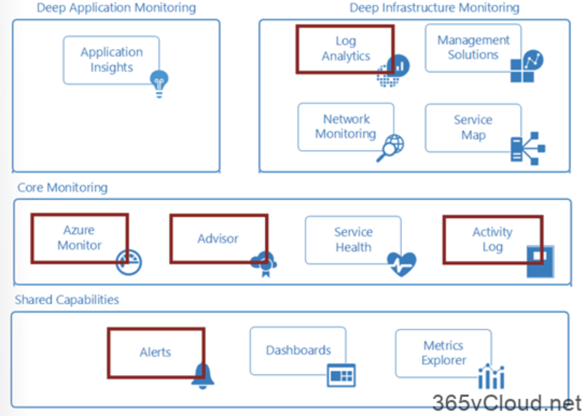

本文中主要介绍上图中叫做Azure Monitor 和alerts服务，其提供用于收集、分析和处理来自云与本地环境的遥测数据的综合解决方案，可将应用程序的可用性和性能最大化。它可以帮助您了解应用程序的性能，并主动识别影响应用程序及其所依赖资源的问题。其工作架构图如下所示：


* 上图的**中心是用于存储指标和日志**（Azure Monitor 使用的两种基本类型的数据）的数据存储。 
* **左侧是用于填充这些数据存储的监视数据源**。 
* 右侧是 `Azure Monitor` 针对这些收集的数据执行的不同功能，例如分析、警报和流式传输到外部系统。


`Azure Monito`r 收集的所有数据属于以下两种基本类型之一：**指标和日志**。

* **指标是数字值，用于描述系统某些方面在特定时间点的情况。 指标是轻型数据，可以支持近实时方案**。 
* 日志包含不同类型的已经整理成记录的数据，每种类型都有不同的属性集。 与性能数据一样，事件和跟踪等遥测数据也作为日志存储，因此，可将它们合并以进行分析。


Azure 门户中的”概述”页会直接显示·Azure Monitor·针对许多 `Azure` 资源收集的数据。 例如，在查看任一虚拟机时，多个图表会显示性能指标。 单击任一图形会在 Azure 门户上的指标资源管理器中打开数据，可在其中绘制多个指标在不同时间段的值的图表。 可以通过交互方式查看图表，也可以将其固定到某个仪表板，与其他可视化效果一起查看。

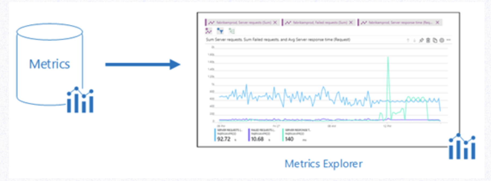

**可以使用查询来分析 `Azure Monitor` 收集的日志数据，这些查询可以快速检索、合并和分析所收集的数据**。 您可以使用 `Azure` 门户中的`Log Analytics`创建和测试查询, 然后使用这些工具直接分析数据, 或者保存用于可视化或警报规则的查询。

`Azure Monitor`使用 `Azure`数据资源管理器使用的`Kusto`查询语言的某个版本，该查询语言适用于简单的日志查询，但也包括高级功能，例如聚合、联接和智能分析。 可以通过多个课程快速了解此查询语言。 特定指南提供给已熟悉 SQL 和 Splunk 的用户。

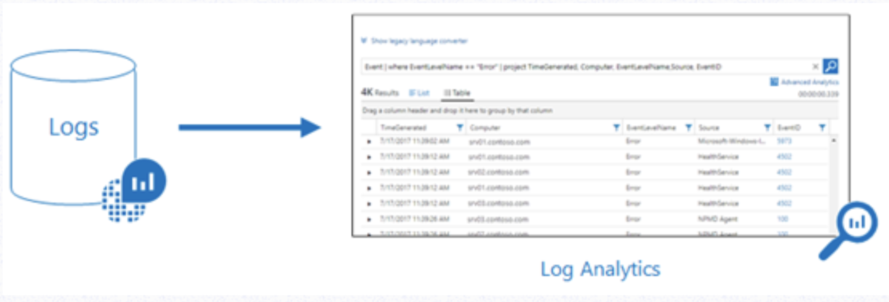


Azure Monitor 可从各种源收集数据。可将应用程序的监视数据视为划分了层次，范围从应用程序、应用程序依赖的任何操作系统和服务，直到平台本身。 Azure Monitor 从以下每个层收集数据：

* 应用程序监视数据：有关编写的代码的性能和功能的数据，不管平台是什么。
* 来宾OS监视数据：有关运行应用程序的操作系统的数据。 此应用程序可以在 Azure中运行，也可以在其他云中或本地运行。
* Azure资源监视数据：有关Azure资源的操作的数据。
* Azure 订阅监视数据：有关Azure订阅操作和管理的数据，以及有关Azure 本身运行状况和操作的数据。
* Azure租户监视数据：有关租户级Azure服务（例如Azure Active Directory）操作的数据。

## 6.Log Analytics服务查看或分析数据

Log Analytics可帮助IT管理员收集，关联，搜索和操作由操作系统和应用程序生成的日志和性能数据。它使用集成的搜索和自定义仪表板为您提供实时操作洞察，以便轻松分析所有工作负载和服务器中的数百万条记录，而不管其物理位置如何。 Log Analytics为您提供了一个用于使用和关联数据的单一界面，涵盖Linux和Windows Server。**并将数据置于单个存储库进行详细的分析和关联**。

对于已在Azure中部署的Windows和Linux虚拟机，**可使用`Log Analytics VM`扩展安装`Log Analytics`代理。使用扩展可简化安装流程，并可自动配置代理，以将数据发送至指定的Log Analytics工作区**。代理还会自动升级，以确保拥有最新的功能和修补程序。在继续之前，请验证VM是否正在运行，否则此过程将无法成功完成。

## 7.Log Analytics实现日志数据可视化

日志数据是庞大的、复杂的不可直观的文件，管理员需要对所有日志文件进行可视化以便快速判定某些问题或者获取需求的信息，因此本演示文档介绍如何使用Log Analytics实现日志数据可视化。

Azure仪表盘，可将所有Azure资源中对IT而言最重要的操作数据整合到此处，包括来自 `Azure Log Analytics` 的遥测数据。 在开始直观显示日志查询之前，先来创建并共享一个仪表板。 然后，可以专注于将呈现为折线图的示例性能日志查询，并将其添加到该仪表板。

另外我们还可以将日志数据导入到 Power BI中进行集中展示与可视化，其原理如下图所示

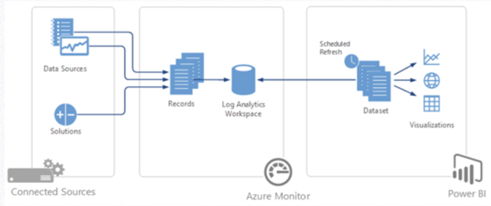

## 8.移动资源到其他资源组或订阅 (Resource group)

资源组，定义了整个Azure资源存储的顶级逻辑单元，您可以将其立即为一个容器，将应用程序所需的资源聚合到单个可管理单元中。每个Azure资源必须存在于一个（且仅存在于一个）资源组中。可以用下图表示：

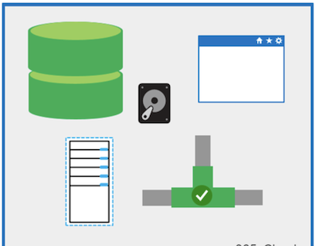

很多时候因为一些特殊原因，需要将已经部署的Azure资源移动到另一 Azure 订阅，或移动到同一订阅下的另一资源组，来确保Azure管理的一致性或者合规性。在Azure平台，微软提供了Azure 门户、Azure PowerShell、Azure CLI 或 REST API等操作来实现资源的移动。

***需要注意的是，在资源移动的过程中，源资源组和目标资源组都会锁定。 在完成移动之前，将阻止对资源组执行写入和删除操作，也就意味着您将无法添加、更新或删除资源组中的资源***。


需要明确的是，例如，如果将 `SQL Server` 及其数据库移动到新的资源组中，**则使用该数据库的应用程序将不会遇到停机的情况。 它仍可读取和写入到数据库。移动资源只会将其移到新的资源组或订阅。它不会更改资源的位置**。

* 在确认移动资源到新的资源组或者订阅前，需要确认哪些资源可以移动哪些资源不能移动
* 源订阅与目标订阅必须在同一个`Azure Active Directory`租户中。您可以使用Azure PowerShell或 `Azure CLI`检查这两个订阅是否具有相同的租户 `ID`

**Azure PowerShell：**

```
(Get-AzSubscription -SubscriptionName <your-source-subscription>).TenantId
(Get-AzSubscription -SubscriptionName <your-destination-subscription>).TenantId
```

Azure CLI

```
az account show –subscription <your-source-subscription> –query tenantId
az account show –subscription <your-destination-subscription> –query tenantId
```

移动资源的帐户至少需要具备下列权限：
源资源组上的

`Microsoft.Resources/subscriptions/resourceGroups/moveResources/action` 权限。

目标资源组上的

`Microsoft.Resources/subscriptions/resourceGroups/write` 权限。

使用 Azure PowerShell

```
$webapp = Get-AzResource -ResourceGroupName OldRG -ResourceName ExampleSite
$plan = Get-AzResource -ResourceGroupName OldRG -ResourceName ExamplePlan
Move-AzResource -DestinationResourceGroupName NewRG -ResourceId $webapp.ResourceId, $plan.ResourceId
```

使用 Azure CLI

```
webapp=$(az resource show -g OldRG -n ExampleSite –resource-type “Microsoft.Web/sites” –query id –output tsv)
plan=$(az resource show -g OldRG -n ExamplePlan –resource-type “Microsoft.Web/serverfarms” –query id –output tsv)
az resource move –destination-group newgroup –ids $webapp $plan
```

以上即时资源移动到其他资源组的完整过程以及注意事项。并且在移动的过程中，对网站进行不停的检测，并无”无法访问”现象出现

**如果希望将资源从一个订阅移到另一个订阅，主要涉及三个步骤**


* 步骤 1：如果从属资源分布在不同的资源组中, 请先将它们移到一个资源组中。
* 步骤 2：将资源和相关资源与源订阅一起移动到目标订阅。
* 步骤 3：(可选) 将从属资源重新分发给目标订阅中的不同资源组。

## 9.Azure RBAC介绍

作为管理员，首先需要对Azure进行一致性或者企业合规性管理，因此管理 Azure 中的资源访问权限是组织安全性和合规性要求的关键部分。

基于角色的访问控制（`RBAC`）是您授予对 `Azure AD` 用户，组和服务的适当访问权限的功能。通过选择角色（允许和/或拒绝哪些操作的定义），然后将角色与用户，组或服务主体相关联来配置 `RBAC`。

最后，角色和用户/组/服务主体的这种组合的范围被限定为整个订阅，或资源组，或资源组中的特定资源。

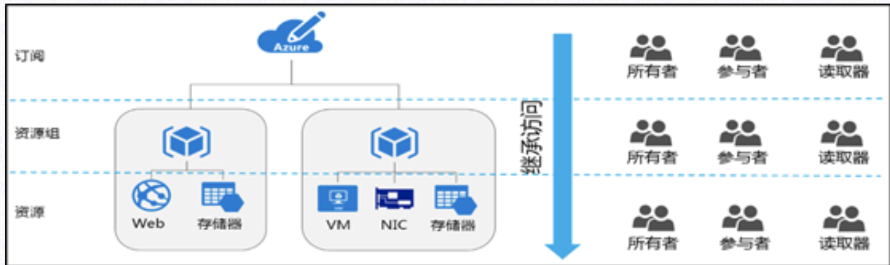

基于角色的访问控制（RBAC）主要作用：

* 允许一个用户管理订阅中的虚拟机，并允许另一个用户管理虚拟网络
* 允许 DBA 组管理订阅中的 SQL 数据库
* 允许某个用户管理资源组中的所有资源，例如虚拟机、网站和子网
* 允许某个应用程序访问资源组中的所有资源

在Azure中，对资源的控制访问是通过创建对应的角色进行分配的。在Azure中，其角色分配存在三个重要概念：**安全主体、角色订阅和范围**

* 用户 – 在 Azure Active Directory 中具有配置文件的人员。 也可以将角色分配到其他租户中的用户。
* 组 – 在 Azure Active Directory 中创建的一组用户。 将某个角色分配到某个组时，该组中的所有用户都拥有该角色。
* 服务主体 – 应用程序或服务用来访问特定 Azure 资源的安全标识。 可将服务主体视为应用程序的用户标识（用户名和密码或证书）。
* 托管标识 – Azure Active Directory 中由 Azure 自动托管的标识。 在开发云应用程序时，通常使用托管标识来管理用于向 Azure 服务进行身份验证的凭据。


**角色定义**：角色定义是权限的集合。 它有时简称为”角色″ 。 角色定义列出可以执行的操作，例如读取、写入和删除。 角色可以是高级别的（例如所有者），也可以是特定的（例如虚拟机读取者）。

Azure 包含多个可用的内置角色。 下面列出了四个基本的内置角色。 前三个角色适用于所有资源类型。

* 所有者 – 拥有对所有资源的完全访问权限，包括将访问权限委派给其他用户的权限。
* 参与者 – 可以创建和管理所有类型的 Azure 资源，但无法将访问权限授予其他用户。
* 读取者 – 可以查看现有的 Azure 资源。
* 用户访问管理员 – 允许你管理用户对 Azure 资源的访问。

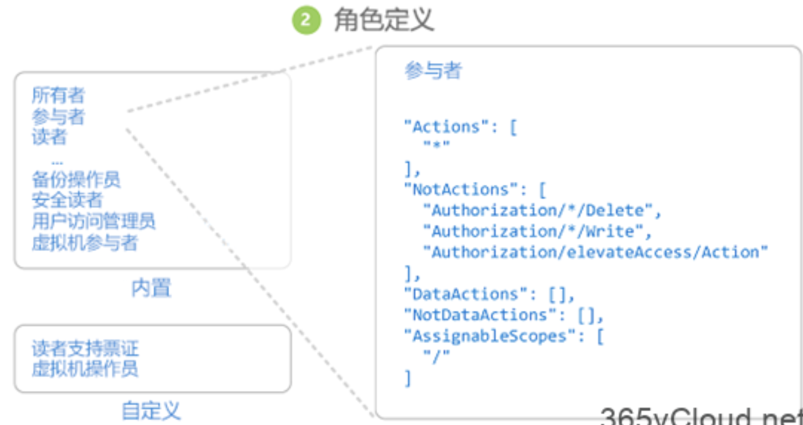


   剩余的内置角色允许管理特定的 Azure 资源。 例如，虚拟机参与者角色允许用户创建和管理虚拟机。 如果内置角色不能满足组织的特定需求，则可以为 Azure 资源创建你自己的自定义角色。

Azure 具有数据操作，通过这些操作可以授予对对象内数据的访问权限。 例如，如果某个用户对某个存储帐户拥有读取数据的访问权限，则该用户可以读取该存储帐户中的 Blob 或消息。

范围：范围是访问权限适用于的资源集。 分配角色时，可以通过定义范围来进一步限制允许的操作。 如果你想要将某人分配为网站参与者，但只针对一个资源组执行此分配，则使用范围就很有帮助。

在Azure中，可在多个级别指定范围：**管理组、订阅、资源组或资源。 范围采用父子关系结构。**

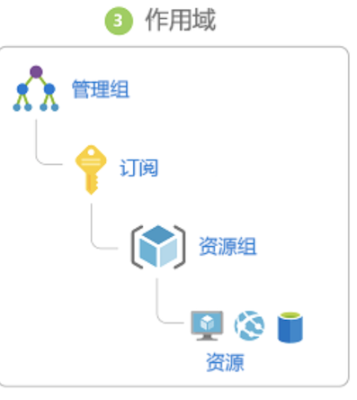


在父范围授予访问权限时，这些权限会继承到子范围。 例如：

* 如果将所有者角色分配给管理组范围的用户，则该用户可以在管理组中管理所有订阅中的一切内容。
* 如果在订阅范围向某个组分配了读取者角色，则该组的成员可以查看订阅中的每个资源组和资源。
* 如果在资源组范围向某个应用程序分配了参与者角色，则该应用程序可以管理该资源组中所有类型的资源，但不能管理订阅中的其他资源组资源。
* 角色分配：角色分配是出于授予访问权限的目的，将角色定义附加到特定范围内的用户、组、服务主体或托管标识的过程。 通过创建角色分配来授予访问权限，通过删除角色分配来撤销访问权限。

下图显示了角色分配的示例。 在此示例中，为”营销”组分配了医药销售资源组的参与者角色。 这意味着，”营销”组中的用户可以在医药销售资源组中创建或管理任何 Azure 资源。 “营销”用户无权访问医药销售资源组外部的资源，除非他们属于另一个角色分配。


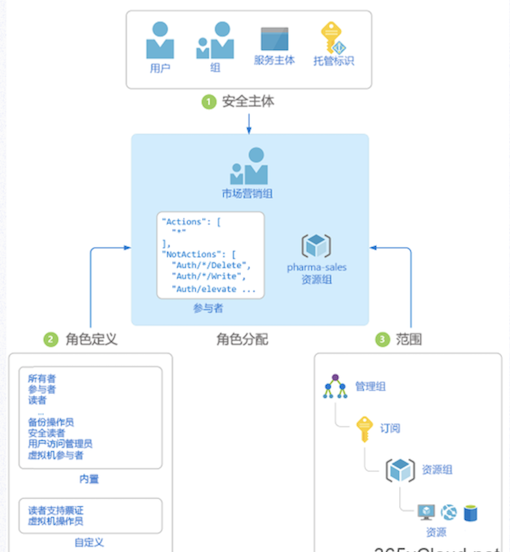

**多角色分配：如果有多个重叠的角色分配**，将会发生什么情况？**RBAC 是一个加法模型，因此，生效的权限是角色分配相加。** 请考虑以下示例，其中在订阅范围内向用户授予了”参与者”角色，并且授予了对资源组的”读者”角色。 “参与者”权限与”读者”权限相加实际上是资源组的”参与者”角色。 因此，在这种情况下，”读者”角色分配没有任何影响。

**拒绝分配：以前，RBAC 是一种仅允许模型，没有拒绝功能，但 RBAC 现在以有限方式支持拒绝分配。** 

**拒绝分配类似于角色分配，可将一组拒绝操作附加到特定范围内的用户、组、服务主体或托管标识，以便拒绝访问。** 角色分配定义了一组允许 的操作，而拒绝分配定义了一组不允许 的操作。 换而言之，即使角色分配授予用户访问权限，拒绝分配也会阻止用户执行指定的操作。 拒绝分配优先于角色分配。


