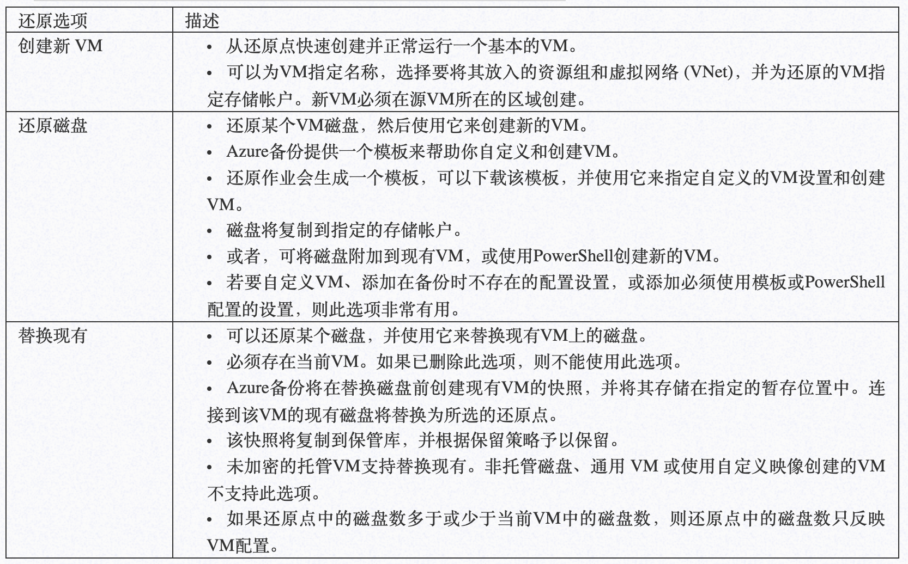
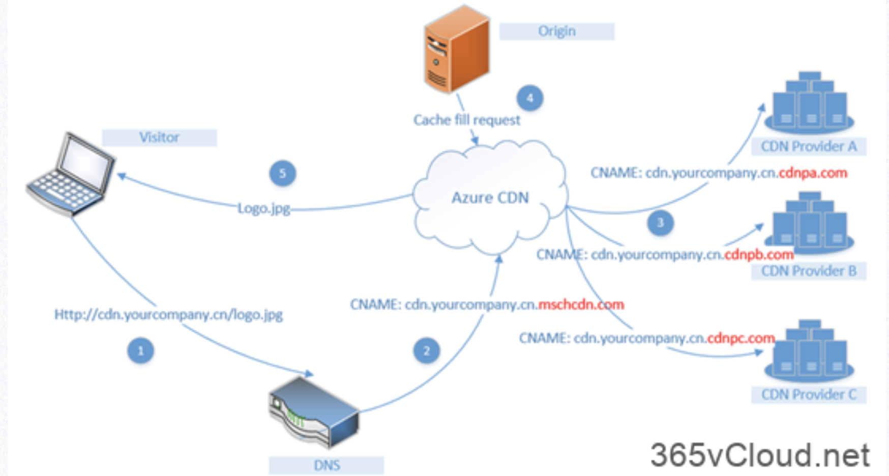

# Azure Administrator认证学习 （3）


## 1. Azure Recovery Services

恢复服务保管库是Azure中用于存储数据的存储实体。数据通常是虚拟机 (VM)、工作负荷、服务器或工作站的数据或配置信息的副本。

可以使用恢复服务保管库为各种`Azure`服务（例如 IaaS VM（Linux 或 Windows））和 Azure SQL 数据库存储备份数据。

恢复服务保管库支持 `System Center DPM`、`Windows Server`、`Azure` 备份服务器等。 使用恢复服务保管库可以方便地组织备份数据，并将管理开销降至最低。


`Azure Backup`是基于`Azure`的服务，可用于`Backup`（或保护）和还原 Microsoft云端数据。 `Azure Backup`取代了现有的本地或异地`Backup`解决方案，并且是可靠、安全、高性价比的基于云的解决方案。 

**`Azure Backup`提供多个组件，可将其下载并部署到适当的计算机、服务器或云中**。

可根据要保护的内容选择部署的组件或代理。无论是保护本地数据还是云端数据，所有`Azure Backup`组件均可用于将数据备份到`Azure Backup`保管库中。

### 为何使用Azure Backup？

传统的备份解决方案已演变成将云视为类似于磁盘/磁带的终结点或静态存储目标。 该方法很简单，但用途有限，不能充分利用基础云平台，由此变成了一种效率低的昂贵解决方案。其他解决方案也很昂贵，因为你最终会为错误的存储类型或不需要的存储投资。其他解决方案的效率通常不高，因为它们不会提供所需的存储类型/存储量，或者管理任务需要耗费太多时间

### Azure Backup具有以下主要优势：

* **自动存储管理 – 混合环境常常需要异类存储（部分在本地，部分在云）**。 通过`Azure Backup`，使用本地存储设备时无需付费。 Azure Backup会自动分配和管理备份存储，且采用即用即付模型。即用即付是指只需为所用的存储付费。

* **无限缩放 – Azure Backup利用Azure云的基础功能和无限缩放功能实现高可用性** – 无需维护或监视开销。可设置警报来获取相关事件信息，但无需担忧云数据的高可用性。

* 多个存储选项 – 高可用性的一个方面是存储复制。Azure Backup提供两种类型的复制：**本地冗余存储和异地冗余存储**。根据需要选择Backup存储选项：

	* 本地冗余存储 (LRS) 将同一区域的配对数据中心内的数据复制三次（创建三个数据副本）。LRS是一个低成本选项，可在本地硬件故障时保护数据。
	* 异地冗余存储 (GRS) 将数据复制到源数据主位置数英里之外的次要区域中。 GRS 的成本比LRS的高，但GRS可让数据更为持久，即使出现区域性中断也是如此。

* **无限制的数据传输 – `Azure Backup`不会限制传输的入站或出站数据量**。Azure Backup也不会对传输的数据收费。但如果使用 Azure导入/导出服务来导入大量数据，则入站数据将产生相关费用。 有关此费用的详细信息，请参阅 Azure Backup中的脱机Backup工作流。 出站数据是指还原操作期间从Backup保管库传输的数据。

* **数据加密 – 该服务允许在公有云中安全地传输和存储数据**。 加密通行短语存储在本地，绝不会传输或存储到Azure 中。如有必要还原任何数据，只需具有加密通行短语或密码即可。

* **应用程序一致的`Backup `– 无论是Backup文件服务器、虚拟机还是SQL数据库，都需要知道恢复点具有还原Backup副本所需的全部数据**。Azure Backup提供了应用程序一致的Backup，确保了还原数据时无需额外的修补程序。还原应用程序一致的数据可减少还原时间，使得可快速恢复到运行状态。

* **长期保留 – 可使用Azure实现短期和长期保留，无需将Backup副本从磁盘转到磁带中，也无需将磁带移到异地位置**。 Azure不会限制Backup或恢复服务保管库中数据的保留时间长度。可以根据需要设置数据在保管库中的保留时间。Azure Backup的限制为每个受保护实例仅限9999个恢复点。

## 2.Azure Recovery Services恢复Azure VM

在Azure中，Recovery Services中的备份服务提供多种方式用以还原VM



另外，Recovery Services中的备份服务还增加了备份VM中的文件和文件夹功能，该恢复方式可参考如下图所示，本文不做详细介绍。


**还原VM之后，还需要注意一些事项：**

* 将安装备份配置期间存在的扩展，但不会启用这些扩展。 如果出现问题，请重新安装这些扩展。
* 如果备份的 VM 使用了静态 IP 地址，则还原的 VM 将使用动态 IP 地址，以避免冲突。 可将静态 IP 地址添加到还原的 VM。
* 还原的 VM 没有可用性集。 如果使用了还原磁盘选项，则使用提供的模板或 PowerShell 从磁盘创建 VM 时，可以指定可用性集。
* 如果使用基于 cloud-init 的 Linux 分发版（例如 Ubuntu），出于安全原因，还原后将阻止密码。 请在还原的 VM 上使用 VMAccess 扩展 重置密码。 我们建议在这些分发版中使用 SSH 密钥，这样，在还原后就无需重置密码。
* 如果在还原后因 VM 与域控制器的关系被破坏而无法访问 VM，请按以下步骤操作，以便启动 VM：
	* 将 OS 磁盘作为数据磁盘附加到恢复的 VM。
	* 如果发现 Azure 代理无响应，请按此链接的要求手动安装 VM 代理。
	* 在 VM 上启用串行控制台访问，以便通过命令行访问 VM


## 3. Azure VM 设置到 Azure辅助区域的灾难恢复

Azure Recovery Services中另外一个重要服务就是`Azure Site Recovery`，**该服务服务可管理和协调本地计算机和Azure虚拟机 (VM) 的复制、故障转移和故障回复，因而有利于灾难恢复策略**。

企业生产环境下，您需要详细规划您的**网络设置、存储设置、复制策略等等**。我将单独准备一个专题详细介绍Azure中的容灾恢复。

## 4.配置Azure 内容分发网络（CDN）

内容分发网络 (CDN) 是高效地向用户分发 Web 内容的分布式服务器网络。 CDN 将缓存的内容存储在 **接入点 (POP) 位置**（靠近最终用户的边缘服务器），以最大程度地降低延迟。

Azure 内容分发网络 (CDN) 为开发人员提供了一个全局解决方案，通过在世界各地按特定策略放置的物理节点缓存内容来快速分发高带宽内容。 **`Azure CDN` 还可以通过 `CDN POP` 来利用各种网络优化措施，从而加速不能缓存的动态内容的交付**。 例如，可以绕过边界网关协议 (BGP) 的路由优化。

使用 Azure CDN 来交付网站资产的优点包括：

* 为最终用户提供更好的性能和改进的用户体验，尤其是在使用的应用程序需要多次往返来加载内容时。
* 大幅度缩放以更好地处理瞬间的高负载，例如在产品发布活动开始时。
* 通过分发用户请求并直接通过边缘服务器来提供内容，可以减少发送到源服务器的流量。



Microsoft Azure CDN主要提供：**动态站点加速、CDN 缓存规则、HTTPS 自定义域支持、Azure 诊断日志、文件压缩、地理筛选等功能**。

需要注意，将Azure CDN和Web站点集成之后，并不会立刻进行同步，这是CDN的原理使然，

* 对于Microsoft推出的`Azure CDN`标准版配置文件，**内容缓存到就近站点通常可在10分钟内完成**。
* 对于`Akamai`的`Azure CDN`标准版配置文件，**内容缓存到就近站点通常可在一分钟内完成**。
* 对于`Verizon`的`Azure CDN` 标准版和`Verizon`的`Azure CDN`高级版配置文件，**内容缓存到就近站点通常可在 90 分钟内完成**。

### 在Azure CDN 中，提供两种类型的缓存规则

* 全局缓存规则：**可以针对配置文件中的每个终结点设置一个全局缓存规则，该规则影响对该终结点发出的所有请求**。 全局缓存规则会替代所有HTTP 缓存指令标头（如果已设置）。
* 自定义缓存规则：**可以针对配置文件中的每个终结点设置一个或多个自定义缓存规则。** 自定义缓存规则将匹配特定的路径和文件扩展名，按顺序进行处理，并替代全局缓存规则（如果已设置）

### Azure CDN中的”优化”

如果您希望您的Web站点提供全球访问，那么您需要启用Azure CDN中的”优化”，优化选项旨在通过最佳做法行为来提升内容传送性能和改进源卸载。 **选择的方案会修改部分缓存、对象区块和源故障重试策略的配置，从而影响性能**。

默认情况下选择**”常规 Web 传送”** 。只有对于现有的来自 `Akamai` 的标准` Azure CDN`终结点，你可以随时更新优化选项。此更改不会中断Azure CDN内容分发。

* 来自Microsoft的标准`Azure CDN`配置文件支持的优化项：**常规Web分发。 此优化也用于媒体流式处理和大型文件下载**。
* 来自`Verizon`的标准`Azure CDN`和来自`Verizon`的高级`Azure CDN`配置文件支持的优化项：**常规Web分发。此优化也用于媒体流式处理和大型文件下载，动态站点加速**
* 来自`Akamai的`标准`Azure CDN`配置文件支持的优化项：**常规Web传送，常规媒体流式处理，点播视频媒体流式处理，大文件下载，动态站点加速**

**另外，Azure CDN还支持对Azure Blob存储里的文件进行加速，以及您自定义于环境进行加速，这样对于用户而言，只需要访问您的常规站点**


## 5.创建Azure 虚拟机

以下是一个基于虚拟机可用性集创建的高可用性VM

```
# 定义VM属性
$resourceGroup = “AZEXAM103-01”

$location = “westeurope”

$vmName = “AZEXAM103VM”

# 设置账户和密码

$cred = Get-Credential -Message “Enter a username and password for the virtual machine.”

# 创建资源组

New-AzResourceGroup -Name $resourceGroup -Location $location

# 创建虚拟网络子网

$subnetConfig = New-AzVirtualNetworkSubnetConfig -Name mySubnet -AddressPrefix 192.168.1.0/24

# 创建虚拟网络

$vnet = New-AzVirtualNetwork -ResourceGroupName $resourceGroup -Location $location -Name MYvNET -AddressPrefix 192.168.0.0/16 -Subnet $subnetConfig

# 创建公网IP

$pip = New-AzPublicIpAddress -ResourceGroupName $resourceGroup -Location $location -Name “mypublicdns$(Get-Random)” -AllocationMethod Static -IdleTimeoutInMinutes 4

# 创建NSG入站规则

$nsgRuleRDP = New-AzNetworkSecurityRuleConfig -Name myNetworkSecurityGroupRuleRDP -Protocol Tcp -Direction Inbound -Priority 1000 -SourceAddressPrefix * -SourcePortRange * -DestinationAddressPrefix * -DestinationPortRange 3389 -Access Allow

# 创建网络安全组NSG

$nsg = New-AzNetworkSecurityGroup -ResourceGroupName $resourceGroup -Location $location -Name myNetworkSecurityGroup -SecurityRules $nsgRuleRDP

# 虚拟网卡、NSG、公网IP关联

$nic = New-AzNetworkInterface -Name myNic -ResourceGroupName $resourceGroup -Location $location -SubnetId $vnet.Subnets[0].Id -PublicIpAddressId $pip.Id -NetworkSecurityGroupId $nsg.Id

# 创建VM配置文件

$vmConfig = New-AzVMConfig -VMName $vmName -VMSize Standard_D1 | Set-AzVMOperatingSystem -Windows -ComputerName $vmName -Credential $cred | Set-AzVMSourceImage -PublisherName MicrosoftWindowsServer -Offer WindowsServer -Skus 2016-Datacenter -Version latest | Add-AzVMNetworkInterface -Id $nic.Id

# 创建VM

New-AzVM -ResourceGroupName $resourceGroup -Location $location -VM $vmConfig
```

