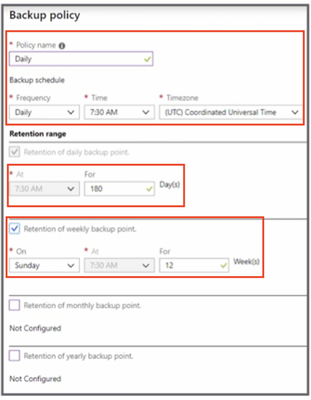

# Deploy and Manage Virtual Machines (VMs)

## Create and configure a VM for Windows and Linux

### Availability Sets

* AS is Microsoft best practice 
* Meets SLA 
* **Virtual machine is distributed across fault and update domains**
* Ensure one instance is always available during maintenance 


### Availability Zones 

* Spread the virtual machine across the separate zones within a region 
* Protects from datacenter failure 
* **Maximum of three zones per region** 
* **Not available in all regions** 


### Virtual Machine Storage  

* **Virtual machine has a minimum of two disks** 
	* OS: registered as an SATA disk; C drive (C:); 
		* max capacity is 2,048 GB 
	* Temp: page or swap files; D drive (D:); 
		* <span style="color:red">stores the pagefile.sys;</span> 
		* data may be lost; 
		* <span style="color:red">do not store files on this disk</span> 

* **Data disks** 

	* Registered as an SCSI disk; 
	* **max capacity is 4,095 GB to a max of 32,767 GB, depending on the virtual machine** 


### Types of Disks 

* Standard HDD 
	* Cost-effective disks 
* Standard SSD 
	* **Recommended for most workloads** 
	* **Workloads not requiring high IOPS** 
* Premium SSD 
	* **Use when running an S series virtual machine** 


### Managed vs. Unmanaged Disks 

* Unmanaged 
	* The storage account needs to be managed 
	* **Max IOPS is 20,000 across the storage account** 
	* **Use TRIM on standard HDD to delete unused blocks to reduce spend** 

* Managed 
	* The storage account is automatically managed 
	* Microsoft recommends using managed disks 


### Configure Inbound Port Rules

* **By default, no traffic can access the virtual machine** 
* <span style="color:blue">**Must select public inbound ports**</span>

 


### Configure Networking 

* Every virtual machine **must be associated to a VNet** 
* **Default subnet is automatically assigned** 
* Control access via **network security group (NSG)** **using access control lists (ACLs)** 
* Open inbound ports: **default — all inbound Internet traffic is blocked** 


### Configure Monitoring

* Enable boot diagnostics 
* Enable OS guest diagnostics 
* A diagnostic storage account is required  


### Configure Virtual Machine 

* General purpose
* Compute optimized 
* Memory optimized 
* Storage optimized 
* GPU 
* **High-performance compute** 


### Scale Sets

* Multiple, identical, load-balanced virtual machines
* Manage all the instances as one 
* Instances increase or decrease based on workload or schedule 


### PowerShell 

```
New-AzureRmVm 
	-ResourceGroupName "YourResourceGroup" 
	-Name "YourVM" 
	-Location "East US" 
	-VirtualNetworkName "YourVnet" 
	-SubnetName "YourSubnet" 
	-SecurityGroupName "YourNetworkSecurityGroup" 
	-PublicIpAddressName "YourPublicIpAddress" 
	-OpenPorts 80,3389 
```


### Key Points 

* Know how to create a virtual machine 
* Understand the virtual machine storage and disk options 
* Know and recommend the best virtual machine size based on the performance requirement 
* Know when and why to use scale sets 


## Automate deployment of VMs

### Create a VM Template from Deployment

* Build the virtual machine 
* Review and create the tab
* Download a template for automation 


### Create a VM Template

* github
* Azure Template

### Create a Template from scratch


### Basic Json Template

```
{ 
	"$schema": "http://schema.management.azure.com/schemas/2015-01-01/deploymentTemplate.json#", 
	"contentVersion": "",
	"parameters": { }, 
	"variables": { }, 
	"functions": [ ], 
	"resources": [ ], 
	"outputs": { } 
}
```

* schema, contentVersion, parameters, variables, functions, resources, outputs

### Configure VHD Template Windows 

```
"imageReference": { 
	"publisher": "MicrosoftWindowsServer", 
	"offer": "WindowsServer", 
	"sku": "2016-Datacenter", 
	"version": "latest" 
}, 
```

### Save Deployment as an ARM Template

* Save when creating the resource 
* **Save after deployment** 
* Download, add to the library, or deploy 


### Modify Azure Resource Manager Template 

* Download and modify a template from 
	* **The resource** 
	* **During creation** 

* Modify quickstart templates 
* Modify an existing template 

### Deploy from the Template 

* The portal 
* Template deployment tool 
* Visual Studio Code 
* Visual Studio 
* PowerShell 


### Deploy Virtual Machines from a Template 

1. Create the resource group 
2. Create a `template.json` file
3. Create a `parameters.json` file 
4. Create a **storage account and container** 
5. **Upload the files to the storage account** 
6. Deploy the template 


### Deploy the Template 

```
$templatePath = "https://" + $storageName + ".blob.core.windows.net/templates/Template.json" 

$parametersPath = "https://" + $storageName + ".blob.core.windows.net/templates/Parameters.json" 

New-AzureRmResourceGroupDeployment -ResourceGroupName "myResourceGroup" -Name "myDeployment" -TemplateUri $templatePath -TemplateParameterUri $parametersPath 
```

* `-ResourceGroupName`
* `-Name`
* `-TemplateUri`
* `-TemplateParameterUri`

### Key Points 

* Be familiar with the basic template structure 
* Know where templates can be acquired
* Know the steps to deploy a template using different methods 


## Manage an Azure VM

### Attach a Data Disk

* Microsoft recommends **adding disks to virtual machines** 
* **Number of disks that can be added is dependent on the virtual machine size** 
* Initialize the disk in the virtual machine
* **Use TRIM if using FIDD disks** 

> TRIM will delete the empty disk


### Attach a Data Disk Using PowerShell 

```
$rg = 'yourResourceGroup' 
$vm = 'yourVM' 

$location = 'East US' 
$storageType = 'Premium LRS' 
$dataDisk = $vm + '_disk' 

$diskConfig = New-AzureRmDiskConfig -SkuName $storageType -Location $location -CreateOption Empty -DiskSizeGB 128 

$dataDisk1 = New-AzureRmDisk -DiskName $dataDisk -Disk $diskConfig -ResourceGroupName $rg 

$vm = Get-AzureRmVM -Name $vmName -ResourceGroupName $rg 
$vm = Add-AzureRmVMDataDisk -VM $vm -Name SdataDisk -CreateOption Attach -ManagedDiskId $dataDiskl.Id -Lun 1 

Update-AzureRmVM -VM $vm -ResourceGroupName $rg 
```

### Add Network Interface

* A virtual machine must have one **network interface card (NIC)** 
* **`Multiple NICs`** are available **depending on the virtual machine** 
* **The NIC must be in the same location** and **subscription as the virtual machine** 


### PowerShell Desired State Configuration

* Ensures the virtual machine **always has the desired configuration** 
* **Provides management of the virtual machine** 
* No snowflakes (They dont become special)
* **Doesn't not require an agent**


```
configuration IISInstall 
{ 
	node "localhost" 
	{ 
		WindowsFeature IIS { 
			Ensure = "Present" 
			Name = "Web-Server" 
		} 
  } 
} 
```
> Exam: You should be familiar with the basic configuration of desired state configuration


### Use Custom Script Extensions

* Postdeployment and management tasks 
* ARM templates 
* CLI 
* PowerShell 


### Change a Virtual Machine Size 

* The virtual machine may have to be deallocated 
* Select an S version for Premium Storage if already using Premium Storage 
	* For example, DS2 v2 


### Moving Resources 

* **Resources are locked during the move** 
	* Cannot add, update, or delete the resource while the resource is being moved 
	* Applications using the resource will still be available 

* **The location of the resource does not change** 

* **Not all resources can be moved** 

> Moving resources can be tested prior to actual move to determine if the resource can be moved

### Subscription Requirements 

* Different subscriptions 
	* **Must exist in the same Azure Active Directory tenant** 

* Resource provider must be <span style="color:blue">registered for the destination subscription</span> 
	* <span style="color:red">**`Microsoft.Compute` must be registered for a virtual machine** </span>


> If we were moving a virtual machine, the `Microsoft.Compute` must be registered in the destination subscription for that virtual machine


### Permissions Required 

* Source resource group Microsoft. 

Resources/subscriptions/resourceGroups/**`moveResources/action`**

* Destination resource group 

Microsoft.Resources/subscriptions/resourceGroups/`write` 


### Redeploy Virtual Machines 

* Unable to connect to the virtual machine 
* Virtual machine is shut down and is moved to a new node and restarted 
* Dynamic IP will be updated 
* Portal or PowerShell 
* `Set-AzureRmVM -Redeploy -ResourceGroupName "ResourceGroup" -Name "VM"`

### Key Points 

* Understand the implications of moving resources 
* Know the requirements to move resources 
* Know why a virtual machine would need to be redeployed 
* Know why and how to attach a data disk 


##  Manage VM backups

### Configure the Virtual Machine Backup

* **Backup can be configured from the virtual machine blade** 
* Bulk configuration can be configured from **the Recovery Services vault** 
* **Can be configured when creating the virtual machine** 


### Create a Backup policy

* Azure virtual machine can **<span style="color:red">only be backed up once a day</span>** 
* Frequency is **either weekly or daily** 
* Configure **additional retention points** (For weekly, monthly or yearly backup)



> There are 2 options for restoring a VMs, create a **new VM** or **replace existing virtual Machine**

### Restore to a New Virtual Machine

* **<span style="color:blue">Restored virtual machine will not overwrite the existing virtual machine</span>** 
* Additional customizations will require **PowerShell** 


### Restoire Disks

> In addition to restoring the entire VM, there is also option to restore the disks only

* **Restore special network customizations** 
* New disks will be created in the selected storage account 
* Additional customizations will require **PowerShell** 


### Replace Existing Virtual Machine

> You really can't replace the existing virtual machine, 

* **Only option is Replace Disk(s)** 
* **Replaces the disks in the existing virtual machine** 
* The virtual machine must still exist 


### Restore Files from Azure Virtual Machine Backup

* Download a script and password onto the system where the files are to be restored to a local machine or Azure virtual machine 
* The script mounts the disk 
* Copy the files that need to be restored to the local system 
* **Unmount the disks; automatically unmount after 12 hours** 


### Key Points 

* Know how to create a backup policy 
* Understand the limitations of the backup policy 
* Know when to restore a full virtual machine vs. disks only 
* Practice restoring virtual machines and files 

