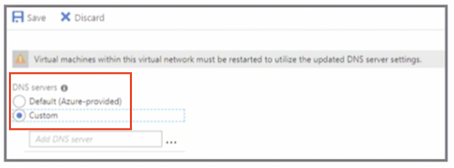
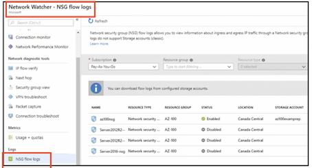
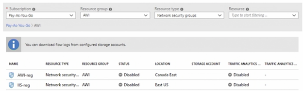

# Configure and Manage Virtual Networks

## Create connectivity between virtual network

### VNet Peering Overview 

* **Connect two Azure networks** 
* <span style="color:green">**Traffic never leaves the Microsoft backbone**</span> 
* <span style="color:green">**Traffic between the peered networks is private**</span> 
* **Peer across subscriptions and regions** 


### VNet to VNet Connections 

* **Requires VPN Gateway** 
* **Geo-presence and geo-redundancy**; 
* **isolate regional multi-tier applications** 
* **VNets in different subscriptions must be configured using PowerShell** 


### Virtual Network Gateway

* **Connect Azure VNet to another Azure VNet** 
* Connect **Azure VNet to on-premises** 


### Key Points 

* Know how to create a VNet, subnet, and gateway 
* Know when to use PowerShell to create a connection
* **Know that connecting networks need to be configured in both directions** 
* **<span style="color:green">VNet peering uses internal DNS only</span>**

## Implement and manage virtual networking


### Virutal Networks

* Isolation and segmentation 
* Each VNet is isolated from other VNets 
* **Resources have outbound access to the Internet by default** 


### Network Interface

* **Only a private IP address is configurable** 
* `Public IP` is assigned automatically when the **`NIC` is associated to a virtual machine** 
* <span style="color:green">Configure the NIC with a public IP without the virtual machine use CLI or PowerShell</span> 
* **New-AzureRMNetworkInterface**

 


### Network Subnets

* Used to divide the network 
* Subnet must fall within the VNet address space 
* **<span style="color:green">Azure reserves `five IP` addresses in the subnet range</span>**


### System Routes 

* Automatically created and assigned to each subnet 
* <span style="color:green">System routes cannot be deleted or created</span> 
* **Override system routes using custom routes** 


### Create Custom Routes

* **Create a route table** 
* **Border gateway protocol (BGP)**: 
	* an `on-premises` network gateway 
	* Azure VNet gateway (a separate route is created) 
* Typically, <span style="color:green">**BGP is used for ExpressRoute configurations**</span>


### Add a route

* **Define route specifying the next hop** 
* Next hop can be a **virtual appliances, virtual network gateways, virtual network, or the Internet** 
* <span style="color:red">**Associate the route to a subnet**<span/>


### Public IP 

* Allows communication with Internet resources 
* SKUs`Stock Keeping Unit(shapes of the product)`: **Basic or Standard** 
* **Static allocation assigns the IP when the resource is created** 
* **Dynamic allocation assigns the public IP after it is associated to an Azure resource** (default setting) 


### Public IP Resources 

* <span style="color:green">**Virtual machine network interfaces (static and dynamic)**</span>
* <span style="color:green">**Internet-facing load balancers (static and dynamic)**</span> 
* VPN gateways (dynamic) 
* Application gateways (dynamic) 


### Private IP 

* Enables Azure resources to communicate 
* **Dynamic**
	* **Assigns the next available unassigned address** 
	* Default setting 
* **Static Azure selects and assigns the IP** 

> We can't select that, it is done automatically for us


### Private IP Resources 

* <span style="color:blue">Virtual machine network interfaces (dynamic and static)</span> 
* <span style="color:blue">Internal load balancers (dynamic and static)<span>
* <span style="color:blue">Application gateways (dynamic and static)</span> 

### Key Points 

* Know how to create multiple subnets 
* Understand what happens if you create a subnet that is too small 
* **Know when to use a user-defined route (UDR)** 
* **Know the default hops in a system route** 
* **Review private and public IPs (dynamic and static)** 


##  Configure name resolution (DNS)

### Name Resolution that uses DNS servers

* Hybrid 
* Virtual machines in different VNets 
* **Name resolution for web apps** 
* <span style="color:red">Virtual machines added **before** the custom DNS server was added will need to be rebooted</span>



### DNS Zone

* Host DNS records for your domain 
* **<span style="color:green">Public: Internet-facing DNS domains</span>** 
* **<span style="color:green">Private: Eliminates the need for a custom DNS server</span>** 


### Add a Record

* Name that the IP address will be resolved to 
* **Type of DNS record to create** 
* TTL and TTL unit 
* **IP address that the type resolves to** 


> Alias record set


### DNS Alias Record Set 

* References other Azure resources in the Azure DNS zone 
* Only supported on **A, AAAA, and CNAME record types** 
* **Alias records automatically update during DNS resolution** 
* **Prevents dangling DNS records when an application IP changes** or **references an Azure `Traffic Manager` profile for the domain name apex** 


### Create DNS and Record Using PowerShell 

```
#1. Create a DNS Zone 
New-AzureRmDnsZone -Name abc.com -ResourceGroupName ResourceGroup 


#2. Create a DNS Record 
New-AzureRmDnsRecordSet -Name www -RecordType A -ZoneName abc.com -ResourceGroupName ResourceGroup -Ttl 3600 -DnsRecords (New-AzureRmDnsRecordConfig -IPv4Address "10.0.1.4") 
```

### Delegate a Domain to Azure DNS

* When **delegating a domain to Azure DNS**, the name servers will be needed 
* **Name servers will need to be added to the registrars** 


### Custom DNS Settings for a Web App

* A record to map a root domain 
* CNAME record to map a subdomain or wildcard domain 
* Not supported in the F1 tier (free tier) 


### Key Points 

* Know when to use your own DNS server 
* Know when to use an alias record set
* Understand how to configure a custom DNS record for web apps 


## Create and configure a network security group (NSG)

### Network security group

* List of security rules 
* Allow or deny traffic 
* **<span style="color:green">Associated with a subnet or network interface</span>** 
* <span style="color:red">**Microsoft recommends associating with a subnet instead of a network interface**</span>


### Create Security Rules

* **Source and source port ranges** 
* Destination and destination port ranges 
* Protocol (any, TCP, UDP)
* **Action (allow or deny)** 
* **Priority** 
* **Rule name** 


### Associate NSG to a subnet

* Choose a virtual network 
* Choose a subnet 
* <span style="color:red">**NSG cannot be applied to a gateway subnet**</span>


### Associate NSG to a Network Interface

*  Must be in the same location and subscription 
*  NSG will overwrite existing NSG 


### Log NSG Traffic

* Network Watcher 
* **Enables NSG flows** 
* Requires a storage account 



### Evaluate Effective Security Rules

* Networking from the virtual machine blade 
* Only the top 50 rules are shown 
* Download .csv for all rules 


### Key Points 

* Know the default inbound and outbound security rules 
* Priority: <span style="color:red">**the lower the number, the higher the priority**</span> 
* NSG must be in the same location as the virtual network 
* **If applying an NSG to a virtual machine and the subnet, the allow rule must be allowed at both levels or the traffic will be blocked** 
* NSG cannot be applied to a gateway subnet 

## Implement Azure Load Balancer

### Types of Load Balancers 

* **Public** 
	* **<span style="color:green">Load balancing incoming traffic</span>** 
	* **<span style="color:red">Outbound connectivity for internal virtual machines</span>** 

* Internal 
	* **Load balancing internal traffic** 


### Load Balancer


> The internal load balancer can also **manage the traffic coming from VPN connection from the on-premises environment** This eliminates the traffic from traversing the internet

### Sku Comparsion


**<span style="color:red">MC does recommend using the standard SKU**</span>

### Load Balancing Rules

Direct incoming traffic backend resources


### Configure Internal Load Balancer

* Requires a **private IP address** 
* **Sits behind the external load balancers**

### Configure Public (External) Load Balancer 

* **<span style="color:green">Required when deploying virtual machine scale sets</span>** 
* **Requires a public IP address** 
* **Load balances all traffic** 
 
### Troubleshoot Load Balancer 

* Virtual machine is unhealthy 
* Virtual machine is not listening on the probe port 
	* **Probe port is closed;** 
	* **Probe not listening on the correct port** 
* **<span style="color:green">Network security group (NSG)</span>**
* **<span style="color:green">Firewall is blocking the probe port</span>** 


### Key Points

* Know how to configure a load balancer, including health probes 
* Know the difference between the SKUs 
* A single load balancer cannot be both internal and public (external) 

## Monitor and troubleshoot virtual networking

### Azure Monitor 

* **Monitor and visualize metrics** 
* **Query and analyze logs** 
* Set up alert and conditions 


### Network Watcher 

* **Monitoring** 
* **Network diagnostic tools** 
* Metrics
* Logs 


### Network Watcher: Monitoring 

* Topology  
* **Connection monitor** 
* Network **（performance monitor）** 


### Network Performance Monitor 
 
* Monitor **on-premises connectivity** 
* Monitor **loss and latency** 
* Monitor **the health of the network without SNMP** 


### Network Watcher: Network Diagnostic Tools

* **IP flow verify** 
* Next hop 
* **Effective security rules** 
* **VPN troubleshoot** 
* Packet capture 
* **Connection troubleshoot** 


### Network Watcher: Metrics 

* **Usage and quotas**


### Network Watcher: Logs

* **NSG flow logs** 
* **Diagnostic logs** 
* Traffic analytics 



### Security Center 

* Network map for security 
* Network recommendations 
* Just-in-time access 
* NSGs 
* Firewall 


### Key Points 

Know which tool does what 

* **Network Monitor** - provides metrics and logs and creates alerts 
* **Network Watcher** - **can monitor and diagnose virtual networks** 
* **Security Center** - provides recommendations to secure the virtual networks 


## Integrate on-premises network with an Azure Virtual Network

### VPN Gateway 

* Passes encrypted traffic between on-premises and Azure over the internet 
* **Requires a gateway subnet** 
* **Four SKU types** 

### Gateway SKU 

* Basic **Does not support IKEv2 or BGP (no ExpressRoute)** 
* **VpnGw1** - throughput bandwidth at 650 Mbps 
* **VpnGw2** - throughput bandwidth at 1 Gbps 
* **VpnGw3** - throughput bandwidth at 1.25 Gbps 


### Virtual WAN 

* Optimized branch connectivity to Azure 
* Hub and spoke 
* Requires more than 30 site-to-site VPN tunnels 

> Make sure your subnets from on-premise and into Azure cannot overlap

### Site to Site 

* Policy-based and route-based routing 
* Active-passive or active-active 

### Point to Site 

* Used to connect clients 
* Dedicated VPN device or public-facing IP are not required 
* `SSTP or IKEv2` 
* **Route-based routing** 
* **Active-passive** 

### ExpressRoute 

* Active-active 
* BGP 
* Direct connect 

> Direct connect between your on-premise environment and Azure through 3rd party supplier
> 
> Traffic does not over the internet

### Key Points 

* Know the differences between site to site and point to site 
* Know when to use **S2S or P2S** 
* Compare and contrast gateway SKUs 


