# Manage Identities

## Manage Azure Active Directory (AD)

### Add a Custom Domain 

* **Purchase a domain from a registrar** 
* The domain will need to be verified 
* **Add the DNS information to your registrar** 
* <span style="color:red">**Only top-level domains are supported**</span>


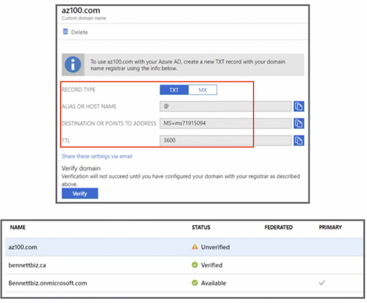

### Azure AD Identity Protection 

* Detects potential vulnerabilities 
* **Handles suspicious actions automatically** 
* **Investigates incidents and resolves them** 
* **Only available in the Premium P2 edition** 


### Azure AD Join Overview 

* Designed for cloud-first organizations 
* Single-sign on (SSO) 
* **Seamless access to on-premises resources** 
* **Allows for enterprise-compliant roaming** 
* **Restricts access to apps from devices compliant with company policy** 
* Windows 10 (Pro and Enterprise) 

### When to Use Azure AD Join 

* Manage groups that are not in Azure AD 
	* For example, seasonal workers, students, and contractors 

* For BYOD (**bring your own device**), 
* <span style="color:red">**Microsoft recommends using Azure AD registered devices**</span>


### Enterprise State Roaming Overview 

* Settings and app data are synchronized across devices 
* Windows 10 only 
* Reduces time needed to configure a new device 
* Supports separation of corporate and consumer data in users' cloud accounts 
* Content is encrypted at rest in the cloud 
* **Synced data is retained until it's manually deleted or becomes stale (one year)** 
 

### Configure Self-service Password Reset

* sUsers can change their own passwords without assistance from the help desk 
* Password change 
* Password reset
* Account unlock 

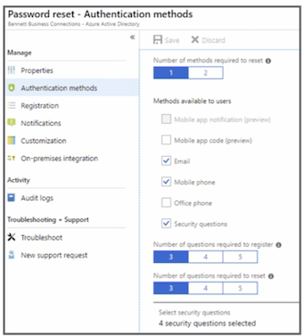

### Conditional Access

* **Control access to company resources based on rules** 
* **Condition statement**: when this happens 
* **Control statement**: then do this (block or grant) 

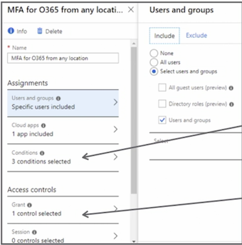


### Manage Multiple Directories

* Each tenant is independent 
* What you do in one tenant does not affect another 
* <span style="color:red">**A domain name can only be used by a single tenant**</span> 
* The creator of the tenant is a **global admin for the tenant** 

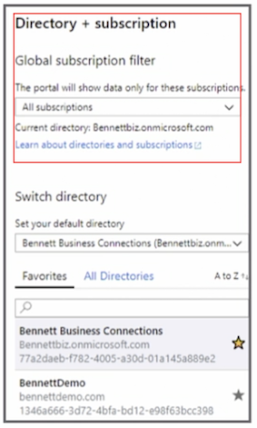 

### Perform an Access Review

* Manage group memberships 
* **Find stale accounts** 
* **Review access to enterprise applications** 
* **Review privileged roles**

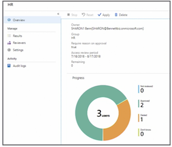 

### Key Points 

* Know how to configure and implement an **access review **
* Know how to **complete an access review as a user** 
* Create a **conditional access rule** 
* Review Azure AD Identity Protection in depth 
 
 
## Manage Azure AD objects: Users, groups, and devices
 
### Create Users using the portal

* Name 
* Username 
* Group membership 
* Directory role: 
	* user, 
	* global administrator, 
	* limited administrator 

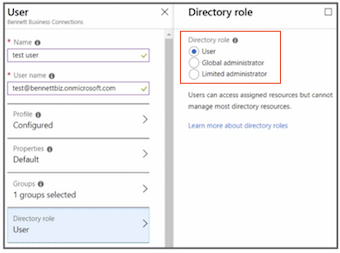 

### Create Users Using PowerShell 

```
$PasswordProfile = New-Object -TypeName Microsoft.Open.AzureAD.Model.PasswordProfile 

$PasswordProfile.Password = "NewPassword" 

New-AzureADUser -DisplayName "Muhammand Garg" -PasswordProfile $PasswordProfile -UserPrincipalName 

"MGarg@bennettbiz.onmicrosoft.com" -AccountEnabled $true - MailNickName "MGarb" 
```

### Create Groups using the portal

* Group type: security (grants permission to a group of users) or Office 365 (collaboration) 
* Membership type: 
	* **assigned**, 
	* **dynamic user**, 
	* **dynamic device** 

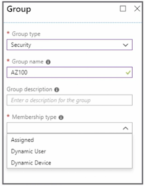 


### Dynamic Group

* **User or device will be added to a group** based on a rule 
* Users in the HR department will automatically become members of a specific group 
* **When the attribute changes, the user or device is automatically removed from the group** 

> In our example, if the user no longer belongs to HR department, they will automatically removed from that group

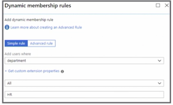 

### Create Groups Using PowerShell 

```
#Create Groups 
New-AzureADGroup -Description "HR" -DisplayName "HR" -MailEnabled $false -SecurityEnabled $true -MailNickName "HR" 

#Add Members 
Add-AzureADGroupMember -ObjectId "Group id" -RefObjectId "Owner/Manager/member id" 
```

### Manage Device Settings

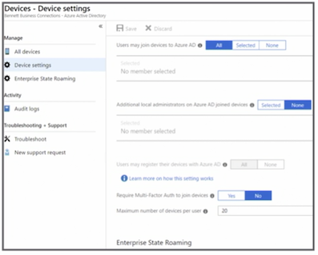 

## Implement and manage hybrid identities

* Sync identities from **on-premises** to Azure AD 
* **Express**: Single forest topology and password hash synchronization 
* **Custom installation**: Multiple forests or different sign-on option 

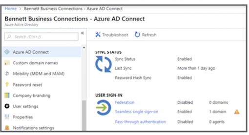 

### On-Premises AD Considerations 

* Run IdFix to correct errors in Active Directory 
* On-premises AD functional level must be Windows Server 2003 or later
* Password writeback will require the DCs (domain controllers) be on Windows Server 2008 R2 or later 
* Cannot be installed on an RODC (read-only domain controller) 


### Azure AD Connect Server 

* Cannot be Windows Server Essentials 
* Server core is not supported 
* Server must be at least Windows Server 2008 
* Password synchronization requires Azure AD Connect be installed on Windows Server 2008 R2 SP1 or later 
* SQL Server is required 
* SQL Server 2012 Express is installed by default 


### Password Synchronization or Hash 

* Default option 
* Will be used in the Express installation 
* Same username and password in Azure and on-premises 
* **<span style="color:blue">Authentication occurs in the cloud</span>** 


### Pass-Through Authentication 

* Same username and password in Azure and on-premises
* **Username and password are authenticated by the on-premises AD** 

### Federation with AD FS 

* Same username and password in Azure and on-premises 
* **Authentication occurs on the on premises AD FS** (Active Directory Federation Services) instance 


### Federation with PingFederate 

* Same username and password in Azure and on-premises 
* **Authentication occurs on the on-premises PingFederate instance** 


### Federation Considerations 

* Used in more complex hybrid environments 
* Domain join SSO 
* Enforcing AD sign-in policy 
* Third-party MFA (multi-factor authentication) integration 


### Password Sync and Writeback 

* Passwords changed in Azure AD writeback to on-premises AD 
* **Synchronous: no delays in the writeback** 
* **Enforces on-premises AD password policies** 
* Writeback is **not supported for users in an on-premises AD protected group** 


### Azure AD Connect Health

* Monitors Azure AD Connect sync 
* Monitors AD FS 
* Monitors AD DS 
* Included in Azure AD Connect Tool 
* Additional servers need to have Azure AD Connect Health agent installed 

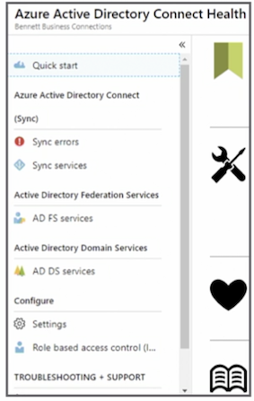 

### Key Points 

* Understand how to install and configure Azure AD Connect 
* Fully understand the different sign-on options 
* Choose the correct sign-on option based on a scenario 
* **Review Azure AD Connect Health** 


## Implement Azure Multi-Factor Authentication

### Azure MFA Versions 

* MFA in the cloud 
	* Cloud-only users and apps 
* MFA server on-premises 
	* Hybrid deployments 


### Cloud MFA Options 

* Multi-Factor Authentication for Office 365 
* Multi-Factor Authentication for Azure Active Directory (AD) administrators 
* Azure Multi-Factor Authentication (full version) 
	*	Azure AD Premium 


### Configure MFA/Bulk Update 

* Individual enabling 
* Bulk using CSV 

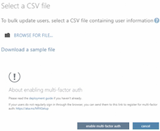 

### Fraud Alerts 

* User reporting fraud is blocked for 90 days or until administrator unblocks the account 
* User can report fraud during **two-step verification; 0 is the default** 

> They'll need to enter a specific code

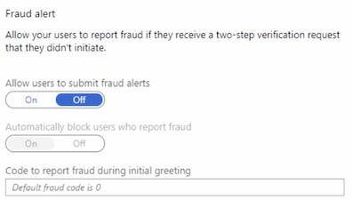 

### Configure Bypass 

* User can authenticate without two-step verification 
* Temporary 

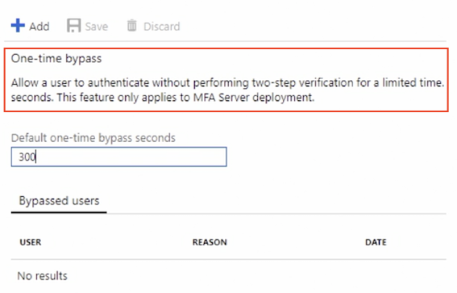 

* Use case: **When a phone is unable to receive a call**


### Trusted IPs 

**Bypass `two-factor` if signing in from trusted location**

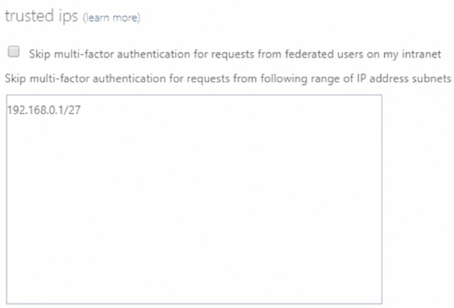 

### Verification Methods 

* Select verification methods users can use for authentication 

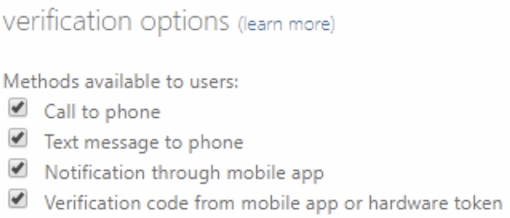 

### Key Points 

* Know what is covered by the paid and free versions of MFA 
* Know the different Microsoft cloud MFA offerings 
* Know how to configure MFA 
