# Azure Administration: Manage Subscriptions and Resources

## 1. Manage Azure Subscriptions


### Assign administrator roles overview

**Classic**

* Account Administrator: **Full access** 
* Service Administrator:  
	* **Manage services** 
	* Assign user to the Co-Administrator role 
* Co-Administrator 
	* **Same as Service Administrator with limitations** 

**Role-Based Access Control**

* Owner 
* Contributor 
* Reader
* User Access Administrator 
* 70 built-in roles 
* Custom roles 

**Owner**

* Full access to all resources 
* Delegate access to others 
* Equivalent to the Service Administrator and Co-Administrator role in the classic model 


**Contributor**

* Cannot delegate access to other users 
* Create and manage resources 

**Reader** 

* View Azure resources only 

**User Access Administrator**

* Special account 
* Privilege at the root scope (`/`) 
* Temporary access only (recommended)
* Azure AD, not subscription 

**Azure AD Administrators**

* **Manage Azure AD resources** 
	* Create, edit, reset user passwords, manage licenses, and more 
* **Several Azure AD roles** 
	* Global, Billing, Device, Information Protection, User Account, and more 

**Service Administrator** 

* Same as the Account Administrator (person who signed up for the account) 
* **Typically changed for migrations** 
* If the Service Administrator is changed, the Account Administrator loses access to the portal 
* **Cannot add a user who is not in the directory** 

> For example, `Sharon@bennettbiz.ca` can add `Watson@bennettbiz.cbu`t not `watson@oldbennettbiz.ca `


### Configure cost center quotas and tagging

**Azure Spending Limit**

* Free trial, Visual Studio, Azure in Open (AIO), or BizSpark subscription **will be disabled when the credits are consumed** 
* **Remove spending limit** 
	* Current billing period or indefinitely 
* Reason: 
	* cannot have a disruption to services or service will exceed the limits, **for example, virtual machine images** 


**Resource Tags** 

* Tag your resources 
* Name and value 
	* Finance: Production; Finance: Dev 
* **Fifteen tags per resource** 
* Write access to the resource to apply a tag 
* Portal, PowerShell, Azure CLI, template, REST API 

### Azure Policy overview

**Azure Policies**

* Set of rules to ensure compliance 
* Scans resources and provides reporting 
* **Used to ensure SLAs and corporate policies are met** 

**Azure Policy Assignment Options**

* Policy 
	* Individual polices 

* Initiative 
	* Groups of individual polices 


**Policy Definition**

Conditions that the policy or initiative will report on and enforce if configured to do so

**initiative Definition**

* Grouping of policies
* Reduce management 
* Assign the definition to a resource 

### Quiz

1.What role allows for privilege at the root scope?

* contributor
* Reader
* Owner
* **User Access administor**

2.What are removed when a subscription moves to another Azure AD Tenant?

* Virtual Machines
* Disks
* **RBAC Assignment**
* Website

3.Abid is attempting to apply a tag to a resource but is unable to do so. What is the minimum role that is required to apply tags?

* User role
* Operator Role
* **Contributor Role**
* Reader Role

4.Rachel, who has been assigned the contributor role, is trying to create a new Resource Group in the West US and is unable to do so. What could be preventing this?

* **A policy restricting creation of Resource Groups in the West US has been applied at the Subscription level.**
* Rachel does not have the permissions to create Resource groups
* A policy has been applied to Rachel that prevents her from creating Resource Groups in the subscription.
* A policy has been applied to Rachel that prevents her from creating Resource Groups in the West US.


5.An initiative definition is

* **a group of policy definitions**
* a group of assignment definitions
* a group of parameters definitions
* a subset of policy assignment

## 2. Analyze Resource Utilization and Consumption

### Azure log overview

**Types of Logs in Azure**

* Activity logs 
* OS-level diagnostic logs 
* Application logs 
* Diagnostic logs 

**Application Logs** 

* Used to debug App Service web apps
* Web server diagnostics 
	* Capture data from the web server hosting the app 
* Application diagnostics 
	* Capture data from a web app 

**Guest OS Diagnostic Logs**

* Logs collected from an **<span style="color:red">agent on the resources</span>**, such as a **virtual machine** 
* Gathers data from the **operating system**
* Gathers data from the **applications** 

**Diagnostic logs**

* Tenant log: 
	* Activity on resources outside an Azure subscription, such as **Azure Active Directory**
* Resource logs
	* Activity for resources within an **Azure subscription**
	* **Agents are not required** 

#### Compute Resource Logs

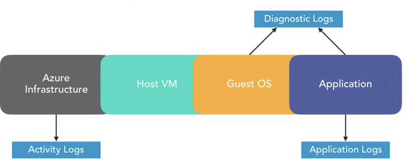

#### Non-Compute Resource Logs

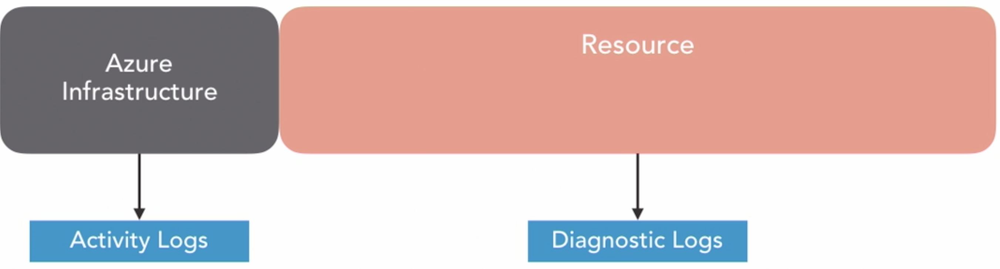

### Configure diagnostic settings on resources using the portal

**WorkFlow**

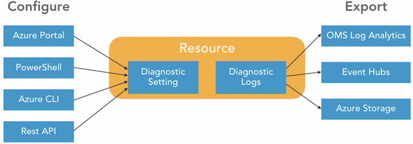


### Configure diagnostic settings on resources using PowerShell

```
Get-AzureRmResource | ft 

Set-AzureRmDiagnosticSetting -ResourceId '/subscriptions/.../DC' -Enabled $True -StorageAccountId 'subscriptions/'

Get-AzureRmDiagnosticSetting -ResourceId '/subscriptions/.../DC' 

Set-AzureRmDiagnosticSetting -ResourceId '/subscriptions/.../DC' -Enabled $False
```


### Create a baseline for resources

**Features**

* Process automation
* Configuration management
* Update Management 
* Shared capabilities 


**Process automation**

* Automate repeatable management tasks 
* Runbooks 
* Starting/stopping all virtual machines in a resource group or subscription on a schedule 

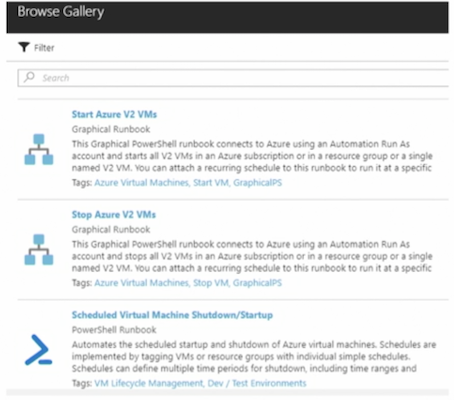

**Configuration Management**

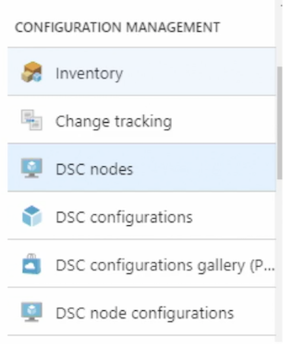

* Inventory
* Change tracking
* **DSC(DSC Configuration Script)**

```
Configuration IIS { 
# Import the module that contains the resources. 
	Import-DscResource -ModuleName PsDesiredStateConfiguration 

# The Node statement specifies which targets systems this will be applied to. 
	Node 'localhost' {  
	
	# Ensures that the Web-Server (IIS) feature is enabled. 
	WindowsFeature WebServer { 
		Ensure "Present" 
		Name "Web-Server" 
	} 
 }
} 
```

**Update Management**

* Upadte and patch virutal machines
* on schedule


**Shared Capabilities**

* Automate and configure at scale across your environment 

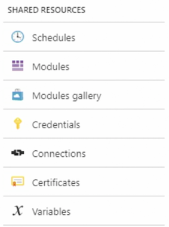

### Azure Alerts

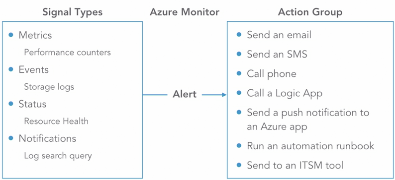

**Alert Overview**

* Target: **The resource that is to be monitored** 
* Criteria: The conditions that will trigger an action 
* Action: The action that is to be sent to a receiver 

**Rate Limiting**

* Email — maximum of 100 emails per hour 
* Voice - maximum of one voice call every five minutes 
* SMS **maximum of one SMS every five minutes** 


### Create and review metrics in Azure Monitor

**Overview**

* View performance and health of an Azure workload 
* Also known as **performance counters** 
* One-minute frequency (near real-time visibility) 
* 93 days of metric history 
* Access via portal, REST API, PowerShell, Azure CLI 

### Azure Advisor cost recommendations

**Overview**

* Eliminate unprovisioned ExpressRoute circuits 
	* Identifies ExpressRoute connections have a provider status of not provisioned" for over a month 
* Delete or reconfigure unused virtual network gateways 
	* Identifies virtual network gateways that have not been used in over 90 days 
* Switch to reserved virtual machine instances 


**Optimize Virtual Machine Spend** 

* Virtual machines usage is monitored for 14 days 
* Identify underutilized instances
* Low-utilized virtual machines meet the following default rules: 
	* CPU utilization less than 5% 
	* Network usage is less than 7 MB for four days 
* Resize or shutdown the instance 

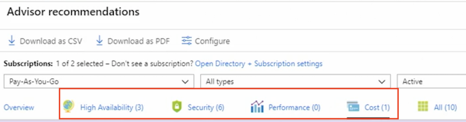


### Manage and report on spend

**Online pricing calculator**

* Gnerate an estimated monthly cost

**Review resource cost in the portal**

* Estimate cost for the selected resource

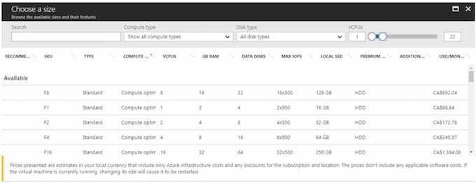

**Using billing alert**

* Email is sent when usage costs exceed the amount specified

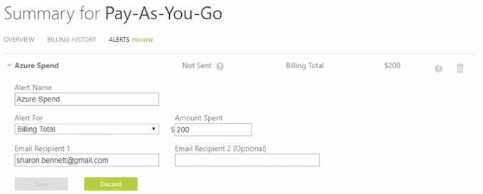

**Spending Limit**

* Credit or trials have the spending limit turned on by default 
* If the spending limit is reached, all services are disabled for the rest of the billing period 
* **Not available for `Pay-As-You-Go` subscriptions**

**Tags**

Use tags to group resources by cost center or environment

* HR, Finance, DevTest, Production

**Cost BreakDown**

* Month-to-date
* Forecast

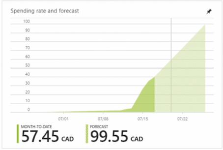

**Cost Analysis**

Filter on subscription, resource type, resource group, timespan, and tags 

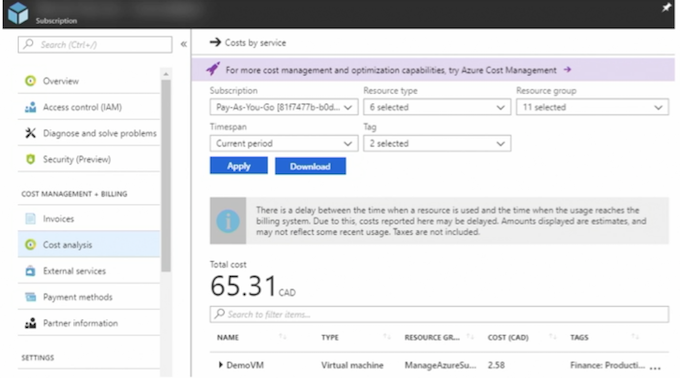

**Azure Advisor**

* Identify idle and underutilized resources 
* Resize or shut down underutilized virtual machines 
* Eliminate ExpressRoute circuits with a status of "not provisioned" for more than 30 days
* Use virtual machine reserved instances 


### Utilize log search query functions

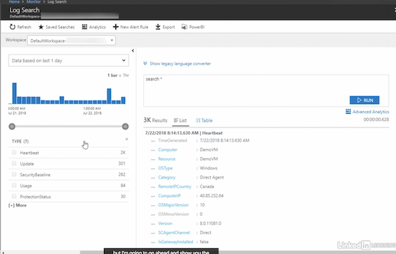

### Quzie

1. What log would you access to determine who created a virtual machine on a specific day and time?

* Azure system logs
* Diagnostic logs
* Application logs
* **Activity logs**

2.What is the default TimeGrain?

* **PT1M**

https://docs.microsoft.com/en-us/powershell/module/az.monitor/set-azdiagnosticsetting?view=azps-3.6.1

```
PS C:\>Set-AzDiagnosticSetting -ResourceId "Resource01" -Enabled $False -MetricCategory MetricCategory1,MetricCategory2
...
Timegrain : PT1M
...
```

3.What is the PowerShell command to add the DSC module?

```
Import-DscResource -ModuleName PsDesiredStateConfiguration
```

4.What are the three components of an alert?

**target, criteria, action**

5.Flavio needs to review the metrics from an Azure virtual machine. He is unable to view the logs from 100 days ago. Why?

Metric history is kept 93 days.

6.Low or under-utilized virtual machines must meet which default rules?

**CPU utilization is less than 5% and network usage is less than 7 MB for four days.**

7.ABC company has lost access to all of its Azure resources halfway through the billing period. Why?


**ABC company reached its spending limit on its credit subscription for the billing period**.

## 3. Manage Resource Groups


### Allocate resource policies using PowerShell

```
# Create the Assignment Of virtual machines not using managed disks.
$RG = Get-AzureRmResourceGroup -Name 'AZ-100' 
$Definition - Get-AzureRmPolicyDefinitipn Where-Object { $_.Properties DisplayName 'Audit VMs that do not use managed disks'}

New-AzureRmPolicyAssignment -Name 'VM-manageddisks' -DisplayName 'Virtual Machines without Managed Disks ' -Scope $RG.ResourceId -policyDefinition  $Definition

#List Policies 

Get-AzureRmPolicyDefinition 

#Identify the non-compliant resources 
 
$PolicyAssignnt = Get-AzureRmPolicyAssignment | Where-Object { $_.Properties. DisplayName eq 'Virtual Machines without Managed Disks'}

$PolicyAssignrrent.PolicyAssignmentId 

#Get the list of virtual machines without Managed Disks 
armclient post "/subscriptions/<subscriptionID>/resourceGroups/<rgName>/providers/Microsoft.PolicyInsights/policyStates/late.." 

#Remove the Assignment 
Get-AzureRMResourceGroup -Name 'AZ-100' 

Remove-AzureRmPolicyAssignment -Name 'VM-manageddisks' -Scope 
```


### Configure and apply resource locks

**Resource Lock Overview** 

* Control access Subscription Resource group Resource 
* Prevents accidental deletion or modification of resources

**Type of lock** 

* <span style="color:red">`CanNotDelete`</span> 

Read and modify but not delete a resource 

* <span style="color:red">`ReadOnly`</span> 

Read but not modify, delete, or update a resource Can lead to unexpected results 


**Lock Hierarchy**

* Parent-child relationship 

	* Locks applied at the parent scope affect all resources within that scope 
	* **Most restrictive lock takes precedence** 


**Permissions Required to Apply a Lock**

* `Microsoft.Authorization/*` 
* `MicrosoftAuthorization/locks/*` 
* Owner 
* User Access Administrator 

**How Locks Are Assigned** 

* Portal 
* PowerShell 
* Azure CLI 
* Template 
* Rest API 


```
#Lock a RG 
New-AzureRmResourceLock -LockName NoDelete -LockLevel CanNotDelete -LockNotes "Can not Delete Resources" -ResourceGroupName -ResourceGroupName 'AZ-100'

#View all Locks in subscription 
Get-AzureRmResourceLock 

#View all locks for a RG 
Get-AzureRmResourceLock -ResourceGroupName 'AZ-100' 

# Delete a Lock 
Remove-AzureRmResourceLock -LockName NoDelete -ResourceGroupName 'AZ-100' 
```


### Implement and set tagging on resource groups using PowerShell

```
#View Tags 
Get-AzureRmTag 

#Create a New Tag 
New-AzureRmTag -Name "IT" -Value "Dev" 

#Assign a Tag to a Resource Group 
Set-AzureRmResourceGroup -Name "AZ-100" -Tag @{IT 'Prod'} 

#View Tags 
Get-AzureRmTag -Name "IT" 

#Add Tags to a Resource 
$resource Get-AzureRmResource -ResourceName 'Server2012R2' -ResourceGroupName 'AZ-100' Set-AzureRmResource -Tag @{ IT "Dev"} -ResourceId Sresource ResourceId -Force 

# Remove Tag From Resource Group 
Set-AzureRmResourceGroup -Tag @{} -Name 'AZ-100' 

#Remove Tag From Resource 
Set-AzureRmResource -Tag @{} -ResourceId Sresource ResourceId -Force 

#Remove Tag 
Remove-AzureRmTag -Name "IT" 
```


### Moving resources overview

**Moving Resource**

* *<span style="color:red">Move resources to a new subscription</spam>* 
* Move resources to a resource group in the same subscription 
* Portal, PowerShell, Azure CLI, or REST API 


**Considerations**

* Resources are locked during the move 
	* Cannot add, update, or delete the resource while the resource is being moved 
	* Applications using the resource are still available 
* The location of the resource does not change
* Not all resources can be moved 

**Subscription Requirements** 

* Different subscriptions 
	* Must exist in the same Azure Active Directory tenant 
* Resource provider must be registered for the destination subscription 
	* `Microsoft.Compute` must be registered for a virtual machine 

	
### Move resources across resource groups	

**Permissions Required to Move Resources** 

* source resource group

Microsoft.Resources/subscriptions/resourceGroups/`moveResources/action` 

* Destination resource group

Microsoft.Resources/subscriptions/resourceGroups/`write`

**Subscription Quotas** 

* Ensure you will not exceed subscription quotas 
* If the limits are exceeded, can you increase the limits? 

**Chunk Down Resources**

* **Resource Manager can move 800 resources per move** 
* May also experience time-outs if less than 800 


**Validate the Move Request** 

* Tests the validity of the move without moving the resources (optional)
* Response code: 202 Validation request was accepted 
* Response code: <span style="color:red">204 The move was validated successfully</span> 


**Virtual Machine Limitations**

* Marketplace with plans attached are not movable 
	* Redeploy in the new resource group or subscription 
* Cannot move virtual machine with certificates stored in the **Key Vault across subscriptions** 
	* Move to different resource group in the same subscription 
* Cannot move virtual machine scale sets 
	* Standard SKU load balancer 
	* Standard SKU public IP 
* **Virtual machines using Azure backup** 
	* Workaround available 


**Managed Disks Are Now Move Supported** 

* Virtual machines with managed disks 
* Snapshots created from managed disks 
* Availability sets with virtual machines that use managed disks 
* Managed disks 

**Virtual Network Considerations**

* All resources dependent on the VNet must be moved 
* Peered networks must first be **un-peered, moved, and re-peered again** 
* Subnets with resource links cannot be moved to a different subscription 
	* For example, a subnet with a Redis Cache resource cannot be moved 


### Remove resource groups

```
# Lists all resource IDs in the resource Groups 
Get-AzureRmResource -oDataQuery "'$filter=resourcegroup eq 101dRGPS'" | Format-Table -Property ResourcelD 

# Move Resources 
Move-AzureRmResource -DestinationResourceGroupName "NewRGPS" -ResourceId "" 

Get-AzureRmResource -oDataQuery "'$filter=resourcegroup eq 'NewRGPS'" | Format-Table -Property ResourceID 

Remove-AzureRmResourceGroup -Name 'NewRGPS' 
```

### Quiz

1.What PowerShell cmdlet is used to create a Policy Assignment?

`New-AzureRMPolicyAssignment`

2.Shiva, who belongs to the Azure contributor role, is unable to apply locks to resources. What permissions does Shiva need to apply locks?

* `Microsoft.Authorization/locks/*`
* `Microsoft.Authorization/*`
* Owner role

3.What PowerShell cmdlet is used to create a new tag?

`New-AzureRMTag`

4.Joelle is testing a resource move and receives a code of 204. What does this mean?

The move was successfully validated.

5.When moving resources to another resource group using PowerShell, what is required?

**Resource ID**

6.Amelia wants to delete a Resource Group using PowerShell. What cmdlet does she need to use?

`Remove-AzureRMResourceGroup`


## Manage Role-Based Access Control (RBAC)

### RBAC overview

**Manage role-based access control**


**Azure AD Admin Roles vs. RBAC (difference)**

* RBAC roles provide **access management to Azure resources** 
* Azure AD roles used to **manage Azure AD resources** 
	* Manage users 
	* Assign admin roles 
	* Reset passwords 
	* Manage licenses 
	* Manage domains 

**Type of RBAC Roles:**

* Owner 
* Contributor 
* Reader 
* User Access Administrator 
* Built-in roles
* Custom roles 

**RBAC Required Permissions:**

* Microsoft.Authorization/roleAssignments/**write**
* Microsoft.Authorization/roleAssignments/**delete** 
	* **User Access** 
	* **Administrator Owner** 

**Before Assigning Access:**

* Who needs access to the resource? 
* What permissions do they really need? 
* What resource does access need to be granted to? 

**RBAC Role Assignments:**

* **Security principal** 
	* Who or what needs access 

* **Role definition** 
	* Collection of permissions 

* **Scope** 
	* Boundary of the access 
	* What resource is this going to apply to

**Security Principal (Who or what needs access)**

* User 
* Group 
* Service principal 
	* **Identity for an application** 
* **Managed identity** 
	* Cloud apps that need to authenticate to Azure AD 


**Role definition (permissions)**

* Actions 
* Not actions 


**Scope**

* Management group 
* Subscription 
* Resource group 
* Resource 
* **Parent-child relationship — Roles are inherited**


**Putting it together**


### Assign an RBAC role


### Assign an RBAC role using PowerShell

```
#Assign a RBAC Role 

#view all roles
Get-AzRoleDefinition | FT Name Description
 
#View a specific role 
Get-AzRoleDefinition 'contributor' 

#List the actions of a specific role 
Get-AzRoleDefinition 'contributor' FL | Actions, NotActions 

#create the subscription variable 
Get-AzSubscription 
$subscope = "/subscriptions/ 

#Aassign a role to a subscription 
Nev-AzRoleAssignment -SignInName watson@bennettbiz.ca `
		-RoleDefinitionName Reader` 
		-Scope Ssubscope 

#Assign a role to a resource group 
New-AzRoleAssignment -SigninName watson@abennettbiz.ca `
	-RoleDefinitionName contributor `
	-ResourceGroupName "RBAC" 
	
# List role assignments at the scope level 
Get-AzRoleAssignment -ResourceGroupName | RBAC FL DisplagName,RoleDefinitionName 


# List roles assigned to a user 
Get-AzRoleAssignment -SignInName Watson@bennettbiz.ca | FL RoleDefinitionName,RoleAssignmenID 

#Remove role assignment 
Remove-AzRoleAssignment -SignInName watson@bennettbiz.ca 
	`-RoleDefinttnName "Contributor"` 
	-ResourceGroupName RBAC 
```


### Create a custom role

```
#Create a Custom Role 

#View current custom roles 
Get-AzRoleDefinition | FT Name,IsCustom 

#Export a role locally 
Get-AZRoleDefinition -Name "Virtual Machine Contributor" | ConvertTo-Json | Out-File "C:\Users\Sharon Bennett\...\contributor.json

# Change contributor.json

#upload the Role to Azure 
New-AZRoleDefinition -InputFile "C:\Users\SharonBennett\Desktop\CustomRole\Power Operator.json" 

#List only Custom Roles 
Get-AzRoleDefinition | ? {$_Iscustom -eq $true} | FT Name,IsCustom 

#Delete a custom Role 
Get-AzRoleDefinition "virtual Machine Power Operator" 
Remove-AzRoleDefinition -Id "62f66d8e-9795-498a-8900-9e356087a9a0" 

```


### Enable the User Access Administrator

```
# Manager User Access Administrator 


# List roles assigned to a user  
Get-AzRoleAssignment -SignInName Watson@bennettbiz.ca | FL FL RoleDefinitionName RoleAssignmentID 

#Assign User Access Administrator Role 
New-AzRoleAssignment -SignInName watson@bennettbiz.ca `
	-RoleDefinitionName "User Access Administrator" -Scope "/"
	
#Remove User Access Administrator Role 
Remove-AzRoleAssignment -SignInName watson@bennettbiz.ca `
	-RoleDefinitionName "User Access Administrator" -Scope "/"
```


### Troubleshoot RBAC

**RBAC Required Permissions:**

* Microsoft.Authorization/roleAssignments/**write**
* Microsoft.Authorization/roleAssignments/**delete** 
	* **User Access** 
	* **Administrator Owner** 


**Custom Roles**

* Not enough permissions 
* Restricted access to dependent resources **Write access** 
* Custom role is already being used **Role names must be unique** 

**General Items**

* 2,000 roles per subscription 
* Up to 30 minutes for a role or change to be applied 
* Role assignments do not follow moved or migrated resources to a different tenant or subscription
	* The assignment must be re-created 

