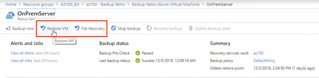

# Azure Administration: Implement and Manage Storage

## 1. Create and Configure Storage Accounts


### Azure Storage overview

**Storage Types** 

* Azure Files
* Azure Blob 
* Azure Queue
* Azure Table 
* zure Data Lake Storage Gen2


**Azure Blob**

* Unstructured data 
* Support streaming scenarios 
* Access from anywhere 


**Azure Blob for VHDs**

* Used for virtual machine disks 
* Persistent storage 
* 4 TB 


**Azure Files**

* Shared folder
* Net use 
* Access files via SMB 


**Azure Queue Storage**

* Stores messages 
* Can be accessed via HTTP or HTTPS 
* Up to a million messages 
* Processing work asynchronously, such as images to resize 
* **Passing messages from a web role to a worker role** 


**Azure Tables**

* Structured NoSQL 
* Key attribute store 
* Schemaless 
* Premium offering for table storage is Azure Cosmos DB 


**Azure Data Lake Storage Gent**

* Stores and accesses both objects and file system data at the same time
* Analytic workloads 

### Create and configure a storage account


### Create and configure a storage account using PowerShell

```
#Create a Resource Group and Storage Account 

#Variables 
$location = "canadacentral" 
$resourceGroup = "AZ100_SA_PS" 
$storageAccountName "sbaz100sa" 
$skuName = "Standard_LRS" 


#Create the Resource Group 
New-AzureRmResourceGroup -Name $resourceGroup -Location $location 

# Create the storage account. 
$storageAccount New-AzureRmStorageAccount -ResourceGroupName $resourceGroup -Name $storageAccountName -Location -SkuName $skuname

#View Storage Account 
Get-AzureRmStorageAccount -ResourceGroupName $resourceGroup 
```


### Manage storage access keys

**Best Practices**

* Store the access keys in a secure location **Azure Key Vault**  
* Do not share the keys 
* **Use a shared access signature** 
* Regenerate the access keys if the account has been compromised 


**Microsoft Steps for Key Regeneration**

1. Update apps to use the second key. 
2. Regenerate the first key. 
3. Update apps to use the first key. 
4. Regenerate the second key. 


### Manage shared access signature

**Overview**

* You do not have to share the account keys 
* Set time limits 
* Specify allowed permissions 
* Restrict the protocol 
* Restrict the IP address range 


**Types of Shared Access Signatures** 

* **Service SAS** 
	* Allows access to only one storage service 
	* Only Files, Blob, Queue, or Table 
* **Account SAS** 
	* Allows access to any of the storage services 
	* Files, Blob, Queue, and Table 


### Monitor activity logs using Log Analytics

**Overview** 

* Activities or operations that have occurred on resources in the subscription (agentless) 
* Who did what when
* Also known as **audit logs or operational logs** 
* Logs are kept for 90 days
* Logs kept for more than 90 days will be charged 


**Data Sources** 

* Virtual machines 
* Storage account 
* Azure Activity Logs 
* Scope Configurations (preview) 
* Azure resources 
* System Center Operations Manager 

**Create Log analytics**


**Add storage account log**


> ETW Log: Event Tracing Logs

**Add resource log**


### Implement Azure Storage replication

**Types of Replication** 

* Locally redundant storage (LRS) 
* Zone-redundant storage (ZRS) 
* Geo-redundant storage (GRS) 
* Read-access geo-redundant storage (RA-GRS) 


**Locally Redundant Storage (LRS)**

* Copy of the data in the same data center 
* Three copies 
* Supported on GPv1 , GPv2, and Blob storage accounts 
* Protects against
	* Node failure 

**Geo-Redundant Storage (GRS)** 

* Data is replicated to a data center in a secondary region 
* Six copies of the data 
* Supported on GPv1 , GPv2, and Blob storage accounts 
* Protects against 
	* Node failure 
	* Data center failure 
	* Region-wide outage 

**Read-Access Geo-Redundant Storage (RA-GRS)** 

* Data is replicated to a data center in a secondary region 
* Supported on GPv1 , GPv2, and Blob storage accounts 
* Protects against 
	* Node failure 
	* Data center failure 
	* Region-wide outage 
* Data can be read from the replica without Microsoft initiating a failover 
* Secondary endpoint 
	* `youraccount-secondary.blob.core.windows.net` 
* Access keys are the same for both endpoints 

**Zone-Redundant Storage (ZRS)** 

* Data is replicated synchronously across three storage clusters in the same region 
* Each cluster is isolated in an availability zone 
* Only support on standard and GPv2 storage accounts 
* Default replication when creating availability sets 
* Protects against 
	* Node unavailability 
	* Data center failure 

### Quiz

1.Which replication strategy protects against node unavailability and datacenter failure?

**Zone-redundant Storage (ZRS)**

2.Alberto is attempting to connect a virtual machine to a workspace to analyze logs, but he is unable to connect it. Why is this happening?

**The virtual machine is shutdown.**

3.What are some of the benefits of using a Shared Access Signature instead of a Storage Account Key?

* set time limits for access
* specify HTTP or HTTPs
* specify allowed permissions

4.What is the correct order to regenerate storage account keys?

**1. Update apps to use the 2nd key 2. Regenerate first key 3. Update apps to use the first key 4. Regenerate 2nd key**


5.What is the correct cmdlet to create a new storage account?

```
New-AzureRmStorageAccount -ResourceGroupName $resourceGroup -Name $storageAccountName -Location $location -SkuName $skuName
```

6.Premium storage performance disks are only supported in which storage type?


**Azure virtual machines**

7.What type of Azure Storage is used for unstructured data, such as streaming data?

**Azure Blobs**


## 2. Import and Export Data to Azure


### Import and export data to and from Azure Storage

**Azure Data Box**

* Physical storage device 
* Offline data transfer 
	* Data Box Disk — up to 40 TB 
	* Data Box — 40-500 TB 
	* Data Box Heavy — larger than 500 TB 
* Online data transfer 
	* Data Box Gateway, Data Box Edge 

**Azure Import**: Prepare the Disks 

* Must enable **BitLocker** 
* Prepare disk using **`WAlmportExport.exe`** 
* Must create a journal file that contains 
	* Drive serial number, encryption key, and storage account information 
* Microsoft recommends using the drive SN as the journal name 

**WAImporatExport Tool**

* Import data to blobs use
	* WAImportExport Version 1 

* Import data to files 
	* use WAImportExport Version 2 

* Same general steps but the tool options and configuration are slightly different 


**Azure Export Overview**

* Ship empty drives, configure blobs to export, and ship drives back 
* Retrieve the **BitLocker keys** 
* Transfer the data from the disks 
* **Export data from blobs only** 

### Create an import job from Azure

* Step 1 on Terminal: **Generate journal file**

```
C:\Users\sharon\Desktop\WAImportExportvl> manage-bde -protectors -get e: 
BitLocker Drive Encryption: Configuration Tool version 10.0.14393 
Copyright (C) 2013 Microsoft Corporation. All rights reserved. 

Volume E: [data] 
All Key Protectors 

	Password: 
		ID: {7882094D-7FEA-430C-93B3-1F9ADB8ADA17} 
	
	Numerical Password: 
		ID: {45DA525A-382C-457C-9Al2-CBF2042EC7C7} 
		Password: 
			068138-084161-634887-146102-542399-718641-278212-157179 
			
WAImportExporExport.exe PreImport ...	
```

* Step 2: Create import **job on portal**


* Step 3: Configure data and destination 

	* Data Resource: **(upload journal file)**
	* Import Destination: Storage account


### Create an export job into Azure

* Blobs to export
	* Export all
	* Selected containers and blobs
	* Export from **blob list file**(XML format)


### Azure Blob Storage overview

**Blobs**

* Unstructured data 
	* Files for distributed access 
	* Log files 
	* Backups 
	* Archives 
	* Data for analysis 
* Access objects via **HTTP or HTTPS** 

**Blob Storage**


> Think containers like folders 

```
https://youraccount.blob.core.windows.net/movies1/movie1.avi
```

**Container Access**

* Allow access without sharing access keys or shared access signature 
* Stored access policy for fine-grained access 
* Public access level 
	* Private 
	* Blob 
	* Container 


**Private： No Anonymous Access**

* Only the account owner can see the data 
* Default setting 


**Blob： Anonymous Read Access for Blobs Only**

* Does not have access to the container 
* **Allows public read access for the blobs only** 


**Container: Anonymous Read Access for Containers and Blobs**


* Access to read and list access to the container 

**Stored Access Policy**

* Fine-grained access control at the container and blob level 
* Change start and expiry for access 
* Modify the permissions for access 
* Easier to revoke access to the object 

**Immutable Blob Storage**

* Write once, read many (WORM) 
* Data cannot be deleted or modified
* New containers and data can still be added 
* Scenario 
	* Legal hold 
	* Secure document retention 
	* Compliance 

* Time-based retention 
	* Active from when the container was created 
	* For example, a three-year retention is applied; containers created a year ago would have an effective retention of two years from now 
* Legal hold 
	* Data is protected until the hold is cleared 


### Configure and use Azure Blob Storage using the portal

* Create container


* Add Stored Access Policy


* Add Immutable Blob Storage


### Configure and use Azure Blob Storage using PowerShell

```
#variables 
$location = "canadacentral" 
$resourceGroup = "AZ100_SA_PS" 
$storageAccountName = "sbaz100sa" 
$containerName = "az100" 

# Retrieve the context. 
$Key = (Get-AzureRmstorageAccountKey -ResourceGroupName $resourcegroup -StorageAccountName SstorageAccountName) Value 0
$ctx = New-AzureStorageContext -StorageAccountName $storageAccountName -StorageAccountKey $Key 

#Create a container 
New-AzureStorageContainer -Name $containerName -Context $ctx -Permission blob 


#Upload a file 
Set-AzureStorageBlobContent -File "D:\02\Image001.bmp" -Contlainer ScodtainerName -Blob "Image001.bmp" -Context $ctx


#Download a file 
Get-AzureStorageBlobContent -Blob "Image001.bmp" -Container ScontainerName -Destination "D:\02\Downloads\"  -Context $ctx

#List the files in a container 
Get-AzureStoraqeBlob -Container $ContainerName -Context $ctx | select Name 

#Delete Container 
Remove-AzureStorageContainer -Name ScontainerName -context $ctx 
```


### Azure Content Delivery Network (CDN) overview

**Overview**


**Scenarios** 

* Static content 
	* Websites 
	* Resources 
* Streaming video 

**Time to Live (TTL)**

* The cached file lives on the server until the TTL expires 
*  The TTL is in the 1-1TTP header 
*  If a TTL has not been specified, **the default TTL is seven days** 

**CDN Products**

* Premium Verizon 
* Standard Verizon 
* Standard Akamal 
* Standard Microsoft 
* **Delivery of large files and media via general web delivery is supported on Microsoft and Verizon only** 

**Registration Propagation Times**

* Microsoft 10 minutes 
* Standard from Akamai 1 minute 
* Standard and Premium from Verizon 90 minutes 


**CDN POP Configuration**

* Microsoft recommends **creating POP locations based on features, not location** 
* Not all regions support all CDN products 


**Configure an Azure CDN**


### Quiz

1.Microsoft recommends choosing the CDN product based on what?

features

2.What is the default length a file will stay on the edge server if the TTL is not specified in the HTTP header?

7 day

3.What is the cmdlet to upload a file to Azure Storage?

```
Set-AzureStorageBlobContent -File "D:\02\Image001.bmp" -Container $containerName -Blob "Image001.bmp" -Context $ctx
```

4.Adelita is unable to delete a blob container. Why is this?

**Adelita has locked a time-based retention policy to the container.**

5.John wants to allow access to the blobs in a container but not the container. Which type of Public access level should John select?

**Blob**

6.To determine how many drives are required for an export, which option must be selected?

**Export from blob list file**

7.What drive data type is required to execute WAImport.exe?


**Numerical BitLocker Password**

8.Ankur has 250 TB of data that they wants to ship to Azure using the new Azure Data Box service. Which Azure Data Box product will be required?

Data Box

## 3. Configure Azure Files

### Create an Azure file share using the portal

**Overview** 

* Company share hosted in the cloud 
* File share via SMB 3.0 
* Mount on local systems 

> Mount the file share to our systems that are actually on premises or our virtual machines that are in Azure 

**File Storage**


`https://yourstorageaccount.file.core.windows.net/Files `


Example: Net use

```
C:\Users\sharon>net use Z: \\az100fs.file.core.windows.net\companyfiles /u:AZURE\az100fs TUWakeTruuUnjv+Stw0QcBiYojwd3aMSNXM6vFLOapQtbps4bfHFRIF7i3UfvQjEGIY1pM8q152XSCkjsBMgQ== 

The command completed successfully. 
```


### Create an Azure file share using PowerShell

```
#Variables 
$location "canadacentral" 
$resourceGroup = "Az100_Fst" 
$storageAccountName = "az100fs" 
$FileSharename = "hrfiles" 
$Path = "recruitment" 
$Sharename = "hrfiles" 

#Retrieve the context 
$Key = (Get-AzureRMStorageAccountKey -ResourceGroupName $resourcegroup -StorageAccountName $storageAccountName) 
$ctx = New-AzureStorageContext -StorageAccountName $storageAccountName -StorageAccountKey $Key

#Create a file share 
New-AzureStorageShare -Name SFileSharename -Context $ctx

#View file shares 
Get-AzureStorageShare -Context $ctx
 
#Create a new directory 
New-AzureStorageDirectory -ShareName $Filesharename -Path -Context $ctx

#Upload a file to the Azure file Share 
Set-AzureStorageFileContent -ShareName $ShareName -Source "C:\users\sharon Bennett\Desktop\01 Implement Azure Storage\03\doc 3.docx" -Path $path -Context $ctx

# View files
New-AzureStorageDirectory -ShareName $sharename -path -Context $ctx | Get-AzureStorageFile

# Download a file to the local system 
Get-AzureStorageFileContent -ShareName $sharename -Path "recruitment\doc 3.docx" -Destination "D:\03\doc3.docx" -Context $ctx

#Delete the file share 
Remove-AzureStorageShare -Name $Filesharename -Context $ctx 

#View file shares 
Get-AzureStorageShare -Context $ctx 
```

### Azure File Sync overview


**Components**

* Storage Sync Service 
* Sync group 
* Registered server 
* Azure File Sync agent 


**Sync Group** 

* Cloud endpoint: 
	* Points to the storage account and file share Detection job is initiated every 24 hours 
* Server endpoint 
	* Points to the registered server and path 
	* Configure cloud tiering 
	* NAS storage is not supported 


**Registered Server** 

* The server that contains the share to be synced
*  Must have the agent installed 
*  Each server can only be registered to one Storage Sync Service 
*  Windows Server 2012 R2 and later 

**Cloud Tiering** 

* Frequently accessed (hot) files are cached locally 
* **Free space is the amount of space reserved on the local system for cached files** 
* Does not support volumes with data deduplication 

**Backup**

* Microsoft recommends backing up the cloud share, instead of the `on-premises` share 
* **<span style="color:red">If backing up the on-premises server, cloud tiering should be disabled</span>**
* Bare metal backups are not supported 

**Encryption** 

* Azure File Sync supports 
	* BitLocker encryption 
	* Azure Information Protection (AIP) 
	* Azure Rights Management (RMS) services 
	* Active Directory RMS 
* Azure File Sync does not support 
	* NITS Encrypted File System 


### Create an Azure File Sync service and sync group

* Create sync group


* Add server endpoint


> Basically what Cloud Tiring allows us to do is to cache files on local server reducing the latency for our users

* Check registered Sync Server


### Troubleshoot Azure File Sync

**What Not to Do**

* Do not remove server endpoint 
*  Could result in the loss of data 


**General Troubleshooting**

* Review operational and diagnostic logs 
* Verify the Azure File Sync service is running on the server 
* Verify the Azure File Sync filter drivers are running 
	* `StorageSync.sys`, `StorageSyncGuard.sys `
* Run **AFSDiag tool and review the output** 

**Registration Error**

* Error `'The term find-AzureRMResource' ` is not recognized as the name during registration 
	* `Cmdlet` was changed in `AzureRM version 6` 
	* Install module `AzureRM 5.7.0` 

**Agent Installation Failures**

*  Review the `installer.log` by running `StorageSyncAgent.msi /l*v Installer.log` 
*  Microsoft Update is enabled and the Windows Update service is not running the agent will fail during installation 

**Agent Installation Failures** 

* Agent installation fails on AD DC 
	* Move PDC role to a domain controller running 
	* Server 2012 R2, if the failure occurs on Server 2008 R2 or below

*  "Storage Sync Agent Wizard" error when installing the agent 
	*  Use **`version 2.0.11+`** of the agent, instead of version 1.x 


**Agent Installation Failures** 

* Server is not listed under registered servers 
	* Reset the Storage Sync Server 

**Sync Group Issues**

* "The soecified Azure FileShare is already in use by a different CloudEndpoint" 
	* Azure file share is already in use 

* Cloud endpoint creation fails with "Authorization Failed"
	*  User account does not have the correct permissions 

```
* Read: Get role definition 
* Write: Create or update custom role definition 

* Read: Get role assignment 
* Write: Create role assignment 
```

**Server Issues**

* `"MgmtServerJobFailed" (Error code: -2134375898) `
	* Cloud tiering is enabled on a server endpoint path on the system volume - not supported on the system volume 
	* Disable the cloud tiering 

* `"MgmtServerJobExpired"` 
	* Server is offline or unable to connect to it 

**Sync Issues** 

* Sync fails on the server 
	* Verify the endpoints exist in Azure 
	* Review operational and diagnostic event logs

* `"Ox80c8300f` - the replica is not ready to perform the required operation" 
	* May see this error while the data is initially syncing 
	* Azure file share will sync every 24 hours 
	
* `": Ox80083060 - error -2134364064` The storage account name used could not be resolved" 
	* Verify you can resolve the storage DNS name 
	* Verify Hybrid File Sync Service has been assigned to the Reader and Data Access role 
* 	"This PC doesn't have enough free space" 
	* Less than 1 GB free on the volume
	*  Increase the size of the volume 

**Cloud Storage Failures**

* Inaccessible Azure file share 
	* Deleted the Azure file share that is still associated with the cloud endpoint 
* Inaccessible storage account 
	* Deleted the storage account that is still associated with an Azure file share 

**Cloud Tiering Server Failures** 

* Azure File Sync file system filter (`StorageSync.sys`) is not loaded 
	* Reload the filter 
* Missing, corrupt, or broken reparse point 
	* Caused by modifying the tag or data 
* Network connectivity issues 
	* Verify the server has Internet connectivity 

### Quiz

1.What are the two Azure File Sync filter drivers that need to be installed on the sync server?

`StorageSync.sys` and `StorageSyncGuard.sys`

2.What would need to be enabled to cache files on the Sync Server?

Cloud Tiering

3.Santiago had created a Storage Sync service and is attempting to add an Azure file share to service but the share is not in the list of available file shares. Why is the file share missing?

**The file share and Storage Sync service are in different regions.**

4.What is the cmdlet to create a File share?

**`New-AzureStorageShare -Name $FileshareName -Context $ctx`**

5.Natalia is attempting to connect to a file share in Azure from the local on-premises system but is unable to successfully connect. What could be the issue?

**Outbound TCP port 445 is not open.**

## 4. Implement Azure Backup

### Azure virtual machine backup

**Overview**

* Back up once per day 
* 9999 recovery points 
* Agent is not required (virtual machine extension) 
* Application-aware snapshots (VSS) 
* Windows and Linux virtual machines 
* Incremental backups 

**Components**

* Recovery Services vault 
	* Geo-replication by default 
	* Backup of multiple virtual machines at once 
	* Must be in the same location as the virtual machines 
	
> Otherwise you can back up a virtual machine when you provision it or after its been provisioned 

	
* Backup policy 
	* Daily or weekly frequency 
	* Retention points 

> Those been weekly, monthly and yearly

**Premium Storage and VM Backups** 

* Temporary staging location is created called `"AzureBackup-"` in the `Premium Storage account` 

* Staging location is the same size as the snapshot 
	* Be sure there is enough room in the Premium Storage account for the temporary location 
	* Staging location is deleted after the backup has completed 


### Create and configure a Recovery Services Vault

**Backup configuration**

`Recovery Services Vault => Backup Infrastructure(Manage) => Backup Configuration(General) => Locally-redundant(Backup configuration)`


**Backup Policy**


**Add Custom Policy: Type**

* AZ VM
* Azure File Share
* SQL Server in Azure VM


### Create and configure a Recovery Services Vault using PowerShell

```
#variables
$RGName = "Az100_Bu_PS"
$RSVNaMe = "Azl00Rsv" 
$Location = "canadacentral" 

# Create a Recovery Services vault 
New-AzureRmRecoveryServicesVault -Name $RSVName -ResourceGroupName $RGName -Location $Location 

#Set replication type 
$vault = Get-AzureRmRecoveryServicesVault -Name $RSVName 
Set-AzureRmRecoveryServicesBackupProperties -Vault $vault -BackupStorageRedundancy LocallyRedundant 

#view 
Get-AzureRmRecoveryServicesVault 

#Create a New Policy 
$schPolicy Get-AzureRmRecoveryservicesBackupschedulePolicyobject -workloadType "AzureVM" 
$retPolicy Get-AzureRmRecoveryservicesBackupRetentionPolicyobject -workloadType "AzureVM" 
New-AzureRmRecoveryservicesBackupProtectionPolicy -Name "Daily" -workloadType "AzureVM" -RetentionPolicy -SchedulePolicy $schpolicy

#Delete the Recovery Services vault 
Remove-AzureRmRecoveryServicesVault -Vault $vault
```


### Create an Azure virtual machine backup

`Home => VM => OnPremServer => Enable backup`

* Backup frequency
* Retention Range
* Retention of daily backup point


```
Recovery Services Vault => Backup Goal(what do you want to backup?) 
=> Backup policy => Items to backup => 
```


### Create an Azure virtual machine backup

**Backup reports**

* Add Diagnostics Settings
* Power BI connect to Azure Backup Content


### Restore an Azure virtual machine

**Restore Azure Virtual Machine Options** 

* Create a new virtual machine 
* Restore disks only 
* Replace disks 

**Restore to a New Virtual Machine**

* Restored virtual machine will not overwrite the existing virtual machine 
* Additional customizations will require PowerShell 

**Restore Disks**

* Use when special network customizations are required 
* New disks will be created in the selected storage account 
* Additional customizations will require PowerShell 

**Replace Virtual Machine Disks** 

* Replaces the disks in the existing virtual machine 
* The virtual machine must still exist 



* Restore VM
* File restore

`restore configuration`


### Perform a restore operation files and folders

> Perform a restore operations files and folders

1. Select recovery point
2. download script to browse and recove files
3. Unmount the disk after recovery


### Quiz

1.Can a mounted disk that has been protected with BitLocker can still have be accessed to recover files from?

**Yes, but only if the BitLocker key is provided.**

2.Nisha is attempting to replace virtual machine disks but is unable to do so. Why can Nisha not restore the disks?

The virtual machine that the disks were backed up from has been deleted.

3.Diya want to retain the AzureBackupReport logs forever. How does Diya configure this option?

Set the retention time to 0.

4.An Azure virtual machine backup can be enabled from where in the portal?

* from the virtual machine blade
* when provisioning/creating the virtual machine
* from the recovery services vault

5.Tomas is creating a Recovery Services Vault using PowerShell. What command should they use to create the vault?

`New-AzureRMRecoveryServicesVault -Name $RSName -ResourceGroupName -$RGName -Location $Location`

6.What is the default storage replication type for a Azure Recovery Vault?

`Geo-redundant (GRS)`

7.Gislaine is attempting to configure a virtual machine backup, but virtual machine is not listed in the Recovery Services Vault as option. What does Gislaine need to do to backup the Azure virtual machine?

Backup the virtual machine to a Recovery Services Vault in the same location as the virtual machine.


