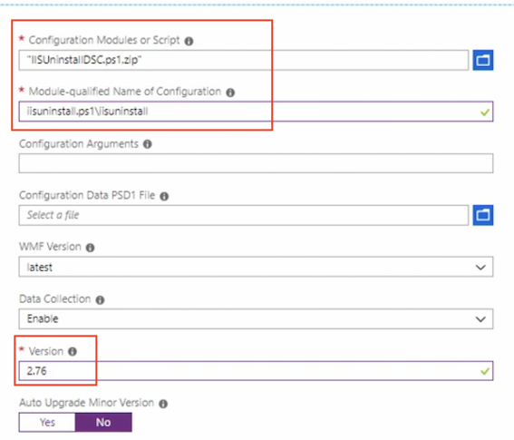

# Deploy and Manage Virtual Machines

## 1. Create and Configure a VM for Windows and Linux


### Availability set overview

**Outage Types** 

* **Planned** 
	* Patching 
	* Hardware 
	* Maintenance 
* **Unplanned** 
	* Local network failure 
	* Hard disk 

> When a failure is detected, your VMs will be automatically moved to healthy host, but that process requires a reboot

**Availability Sets** 

* VMs are spread across **fault and update domains** 
* Required for 99.95% SLA from Microsoft 
	* Excluding Premium Storage 
* **Virtual machines must be created within the availability set** 
	* **Cannot add a virtual machine after it has been provisioned**

**Planning** 

* Flow many tiers? 
	* Group like services together 
	* Front-end availability set 
	* Back-end availability set 

* Flow many virtual machines per set? **You need at least two**. 

**Fault Domain**

* **Servers that share networking and power resources** 
* Availability sets are spread across fault domains 
* Three fault domains when using unmanaged disks 
* **Two or three fault domains when using managed disks**, depending on region 


**Update Domain** 

* **Default is 5** update domains up to 20 
* A virtual machine is assigned sequentially to an update domain 
* **All the virtual machines in an update domain will be rebooted together** 
* Only one update domain is updated and restarted at a time 


**Managed Disks** 

* Microsoft **recommends using managed disks** 
* Provides better isolation when combined with availability sets 
* Disks are placed in different storage fault domains 

**Unmanaged Disks**

* **Keep virtual machine OS and data disks in the same storage account**
* Create a separate storage account for each virtual machine in an availability set 

**putting it together**


### Configure high availability with an availability set

An AS must be created before a vm can be added to it

**Create availability Set**


**Create VM with AS(Demo AS)**


**Create with powershell**

```
#Create an AS 

#Variables 
$ResourceGroup = 'ASPS' 
$Location = 'Canada Central 
$ASName = 'FE1'
 
#Create a Resorce Group 
New-AzureRmResourceGroup ` 
	-Name $ResourceGroup  `
	-Location $Location  `

#Create an Availablity Set 
New-AzureRmAvailabilitySet ` 
	-ResourceGroupName $ResourceGroup `
	-Location $Location `
	-Name $ASName ` 
	-Sku aligned `
	-PlatformFaultDomainCount 2 `
	-PlatformupdateDomainCount 2 `
```


### Virtual machine networking overview

**Overview**

* Azure virtual machines use virtual networks to communicate 
	* Virtual machines 
	* Azure SQL databases 
	* Other Azure services 

**Bits and Pieces**

* Network interface 
* Subnets 
* IP addresses 
* Network security groups 
* Network load balancer 


**Network Interfaces** 

* Each virtual machine must have **at least one NIC** 
* **Number of NICs is dependent** on the virtual machine 

**Subnets** 

* Network boundary
* Control traffic **flow to and from the resources in the subnet** 


**IP Addresses**

* Public Communication to and from the Internet 
* Private Communication with other virtual machines in the same network (virtual or on-premises) 

**IP Addresses** 

* Dynamic 
	* IP address is assigned after the virtual machine is started and **released when the virtual machine is stopped** 
	* IP address can change 

* Static 
	* **IP address is assigned immediately and does not change** 

**Network Security Groups** 

* Provides network isolation
* **Rules that deny or allow traffic** 
* Rule contains 
	* Source IP, source port 
	* Destination IP, destination port 

**Network Load Balancer** 

* Internal Load Balancer 
	* Balances traffic between virtual machines in a VNet 

* External Load Balancer 
	* Balances traffic from the Internet to virtual machines 


**Putting it together**


### Configure networking in the portal


* Create VM with networking
	* **NIC network security group**:
	* **Accelerated Networking**: Enables low latency and high throughput newwork interface


* Can also attach network interface


### Create a basic virtual network using PowerShell

```
#Create a VNet, Subnet and VM
 
# variables 
$ResourceGroup = 'VNetDemo' 
$Location = 'Canada central' 
$virtualNetwork = 'vnetdemo' 

#Create a Resource Group 
New-AzureRmResourceGroup -ResourceGroupName $ResourceGroup -Location $Location 

#Create a Vnet 
$virtualNetwork New-AzureRmVirtual Network `
	-ResourceGroupName $ResourceGroup `
	-Location $Location `
	-Name $virtualNetwork `
	-AddressPrefix 192.168.0.0/24 

#Add a subnet 
$subnetconfig = Add-AzureRmvirtualNetworksubnetconfig ` 
	-Name default `
	-AddressPrefix 192.168.0.0/26 `
	-VirtualNetwork $virtualNetwork `

#Assign the Subnet to the VNet 
$virtualNetwork | set-AzureRmvirtualNetwork 

#Create VM in the VNet 
New-AzureRmVm  `
	-ResourceGroupName $ResourceGroup `
	-Location $Location `
	-VirtualNetworkName 'vnetdpmo'` 
	-subnetName 'default'`
	-Name 'Vm1' 
```


### Configure storage

**Operating System Disk** 

* One OS disk per virtual machine 
* Registered as a SATA drive 
* Labelled C: 
* Max capacity 2048 GB 

**Temporary Disks** 

* Windows 
	* `Pagefile.sys` 
	* `Labelled D:` 
* Linux 
	* `/dev/sdb` 
	* mounted as /mnt 


**Temporary Disks** 

* Data could be lost during maintenance 
* Data may not be retained during a reboot 
* Do not store data on this disk 


**Data Disks**

* Disk is attached to the virtual machine 
* The number of disks allowed depends on the virtual machine selected 
* Registered as SCSI 
* Max capacity of 4095 GB 


**Disk Performance Tiers** 

* Premium SSD
* Standard SSD 
* Standard FIDD 
* Ultra SSD (preview) 

**Premium SSD** 

* High performance 
* Low-latency workloads 
* Meet 99.9% connectivity SLA 

**Standard SSD**

* Applications that do not require high IOPS
* **Recommended disk type** 


**Standard HDD** 

* Most cost-effective 
* Workloads that can support latency 
* Dev/Test 
* Non-critical workloads 

**Unmanaged Disks** 

* Manually manages the disks and storage account 
* Cannot exceed 20,000 IOPS across the storage account 
* If 20,000 IOPS is exceeded, the virtual machine is throttled 
* Enable TRIM 
	* Discards unused blocks 
	* Reduces spend 


**TRIM**

* To check the TRIM setting: 
	* fsutil behavior query DisableDeleteNotify 
	* 0 =TRIM is correctly enabled 
	* 1 =TRIM is not enabled 
* To enable TRIM 
	* **`fsutil behavior set DisableDeleteNotify 0`**


**Managed Disks** 

* Storage account and disks are managed 
* Never worry about scaling, as it's all managed 
* **Microsoft recommends using managed disks** 


**Create new disk**


**Managed disk are now enabled by default**

### Configure virtual machine size

**Type and Use**


> Keep in mind, that your virtual machine may reboot and that will be dependent on the sizing 

```
#change VM size 

#Variables 
$resourceGroup = "DSC" 
$vmName = "DSCVM" 

#List the VM size that are available
Get-AzureRmVMSize -ResourceGroupName $resourceGroup -VMName $vmName 

#change the size 
$vm = Get-AzureRmVM -ResourceGroupName $resourceGroup -VMName $vmName $vm.HardwareProfile.Vmsize = "standard_DS2_v2" 
Update-AzureRmvm -VM $vm -ResourceGroupName $resourceGroup 
```


### Deploy and configure scale sets

**Overview** 

* Load balanced 
* Scale up to 1000 virtual machine instances 
* Custom images scale up to 300 virtual machine instances 
* Virtual machines are spread across logic fault domains and update domains in a placement set 
* Placement set is similar to an availability set


**Create virtual machine scale set**


> An application gateway is used for web-based traffic, so it's HTTP, HTTPS, or WebSocket only
> 
> A load balancer will be used for stream-based traffic and any of protocols are supported 


* **Scale based on a metrics**
* **Scale rules**
* **Instance limit**: min, max, default


### Configure diagnostic settings

**Diagnostic Log Overview**

* Tenant logs 
	* Activity on resources outside an Azure subscription, such as Azure Active Directory 

* Resource logs 
	* Activity for resources within an Azure subscription 
	* **Agents are not required** 

**Workflow**


**Configure Diagnostic Log**

* Performance counters


* Configue logs


* Configue agent


### Configure and analyze metrics

**Overview**

* View performance and health of an Azure workload 
* Also known as performance counters 
* One-minute frequency (near real-time visibility)
* 93 days of metric history
* Access via portal, REST API, PowerShell, Azure CLI 

**Configure logic action**


### Quiz

1. How long is metric data kept for?

93 days

2.Jutta needs to collect Event Tracing for Windows (ETW) events. Where would this be enabled?

**Diagnostic settings - Logs**

3.You are deploying Azure Scale Sets and you need to allow web-based traffic to the instances. Which load-balancing option should you choose?

**Application Gateway**

4.Clair needs to choose a virtual machine for a relational database. Which virtual machine size is recommended?

memory optimized

5.To enable TRIM on an unmanaged disk, which command should you use?

**fsutil behavior set DisableDeleteNotify 0**

6.What Cmdlet will create a subnet?

**`Add-AzureRMVirtualNetworkSubnetConfig`**

7.Madan is receiving reports that an Azure virtual machine that was recently created is fully accessible from the Internet. What NIC setting did Madan apply that allowed this?

**None**

8.Which IP address type is assigned after the virtual machine has started?

dynamic IP address

9.What is the maximum number of Update Domains?

20

10.Abid created a virtual machine and attempted to assign it to an availability set but was unable to do so. Why was this unsuccessful?


**Abid did not assign the virtual machine during provisioning.**

## 2. Automate Deployment of Virtual Machines

### Azure templates overview


**Template Advantages** 

* Faster than manually provisioning virtual machines 
* Ensures the same build each time 
* Build a template from an existing virtual machine 
* Modify the template as required 
* Use an Azure QuickStart Template 

**Steps**


**Template Elements** 

* $schema 
* contentVersion 
* Parameters 
* Variables 
* Functions
* Resources 
* Outputs 

**`$schema`**

* Required 
* Points to where the JSON schema file is located 
* Describes the version of the template language 
* `"$schema ": " http://schema.management.azure.com/schemas/2015-01-01/deploymentTemplate.json#" `

**contentVersion**

* Required 
* Version of the template 
* Version control 
* `"contentVersion": " 1.0.0.1"` 

**Parameters** 

* Values to be used when a deployment is executed 
* Customizes the deployment 
* Examples: Location, name 

```
"Location": { 
	"type":"string", 
	"defaultValue": "Canada Central", 
	"allowedValues": 
		[ "Canada East", 
			"Canada Central", 
			"East US" 
		]
},
```

**Variables**

* Values that are used through the template 
* Examples: network security groups, vNetIDs 

```
"variables": { 
	"nsgId": "[resourceId(resourceGroupOsname, 'Microsoft.Network/networkSecurityGroups', parameters('networkSecurityGroupName'))]", 
	"vnetId": "[resourceId(resourceGroup().name,'Microsoft.Network/	virtualNetworks', parameters('virtualNetworkName'))]", 
	"subnetRef": "[concat(variables('vnetId'), '/subnets/', parameters('subnetName'))]" 1, 
```

**Functions** 

* Simplifies complex expressions 
* Reduces repetitiveness and complexity 


**Resources**

* Define the resources to be deployed or updated 
* Example: `Microsoft.Compute/virtualMachines` 

```
"name": "[parameters('virtualMachineName')]", 
			"type": "Microsoft.Compute/virtualMachines", 
			"apiVersion": "2018-06-01", 
			"location": "[parameters('location')]", 
			"dependsOn": [ 
				"managedDiskResources", 
				"[concatrMicrosoft.Network/networkInterfaces/', parametersrnetworkInterfaceNameTh", 
				"[concat('MicrosofteStorage/storageAccountsr, parameters('diagnosticsStorageAccountName'))]" 
		], 
```

**Output**

* Values after the template has been deployed

``` 
"outputs": { 
	"adminUsername": { 
		"type": "string", 
		"value": "[parameter('adminUsername')]"
```


### Create a template from a VM deployment


* **Download a template fot automation**


### Modify Azure Resource Manager (ARM) template

* Example: `networkSecurityGroupRules`


* Example: `dataDisksResources`


* Example: `adminPassword`


### Deploy from a template using PowerShell

```
....
[string] 
$templateFilePath = "c:\users\sharon Bennett\Desktop\Template\triplate.json" 
[string] 
$parametersFilePath = 
"C:\Users\Sharon Bennett\Desktop\Template\parameters.json' 

....

# Start the deployment 
write-Host "starting deployment..."; 
if(Test-Path $parametersFilePath) { 
	New-AzureRmResourceGroupDeployment -ResourceGroupName $resourceGroupName -TemplateFile StemplateFilePath 
	} 
	else 
	{ 
	New-AzureRmResourceGroupDeployment -ResourceGroupName $resourceGroupName -TemplateFile StemplateFilePath; 
} 
...
```


### Configure location using custom deployment

**Use template deployment**


**Custom deployment**


### Quiz

1. Daisy is attempting to deploy a modified template to Azure from a local machine. When running, the script errors are reported. What must Daisy do?

Add the paths for the template.json and parameters.json in the script.

2.What must you be aware of when adding a password to the parameters file?

It is displayed in clear text.

3.The element "contentVersion" is used for what purpose?

versioning control

4.How many elements are in an Azure template?

7

## 3. Manage Azure Virtual Machines

### Create a basic virtual machine using the portal

**Add Network Security Group**

* None: <span style="color:red">All the ports on the virtual machine will be exposed to the public internet</span> (Warning)


* Basic: will allow us to select from 4 options 


* Advanced: <span style="color:red">Configure network security group for other ports</span>


### Add data disks

**Provided System Disks** 

* Operating System Disk (C:) 
	* Registered as a SATA drive 
	* Max capacity 2048 GB 

* Temporary Disk (D:) 
	* Page or swap files 
	* Data may be lost 
	* Do not store data on this disk 

* Data Disk 
	* Store app data 
	* Registered as a SCSI drive 
	* Max capacity Max size 4095 GB
	* Number of disks depends on the virtual machine 

* None Host Caching 
	* Write-only and write-heavy disks 

* ReadOnly Host Caching 
	* Read-only and read-write disks 
	* When implemented on premium storage disks 
		* Low read latency 
		* High read IOPS 
* ReadWrite Host Caching 
	* Read-only and read-write disks 
	* Default for C: drive 
	* Use only if the application supports writing cached data to persistent disks 

> Adding a disk is two step process either through the portal our using powershell

* Created managed disk


### Add network interfaces


### Apply a PowerShell Desired State Configuration (DSC) using PowerShell


**Desired State Configuration (DSC)**

* Management Of: 
	* Server roles and features 
	* Registry settings 
	* Files and directories 
	* Packages 
	* Environment Variable
	* Prevent server drift

* Steps 

1. Create configuration file `.ps1`. 
2. Publish to create a zip file. 
3. Apply to the virtual machine. 


* Initial


**`.ps1`**

```
configuration IISInstall
{
 	Node 'localhost' 
{ 
	WindowsFeature IIS
	{ 
		Ensure 						= 'Present' 
		Name 							= 'web-Server' 
		includeAllSubFeature = $true 
		} 
  } 
} 
```

* Publish to create a zip file.

```
#Publish DSC 
$ResourceGroupName = 'DSC' 
$storageName = 'dscdemostorage' 
$location = 'Canada central' 
$vmName = 'DSCVM' 

#Publish the configuration script to storage 
Publish-AzureRmvmDscConfiguration `
	-configurationPath .\IISInstallDsc.ps1 `
	-ResourceGroupName $ResourceGroupName `
	-StorageAccountName $storageName `
	-Force 
	
#set the VM to run the DSC configuration 
Set-AzureRmVMDscExtension `
	-Version '2.76' `
	-ResourceGroupName $resourceGroupname  `
	-VMName $vmName  `
	-ArchiveStorageAccountName $storageName  `
	-ArchiveBlobName 'IISInstallDSC.ps1.zip' `
	-configurationName 'IIsinstall'  `
```


### Apply a PowerShell DSC using the portal

**`.ps1`**

```
configuration IISInstall
{
 	Node 'localhost' 
{ 
	WindowsFeature IIS
	{ 
		Ensure 						= 'Absent' 
		Name 							= 'web-Server' 
		includeAllSubFeature = $true 
		} 
  } 
} 
```

```
#Publish the configuration script locally 
Publish-AzureRmvmoscconfiguration  `
	-configurationPath .\IISUninstall.ps1  `
	-OutputArchivePath .\IISUninstallDSC.ps1.zip  `
	-Force 
```

**Add PowerShell DSC**





### Apply a custom script extension using the portal

```
get-windowsfeature web-server | install-windowsfeature 
mkdir 'c:\Distros' | 
```

* **Custom Scripts Extension**


### Apply a custom script extension using PowerShell


Run PowerShell Script that will apply that script to our vm

**`.ps1`**

```
get-windowsfeature web-server | uninstall-windowsfeature 
rmdir 'c:\Distros' | 
```

```
#Run a custom script
 
$RGName ='DSC' 
$VMName  ='DSCVM' 
$Location 'Canada central' 

#Apply Custom Script 
Set-AzureRmVMCustomScriptExtension `
 -ResourceGroupName $RGName ` 
 -VMName $VMName `
 -Location $Location ` 
 -FileUri 'https://dscdemostorage.blob.core.windows.nethvindows-powershell-dsc/uninstallwebserver.ps11' ` 
 -Run 'UnInstallWebServer.ps1' 
 -Name 'uninstallwebserver' 
```


### Move a virtual machine to a resource group


### Redeploy virtual machines

**Process**

* The virtual machine will shut down 
* Transferred to a new node 
* Started preserving the configuration options and resources 
* The temporary disk will be deleted 
* The dynamic IP will be updated 

```
Set-AzureRmVM -Redeploy -ResourceGroupName ManageVMNew -Name "demovm" 
```

### Quiz

1. Why should a virtual machine be redeployed?

	* unable to access an application on a Windows virtual machine
	* unable to RDP to a virtual machine
2. Resources that have been moved will be assigned new _____.

	* resource IDs

3. Fatima has attempted to apply a custom DSC extension to an Azure virtual machine but encounters an error every time. Fatima has tested the script and knows it works as expected. Why does the script fail?

	* A custom DSC extension is already applied to the virtual machine.
	
	> Multiple script extensions are not supported on a virtual machine.

4. What is the correct format for a Module-qualified Name of Configuration?

	* yourscript.ps1\configuration name

5. What is the default folder that is created when a script is published to Azure storage?

	* `windows-powershell-dsc`

6. Vikram is attempting to add a NIC to a virtual machine but he is unable to do so. What could be the reason for this?

	* The virtual machine does not support additional NICs.

7. Which caching type is the default for C: drive?

	* Read Write Host Caching

8. What service needs to be configured if the virtual machine is configured to use unmanaged disks?

	* Storage accounts


## 4. Manage Virtual Machine Backups


### Azure virtual machine backup

**Overview**

* Back up once per day 
* 9999 recovery points 
* **Agent is not required (virtual machine extension)** 
* Application-aware snapshots (VSS) 
* Windows and Linux virtual machines 
* Incremental backups 

> Otherwise, u can backup a virtual machine when you provision or after it's been provisioned 


**Components** 

* Recovery Services vault 
	* Geo-replication by default 
	* Backup of multiple virtual machines at once
	* Must be in the same location as the virtual machines 

* Backup policy 
	*	Daily or weekly frequency 
	*	Retention points 


**Premium Storage and VM Backups** 

* Temporary staging location is created called `"AzureBackup-"` in the Premium Storage account 
* Staging location is the same size as the snapshot 
	* Be sure there is enough room in the Premium Storage account for the temporary location 
	*** Staging location is deleted after the backup has completed** 


### Create and configure a Recovery Services vault

**Create Service Vault**


**Configure storage replication type**


> This is one of those hard and fast rules in Azure, once configured , you cannot change thereplication type


**Create and configure a Recovery Services vault using PowerShell**

```
#variables 
$RGName = "Az100_Bu_Ps" 
$RSVNare "AzlOORsv" 
$Location "canadacentral" 

# create a Recovery Services vault 
New-AzureRmRecoveryServicesVault -Name $RsvName -ResourceGroupName $RGName -Location $Location 

#Set replication type 
$vault = Get-AzureRmRecoveryServicesVault -Name $RSVName 
Set-AzureRmRecoveryServicesBackupProperties -vault $vault -BackupStorageRedundancy LocallyRedundant 

#View 
Get-AzureRmRecoveryservicesvault 

#Backup Policies 
#Set vault Context 

Set-AzureRMRecoveryServicesVaultContext -Vault 

#View Backup Policies 
Get-AzureRmRecoveryServicesBackupProtectionPolicy -WorkloadType 

#Create a New Policy 
$schPolicy Get-AzureRmRecoveryservicesBackupschedulePolicyobject -workloadType "AzureVM" 
$retPolicy Get-AzureRmRecoveryServicesBackupRetentionPolicyObiect -workloadType "AzureVM" 

New-AzureRmRecoveryServicesBackUpProtectionPolicy -Name "Daily"-WorkloadType 'AzureVM" -RetentionPolicy $retPolicy -SchedulePolicy $schploicy

# Delete the Recovery Services Vault 
Remove-AzureRmRecoveryServicesVault -Vault $vault 
```


### Create an Azure virtual machine backup


### Restore an Azure virtual machine

**Restore Azure Virtual Machine Options** 

* Create a new virtual machine 
* Restore disks only 
* Replace disks 


**Restore to a New Virtual Machine**

* Restored virtual machine will not overwrite the existing virtual machine 
* Additional customizations will require PowerShell 

**Restore Disks** 

* Use when special network customizations are required 
* New disks will be created in the selected storage account 
* Additional customizations will require PowerShell 

**Replace Virtual Machine Disks** 

* Replaces the disks in the existing virtual machine 
* The virtual machine must still exist 

**Restore VM**


**Replace existing: Replace Disks**


**Create New: Create VM / Restore Disks**


### Quiz

1. What must exist in order to replace virtual machine disks?

	* the virtual machine

2. Ray needs to set a backup on multiple virtual machines. What is the most time-efficient way to do this?

	*  Select the virtual machines from the Recovery Services Vault.

3. What cmdlet does Payton need to use to view the current Azure backup policies?

	* `Get-AzureRMRecoveryServicesBackupProtectionPolicy -WorkloadType AzureVM`

4. Asghar has realized that the Recovery Services Vault created for the virtual machine backups is set for GRS. This needs to be changed to LRS. How can Asghar accomplish this? 
  * Asghar can't change the replication type. Once the Recovery Services Vault has a backup, the replication mode can't be changed.

5. How many times a day can an Azure virtual machine be backed up?
	* once a day


  


