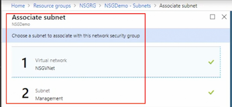

# Configure and Manage Virtual Networks

## 1. Implement and Manage Virtual Networking


### Azure Virtual Network overview

**Typical On-premise**


**Azure**


**Virtual Network Overview** 

* Isolation and segmentation from other virtual networks 
* Communication between the resources in the network 
* Allows for external communication 
* Filter and Route traffic 
* Connect virtual networks 


**Isolation & Segmentation** 

* Multiple VNets per region and subscription 
* Further isolate or segment using subnets 
* By default traffic is routed between all subnets in a 
	* **VNet Network Security Groups** 
	* **Network Virtual Appliances** 


**Virtual Network Subnet**

* Subnets must a part of the virtual network address space 
* Subnets can not overlap 
* Use a **`service endpoint` to restrict access to a resource, such as Azure storage** 


**External Communication**

* Internet 
	* Outbound access is allowed by default 
	* Inbound requires public IP 

* On-premises 


**Filter and Route Traffic**

* Network Routes 
* Network Security Groups 
* Network Virtual Appliances 

**Virutal Network Subnet**

* Same or different regions 
* Different subscriptions 
* Seamless communications 


**Virutal Network Subnet**

* Connect VNets in different region and subscriptions 
* **Requires a VNet Gateway** 
* Provides a secure tunnel 


### Create a virtual network using the portal


When you **enable an service endpoint**, the service or services to the virtual network, the service or services are secured to the VN


**Add subnet**


### Create a virtual network using PowerShell


```
#Create VNet and subnets 

#Parameters 
$RG = 'PSVTet' 
$Location = 'Canada Central' 

#Create a Resource Group 
New-AzResourceGroup -ResourceGroupName $RG -Location $Location 

#Create a Vnet 
$virtualNetwork New-AzVirtualNetwork` 
	-ResourceGroupName $RG 
	-Location $Location 
	-Name 'VNetPS' 
	-AddressPrefix 10.0.0.0/16 
	
#Add a Subnet 
$subnetconfig Add-AZVirtualNetworkSubnetConfig `
	-Name FrontEnd `
	-AddressPrefix 10.0.1.0/24  `
	-VirtualNetwork $virtualNetwork 

#Assign the subnet to the VNet 
$virtualNetwork | Set-AzVirtual Network 

#Add another subnet 
$subnetConfig Add-AzvirtualNetworksubnetconfig ` 
	-Name BackEnd ` 
	-AddressPrefix 10.0.2.0/24 `
	-virtualNetwork $virtualNetwork 

#Assign the subnet to the VNet 
$virtualNetwork |set-AzvirtualNetwork 

#Review the VNet 
Get-AZVirtualNetwork -ResourceGroupName $RG -Name 'VNetPS' 
```


### Create a network interface

* Create Network Interface


* Configure IP configuration


* Attach Network Interface to VM


### Azure IP addressing overview

**Public IP** 

* Connect to the Internet 
* Connect to other Azure public-facing s
	* ervices SQL Databases 


**Public IP SKUs**

* Basic 
* Standard 

**Public IP Basic SKU** 

* Static or dynamic allocation 
* Open by default 
* <span style="color:red">Restrict traffic using NSGs</span>
* Do not support Availability Zones 

**Public IP Standard SKU** 

* Static allocation 
* Closed to inbound traffic 
* **<span style="color:red">Use NSGs to whitelist traffic</span>** 
* Zone redundant by default 


**Public IP Assignments** 

* Virtual machines 
	* **Assigned to the primary NIC** 
* VPN Gateways 
	* Dynamic IP only 
* Application Gateways 
* Internet-facing load balancers 

**Public IP - Dynamic** 

* Default 
* Not assigned when the virtual machine is created 
* **Assigned during startup of the virtual machine** 
* **Released when the virtual machine is restarted, stopped or deallocated** 

**Public IP - Static** 

* The address is assigned when the virtual machine is provisioned 
* Never released 
	* Delete the resource 
	* Change to dynamic 
* IP is assigned from the Azure resource pool 


**Public Static IP Uses** 

* IP addresses linked to **SSL certificates** 
* Services that require a static IP 

**Best Practice**

* Microsoft recommends **not** applying the static IP to the OS of the virtual machine 
* Exception 
	* Assigning multiple IPs to the virtual machine 
	* Use the same IP address that has been assigned to the network interface 

**Private IPs** 

* Assigned to virtual machines within the VNet 
* Connect to an on-premise environment 
	* VPN Gateway 
	* ExpressRoute 
* Not accessible to the Internet 

**Private IP - Dynamic** 

* Default 
* Not assigned when the virtual machine is created
* Assigned during startup of the virtual machine 
* Released when the virtual machine is stopped 
* May change from reboot to reboot 


**Private IP - Static** 

* Assigned when the virtual machine is provisioned 
* Never released 
* Do not configure the private IP within the server 

> If you do this, this could result in failure and dropped connections

**Private Static IP Uses**

* Domain controllers 
* DNS servers 
* Other resources that need require a static IP for connectivity 


**DHCP**

* Azure controlled 
* Leases are for the lifetime of the virtual machine 

> But keeping in mind that we do no change the private IP address in the operating system 


### Configure virtual machine IP addresses using the portal

> When you create VM by default, a public, dynamic IP address is assigned automatically


**Configure IP configuration**


### Create a private IP address using PowerShell

```
#Create a Private IP 

#Variables 
$RG=  "PrivateIP" 
$Location = "Canada Central" 

New-AzResourceGroup -Name $RG -Location $Location 

# Create a subnet configuration 
$subnetconfig = New-AzvirtualNetworksubnetconfig 
	-Name Frontend 
	-AddressPrefix 10.4.0.0/24 

# Create a virtual network 
$VNet = New-AzVirtualNetwork `
	-ResourceGroupName $RG `
	-Location $Location `
	-Name VNET ` 
	-AddressPrefix 10.4.0.0/16 `
	-subnet $subnetConfig 
	
# Get the subnet object for use in a later step. 
$subnet Get-AzvirtualNetworksubnetconfig -Name $SubnetConfig Name -VirtualNetwork $VNet

$ipconfigName1 = "IPConfig1" 
$ipconfig1 = New-AzNetworkinterfaceipconfig `
	-Name $IpconfigName1 `
	-Subnet $subnet  `
	-PrivatelpAddress 10.4.0.4 `
	-Primary 

$NIC = New-AzNetworkInterface  `
		-Name NIC `
		-ResourceGroupName $RG  `
		-Location $Location `
		-Ipconfiguration $Ipconfig1

#view Network Interface 
Get-AZNetworkinterface -ResourceGroupName $RG 

#You would then assign this NIC to the vm 

```


### Create a public IP address

**Standrad Public IP**


A standard can only be assoicated with virtual machine or load balancer front end, only IPv4 is available 

**Basic SKU Public IP**

At this time, IPv6 can only be associated to internet-facing load balancer, a dynamic address is assigned after the resource has been started.

A reboot or stopped, but not deallocated, **virtual machine will retain the dynamic IP**, wherear a static IP is assigned when the public IP is created and does not changed. 

A static IP will not be released until the public IP address is deleted 

**Associate public IP address to `load balancer` and `Network interface`**


### Azure route table overview

**Workflow**


**Next Hop Options** 

* Virtual appliance 
* Virtual Network Gateway 
* Virtual Network 
* Internet 
* None (traffic is dropped) 

**Network Security Groups & Route Tables** 

* Separate entities 
* Both are applied to a Subnet 
* NSG 
	* **Security rules to allow or deny traffic** 
* Route Table 
	* **Direct traffic** 

**Considerations**

* Routes can be overridden or 
* Routes can be combined with the default Azure routes 
* Routes with the longest prefix are used first 
	* `10.0.0.0/24` will be used over `10.0.0.0/16` if the next hop address is in n both prefixes 

**Sequence for Routing** 

* User-defined route 
* BGP route 
* System route 


### Create and configure a network route using the portal


**Associate route table to subnet**


**You can associate route to more than on subnet**


### Create and configure a network route using PowerShell

```
#Create a VNet and routes 

# Avariables 
$RG = "RoutesRG" 
$Location = "Canada East" 

#Create the Resource Group 
New-AzResourceGroup -ResourceGroupName $RG -Location 

#Create the Route Table 
$routeTablePublic = New-AzRouteTable 
	-Name 'AZRouteTable' `
	-ResourceGroupName $RG `
	-location $Location `

#Create the Route 
Get-AzRouteTable `
	-ResourceGroupName $RG` 
	-Name "AZRouteTable" `
	| Add-AzRouteConfig 
	-Name "ToPrivateSubnet" ` 
	-AddressPrefix 10.0.10.0/24 ` 
	-NextHopType "VirtualAppliance" `
	-NextHoplpAddress 10.0.20.4 `
   | Set-AzRouteTable 

#Create the VNet 
$virtualNetwork = New-AzVirtual Network` 
	-ResourceGroupName $RG 
	-Location $Location `
	-Name AZVirtualNetwork ` 
	-AddressPrefix 10.0.0.0/16 

#Create subnets 
$subnetConfigPublic = Add-AzVirtualNetworkSubnetConfig
 -Name Public `
 -AddressPrefix 10.0.0.0/24 ` 
 -Virtua1Network $virtualNetwork `
 
$subnetConfigPrivate = Add-AzVirtualNetworkSubnetConfig 
	-Name PrivateSubnet 
	-AddressPrefix 10.0.10.0/24 ` 
	-VirtualNetwork $virtualNetwork 

$subnetConfigDmz = Add-AzVirtualNetworkSubnetConfig 
	-Name DMZSubnet `
	-AddressPrefix 10.0.20.0/24` 
	-VirtualNetwork $virtualNetwork 


#Sets the subnet 
$virtualNetwork | Set-AzvirtualNetwork 

# Associates with the subnet 
Set-AzVirtualNetworkSubnetConfig `
	-VirtualNetwork $virtualNetwork `
	-Name 'Public' `
	-AddressPrefix 10.0.0 0/24 `
	-RouteTable SrouteTablePublic | `
Set-AzVirtual Network 

Get-AZRouteTable -ResourceGroupName $RG -Name AZRouteTable
```

### Quiz

1. By default, where is all traffic within a VNet routed?
	* between all the subnets
2. What does standard DDoS protection include?
	* adaptive tuning
	* telemetry
	* notifications
3. What is the cmdlet to create a subnet?
	* `Add-AZVirtualnetworkSubnetConfig`
4. When must you add public IP addresses to a network interface?
	* after the network interface has been provisioned
5. A dynamic public IP is assigned at what point during the provisioning of a virtual machine?
	* during the start up of a virtual machine
6. When creating a new virtual machine, what type is the default sku for a public IP?
	* basic
7. What is the cmdlet to create a network interface?
  * `New-AZNetworkInterface`
8. You are creating an Azure public IP address that will require an IPv6 address. What sku type must you select?
	* basic
9. What happens to traffic if the next hop is set to none?
	* All traffic is dropped.
10. When setting up a route table, what type of virtual resource can the next hop be?
	* Virtual Network
	* Virtual Appliance
	* Virtual Network Gateway
11. What cmdlet would you use to create a route?
	* `Add-AZRouteConfig`


## 2. Create Connectivity between Virtual Networks

### Azure virtual network connectivity

**Options**

* VNet Peering 
	* Global VNet Peering spans regions 
* VNet to VNet 

**Vnet peering**


**VNet Peering Overview** 

* **Peered networks appear as one network** 
* Resources can communicate between the peered networks 
* Traffic between the networks is **private**, never exposed to the Internet 
* Provides low-latency and high-bandwidth between all the resources 

**VNet Peering Overview** 

* Peer across Azure regions or subscriptions as long as the subscriptions are **associated to the same Azure AD tenant** 
* Traffic between peered networks is **not encrypted** 

**Vnet to vnet**


**VNet to VNet Overview** 

* Secured tunnel using **IPsec/IKE** 
* Resources can communicate between the networks 
* **Cross region geo-redundancy and geo-presence** 
* **Regional multi-tier applications** with isolation or administrative boundaries 
* Can be combined with multi-site configurations 


**VNet to VNet Overview** 

* **VPN Gateway is required** 
* Traffic between the networks is **private**, never exposed to the Internet 
* <span style="color:green">VNets in different subscriptions must be configured using PowerShell</span> 


### Create and configure VNet peering in the portal

**Add peering(A->B)**


* You can across **subscriptions**
* You can enable or disable forwarding traffic, if you enable forwarding traffic, traffic has come **through this  virtual network** but not generated here would be forewarded to a peered network 

**Add peering(B->A)**


**Connected peering**


**Check： Effective routes => VNetGloablpeering**


### Create and configure VNet peering using PowerShell

```
# variables 
$RGName = 'PeeringPS' 
$Location ='CanadaCentrall 

#Create Resource Group 
New-AzResourceGroup -Name $RGName -Location $Location -Tag @{Peering "Portal"} 

# Create 
$vnet1 = New-AZVirtualNetwork -ResourceGroupName $rgName -Name 'VNet1' -AddressPrefix '10.7.0.0/16' -Location $location
$vnet2 = New-AZVirtualNetwork -ResourceGroupName $rgName -Name 'VNet2' -AddressPrefix '10.5.0.0/16' -Location location

# Peer VNet1 to VNet2 
Add-AZVirtualNetworkPeering -Name 'VNet1ToVNet2' -VirtualNetwork $vnet1 -RemoteVirtualNetworkId $vnet2.Id 

# Peer VNet2 to VNet1 
Add-AZVirtualNetworkPeering -Name 'VNet2ToVNet1' -VirtualNetwork $vnet2 -RemoteVirtualNetworkId $vnet1.Id 

#Verify 
Get-AZVirtualNetworkPeering -Name 'VNet1ToVNet2' -VirtualNetwork 'Vnetl' -ResourceGroupName $rgName | Select PeeringState
```


### Create a VNet gateway

**1. Add gateway subnet**


**2. Create virtual network gateway**


* A good rule, for the most part, is choosing a **route based VPN**.  
* <span style="color:red">Note: A **policy based VPN** will only allow for one to site connection</span> The difference in the **SKUs is the throughput**


### Configure VNet-to-VNet connection

**1. Add connection(VNet to VNet A->B)**


**2. Add connection(VNet to VNet B->A)**


> In order to use the portal, the network must be in the **same subscriptions**, If the networks are in different subscriptions, you will using Powershell

### Quiz

1. You are connecting two virtual networks in Azure. The traffic must be encrypted during transit. What type of connection should you use?
	* **VNet to VNet**

2. To verify two networks have been peered in effective routes, what is the next hop type?
	*  peered

3. What cmdlet would you use to peer to another network?

	* `Add-AZVirtualNetworkPeering`

4. You are setting up a VNet connection and require multiple vnet gateways from a single on-premises connection. What do you need to enable for this functionality?

	* `Active-active mode`

5. You need to connect two networks in different subscriptions using a VNet to VNet connection. How would you accomplish this?
	* Create a VNet to VNet connection using PowerShell.


## 3. Configure Name Resolution

### Azure DNS overview

**Options**

* Azure provided name resolution 
* Bring your own DNS 
* Azure DNS Azure DNS Private Zones (Preview) 


**Azure Provided DNS Pros** 

* No configuration required 
* **FQDN is not needed **
	* Unless connecting to networks in the Classic model 
* Highly available 

**Azure Provided DNS Cons** 

* DNS suffix can not be modified 
* WINS and NetBIOS are not supported 
* Cannot manually register records 


**Bring Your Own DNS** 

* Hybrid connectivity 
	* Azure virtual machines and on-premises 
	* Azure virtual machines in different networks 
* Reverse lookup of Internal IPs 
* Authenticate to a DC 


**Bring Your Own DNS Considerations** 

* Turn off scavenging 
	* To avoid accidental removal of a DNS record 
* Enable DNS recursion 
* Accessible on TCP/UDP port 53 from clients 
* Provide hostname resolution 
* Secure it 

**Azure DNS**

* Hosts DNS domains 
* Provides name resolution using the Microsoft global servers 
* Highly available 
* Can be secured using RBAC and Resource Locking 
* You must already own the domain
* Does not support DNSSEC 
* Supports private DNS domains (preview)  


**Azure DNS Private Domains (preview)** 

* Provides name resolution within a Azure network 
* Replaces managing a DNS server 
* Span virtual networks, regions and subscriptions 
* Support split-horizon 
	* Private and public DNS zone to share a name 

> Keep in mind you can't purchase domain name through Azure, you still have to do via your favorite register


**Add A record set**


### Create and configure Azure DNS using PowerShell

```
# variables 
$RG = 'PSDNS' 
$Location = 'Canada Central' 

# Create DNS Zone 
New-AZDnsZone -Name "bennettbiz.ca" -ResourceGroupName $RG 

# Create an A Record 
New-AZDNSRecordSet -Name www `
	-RecordType A 
	-ZoneName "bennettbiz.ca" ` 
	-ResourceGroupName $RG  `
	-Ttl 3600 -DnsRecords (New-AZDnsRecordconfig -IPv4Adress "10.10.10.12") 

# View Record 
Get-AZDnsRecordSet -ZoneName "bennettbiz.ca" `
 -ResourceGroupName $RG 
 
# Create a Private DNS Zone 
New-AzDnsZone -Name private.bennettbiz.ca `
	-ResourceGroupName $RG  `
	-ZoneType Private ` 
	
#To specify the network that the DNS will manage the hostname records
-RegistrationvirtualNetworkId @($vnet.Id) 

# View Private DNS Record 
Get-AZDnsRecordSet -ZoneName "private.bennettbiz.ca" 
-ResourceGroupName $RG
```

### Quiz

1. To avoid accidental removal of DNS records, what must you do if you "bring your own DNS" to Azure?

	* Turn off scavenging.

2. Microsoft provides domain names for Azure DNS.

	* FALSE

3. To create a Private DNS, what cmdlet do you need to include when creating a zone using PowerShell?

	* `-ZoneType Private`

## 4. Create and Configure a Network Security Group


### Network Security Group (NSG) overview

**What is a Network Security Group** 

* List of Rules 
* **<span style="color:green">Allow or Deny Traffic</span>** 
* Applied to 
	* **Subnet** — affects all the virtual machines in the subnet 
	* **Network Interface** — affects the virtual machine 
* **Inbound or Outbound** 


**Nsg Workflow**


**Default Inbound Security Rules** 

* AllowVNetInBound 
* **AllowAzureLoadBalancerInBound**
* DenyAllInBound 


> The last rule in the **inbound security rules** is **DenyAllInBound**

**Default Outbound Security Rules** 

* AllowVnetOutbound 
* AllowInternetOutBound 
* DenyAllOutBound 


**Rules**

* Source, Source Port Range 
* Destination, Destination Port Range 
* Protocol 
	* Any, tcp, udp
* Action 
	* Allow, Deny
* Priority - Microsoft recommends increments of a 100 
*  Name 

> And Microsoft does recommend that your port range here be any or an asterisk


### Create an NSG rule


### Create and associate an NSG

**Associcate NSG to subnet**




> This means that any traffic coming into that subnet is subject to the rules in that network security group


### Create and configure an NSG using PowerShell

```
#create NSG 

#Variables 
$RG = 'NSGRG' 
$Location = 'Canada central' 
$vnet = 'NSGVNET' 
$Mgmtsubnet = 'Management' 
$Protectedsubnet = 'ProtectedvMs' 

#create the Rule 
$httprule New-AzNetworksecurityRuleconfig `
 	-Name "Allowinternet"  `
 	-Description "Allow HTTP" `
 	-Access "Allow"  `
 	-Protocol "Tcp" `
 	-Direction "Inbound" `
 	-Priority "200" ` 
 	-sourceAddressPrefix "Internet" `
 	-SourcePortRange * `
 	-DestinationAddressPrefix * `
 	-DestinationPortRange 8O 

#Create the NSG 
$nsg New-AzNetworkSecurityGroup  `
	-ResourceGroupName $RG  `
	-Location $Location `
	-Name 'InternetNSGI' `
	-SecurityRules $httprule `
	
#Assign to a subnet 
$vnet = Get-AzvirtualNetwork ` 
	-ResourceGroupName $RG ` 
	-Name $vnet 


#Assocaite with the subnet 
$subnetPrefix = $vnet.Subnets | ?{$_.Name -eq 'ProtectedVMs'}

#set the subnet and NSG 
set-AzvirtualNetworksubnetconfig `
	-virtualNetwork $vnet `
	-Name $Protectedsubnet ` 
	-AddressPrefix $subnetPrefix.AddressPrefix ` 
	-NetworkSecurityGroup $nsg 
	
#update the VNet 
set-Azvirtual Network -virtualNetwork 

#View NSG 
Get-AzNetworkSecurityGroup -ResourceGroupName $RG -Name InternetNSG 
```

> In oder to delete this network secruity group, you first disassociate it with the subnet, then go ahead to delete the network secruity group, 


### Evaluate effective security rules

* First section: **attach to subnet**
* Second Section: **attach to network interface**


### Quiz

1. What are the default NSG rule(s)?

	* DenyAllInBound
	* AllowAzureLoadBalancerInBound
	* AllowVNetInBound

2. Security rules are processed in which order?

	* lowest to highest


