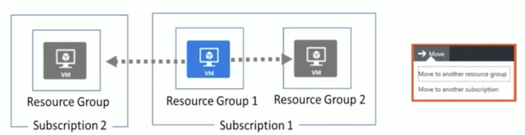

### Course Agenda 

* M01: Managing Azure Subscriptions 
* MO2: Access Management for Cloud Resources 
* M03: Azure Resource Manager 
* M04: Monitoring and Diagnostics 

### Cloud Administrator Role 

* Cloud Administrators manage the cloud services that span storage, networking and compute cloud capabilities, with a deep understanding of each service across the full IT lifecycle. 
* They take end-user requests for new cloud applications and make recommendations on services to use for optimal performance and scale, as well as provision, capacity, monitor and adjust as appropriate
* This role requires communicating and coordinating with vendors. 
* Cloud Administrators use the Azure Portal and as they become more proficient they use PowerShell and the Command Line Interface. 
* Successful Cloud Administrators start this role with experience on operating systems, virtualization, cloud infrastructure, storage structures, and networking. 

**Certification Areas (AZ-103)** 

* Manage Azure subscriptions and resources 15-20% 
* Implement and manage storage 15-20% 
* Deploy and manage virtual machines 15-20% 
* Configure and manage virtual networks 30-35%
* Manage identities 15-20% 


* Percentages indicate the relative weight of each area on the exam 
* The higher the percentage, the more questions you are likely to see in that area 

## AZ-103.1 Module 01: Managing Azure Subscriptions 

### Getting an Azure Subscription 

* Enterprise Agreement 
* Reseller - Open Licensing program 
* Microsoft partner 
* Free trial account 

### Azure Subscriptions and Accounts 

* A subscription is a **logical unit of Azure services that is linked to an Azure account** 
* An account is an **identity in Azure AD** or **in a directory that is trusted by Azure AD** 


### Controlling access to subscriptions

**Administrative Roles** 

* **Account Administrator** 
	* **1 per Azure account** 
	* Authorized to access the Account Center (create subscriptions, cancel subscriptions, change billing for a subscription, change Service Administrator, and more) 

* **Service Administrator**
	* **1 per Azure subscription** 
	* Authorized to access the Azure Management Portal for all subscriptions in the account. By default, same as the Account Administrator when a subscription is created.

* **Co-administrator** 
	* **200 per subscription** 
	* Same as the Service Administrator, but can't change the association of subscriptions to Azure directories. 

### Check Resoure usage


* All resources have a maximum limit listed in Azure limits 
* Helpful to track current usage, and plan for future use 
* You can request an increase 


###  Management Groups 

* Provides a **level of scope above subscriptions** 
* Organizational alignment for your Azure subscriptions through custom hierarchies and grouping 
* Targeting of policies and spend budgets across subscriptions and inheritance down the hierarchies 
* **Compliance and cost reporting by organization (business/teams)** 


## AZ-103.1 Module 02: Access Management for Cloud Resources 

### User account


* All users must have a user account 
* The account is used for authentication and authorization 
* **Identity Sources**: Cloud, Directory-synchronized, and Guest 

### Group Accounts 

* Security groups 
* Distribution groups 
* Directly assigned 
* Dynamically assigned 


```
New-AzureADGroup -Description "Marketing" -DisplayName "Marketing" -MailEnabled $false -SecurityEnabled $true -MailNickName "Marketing" 
```

### RBAC

1. Define what actions are allowed and/or denied 
2. Associate the role with a user, group or service principal 
3. Scope to a subscription, a resource group, or specific resources 


### Roles


* Owner can manage everything, including access 
* **Contributors can manage everything except access**
* Readers can view everything but can't make changes 

**Resource Scope**

* Roles can be assigned for **resources groups and individual resources** 
* Resource inherits role assignments from its parent resources 


### Role Assignment 

* **Users** 
	* Assigned to organizational users in the AD associated with the subscription 
	* Or, external Microsoft accounts in the same directory 
* **Groups** 
	* Assigned to Azure AD security groups 
	* Best practice: manage access through groups, adding roles, and assigning users 
* **Service Principals** 
	* Service identities represented as service principals in the directory 
	* Authenticate with Azure AD and securely communicate with one another 


## AZ-103.1 Module 03: Azure Resource Manager 

###  Azure Resource Manager 

* A **resource** is simply a single service instance in Azure 
* A **resource group** is a logical grouping of resources
* A **resource group template is a JSON file** that allows you to declaratively describe a set of resources 


### Resource Groups and Deployment 

* Resources can only exist in one resource group 
* Groups cannot be renamed 
* **Groups can have resources of many different types (services)**
* **Groups can have resources from many different regions** 
* Deployments are incremental 


### ARM Template Advantages 

* Ensures idempotency 
* Simplifies orchestration 
* configure multiple resources simultaneously 
* Use variables/parameters/functions to create dependencies 
* **Can be configured and managed using a source control provider** 
* Reusable and nestable 


### Resource Manager Lock


* Associate the lock with a **subscription, resource group, or resource**
* Locks are inherited by child resources 
* **Read-Only locks** prevent any changes to the resource. 
* **Delete locks** prevent deletion 

### Moving Resources

* When moving resources, both the s**ource group and the target group are locked during the operation** 
* Services that can be moved 
* Services that cannot be moved 



### Remove Resources groups and Resources

**Resources groups**


`Remove-AzureRmResourceGroup -Name "ContosoRG01" `

**Resources **


`Remove-AzureRmResource -ResourceId" `


### Tags

* Tags logically organize your resources 
* Tags consist of a name and value 
* Useful especially in billing 


### Azure Policy 

* Azure Policy is a service in Azure that you use to create, assign and, manage policies 
* Azure Policy runs evaluations and scans for **non-compliant resources**
* Advantages: 
	* Enforcement and compliance 
	* Apply policies at scale 
	* Remediation 


### Implementing Azure Policy 

1. Browse Policy Definitions 
2. Create Initiative Definitions 
3. Scope the Initiative Definition 
4. View Policy evaluation results 


### Determine Compliance

*  Non-compliant initiatives
*  Non-compliant policies 
*  Non-compliant resources 


## AZ-103.2 Module 04: Monitoring and Diagnostics

* Core monitoring for Azure services 
* Collects metrics, activity logs, and diagnostic logs 
* Use for time critical alerts and notifications 


### Azure Advisor

* Personalized cloud consultant 
* Analyzes your configuration and recommends solutions 
* Four areas: **High Availability, Security, Performance, and Cost** 


### Azure Monitor Alerts


* A unified authoring experience 
* Better creation workflow and fired alert notification 
* Consolidation into one view 


### Creating Alert rules


1. Define the alert condition with target, criteria, and logic 
2. Define the alert details like rule name, description, and severity 
3. Define the action group for notifications 

### Action groups


* Configure a list of actions to take when the alert is triggered •
* Ensures the same actions are taken each time an alert is triggered •
* Action types: Email/SMS/Push/Voice, Logic App, Webhook,  IT Service Management, or Automation Runbook 


**QUESTION1**

You administer a virtual machine (VM) that is deployed to Azure. You configure a rule to generate an alert when the average availability of a web service on your VM drops below 95 percent for 15 minutes. The development team schedules a one-hour maintenance period. You have the following requirements: - No alerts are created during the maintenance period. - Alerts can be restored when the maintenance is complete. You want to achieve this goal by using the least amount of administrative effort. What should you do from the Management Portal? 

* A. Select and disable the rule from the Dashboard page of the virtual machine. 
* B. Select and delete the rule from the Configure page of the virtual machine. 
* **C. Select and disable the rule from the Monitor page of the virtual machine**. 
* D. Select and disable the rule on the Configure page of the virtual machine. 

**QUESTION2**

You configure alerts in Azure The metrics shown in the following exhibit represent the average values for each five-minute period 


**QUESTION3**

You are an administrator for a company. You have an Azure subscription that contains 10 virtual machines. You need to ensure that you receive an email message when any virtual machines are **powered off, restarted, or deallocated.** 
What is the minimum number of rules and action groups that you require? 

* A. Three rules and three action groups. 
* B. One rule and one action group. 
* C. **Three rules and one action group.** 
* D. One rule and three action groups. 

**QUESTION4**

