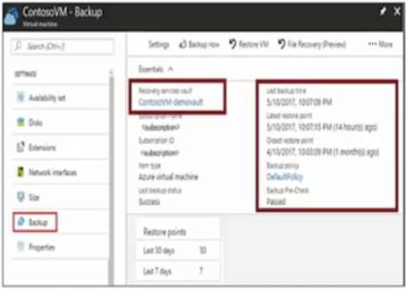

# Azure103 Storage

### Course Agenda 

* M01: Overview of Azure Storage 
* M02: Storage Services 
* M03: Securing and Managing Storage 
* M04: Storing and Accessing Data 


## Overview of Azure Storage 


### Intro to Azure Storage


### Azure Storage 

* A service that you can use to store files, messages, tables, and other types of information 
* Three categories of Azure storage: 
	* Storage for virtual machines — **Disks and File Shares** 
	* Unstructured data — **Blobs and Data Lake Store** 
	* Structured data - **Tables, Cosmos DB, and Azure SQL DB** 


**QUESTION**

You develop a web application that uses table storage in Azure. You create a storage account named Contoso that stores a table named CityPopulationData. **The web application stores entities in this table**. You need to query the table data by using OData. 

Which URL should you use? 

* http://contoso.table.core.windows.net/citypopulationdata
* **http://contoso.table.core.windows.net/odata/citypopulationdata**
* http://azurestorage.table.core.windows.net/contoso
* http://microsoft.table.core.windows.net/contoso
* http://azure.table.core.windows.net/contoso/citypopulationdata


### Storage Account Endpoints 

* Every object has a unique URL address 
* The storage account name forms the subdomain of that address 
* The subdomain and domain name forms an **endpoint** 
	* **Blob service**: http://mystorageaccount.blob.core.windows.net 
	* **Table service**: http://mystorageaccount.table.core.windows.net 
	* **Queue service**: http://mystorageaccount.queue.core.windows.net 
	* **File service**: http://mystorageaccount.file.core.windows.net 

### Storage Accounts


* Two types of Storage: **General purpose and Blob storage** 
* General purpose storage has two tiers: **Standard and Premium**. 
* Blob storage has three tiers: **Hot, Cool, and Archive** 

**QUESTION**

You deploy an Azure VM into an availability set. The VM is the only VM in the availability set. The VM runs an application named Appl. The VM has the following characteristics: 

* The VM uses Azure standard storage 
* The VM does not have any data disks
* The VM was built with a custom image 


During an Azure planned maintenance event, the VM experiences downtime. The company issues a new requirement for App1:

* Appl must remain available during Azure planned maintenance events 

You need to reconfigure your environment to meet the new requirements. What should you do? (Each answer presents a complete solution. Choose two.) 

* **A. Deploy a second Azure VM and add it to the same availability set.** 
* B. Deploy a second Azure VM and add it to the same update domain. 
* C. Deploy a second Azure VM and add it to the same fault domain. 
* **D. Convert the VM storage to premium storage**. 
* E. Convert the VM to a Standard size or higher. 
* F. Convert the VM storage to use zone redundant storage 


### Replication Options


* Replication ensures durability and high availability
* Replicate your data **within the same data center, across zonal data centers within the same region, and even across regions** 


### Locally Redundant Storage


* Maintains three copies of your data at a single facility 
* **All copies of the data exist within the same region** 
* Use if data can be easily reconstructed 
* Use if there are regional governance requirements •
* Low-cost option 

### Zone Redundant Storage


* **Replicates your data across three storage clusters in a single region** 
* Each storage cluster is physically separated from the others and resides in its own availability zone 
* Each availability zone, and the ZRS cluster within it, is autonomous, with separate utilities and networking capabilities 
* **Not available in all regions** 

### Geo-Redundant Storage


* **GRS** replicates your data to another data center in a secondary region, **but that data is available to be read only during a failure**. 
* **`RA-GRS`** is based on GRS and replicates data to another data center in another region. **Provides read access from the secondary region, even without a failure**. 


### Replication Option Comparison


### Azure Storage Explorer 

* Access multiple accounts and subscriptions 
* Create, delete, view, edit storage resources 
* View and edit Blob, Queue, Table, File, Cosmos DB storage and Data Lake Storage 
* Obtain shared access signature (SAS) keys 
* Available for Windows, Mac, and Linux 


### Storage Explorer Connection 

* Connect to an Azure subscription 
* Work with local development storage (emulator) 
* **Attach to external storage** 
* Attach a storage account or storage service by using a shared access signature 
* **Connect to an Azure Cosmos DB account by using a connection string** 


### Demonstration - Storage Explorer 

* Download and install Storage Explorer 
* Connect to an Azure subscription 
* Attach an Azure storage account 


## Storage Services 

### Virtual Machine Disks

* **Operating System Disks are SATA drives, labeled as C:** 
* **Temporary Disks** provides **short term storage** 
* **Data Disks** are SCSI drives and depend on your virtual machine type 


### Premium Storage 

* Delivers **high-performance, low-latency SSD disk support** 
* Use for virtual machines with input/output (I/O)-intensive workloads 
* Two types of disks: **Unmanaged and Managed**
* Unmanaged disks **require you to manage the storage accounts and VHDs** 
* **_Managed disks_ are maintained by Azure (recommended)** 

### Blob Storage  

* Stores unstructured data in the cloud 
* **Can store any type of text or binary data** 
* Also referred to as object storage 
* **Common uses:** 
	* Serving images or documents directly to a browser 
	* Storing files for distributed access 
	* Streaming video and audio 
	* Storing data for backup and restore, disaster recovery, archiving 
	* Storing data for analysis by an on-premises or Azure-hosted service


### Blob Containers 

* **All blobs must be in a container**
* Accounts have **unlimited containers**  
* Containers have unlimited blobs 
* **Private blobs** - no anonymous access 
* **Blob access** - anonymous public read access for blobs only 
* **Container access** - anonymous public read and list access to the entire container, including the blobs 


### Uploading Blobs 

* **Block blobs (default)** - useful for storing text or binary files 
* **Page blobs** - **More efficient for frequent read/write operations** 
* **Append blobs** - useful for logging scenarios 
* **You cannot change a blob type once it has been created**


### Blob Performance Tiers 

* **Hot tier (inferred)** - Optimized for frequent access of objects in the storage account 
* **Cool tier** - Optimized for storing large amounts of data that is infrequently accessed and stored for at least 30 days 
* **Archive** - Optimized for data that can tolerate several hours of retrieval latency and will remain in the Archive tier for at least 180 days 

**You can switch between these access tiers at any time.**


### QUESTION 

You are designing an Azure application that provides online backup storage for hundreds of media files. Each file is larger than 1GB. 

The data storage solution has the following requirements 

- It must be capable of storing an average of 1TB of data for each user.
- It must support sharing of data between all Windows Azure instances. 
- **It must provide random read/write access**. 

You need to recommend a durable data storage solution. What should you recommend? 

* A. Azure Drive 
* B. **Azure Page Blob service** 
* C. Azure Block Blob service
* D. Local storage on an Azure instance 


### Azure Files 

* **Managed file shares in the cloud that accessible via SMB**

* Replace and supplement 
* Lift and shift 
* Azure File Sync 
* Shared applications 
* Diagnostic data 
* Tools and utilities 


### Azure Files Usage


### Create File Shares


* Portal


**Power Shell**

```
# Retrieve storage account and storage account key 
$storageContext = New-AzStorageContext <storage-account-name> <storage-account-key> 

# Create the file share, in this case "logs" 
$share = New-AzStorageShare logs -Context $storageContext 
```
### Mapping File Shares(Windows)

* Mapping drive letter 
* UNC path 
* Account user 
* Storage Account Key 


**Ensure port 445 is open**


### Secure Transfer Required

* Only allows requests by secure connection such as HTTPs 
* Portal 


* PowerShell 

```
Set-AzStorageAccount
	 -Name "{StorageAccountName}" 
	 -ResourceGroupName "{ResourceGroupName}" 
	 -EnableHttpsTrafficOnly $True 
```


### File Share Snapshots 

* Captures the share state at that point in time 
* Is read-only copy of your data 
* Snapshot at the file share level 
* Retrieve at the individual file level 
* Incremental in nature 
* Uses: 
	* **Protection against application error and data corruption**
	* Protection against accidental deletions or unintended changes
	* General backup purposes


### Table Storage 

* Store large amounts of structured data 
* **A NoSQL key-value data store** 
* Authenticates from inside and outside to Azure cloud. 
* Good for web scale applications 
* Store datasets for non-complex jobs, foreign keys, or stored procedures 
* **Quickly query data using a clustered index **


### Implementing Table Storage

* An entity can have up to 225 properties, including three system properties 
* **PartitionKey** and **RowKey** must uniquely identify every entity within a table 
* Azure assigns the **Timestamp** and it cannot be modified 


### Queue Storage 

* Store millions of messages 
* Accessible from anywhere 
* Authenticate with **HTTP or HTTPS** 
* A message can be up to **64 KB** in size 


* Create a backlog of work to process asynchronously. 
* Pass messages from an Azure web role to an Azure worker role 


**QUESTION**

You have an Azure Storage accounts as shown in the following exhibit. Use the drop-down menus to select the answer choice that completes each statement based on the information presented in the graphic. 


* **storageaccount 1+2**
* **All the account**


**QUESTION**

Your company provides cloud software to audit administrative access in Microsoft Azure resources. The software logs all administrative actions (including all clicks and text input) to **log files**. The software is about to be released from beta and the company is concerned about storage performance. You need to deploy a storage solution for the log files to maximize performance. What should you do? Select one. 

* A. Deploy Azure Files using SMB 3.0. 
* B. Deploy Azure Table Storage. 
* C. Deploy Azure Queues Storage. 
* D. Deploy blob storage using block blobs. 
* E. **Deploy blob storage using append blobs.** 

**QUESTION** 

Your company Is building an app In Azure. The app has the following storage requirements: 

* Storage must be reachable programmatically through a REST API.
* Storage must be globally redundant. 
* Storage must be accessible privately within the company's Azure environment. 
* **Storage must be optimal for unstructured data.** 

Which type of Azure storage should you use for the app? Select one. 

* A. Azure Data Lake store 
* B. Azure Table Storage 
* **C. Azure Blob Storage** 
* D. Azure File Storage 

**QUESTION** 
Your company requires all data to be encrypted with 256-bit AES encryption. What should you do? Select one. 

* A. Enable storage service encryption. 
* B. Enable customer managed keys. 
* C. Enable shared access signatures. 
* **D. You do not need to do anything.**

**QUESTION**
When you created a virtual machine you selected standard storage because the data was accessed infrequently. The data is now being used for a Business Intelligence application and you need better performance. What should you do? Select one. 

* A. **Create a new storage account with premium storage and copy the data there.** 
* B. Change the standard storage to premium storage. 
* C. Create a general-purpose v2 account and use that for the data. 
* D. Create a blob storage account and use that for the data. 

**(standard cannot=> premium [after created])**


## Securing and Managing Storage 

### Storage Security 

* Storage Encryption Services 
* Authentication with Azure AD and RBAC 
* Client-side encryption, HTTPS, and SMB 3.0 for data in transit 
* Azure disk encryption
* **Shared Access Signatures — delegated access** 
* **Shared Key — encrypted signature string**
* **Anonymous access to containers and blobs**

### Shared Access Signatures （SAS)

* **Provides delegated access to resources**
* Grants access to clients without sharing your storage account keys 
* The account SAS delegates access to resources in one or more of the storage services: **Blob, Queue, Table, or File service** 
* The service SAS delegates access to a resource in just one of the storage services 

### Configuring SAS Parameters

**Account level SAS, full permissions **

```
New-ALStorageAccountSASToken 
	-Service Blob,FiletTable,Queue 
	-ResourceType Service,ContainersObject 
	-Permission "racwdlup" 
```

**Blob level SAS, full permissions** 

```
New-AzStorageBlobSASToken 
	-Container "ContainerName" 
	-Blob "BlobName" 
	-Permission rwd 
```


* Permissions: R, W, ...
* Start and Expiry date time
* Allowed IP address
* Allowed Protocols: HTTPS,HTTP
* Signing Key


### URI and SAS Parameters 

* A SAS is a **signed URI that points to one or more storage resources**
* Consists of a **storage resource URI and the SAS token** 


* Includes parameters for **resource URI, storage services version, services, resource types, start time, expiry time, resource, permissions, IP range, protocol, signature** 

### Storage Service Encryption

* Protects your data for security and compliance 
* **Automatically encrypts and decrypts your data** 
* Encrypted through 256-bit AES encryption 
* Is enabled for all new and existing storage accounts and cannot be disabled 
* Is transparent to users 

**You can use your own key (next topic)** 


### Customer Managed Keys 

* Use the Azure Key Vault to **manage your encryption keys** 
* **Create your own encryption keys and store them in a key vault** 
* **Use Azure Key Vault's APIs to generate encryption keys** 
* Custom keys give you more flexibility and control 


### Best Practices 

* **Always use HTTPS to create or distribute an SAS** 
* **Reference stored access policies where possible**
* **Use near-term expiration times on an ad hoc SAS**
* **Have clients automatically renew the SAS if necessary**
* **Be careful with SAS start time** 
* **Be specific with the resource to be accessed** 
* **Understand that your account will be billed for any usage** 
* **Validate data written using SAS** 
* **Don't assume SAS is always the correct choice** 
* **Use Storage Analytics to monitor your application** 

### Azure Backup 

* Azure-based service used to back up and restore data in Microsoft cloud 
* Automatic Storage Management 
* Unlimited scaling 
* Multiple storage options 
* Unlimited data transfer 
* Data encryption 
* Application consistent backup 
* Long-term retention 


### Recovery Services Vault 

* Storage entity in Azure that houses data 
* Data for virtual machines (VMs), workloads, servers, or workstations 
* Support for System Center DPM, Windows Server, Azure Backup Server 
* **Up to 25 Recovery Services vaults per region** 
* **Replaces Backup vaults** 




### Backup File and Folder

1. **Create a recovery services vault in the region you store the data, and determine how you want the data replicated** 
2. Download the Backup Agent for Windows Server or Windows Client 
and the vault credentials 
3. Use Azure Recovery Services to back up files and folders 
4. Schedule the back up and do the first-time backup 


### Security Features for Hybrid Backups 

* **Prevention - Authentication to ensure validated users** 
* **Alerting - Email notifications for critical events** 
* **Recovery - Extended retention and recovery points** 

### Azure File Sync

**Centralize file shares in Azure Files**

1. Lift and shift
2. Branch Office backups 
3. Backup and Disaster Recovery 
4. File Archiving 
 
### File Sync Components 

* The **Storage Sync Service** is the top-level resource. 
* **Sync group**. A sync group defines the sync topology for a set of files. 
* The **registered server** object represents a trust relationship between your server (or cluster) and the Storage Sync Service 
* The **Azure File Sync agent** is a downloadable package that enables Windows Server to be synced with an Azure file share 
* A **server endpoint** represents a specific location on a registered server, such as a folder 
* A **cloud endpoint** is an Azure file share 
* A **sync group** defines which files are kept in sync 


### File sync - Initial Steps


### File Sync - Synchronization 


* Create a sync group with at least one cloud endpoint. The endpoint will 
have a storage account and file share 
* Create a server endpoint with the registered server, path, and optional 
cloud tiering information 


## Storing and Accessing Data 

### Content Delivery Network Overview 

* CDN Benefits 
* How CDN Works 
* CDN Profiles 
* CDN Endpoints 
* CDN Time-to-Live 
* CDN Compression 


### CDN Benefits 

* **Lower latency and faster delivery of content** 
* **Reduced load on server or application** 

**Typical uses**: 

* Delivering static resources for client apps 
* Delivering public static and shared writer to devices 
* Serving static content websites 
* Streaming video files to clients on deman 
* Supporting IoT solutions 


### How CDN Works 
1. User requests a file 
2. Edge server requests file from origin 
3. Origin returns the file to the edge server 
4. Edge server caches the file and returns the file to the original requestor 
5. Additional user requests the same file 
6. Edge server returns the file from the cache 


### CDN Profiles 

* A CDN profile is a **collection of CDN endpoints with the same pricing tier and provider (origin)** 
* Can create multiple profiles to organize endpoints 
* Up to **eight profiles per subscription** 
* Subscription pricing tiers: 
	* Premium Verizon 
	* Standard Verizon 
	* Standard Akamai 


### CDN Endpoints 

* Origin types: **Storage, Cloud Service, Web App, and Custom origin** 
* The CDN endpoint for this storage example: `ASHStorage.azureedge.net/...` 
* Add custom domain mapping to your CDN endpoint and enable custom domain HTTPS 
* Additional CDN features for your delivery, such as **compression, query string, and geo filtering** 


### CDN Compression

* Improve file transfer speed and increase page-load performance 
* **Reduce bandwidth costs and provide a more responsive experience** 
* Enable compression on the origin server or on the CDN edge servers 
* **Specify which MIME formats are compressed** 


### CDN Time-to-Live 

* **Global caching rules** set the Cache Expiration Duration for each endpoint in your profile! 
* **Custom caching rules** match specific paths and file extensions, are processed in order, and override the global caching rule. 


### Import and Export Service Overview 

* Import and Export Service 
* Components and Requirements 
* Import and Export Tool 
* Import Jobs 
* Export Jobs 


### Components and Requirements 

**Components** 

* **Import/Export** service helps the user create and track jobs 
* **WAImportExport tool** command line tool for drive preparation and repair 
* **Disk Drives** can be SSDs (2.5") or HDDs (2.5" and 3.5") 


**Requirements** 

* Windows Server (64-bit and BitLocker) or Client (WMF and BitLocker) 
* General Purpose v2 storage accounts is recommended 
* Import jobs can include Azure Blob storage, Azure File storage, Block blobs, and Page blobs. 
* Export jobs can include Azure Blob storage, Block blobs, Page blobs, and Append blobs. Azure Files not supported. 


### Import and Export Tool 

`WAImportExport.exe Preplmport /j:<JournalFile> /id:<SessionId> /DataSet:<dataset.csv>` 

* Copy data to the hard drives for shipment to an Azure datacenter 
* Repair any blobs that were not useable (import or export) 
* Internal SATA II/III HDDs or SSDs 
* Handles data copy, volume encryption, and creation of journal files 
* Journal files track a set of drives and records the progress 
* Session Id identifies a copy session 
* A CSV file contains a list of directories/files for copying 


### Import Jobs 

1. Create an Azure Storage account 
2. Identify the number of disks 
3. Install the WAImportExport tool 
4. Use the tool to copy the data, encrypt the drive with BitLocker, and generate journal files 
5. Create the import job in the portal 
6. Ship the disks to the import destination 
7. Datacenter imports and returns the disks 


### Import Jobs Process 

* Automatic Storage Management 
* Unlimited data transfer 
* Data encryption 
* Unlimited scaling 
* Multiple storage options 
* Long-term retention 
* Application consistent backup 


### Export Jobs 

1. Identify the data to export 
2. Identify the number of disks 
3. Create the export job in the portal, including your return address 
4. Ship the required number of disks 
5. Datacenter staff will export and encrypt the data. 
6. Copied disks are shipped to you. 
7. BitLocker keys will be in the portal. 


### Questions

DRAG DROP 

You have an Azure subscription that contains a storage account. 

You have an on-premises server named Served that runs Window Server 2016. 

* Server1 has 2 TB of data. You need to transfer the data to the storage account by using the Azure Import/Export service. 
* In which order should you perform the actions? 
* To answer, move all actions from the list of actions to the answer area and arrange them in the correct order. 


**3 -> 2 -> 1 -> 4 -> 5**

You have an Azure subscription named Subscriptiion1. In Subscription1, **you create an Azure file share named share1. You create a shared access signature (SAS) named SAS1 as shown in the following exhibit**. 


* **IP address(193.77.134.1) Will have no acess**
* **Use SAS ASS Password => Will have no acess**


QUESTION 
You are a cloud administrator for a company. The development team asks you to provision an Azure storage account for their use. 

To remain in compliance with IT security policy, you need to ensure that the new Azure storage account meets the following requirements: 

- Data must be encrypted at rest. 
- - Access keys must facilitate automatic rotation. 
- - The company must manage the access keys. 
- What should you do? 

* A. Create a service endpoint between the storage account and a virtual network (VNet). 
* B. Require secure transfer for the storage account. 
* C. Enable Storage Service Encryption (SSE) on the storage account. 
* D. **Configure the storage account to store its keys in Azure Key Vault**. 
