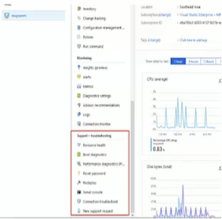

# Azure VMs

1. Overview of Azure Machines 
2. Creating Virtual Machines 
3. Configuring Virtual Machines 
4. Configuring Availability and Extensibility 
5. Managing and Monitoring Virtual Machines 

## Overview of Azure Machines

* Azure Virtual Machines Overview 
* Virtual machine usage scenarios 
* Planning Considerations 

### Virtual machine usage scenarios

1. 用于测试开发 
2. 在云上运行应用程序 
3. 扩展数据中心到云上 
4. 灾难恢复 

### Planning Considerations 

* (1）应用程序的名字 
* (2）资源存储的位置 
* (3）虚拟机的大小 
* (4）可创建最大虚拟机数量 
* (5）虚拟机操作系统 

### 创建虚拟机

1. 选择要用于新虚拟机的映像或磁盘：磁盘是自己创建的 VHD。 
2. 为新虚拟机提供所需的信息．如主机名、用户名和密码。
3. 提供可选信息，如域成员、虚拟网络、存储帐户、云服务和可用性设置。 
4. 提供机器 

### 链接虚拟机问题查找

1. 重装`UDP`连接．比如远程连接被禁用或者`Windows`防火墙规则阻塞`RDP` 
2. 验证网络安全组规则，验证是否某个规则阻塞了与虚拟机的通信 
3. 查看虚拟机的引导诊断，我们可以检查虚机控制台日志，确定VM是否报告了问题 
4. 重置虚拟机拟机的网络接口 
5. 检查虚拟机资源是否健康 
6. 重置用户凭证密码 
7. 重启虚拟机 
8. 重新部署虚拟机 
9. 确定本地电脑的防火墙可以向`azure`发送`TCP 3389`流量

### VM images

**Image types** 

* Virtual machine image 
* OS image 

**Image source** 

* Azure Maiketplace 
* VM Depot 

**Custom image** 

* Image you create and upload for use in Azure 

### VM NetworkInterface Card 

**回络接口(`NIC`)**是`VM`与虚似网络（`VNet`）之间互相连接的桥梁。一种常见方案是为前端和后端连接设置不同的子网。**可以将`VM`上的多个`NIC`关联到多个子网，但这些子网必须全都位于同 一个虚拟网络(`vNe`t）中**。 

### VM IP Address

### VM Network Security Group

### VM Application Security Group

### VM Disks

**操作系统磁盘**：每个虚拟机都有一个附加的操作系统磁盘。操作系统磁盘基于映像创建，操作系统磁盘和该映像都存储在Azure存储帐户中的虚拟硬盘（VHD)内。此磁盘的最大容星为2048g (GB)，被标为c盘 

**临时磁盘**：没个虚拟机都包含一个临时磁盘，临时磁盘为应用程序提供短期数据存储和页面数据交换．在维护期间或重新部署VM时，临时磁盘上的数据可能会丢失。临时磁盘默认标记为D: 盘 

**数据磁盘**： 数据磁盘是`VHD`，它连接到虚拟机来存储应用程序数据和其他需要保存的数据。每个 数据磁盘最大容员为`4095GB`,虚拟机的大小决定了我们可以附加多少数据硬盘。 

### VM Disks 

**标准存储（Standard Storage)**：标准存储以HDD为基础，可以在确保性能的同时提供经济高 效的存储。标准存储可在一个数据中心进行本地复制，也可以通过主要和辅助数据中心实现异地冗余 

**高级存储（Premium Storage)**：离级存储以SSD为基础，为运行I/O密集型工作负荷的VM 提供高性能、低延迟的磁盘支持．可将高级存储与`DS`、`DSv2`或`FS`系列的`Azure VM`配合使用 

**非托管磁盘（Managed)**：非托管磁盘是VM一直使用的传统类型的磁盘。有了这些以后，即可创建自己的存储帐户并在创建磁盘时指定该存储帐户。 

**托管磁盘（`Unmanaged`)**：托管磁盘为用户在后台处理存储帐户的创建／管理，确保用户无需担 ，自存储帐户的可伸缩性限制。用户只需指定磁盘大小和性能层（标准/高级）,Azure就会自动创建和管理磁盘。 

### 配置虚拟机的可用性

* 可用性场景
* 可用性集（Availability Sets）
* 更新域（Updte Domain） 
* 故障域 (Fault Domain) 

### 配置虚拟机的扩展性 

* 规模集（Scale sets) 
* 规模集的好处 
* 如何配置自动缩放 

## Managing and Monitoring Virtual Machines

### 管理和监控虚拟机 

* Azure Backup（备份）
* Azure Site Recovery（站点恢复） 
* VHD快照 
* 如何备份虚拟机 

* 诊断和指标
* 报警
* 日志

You have an Azure subscription that contains a virtual machine named VM1. VM1 hosts a line-ofbusiness application that is available 24 hours a day. VM1 has one network interface and one managed disk. VM1 uses the `D4s_v3` size. 

You plan to make the following changes to VM1: 

* - Change the size to D8s_v3. 
* - Add a S00-GB managed disk. 
* - Add the Puppet Agent extension. 
* - Attach an additional network interface. 
* **Which change will cause downtime for VM1?**

* A. Add a 500-GB managed disk. 
* B. Attach an additional network interface. 
* C. Add the Puppet Agent extension. 
* **D. Change the size to D8s_v3** (only change the size of vms will cause the downtime)

You are an administrator for a company. You have an Azure subscription that contains the resources in the following table : 

Subneti is associated to VNetl. NIC1 attaches VM1 to Subnetl. You need to apply ASG1 to VM1. What should you do? 

* A. Modify the properties of NSG1. 
* B. Modify the properties of ASG1. 
* **C. Associate NIC1 to ASG1.** 
* D. Associate NSG1 to VM1. 

You plan to deploy 8 application VMs to Microsoft Azure. The management team at your company has issued the following requirement for the VMs: 

* During planned Azure maintenance, a maximum of half the VMs can be impacted in any way during the maintenance. 
* Minimize administrative overhead for the deployment and support of the environment 
* Use standard storage for the VMs 
*  You need to deploy the VMs to meet the requirement. What should you do? (Each answer presents part of the solution. Choose two.) 

* A. Deploy each VM to its own availability set. 
* **B. Deploy a single availability set for all the VMs.** 
* C. Deploy 4 availability sets. 
* D. Configure 1 update domain on the availability set(s). 
* **E. Configure 2 update domains on the availability set(s).** 
* F. Configure 4 fault domains on the availability set(s). 
* G. Configure 8 fault domains on the availability set(s). 

You are an administrator for a company. You purchase a new Azure subscription named Subscriptionl. You create a virtual machine named VM1 in Subscriptionl. VM1 is not protected by Azure Backup. 

You need to protect VM1 by using Azure Backup. Backups must be created at 01:00 and stored for 30 days. What should you do? (To answer, select the appropriate options in the answer area. NOTE: Each correct selection is worth one point.) 

You have two Azure virtual machines named VM1 and VM2. VM1 has a single data disk named Disk1 You need to attach Diskl to VM2. The solution must minimize downtime for both virtual machines. Which four actions should you perform in sequence? (To answer, move the appropriate actions from the list of actions to the answer area and arrange them in the correct order.) 

* A. Sequence: 2, 4, 5, 3 
* B. Sequence: 2, 4, 6, 5 
* C. Sequence: 4, 6, 5, 1 
* **D. Sequence: 2, 4, 3, 5**

