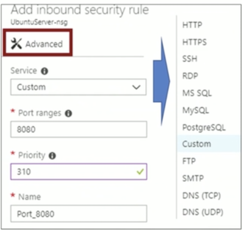

# Configure and manage virtual network

**Create connectivity between virtual networks**

* create and configure VNET peering 
* create and configure VNET to VNET 
* verify virtual network connectivity 
* create virtual network gateway 

**Implement and manage virtual networking**

configure private and public IP addresses, network routes, network interface, subnets, and virtual network 

**Configure name resolution** 

* configure Azure DNS 
* configure custom DNS settings 
* configure private and public DNS zones 

**Create and configure a Network Security Group (NSG)**

* create security rules 
* associate NSG to a subnet or network interface 
* identify required ports 
* evaluate effective security rules 

**Implement Azure load balancer** 

* configure internal load balancer, configure load balancing rules, configure public load balancer, troubleshoot load balancing 

**Monitor and troubleshoot virtual networking** 

* monitor on-premises connectivity, use Network resource monitoring, use Network Watcher, troubleshoot external networking, troubleshoot virtual network connectivity 

**Integrate on premises network with Azure virtual network** 

* create and configure Azure VPN Gateway, create and configure site to site VPN, configure Express Route, verify on premises connectivity, troubleshoot on premises connectivity with Azure 

## Course Agenda 

* MO1 : Azure Virtual Networks 
	* L01: Introducing Virtual Networks 
	* L02: Creating Azure Virtual Networks 
	* L03: Review of IP Addressing 
	* L04: Network Routing 

* MO2 : Azure DNS 
	* L01: Azure DNS Basics 
	* L02: Implementing Azure DNS 

* M03 : Securing Virtual Network Resources 
	* L01: Introduction to Network Security Groups 
	* L02: Implementing Network Security Groups and Service Endpoints 

## Introducing Virtual Networks

### 主要作用 

* 将多台Azure VM整合统一一网段或者子网里 
* 固定`Private IP`
* 实现混合云 

### Virtual Network

* 我们可以将虚拟网络分割成一个或多个子网，并将虚拟网络地址空间的一部分分配给每个子网。
* 在此虚拟网络的生创肚空间中，每个子网必须具有惟一的地址范围。地址范围不能与虚拟网络中的其他子网络重叠。 

### Ip Address

* 公共IP地址：用来与`Internet`以及未连接到`VNet` 的其他`Azure`资源进行入站和出站通信。 

* 私有IP地址：当使用`VPN`网关或`ExpressRoute`电路将网络扩展到`Azure`时，私有IP地址用于在Azure人虚拟网络(VNet)  地网络和本地网络进行通信 

可与公共IP地址资源关联的部分资源包括： 

* 虚拟机网络接口 
* 面向`Internet`的负载均衡器 
* VPN网关 
* 应用程序网关数 

可将专用IP地址关联到以下类型的`Azure`资源 

* 虚拟机网络接口 
* 内部负载均衡器 (ILB) 
* 应用程序网关数 

### System Routes 

System routes direct network traffic between virtual machines, on-premises networks, and the Internet 

* Traffic between VMs in the same subnet 
* Between VMs in different subnets in the same virtual network 
* Data flow from VMs to the Internet 
* Communication between VMs using a VNet-to-VNet VPN 
* Site-to-Site and ExpressRoute communication through the VPN gateway 

### User Defined Routes 

* A route table contains a set of rules, called routes, that specifies how packets should be routed in a virtual network 
* User-defined routes are custom routes that control network traffic by defining routes that specify the next hop of the traffic flow 
* The next hop can be a virtual network gateway, virtual network, Internet, or virtual appliance 

### Routing Example

1. Create the route table 
2. Create the route 
3. Associate the route to the subnet 

### 1. Create Route Table (BGP) 

1. BGP is a standard routing protocol used to exchange routing and reachability information between two or more networks 
2. Routes are automatically added to the route table of all subnets with BGP propagation enabled 
3. In most situations you will want to enable BGP route propagation 

### 2. Create the Route 

* When you create a route there are several Next hop types 
* In this example, any private subnet IP addresses will be sent to the virtual appliance 
* Other choices are Virtual network gateway, Virtual network, Internet, and None 

### 3. Assiocate Route to subnet

* Each subnet can have zero or one route table associated to it 
* In our example, the Public subnet will be associated with the routing table 

## Azure DNS Basics

* `Azure DNS`是DNS域的托管服务 
* `DNS`通过将网站或服务名称解析为其IP地址来提供名称解析 
* `Azure DNS`是全局的，具有快速的性能和高可用性 
* `Azure DNS`可以快速缩放和更新记录 

### Azure DNS Domains and zones

### DNS Zones

* A DNS zone hosts the DNS records for a domain 
* The name of the zone must be unique within the resource group 
* Where multiple zones share the same name, each instance is assigned different name server addresses 
* Only one set of addresses can be configured with the domain name registrar 

### DNS Record Types

An Azure DNS zone can support all common DNS record types

## Overview of Network Secruity Groups

* You can limit network traffic to resources in a virtual network using a network security group (NSG) 
* A network security group contains a list of security rules that allow or deny inbound or outbound network traffic 
* An NSG can be associated to a subnet or a **network interface** 

### NSG Rules 

* Security rules in NSGs enable you to filter network traffic that can flow in and out of virtual network subnets and network interfaces. 
* You cannot delete the default rules, but you can add other rules with a higher priority. 

### Creating NSG Rules 

* Select from a large variety of services 
* Service - The destination protocol and port range for this rule 
* Port ranges — Single port or multiple ports 
* Priority - The lower the number, the higher the priority 

## Network Security Groups and Service Endpoints 

### Service Endpoints

虚拟网络(VNet）服务终结点可通过直接连接将`VNet`的虚拟网络专用地址空间和标识扩展到`Azure`服务。使用终结点可以保护关键的Azure服务资源，只允许在客尸自己的虚拟网络中对其进行访问。 

此功能针对以下Azure服务和区城提供： 

* Azure 存储
*  Azure SQL 数据库
* Azure SQL数据仓库 
* Azure Database for PostgreSQL 服务器 
* Azure Database for MySQL 服务器
* Azure Database for MySQL 服务器
* Azure Cosmos DB
* Azure Kev Vault 
* Azure 服务总线
* Azure 事件中心

## Question 

You have an Azure Active Directory (Azure AD)tenant named `contosocloud.onmicrosoft.com.` Your company has a public DNS zone for `contoso.com.` You add `contoso.com` as a custom domain name to Azure AD. You need to ensure that Azure can verify the domain name. Which type of DNS record should you create? 

* A.PTR 
* **B. MX** 
* C. NSEC3 
* D. RRSIG 

You are a cloud administrator for a company. You have an Azure DNS zone named `adatum.com.` You need to delegate a subdomain named `research.adatum.com.` to a different DNS server in Azure. What should you do? 

* A .Create a PTR record named research in the adatum.com zone. 
* **B .Create a NS record named research in the adatum.com zone**. 
* C .Modify the SOA record of adatum.com
* D .Create an A record named ".research in the adatum.com zone. 

YOU have an Azure subscription named Subscriptionl,Subscription1 contains the virtual machines in the following table. 

Subscription 1 contains a virtualnetwork named VNet1 that has the subnets shown in the following table. 

VM3 has a network adapter named NIC3. IP forwarding is enabled on NIC3. Routing is enabled on VM3.You create a route table named RT1. 

RT1 is associated to Subnet1 and Subnet2 and contains the routes in the following table. 

You apply RT1 to Subnet3. For each of the following statements,select Yes if the statement is true Otherwise, select No. 

(NOTE:Each correct selection is worth one point)

* VM1 and VM3 connect to each other in same IP range

You have an Azure subscription named Subscriptio1. Subscription1 contains a virtual machine named VM1. You have a computer named Computer1 that runs Windows 10. Computer1 is connected to the Internet. You add a network interface named Interface named Interface1 to VM1 as shown in the exhibit (Click the Exhibit button.) 

From Computer1, you attempt to connect to VM,by using Remote Desktop,but the connection fails. You need to establish a Remote Desktop connection to VM1.What should you do first? 

* **A. Start VM1.** 
* B. Attach a network interface. 
* C. Delete the DenyAllOutBound outbound port rule. 
* D. Delete the DenyAllInBound inbound port rule. 

* DenyAllOutBound 不用考虑
* `DenyAllInBound` 最上面的**3389 already open**， it's okay
*  **Start VM1**

### Pre-class practice 

You are an administrator for a company. You have an Azure policy as shown in the following exhibit. 
Which of the following statements are true? 

* **A. You can create Azure SQL servers in ContosoRG1.**
* B. You are prevented from creating Azure SQL servers anywhere in Subscription1. 
* C. You are prevented from creating Azure SQL Servers in ContosoRG1 only. 
* D. You can create Azure SQL servers in any resource group within Subscription1. 

* Scope: **subscription1**
* **Exclusion**: subscription1/contosoRG1
* Not allowed resource type: **MicrosoftSqlServers**

### Course Agenda 

* MO1 : Create connectivity between virtual networks
	* L01: Create and configure VNET to VNET 
	* L02: Verify virtual network connectivity 
	* L03: Create virtual network gateway L04: Create and configure VNET peering 

## Intersite Connectivity 

### Virtual Network Connectivity 

**Site-to-Site** 

* Connect an on-premises network to your virtual networks in Azure 

**VNet-to-VNet** 

* Connect two virtual networks in Azure together 

**Point-to-Site** 

* Connect an individual machine directly through VPN into an Azure virtual network 

### Point to site connection

* Connect VNets with a VNet-to-VNet VPN connection 
* Requires a VPN gateway in each virtual network 
* A secure IPsec/IKE tunnel provides the communication 

### Site-to-site Connections

### Vnet-to-Vnet Connections

* Connect VNets with a VNet-to-VNet VPN connection 
* Requires a VPN gateway in each virtual network 
* A secure IPsec/IKE tunnel provides the communication 

### Site-to-site and ExpressRoute Connection

### Create virtual network gateway

**Gateway type**

* VPN
* ExpressRoute

### VPN Gateway type

* **Routed-based (dynamic)**
	* Basic
	* VpnGW1
	* VpnGW2
	* VpnGW3
* **Policy-based (static)**
	* Basic 

### Create VPN Gateways

* Each virtual network needs a VPN gateway 
* Most VPN types are Route-based, select a gateway SKU 
* **The SKU affects the number of tunnels and the throughput**
* **The gateway needs a public IP address** 

### Virtual Network Connectivity

### Gatway SKUs

### Configuring Gateway Connections

* Once your VPN gateways are created, you can create the connection between them. 
* **If your VNets are in the same subscription, you can use the portal.**
* **The shared key provides the connection** 
* Must create the connection for each virtual network 

### Question 

VPN gateway to provide a secure tunnel using IPsec/IKE, and both function the same way when communicating. 

The local network gateway for each VNet treats the other VNet as a local site. This lets you specify additional address space for the local network gateway in order to route traffic

* Internet User: ok
* Delet Rule2: connect DNS ok

* 50-60 deny
* 3389 allow
* 50-500 allow
* DNS 53
* WEB SERVICE 80 443

You are developing a web application that connects to an existing virtual network. The web application needs to access a database that runs on a virtual machine. 

In the Azure portal, **you use the virtual network integration user interface to select from a list of virtual networks**. 

The virtual network that the web application needs to connect to is not selectable. 

You need to update the existing virtual network so you can connect to it. What should you do? 

**(Point-to-site) must use route-based**

* A. Enable ExpressRoute. 
* B. Enable point-to-site VPN with a static routing gateway. 
* **C. Enable point-to-site VPN with a dynamic routing gateway.**
* D. Enable site-to-site VPN. 

You have an Azure subscription that contains a **policy-based virtual network gateway** named GW1 and a **virtual network named VNetl**. You need to ensure that you can configure a **point-to-site connection** from VNet1 to an on-premises computer. Which two actions should you perform? (Each correct answer presents part of the solution. NOTE: Each correct selection is worth one point.) 

* A. Reset GW1. 
* B. Add a service endpoint to VNetl. 
* C. Add a connection to GW1. 
* D. Add a public IP address space to VNetl. 
* **E. Delete GW1.** 
* **F. Create a route-based virtual network gateway.** 

* policy-based virtual network gateway /=> point-to-site connection
* **Once vpn gateway, you cannot change, only delete and create new**

You have an Azure subscription named Subscriptionl that contains an Azure virtual network named VNetl. VNet1 connects to your on-premises network by using Azure ExpressRoute. You need to connect VNet-1 to the on-premises network by using a site-to-site VPN. The solution must **minimize cost**. Which three actions should you perform? (Each correct answer presents part of the solution. NOTE: Each correct selection is worth one point.) 

* **A. Create a local site VPN gateway.** 
* B. Create a VPN gateway that uses the VpnGw1 SKU. 
* **C. Create a VPN gateway that uses the Basic SKU.** 
* D. Create a gateway subset. 
* **E. Create a connection.** 

## Virutal Networking Peering

### VNet Peering

* VNet peering connects two Azure virtual networks (not transient) 
* Two types of peering: Regional and Global 
* Peered networks use the Azure backbone for privacy and isolation 
* Easy to setup, seamless data transfer, and great performance 

### Regional VNet Peering 

* **Allow forwarded traffic** from within the peer virtual network into your virtual network. 
* **Allow gateway transit**. Allows the peer virtual network to use your virtual network gateway. (upcoming topic) 
* **Use remote gateways**. Only one virtual network can have this enabled 

### Global Vnet Peering

* Global VNet peering connects virtual networks across regions 
* Status will be **Initiated or Connected** 
* Special requirements: public clouds only, virtual network resource limitations, no gateway transit, no transitivity, and limitations on high performance virtual machines. 

### Summary 

Communication between Azure resources : 

* Vnet-to-Vnet , ServiceEndpoints, Virtual Network Peering 

Azure resources communicate with local resources : 

* Point-to-Site, Site-to-Site, Azure ExpressRoute 

Filter network traffic : 

* Network Security Group, Firewall 

Routing network traffic : 

* RouteTable, BGP Route 

You have two subscriptions named Subscription1 and Subscription2. Each subscription is associated to a different Azure AD tenant.

Subscription1 contains a virtual network named VNetl. VNet1 contains an Azure virtual machine named VM1 and has an IP address space of 10.0.0.0/16. 

Subscription2 contains a virtual network named VNet2. VNet2 contains an Azure virtual machine named VM2 and has an IP address space of 10.10.0.0/24. You need to connect VNet1 to VNet2. What should you do first? 

* A. Move VNet1 to Subscription2. 
* B. Modify the IP address space of VNet2. 
* **C. Provision virtual network gateways.** 
* D. Move VM1 to Subscription2. 

**Vnet to Vnet**

You have several Windows Server and Ubuntu Linux virtual machines (VMs) distributed across the two following virtual networks (VNets): 

- prod-vnet-west (West US region) 
- prod-vnet-east (East US region) 

You need to allow VMs in either VNet to connect and to share resources by using only the Azure backbone network. 

Your solution **must minimize cost**, complexity, and deployment time. What should you do? 

* A. Add a service endpoint to each VNet. 
* **B. Configure peering between prod-vnet-west and prod-vnet-west**. 
* C. Create a private zone in Azure DNS. 
* D. Deploy a VNet-to-VNet virtual private network (VPN). 

You are an administrator for your company. You have peering configured as shown in the following exhibit 

* **All disconnected**

Use the drop-down menus to select the answer choice that completes each statement based on the information presented in the graphic. (NOTE: Each correct selection is worth one point.) 

You are an administrator for a company. You have a virtual network named VNet1 as shown in the exhibit 

No devices are connected to VNetl. You plan to peer VNetl to another virtual network named Vnet2 in the same region. VNet2 has an address space of 10.2.0.0/16. You need to create the peering. What should you do first? 

**(Ip range conflict, cannot peering)**

* **A. Modify the address space of VNet1. **
* B. Configure a service endpoint on VNet2. 
* C. Add a gateway subnet to VNetl. 
* D. Create a subnet on VNet1 and VNet2. 

You have an Azure subscription that contains three virtual networks named VNet1, VNet2, and VNet3. 

VNet2 contains a virtual appliance named VM2 that operates as a router. 

You are configuring the virtual networks in a hub and spoke topology that uses VNet2 as the hub network. 

You plan to configure peering between VNet1 and VNet2 and between VNet2 and VNet3. You need to provide connectivity between VNet1 and VNet3 through VNet2. 

Which two configurations should you perform? (Each correct answer presents part of the solution. NOTE: Each correct selection is worth one point.) 

**v1-v2-v3**

* **A. On the peering connections, allow forwarded traffic**. 
* B. On the peering connections, allow gateway transit. 
* **C. Create route tables and assign the table to subnets**. 
* D. Create a route filter. 
* E. On the peering connections, use remote gateways. 

