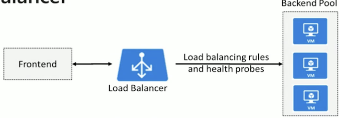
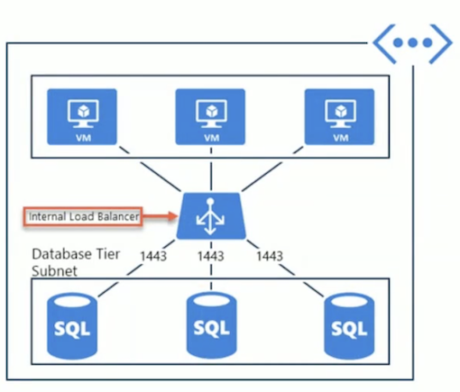
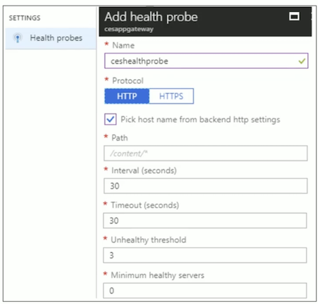

# AZ-103 Implementing Advanced Virtual Networking 

### Course Agenda 

**MO1: Distributing Network Traffic** 

* L01: Overview of Network Traffic Distribution Options 
* L02: Azure Load Balancer 
* L03: Azure Traffic Manager 
* L04: Azure Application Gateway 

**MO2: Site Connectivity** 

* L01: Site-to-Site VPN Connections 
* L02: ExpressRoute 

**M03: Monitoring and Troubleshooting Network Connections** 

* L01: Introducing Network Watcher 
* L02: Implementing Network Watcher 
* L03: Network Troubleshooting Examples 

**Question**

You have an Azure subscription named Subscription1. Subscriptionl contains two Azure virtual machines named VM1 and VM2. 

VM1 and VM2 run Windows Server 2016. VM1 is backed up daily by Azure Backup without using the Azure Backup agent. 

VM1 is affected by ransomware that encrypts data. 

You need to restore the latest backup of VM 1. To which location can you restore the backup? (To answer, select the appropriate options in the answer area. NOTE: Each correct selection is worth one point.) 

* File recovery can be resotred on vm1 and vm2 but cannot create new vm
* vm1 is risky by ransomware so can be only restore to new vm

## AZ-101.3 MO1: Distributing Network Traffic 

* Azure has several options to distribute network traffic. 
* They can each be used in isolation or in combination. 

### Traffic Manager

### Application Gateway 

* **Backend server pool** — List of IP address of backend servers, IP addresses belong to VNet subnet or a public IP/VIP 
* **Backend server pool settings** - Port, protocol, and cookie-based affinity 
* **Frontend port** public port opened on the Application Gateway •
* **Listener**— Frontend port, protocol (HTTP or HTTPS) and SSL certificate (if doing SSL offload) 
* **Rule** — Binds the listener and the backed server pool. Defines which banned pool the traffic should be directed to when it arrives at the listener 

### Azure Load Balancer 

* Distributes inbound traffic to backend resources using load-balancing rules and health probes 
* **Can be used for both inbound/outbound scenarios** 
* Protect on-premises web applications with secure remote access 
* Extend Active Directory to the cloud 
* Two types: **Public and Internal** 

### Public Load Balancer

* Maps public IP addresses and port number of incoming traffic to the VMs private IP address and port number, and vice versa. 
* Apply load balancing rules to distribute traffic across VMs or services. 

### Internal Load Balancer 

* Directs traffic only to resources inside a virtual network or that use a VPN to access Azure infrastructure. 
* **Frontend IP addresses and virtual networks are never directly exposed to an Internet endpoint**. 
* **Enables load balancing within a virtual network, for cross-premises virtual networks, for multi-tier applications, and for line-of-business applications**. 

### Load Balancer SKUs 

* Load balancer supports both **Basic and Standard (newer) SKUs** 
* **SKUs are not mutable** 
* **Load Balancer rule cannot span two virtual networks**
* **No charge for the Basic load balancer** 
* Load Balancer frontends are not accessible across global virtual network peering 

### Backend Pool 

* To distribute traffic, **a back-end address pool contains the IP addresses of the virtual NICs that are connected to the load balancer**

### Load Balancer Rules 

* Maps a frontend IP and port combination to a set of backend IP addresses and port combination*
* **Rules can be used in combination with NAT rules** 
* **A NAT rule is explicitly attached to a VM (or network interface) to complete the path to the target** 

* Round-robin way
* NAT rule

### Multiple Frontend Rules - No Backend Port Reuse

* In the backend pool, each VM exposes **the desired service on a unique port on a dynamic IP address (DIP) — default behavior** 
* **This service is associated with the frontend through a rule definition** 
* **By changing the destination port of the flow, multiple rules can distribute flows to the same DIP but on different ports** 

### Session Persistence

* Session persistence specifies how client traffic is handled. 
* **Client IP** (default) requests can be handled by any virtual machine. 
* **Client IP and protocol** specifies that successive requests from the same address and protocol will be handled by the same virtual machine. 

### Health Probes 

* Allows the load balancer to **monitor the status of an app** 
* Dynamically adds or removes VMs from the load balancer rotation based on their response to health checks 
* **HTTP custom probe (preferred) pings every 15 seconds** 
* **TCP custom probe tries to establish a successful TCP session** 

## Azure Traffic Manager 

### Traffic Manager 

* Allows you to control distribution of user traffic to **service endpoints around the world** 
* Uses **DNS to direct end-user requests to the most appropriate endpoint** 
* Selects an endpoint based on the configuring traffic-routing method 
* **Provides endpoint health checks and automatic endpoint failover** 

### Configrue Traffic Manager

Scenario: multiple web servers distributed globally, each web server fronted by a network load balancer 

* **Create a Traffic Manager profile** 
	* Provides geographic or performance-based routing across different instances of the web server in different regions of the world 
	* **Provides best latency response times** 
	* **Ensures your users connect to the most responsive version or instance of an application** 

### Azure Application Gateway 

* Manages traffic to your web applications 
* Internet-facing gateway, internal-only gateway, or a combination of both 
* **An OSI layer 7 load balancer** 
* **Provides a Web application firewall (WAF)** 
* 99.95% uptime SLA for multi-instance gateways 
* Support for public and private websites 
* **Management through Azure APIs** 
* **Terminology is different from Load Balancer** 

### Azure Application Gateway Components

* **Frontend IP configuration**. Public port on the Application Gateway. 
* **Back-end server pool**. The IP addresses for redirected frontend traffic 
* **Listener**. Has a frontend port, a protocol, and the SSL cert (optional)
* **Rule**. Binds the listener and the backend server pool. 

### Azure Application Firewall

* Provides protection for web applications 
* Uses [OWASP](https://owasp.org/www-project-modsecurity-core-rule-set/) rules to protect applications 
* Rules include protection against attacks like SQL injection, cross-site scripting attacks, and session hijacks 

### Web Application Firewall 

* By default, all **OWASP rules** are applied to your Application gateway
* **Some rules can cause false positives and block real traffic** 
* **Edit the rule set and disable any rules that are not appropriate** 
* **Disable an entire rule group or specific rules under one or more rule groups.** 

### Health Probe

* **Monitors resource health in the backend pool** 
* **Checks every 30 seconds for a healthy HTTP response code** 
* Automatically removes any resource considered unhealthy 
* **Returns healthy backend servers when they respond to health probes** 

### Health Probes 

* Custom health probes have more control over health monitoring 
* Configure the probe interval, the URL and path to test, and how many failed responses to accept 
* **Useful for applications that have a specific health check page or do not provide a successful response on the default web application** 

### Application Gateway Sizing

* Three SKU sizes: **Small (dev and testing only), Medium, and Large** 
* **Each SKU provides different performance benefits (estimates)** 
* There are also Application Gateway service limits 

### Path-Based Routing

* Route traffic to the backend pool based on the incoming URL 
* To configure a path-based rule you must define the path pattern to match. For example, **`/images/*` or `/video/**`* 

### Multiple Site Hosting

* Configure more than one web site on the same Application Gateway 
* Each web site can be directed to its own backend pool of servers 
* Rules are processed in the order they are listed. 

### Secure Sockets Layer Offload 

* **Supports SSL termination at the gateway, after which traffic typically flows unencrypted to the backend servers** 
* Need to create a self-signed certificate that you upload to the Azure portal when you create the listener for the application gateway 

## MO2: Site Connectivity 

### Site-to-Site VPN Connections 

* Connect to your Azure subscription 
* Create a new virtual network and gateway subnet 
* Add a local site 
* Request a public IP address for the VPN device 
* Create a virtual gateway 
* Configure a VPN device 
* Create a VPN connection 
* Verify the VPN connection 

### Site-to-site(S2S) VPN connection

* A S2S connection is for cross-premises and hybrid configurations 
* Uses an IPsec/IKE (IKEv1 or IKEv2) VPN tunnel 
* Requires a VPN device located on-premises that has a public IP address assigned to it 

### Multisite VPN connections

* Variation of the S2S connection 
* More than one VPN connection from your virtual network gateway to on-premises sites 
* There is only one gateway, so all connections share the available bandwidth 
* Use a Route-based VPN 

### Site-to-Site Scenarios

* Capacity On-Demand A connection to Azure to bring more storage or compute resources online 
* Strategic Migration - Typically faster than responding in-house, moves to a pay-as-you-go model, focus on your business not IT 
* Disaster Recovery — Integrated backup and recovery 

## ExpressRoute

### Hybrid Networking 101

### ExpressRoute Connection Options

### Secruity Group View 

* **NSGs are associated at a subnet level or at a NIC level** 
* **Security group view returns all the configured NSGs and rules that are associated at a NIC and subnet level**. 
* A download button (not shown) is provided to easily download all the security rules into a CSV file. 

### NSG Flow Logs

* **View information about ingress and egress IP traffic through an NSG**
* Flow logs are written in json format and show outbound and inbound flows on a per rule basis 
* The JSON format can be visually displayed in Power BI or third-party tools like Kibana. 

## M03: Monitoring and Troubleshooting Network Connections 

### Network Troubleshooting Examples 

### Connection Troubleshoot 

* A tool that enables you to troubleshoot network performance and connectivity issues in Azure 
* Use Connection Troubleshoot to: 
	* Check connectivity between source VM and destination 
	* Identify configuration issues that are impacting reachability 
	* Provide all possible hop by hop paths from the source to destination
	* Review hop by hop latency - min, max, and average between source and destination 
	* View a graphical topology from your source to destination 

* Supports all networking scenarios where the source and destination is an Azure VM, FQDN, URI or an IPv4 Address 

### Troubleshooting Azure Load Balancer (Part 1) 

Scenario 1: VMs behind the Load Balancer are not responding to health probes 

Possible reasons:

* Load Balancer backend pool VM is unhealthy 
* Load Balancer backend pool VM is not listening on the probe port 
* A firewall, or a network security group is blocking the port on the Load Balancer backend pool VMs 
* The Load Balancer is misconfigured 

More information is available at _VMs behind the Load Balancer 
are not responding to health probes_ 

### Troubleshooting Azure Load Balancer (Part 2) 

Scenario 2: VMs not responding to traffic on the configured data port 

Possible reasons: 

* Load Balancer backend pool VM is not listening on the data port 
*  Network security group is blocking the port on the Load Balancer backend pool VM 
*  Accessing the Load Balancer from the same VM and NIC 
*  Accessing the Internet Load Balancer VIP from the participating Load Balancer backend pool VM 

More information is available at: 

* Overview of Application Gateway 
* Symptom: VMs behind Load Balancer are not responding to traffic on the configured data port 

### Troubleshooting Errors in Azure Application Gateway 

* Bad Gateway (502) error — an HTTP status code meaning a server on the Internet received an invalid response from another server 
* Possible reasons for the error: 
	* Network security groups or user defined routes 
	* Custom DNS issues 
	* Problems with health probes
	*  Request time-out 
	* Empty back-end address pool or unhealthy instance 
	* Unhealthy instances in the back-end address pool 

	
More information is available at: 

* Problems with default health probe 
* Troubleshooting bad gateway errors in Application Gateway 

You are configuring a VNet-to-VNet VPN that connects VNets in two different regions, Region A and Region B. The IP address range that you provide for the Local Network for Region A is: 

* **A. the IP address range for the B Region Vnet** 
* B. the IP address range for the A Region Vnet 
* C. the IP address ranges for both the A and B Region VNets 

You have an Azure virtual network named VNet1 that contains a subnet named Subnet1. 

* Subnet1 contains three Azure virtual machines. 
* Each virtual machine has a public IP address.
* The virtual machines host several applications that are accessible over port 443 to user on the Internet. 

Your on-premises network has a site-to-site VPN connection to VNetl. You discover that the virtual machines can be accessed by using the Remote Desktop Protocol (RDP) from the Internet and from the on-premises network. 

**You need to prevent RDP access to the virtual machines from the Internet, unless the RDP connection is established from the on-premises network.** The solution must ensure that all the applications can still be accesses by the Internet users. What should you do? 

* A. Modify the address space of the local network gateway. 
* B. Remove the public IP addresses from the virtual machines. 
* C. Modify the address space of Subnetl. 
* **D. Create a deny rule in a network security group (NSG) that is linked to Subnet1**

You have a public load balancer that balancer ports 80 and 443 across three virtual machines. **You need to direct all the Remote Desktop protocol (RDP) to VM3 only**. What should you configure? 

* **A. an inbound NAT rule** 
* B. a load public balancing rule 
* C. a new public load balancer for VM3 
* D. a new IP configuration 

Question 

Your company has a popular regional web site. The company plans to move it to Microsoft Azure and host it in the Canada East region. The web team has established the following requirements for managing the web traffic: 

* Evenly distribute incoming web requests across a farm of 10 Azure VMs 
* Support many incoming requests, including spikes during peak times 
* Minimize complexity 
* **Minimize ongoing costs** 

* A. Azure Traffic Manager **（cross region)**
* **B. Azure Load Balancer** 
* C. Azure Content Delivery Network 
* D. Azure Cloud Services 
