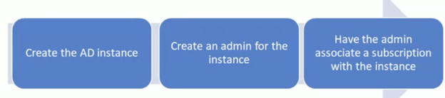

You are an administrator for your company. You have an Azure subscription that contains the resources in the following table. 

To which subnets can you apply NSG1? 

* A. The subnets on VNet2 only 
* B. The subnets on VNet1 only 
* C. The subnets on VNet2 and VNet3 only 
* D. The subnets on VNet1, VNet2, and VNet3 
* **E. The subnets on VNet3 only** 

**subnet, nsg must reside in same region**

# AZ-103.8 Managing Identities And Securing Identities 

### Securing Identities 

**M01: Introduction to Identity Protection in Azure** 

* L01: Role-based Access Control 
* L02: Azure Active Directory (Refresher) 
* L03: Protecting Privileged Access in the Environment 

**MO2: Using Multi-Factor Authentication (MFA) for Secure Access** 

* L01: Introducing MFA 
* L03: Implementing MFA 

**M03: Azure AD Privileged Identity Management** 

* L01: Getting Started with PIM 
* L02: PIM Security Wizard 
* L03: PIM Directory Roles 
* L04: PIM for Role Resources 

### Manage Identities 

**Manage Azure Active Directory (AD)**

*May include but not limited to*: 

Add custom domains; configure Azure AD Identity Protection, Azure AD Join, and Enterprise State Roaming; configure self-service password reset; implement conditional access policies; manage multiple directories; perform an access review • Manage 

**Azure AD objects (users, groups, and devices)** 

*May include but not limited to*: 

Create users and groups; manage user and group properties; manage device settings; perform bulk user updates 

**Implement and manage hybrid identities** 

*May include but not limited to:* 

Install and configure Azure AD Connect; configure federation and single sign-on; manage Azure AD Connect; manage password sync and writeback 

## AZ-103.8 Module 01: Managing Azure Active Directory 

### Azure Active Directory 

* **Microsoft's multi-tenant cloud-based directory and identity management service** 
* **Provides SSO access** 
* Identity management capabilities and integration 
* Integrates with Windows Server Active Directory 

### Azure Active Directory Benefits

* Single sign-on to any cloud or on-premises web app 
* Compatible with ioS, Mac OS X, Android, and Windows devices 
* Protect on-premises web applications with secure remote access 
* Extend Active Directory to the cloud 
* Help protect sensitive data and applications 

### Azure Active Directory Edititions

* **Azure Active Directory Free**:  designed to introduce system administrators to **Azure Active Directory**. 
* **Azure Active Directory Basic** designed for task workers with cloud-first needs, this edition provides cloud-centric application access and self-service identity management solutions. 
* **Azure Active Directory Premium P1** designed to empower organizations with more demanding identity and access management needs. 
* **Azure Active Directory Premium P2** includes every feature of all other Azure Active Directory editions enhanced with advanced identity protection and privileged identity management capabilities. 

### Configure Self-service Password Reset

* Determine who will be enabled to use self-service password reset 
* **Narrow your selection to specific groups**  (select)

### Authentication Methods for Password Reset 

**Choose the:** 

* Number of authentication methods required to reset a password 
* Number of authentication methods available to users 

**Authentication methods include**: 

* Email notification 
* Text or code sent to phone 
* Number of security questions to be registered and how many must be correctly answered 

### Password Writeback 

* Use Password Writeback to configure Azure AD to write passwords back to your on-premises Active Directory 
* A component of Azure AD Connect 
* Available to subscribers of Premium Azure Active Directory editions •
* Removes the need to set up and manage an on-premises SSPR solution 

### Azure AD Identity Protection

* **Protect your organization from compromised accounts, identity attacks, and configuration issues**. 
* **Get a consolidated view of identity threats and vulnerabilities**. 
* Receive notifications of new identity risks, perform recommended remediation, and automate future response with Conditional Access policies. 

### Vulnerabilities Detected 

* Vulnerabilities are weaknesses in your environment that can be exploited by an attacker 
* Review risk level, count, and vulnerability 

### Risky Sign-Ins

* **Azure AD detects suspicious actions related to user accounts** 
* For each detected action, a **risk event** is created 
* Risk events are used to calculate risky sign-ins, and users flagged for risk 

### Risk Detected

* Users with leaked credentials 
* Sign-ins from anonymous IP addresses 
* Impossible travel to atypical locations 
* Sign-ins from infected devices 
* Sign-ins from IP addresses with suspicious activity 
* Sign-ins from unfamiliar locations 

### Question

Your company has a hybrid environment with some applications and services in an on-premises data center and some applications and services in Microsoft Azure. 

The company intends to strengthen identify verification and access controls for Azure administrators by using conditional access. 

The information security team issues the following requirements: 

* If Azure calculates that there is a **chance that an unauthorized person is using an account**, then **multi-factor authentication must be required for the sign-in**. 
* If any administrators attempt to access Microsoft Azure while off the **corporate networks, the sign-ins must be blocked**. 

You need to configure conditional access to support the requirements. Which conditional access features should you configure? (Each answer presents part of the solution. Choose two.) 

* A. Device platforms 
* **B. Locations** 
* **C. Sign-in risk** 
* D. Client apps 
* E. Score 

### Sign-in Risk Condition 

* Sign-in risk is an indicator (high, medium, low) that the legitimate owner of an account did not perform a sign-in attempt 
* **Azure AD calculates the risk level during sign-in attempt** 
* Use the sign-in risk level as a condition in a conditional access policy 
* **Must have Azure Active Directory Identity Protection enabled** 

### Locations Condition 

* Define conditions based on the location of the connection attempt 
* Require MFA for users accessing a service when they are off the corporate network 
* Block access for users accessing a service from specific countries or regions 
* Ensure that access to a non-production Azure environment occurs only from a non-production network 

## Module 02: Managing Azure AD Objects 

### Domain

* An Azure subscription has a domain - `domainnames.onmicrosoft.com` 
* Add **any routable custom domain** name you control 
* Only Global administrators can perform domain management tasks 
* Domain names in Azure AD are globally unique 
* A custom domain name must be added and verified (next topic) 

### Verifying Custom Domain Name 

1. Add the custom domain name (unverified state) 
2. **Add a DNS entry (TXT or MX)** 
3. Verify ownership of the custom domain name by checking for the DNS record in the registered domain 

### Tenants

* A tenant is a dedicated instance of Azure AD 
* Houses the users in a company and their information 
* Can have multiple tenants, each with a different purpose 
* The steps are straightforward (upcoming video) 

### Multiple Tenants

* Each tenant is a fully independent resource 
* This independence between tenants includes resource independence, administrative independence, and synchronization independence 

### User accounts

* All users must have a user account 
* **Contains all the information to authenticate and authorize the user** 
* Different identity sources: **cloud identities, directory-synchronized identities, and guest users**. 

### Group Accounts

* Two types of groups: security and distribution 
* Two ways to add members: assign directly and assign dynamically 
* For PowerShell, **New-AzureADGroup** 

### Role-Based Access Control

1. Provide access to administrators based on their assigned tasks 
2. **Define what actions are allowed and/or denied** 
3. Associate the role with a user, group or service principal 
4. Scope to a subscription, a resource group, or specific resources 

### Role Assignment 

**Users** 

* Assigned to organizational users in the AD associated with the subscription 
* Or, external Microsoft accounts in the same directory 

**Groups** 

* Assigned to Azure AD security groups 
* Best practice: **manage access through groups, adding roles, and assigning** 

**Service Principals**
 
* Service identities represented as service principals in the directory
* Authenticate with Azure AD and securely communicate with one another 

### Device Management 

* **Azure AD enables SSO to devices from anywhere (BYOD)** 
* **Option 1: Registering a device** 

	* Enable a registered device to authenticate when the user signs-in Disable the device, as needed 

* **Option 2: Joining a device**

	* Extends a registered device - all the benefits of registration 
	* Changes the local state of device 
	* Sign-in using an organizational work or school account instead of a personal account. 

### AD Join (Benefits) 

* Single-Sign-On (SSO) to your Azure managed SaaS apps and services 
* Enterprise compliant roaming of user settings across joined devices 
* Access to Windows Store for Business 
* Windows Hello support 
* Restriction of access to apps from only compliant devices 
* Seamless access to on-premise resources 

**QUESTION**

Your company has an existing Azure tenant named `alpineskihouse.onmicrosoft.com.` The company wants to start using alpineskihouse.com for their Azure resources. You add a custom domain to Azure. 

Now, you need to add a DNS record to prepare for verifying the custom domain. What should you do? (Each answer presents a complete solution. Choose two.) 

* A. Add an PTR record to the DNS zone. 
* **B. Add a TXT record to the DNS zone.** 
* **C. Add an MX record to the DNS zone.** 
* D. Add an SRV record to the DNS zone 
* E. Add a CNAME record to the DNS zone. 

## Module 03: Implementing and Managing Hybrid Identities 

### Azure AD Connect

* Integrates on-premises directories with Azure Active Directory 
* Sync Services creates and syncs users, groups, and objects 
* **Azure AD Connect Health provides central location monitoring** 
* AD FS is optional for hybrid scenarios 

### Sign-On Methods 

* Password Synchronization can synchronize an encrypted version of the password hash for user accounts 
* **Pass-through authentication (PTA) authenticates the username and password with the on-premises domain controllers** 
* **AD FS is the Microsoft implementation of an identity federation solution that uses claims-based authentication** 

### Azure AD Connect Health

* **AD FS servers, Azure AD Connect, and AD domain controllers** 
* **Synchronizations between your on-premises AD DS and Azure AD** 
* On-premises identity access Office 365 or other Azure AD applications 
* **View and act on alerts, setup email notifications for critical alerts, and view performance data**. 

### What is Azure Active Directory Application Proxy

* Provides remote access as a service - installed in the datacenter 
* Two connectors are recommended for greater resiliency 
* Windows Server 2012 R2 or higher on the on-premises connector 
* Don't need to change the network infrastructure 

### How does Application Proxy Work?

## Module 4: Using Multi-Factor Authentication for Secure Access 

* The security of MFA two-step verification lies in its layered approach 
* Authentication methods include: 
	* Something you know (typically a password) 
	* Something you have (a trusted device that is not easily duplicated, like a phone) 
	* Something you are (biometrics) 

### Azure MFA Features 

* Get more security with less complexity 
* Mitigate threats with real-time monitoring and alerts 
* Deploy on-premises or on Azure 
* Use with Office 365, Salesforce, and more 
* Add protection for Azure administrator accounts 

### MFA Licensing and Pricing 

* There are three pricing methods for Azure MFA. 
* Consumption based billing 
	* **Per user**. You can pay per user. Each user has unlimited authentications. Use this model if you know how many users you have and can accurately estimate your costs. 
	* **Per authentication**. You can pay for a bundle (10) of authentications. Use this model when you are unsure how many users will participate in MFA authentication. 

* MFA licenses included in other products 
* Direct and Volume licensing 

### Microsoft Authenticator App 

* Prevent unauthorized access to accounts 
* Stop fraudulent transactions by giving you an additional level of security 
* Use either as a second verification method or as a replacement for 
your password when using phone sign-in 
The app can work in one of two ways: 
	* **Notification**. The app sends a notification to your device, then Verify or Deny 
	* **Verification code**. Open the app and copy the verification code onto the sign-in screen 

### MFA User Settings 

* Phone Call 
* **Text Message**. A six-digit code is sent to the user's cell phone. 
* **Mobile App Notification** 
* **Mobile app verification code**. A six-digit code is sent to the user mobile app 
* Cache passwords (1 to 60 days) 

	

## Module 5: Azure AD Privileged Identity Management 

### Azure AD PIM 

* PIM, just-in-time administration, is a cloud-based service 
* Minimize the number of users who can execute privileged operations 
* **Identify users are assigned privileged roles** 
* View administrator activation 
* Require approval to activate 
* Review membership of administrative roles 

### PIM Tasks 

* Display a list of eligible and active roles assigned to you 
* Display a list of requests to activate eligible Azure AD directory roles 
* Display pending requests to activate eligible role assignments. 
* List active access reviews 
* Display the dashboard 

### PIM Access

* The global administrator who enables PIV automatically gets role assignments and access to PIM •
* Other global administrators, security administrators, and security readers have read-only access to Azure AD PIM 
* The first user can assign others to the Privileged role administrator 
 

### PIM Dashboard

* A graphical representation of resource role activations. 
* Two charts that display the distribution of role assignments by assignment type 
* A data area pertaining to new role assignments. 

**QUESTION 1**

Your company recently implement0 Azure pass-through authentication. Users are now able to authenticate to Azure using their corporate credentials. The management team wants to enhance the user experience. The team comes up with the following requirements. 

Minimize the number of times that users must manually enter credentials Minimize on-premises infrastructure 

You need to reconfigure the authentication solution to maintain the existing functionality while adding functionality dictated in the requirements. What should you do? 

* A. Remove Azure pass-through authentication and deploy Active Directory Federation Services (AD FS). 
* B. Deploy Active Directory Federation Services (AD FS). **(cost to much)**
* **C. Deploy Azure single sign-on**. 
* D. Remove Azure pass-through authentication and deploy Azure single sign-on. 

**QUESTION 2** 

Your company has an on-premises AD DS domain that is synced with Microsoft Azure. The company recently implemented dzure pass-through authentication. 

Everything is functional. A few weeks later, the network team performs a change to the company's firewalls. 

Thereafter, pass-through authentication stops functioning. You need to put in an emergency change request to open the minimum number of ports so that pass-through authentication functions. 

Which ports should you open? 

* A. Only inbound TCP port 80 and inbound TCP port 443. 
* B. Only inbound and outbound TCP port 443. 
* **C. Only outbound TCP port 80 and outbound TCP port 443.** 
* D. Only outbound TCP port 443 and inbound TCP port 80. 

You are a systems administrator for Alpine Ski House. The company has a large on-premises environment spread across multiple locations. The on-premises environment includes the following technologies: 

* Active Directory Domain Services (AD DS) 
* Third-party multi-factor authentication service 
* Windows10 

The company is planning to implement services across a range of Microsoft Azure services, such as SaaS and PaaS. You are tasked with deploying a hybrid identity solution. 

The company has established the following requirements for the project  

* All access to Microsoft Azure must use multi-factor authentication 
* All multi-factor authentication must use the existing MFA service 
* Users must be provided with a single sign-on experience when going to the Azure portal 

You need to implement a solution to meet the requirements. You plan to deploy Azure AD Connect. What else should you do? 

* **A. Implement Active Directory Federation Services (AD FS)**. 
* B. Implement Azure pass-through authentication and Azure single sign-on. **(doesn't support 3rd paty authentication)**
* C. Implement Azure multi-factor authentication. 
* D. Implement Azure AD Domain Services. 
* E. Implement Web Application Proxy servers. **(only support access local service from remote)**

**QUESTION 4** 

Your company has Microsoft Azure, which is accessed over the internet. Your company is preparing to deploy Azure AD Application Proxy **to enable users to gain access to on-premises applications**. Your existing on-premises environment includes the following technologies: 

Windows Server 2016 Active Directory Domain Services Your existing Azure environment includes Azure Active Directory Basic. 

You need to deploy the required technology prerequisite for Azure AD Application Proxy. 

What should you do? 

* A. Deploy Azure Active Directory Premium P1. 
* B. Deploy Azure Active Directory Premium P2. 
* C. Deploy a Web Application Proxy server on-premises. 
* D. Deploy a Web Application Proxy server in Azure IaaS 
* E. Deploy Active Directory Federation Services on-premises. 
* F. Deploy Active Directory Federation Services in Azure IaaS. 
* **G. Deploy Application Proxy Connector on-premises**. 
* H. Deploy Application Proxy Connector in Azure IaaS. 

**Question 5**

Your company recently deployed several applications and services in Microsoft Azure. During the deployments, the company relied on the existing on-premises access management method which is made up of security groups that are used to grant access. 

The information security team issues a new public cloud policy to strengthen the security for administrative access in the cloud. The new public cloud policy includes the following requirements: 

* **Administrators must not have standing access in Azure**. 
* First-level administrators must have approval prior to performing administrative work in Azure. 
* You need to implement a solution to enable your company to meet the new requirements. 

Which solution should you implement? 

* A. Azure Key Vault 
* B. OMS Security and Audit Solution 
* C. Azure AD Premium 
* D. Azure AD DS Premium 
* **E. Azure AD Privileged Identity Management** (temporary  Administrators access)
* F. Azure Advanced Threat Analytics 
