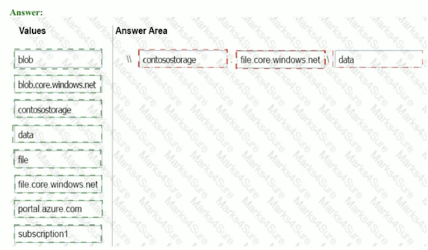
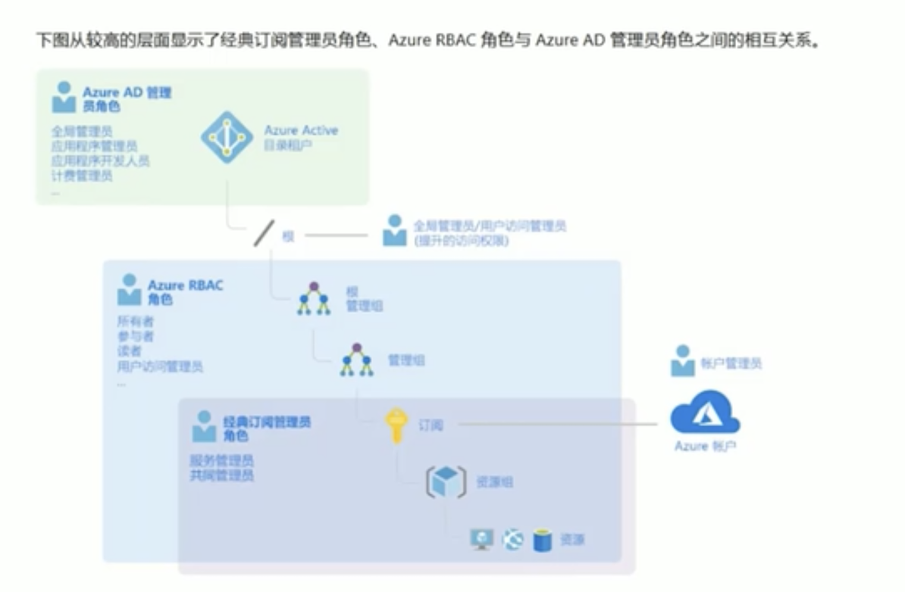
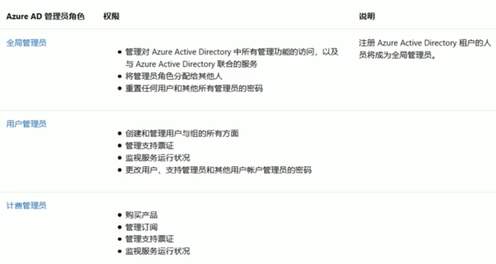
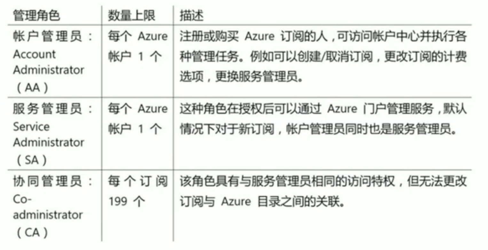
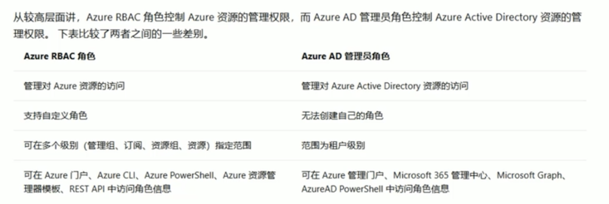
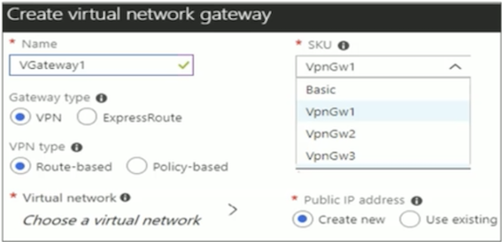
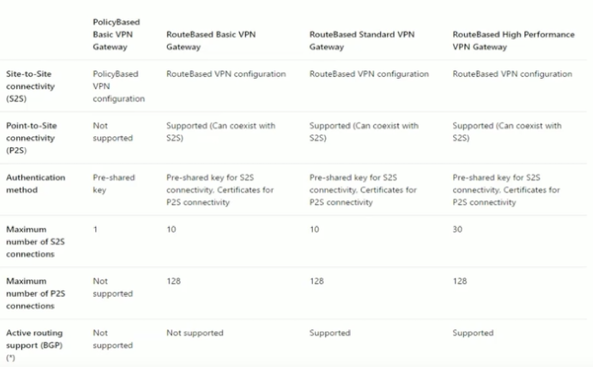
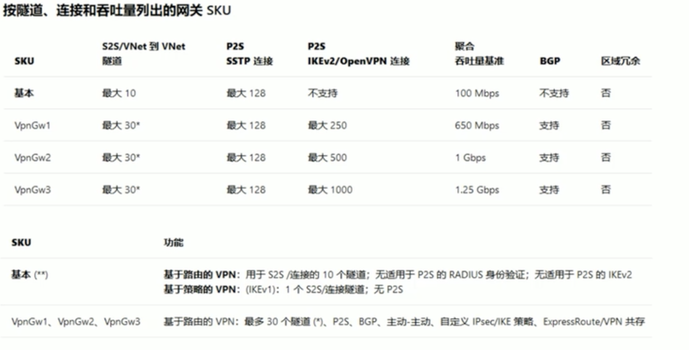

# Azure103 Courses and Exam Tips Summary

### Pre-class practice 

You have an Azure subscription named Subscription1. You create an Azure Storage account named **contosostorage**, and then you create a **file share named data**. Which UNC path should you include in a script that references files from the **data** file share? To answer, drag the appropriate values to the correct targets. Each value may be used once, more than once, or not at all. You may need to drag the split bar between panes or scroll to view content 

**`domain_name.file.core.windows.net\data`**

### Course Agenda 

* 01: 考试介绍 
* 02：考点总结 
* 03：知识点总结 
* 04: 考题练习 

课程回顾

* 第一节课：Azure订阅的管理，云资源的访问管理，条件访问策略，用户和组，监视和诊断，日志分析，azure资源管理器 
* 第二节课：Azure存储概述，存储账户，四种存储服务，保护和管理存储 
* 第三节课：存储的备份，文件同步，导入导出服务，CDN，存储的安全性 
* 第四节课：创建虚拟机，配置虚拟机，配置可用性和可扩展性，虚拟机的备份 
* 第五节课：创建和配置虚拟网络，IP地址和服务终结点，路由表，Azure DNS，网络安全组 
* 第六节课：对等连接，虚拟网络连接 
* 第七节课：高级虚拟网络，监控和排除网络连接故障 
* 第八节课：管理AAD，实现和管理混合身份，多因素身份验证，特权身份管理 

订阅和资源组考点总结

1. log analytics查询语句怎么写：Kusto查询语言 
2. azure alert警报中操作组和规则 
3. azure resource manager template 
4. azure tags 
5. azure policy 
6. azure lock 

### 存储考点总结 

1. 共享签名（SAS)的设置 
2. 如何将本地文件同步到azure上去？具体步骤 
3. 恢复服务保管库 
4. 如何恢复虚拟机的备份
5. 如何恢复被删除的文件的备份
6. 文件备份可以存储的最久的时间：99年 
7. 备份需要一个恢复服务保管库，需要定制一个备份策略 
8. 存储密码：Key Vault 
9. 数据导入导出的具体步骤 
10. 数据备份类型和存储账号类型选择 
11. Azure blob storage 

### 虚拟机考点总结 

1. 对虚拟机做出各种操作，什么清况会导致虚拟机关机重启 
2. 网络接口: 如何将应用程序安全组应用到虚拟机  
3. `availability  set`中重置虚拟机的大小 
4. 一个虚拟机附加另一个虚拟机磁盘的步骤 
5. 虚拟机从订阅1移动到订阅2最方便的方法 

### 虚拟网络考点总结

1. DNS record的类型选择 
2. peering-to-
3. peering对等连接，最简单，最省时间 
3. 网络安全组 
4. 子网应用网络安全组，必须要在同一个区域 
5. azure路由表和路由 
6. load balancer的session persistence 
7. load balancer内部负载均衡 
8. load balancer类型（basic, standard),frontend IP, backend pools, health probe, rules 
9. `point-to-site`实现方式（创建基于路由的虚拟网络网关） 
10. `application gateway backend pools`,rule, listener
11. site一to一site连接
12. `peering-to-peering`的连接类型（`forwarded traffic`) 
13. `Network Watcher Connection monitor`, IP flow 

### Azure AD考点总结 

1. MFA的几种验证方式 
2. RBAC的操作 
3. AAD Licenses 
4. AAD Privileged Identity Management 
5. Access control 
6. MFA block user 
7. just-In-time access 
8. two-step verification user 
9. conditional access policy 

### Azure中管理员和角色比较 

### Azure AD 管理员

### 订阅管理局

### Azure RBAC角色和Azure AD管理员角色之间的差别 

### VPN gateway

* Each virtual network needs a VPN gateway 
* Most VPN types are Route-based, select a gateway SKU 
* The SKU affects the number of tunnels and the throughput 
* The gateway needs a public IP address 

### Virtual Network Connectivity

### Gateway SKU

### 实现`site-to-site`连接的步骤 

1. 创建虚拟网络 
2. 指定DNS服务器 
3. 创建网关子网 
4. 创建VPN网关 
5. 创建本地网关 
6. 配置VPN设备 
7. 创建VPN连接 
8. 验证VPN连接 

### 本地文件同步到Azure的步骤 

1. 部署存储同步服务 
2. 准备Windows Server，用于Azure文件同步 
3. 在window server上安装Azure文件同步代理 
4. 将Windows Server注册到存储同步服务 
5. 创建同步组和云终结点 
6. 创建服务器终结点 

### azure导入导出操作步骤 

1. 附加一个外部的磁盘到本地服务器 
2. 在本地服务器，运行`waimportexport.exe ` 
3. 在Azure portal，创建一个导入的作业 
4. 从本地服务器移除附加的磁盘并寄送磁盘到Azure数据中心 
5. 在`azure portal`，更新导入的作业 

