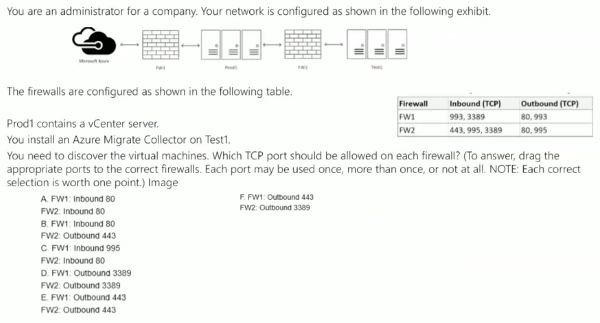
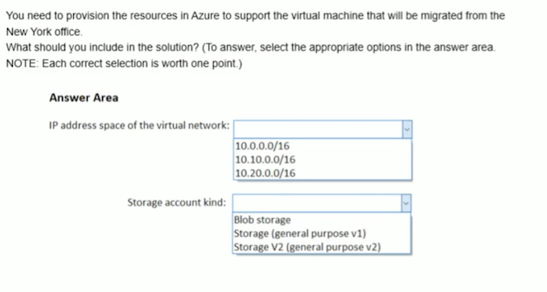

### Question1 

You need to define a **custom domain name** for Azure AD to support the planned infrastructure. Which domain name should you use? 

* A. ad.humongousinsurance.com 
* B. humongousinsurance.onmicrosoft.com 
* C. humongousinsurance.local 
* **D. humongousinsurance.com** 

### Question2

You have an Azure subscription named Subscription1 that is used be several departments at your company. Subscriptionl contains the resources in the following table: 

Another administrator deploys a virtual machine named VM1 and an Azure Storage account named Storage2 by using a single Azure Resource Manager template. You need to view the template used for the deployment. From which blade can you view the template that was used for the deployment? 

* **A. RG1**
* B. VM1 
* C. Storage1
* D. Container1

### Question3

You download an Azure Resource Manager template based on an existing virtual machine. The template will be used to deploy 100 virtual machines. 
You need to modify the template to reference an administrative password. You must prevent the password from being stored in plain text. 
What should you create to store the password? 

* A. Azure Active Directory (AD) Identity Protection and an Azure policy 
* B. a Recovery Services vault and a backup policy 
* **C. an Azure Key Vault and an access policy** 
* D. an Azure Storage account and an access policy 

### Question4

You have an Azure Linux virtual machine that is protected by Azure Backup. One week ago, two files were deleted from the virtual machine. You need to restore the deleted files to an on-premises computer as quickly as possible. Which four actions should you perform in sequence? To answer, move the appropriate actions from the list of actions to the answer area and arrange them in the correct order. 

### Question 5

You have an Azure subscription that contains two resource groups named RG1 and RG2. RG2 does not contain any resources. RG1 contains the resources in the following table. 

Which resource can you move to RG2? 

* **A. W10_OsDisk** 
* B. VNet1 
* C. VNet3 
* D. W10 

### Question 6

You have an Azure Active Directory (Azure AD) tenant named contoso.onmicrosoft.com that contains 100 user accounts. You purchase 10 Azure AD Premium P2 licenses for the tenant. You need to ensure that 10 users can use all the Azure AD Premium features. What should you do? 

* A. From the Groups blade of each user, invite the users to a group. 
* **B. From the Licenses blade of Azure AD, assign a license**. 
* C. From the Directory role blade of each user, modify the directory role. 
* D. From the Azure AD domain, add an enterprise application. 

### Question 7 （operation)

You may start the lab by clicking the Next button. You need to deploy an Azure virtual machine named VM1004a based on the Ubuntu Server 16.04 image, and then to configure VM1004a to meet the following requirements: The virtual machine must contain data disks that can store at least 15 TB of data. The data disks must be able to provide at least 2,000 IOPS. Storage costs must be minimized. 

What should you do from the Azure portal? 

### Question 8 （operation)

To start the lab You may start the lab by clicking the Next button. Your on-premises network uses an IP address range of 131.107.2.0 to 131.107.2.255. You need to ensure that only devices from the on-premises network can connect to the rg 1 lod7523691n1 storage account. 

What should you do from the Azure portal? 

**131.107.2.0/24**

### Question 9
 
You have an Azure subscription that is used by four departments in your company. The subscription contains 10 resource groups. Each department uses resources in several resource groups. You need to send a report to the finance department. 

The report must detail the costs for each department. Which three actions should you perform in sequence? (To answer, move the appropriate actions from the list of actions to the answer area and arrange them in the correct order.) 

**A**

### Question 10 

You are an administrator for a company. You plan to create an Azure Storage account in the Azure region of East US 2. You need to create a storage account that meets the following requirements: 

- Replicates synchronously 
- Remains available if a single data center in the region fails. 

How should you configure the storage account? (To answer, select the appropriate options in the answer area. NOTE: Each correct selection is worth one point.) 

**D** / **C** 

### Storage V2

### Storage V1

### Question 11

You have an azure subscription that contains a virtual network named VNet1. VNet1 contains four subnets named Gateway, Perimeter, NVA, and Production. 

The NVA subnet contains two network virtual appliances (NVAs) that will perform network traffic inspection between the perimeter subnet and the production subnet. You need to implement an Azure load balancer for the NVAs. 

The solution must meet the following requirements: 

- The NVAs must run in an active-active configuration that uses automatic failover. 
- The NVA must load balance traffic to two services on the Production subnet. 
- The services have different IP addresses. 
- Which three actions should you perform? (Each correct answer presents parts of the solution. NOTE: Each correct selection is worth one point.) 

* A. Add two load balancing rules that have HA Ports enabled and Floating IP disabled. 
* **B. Deploy a standard load balancer.** 
* **C. Add a frontend IP configuration, two backend pools, and a health probe.** 
* D. Add a frontend IP configuration, a backend pool, and a health probe.
* **E. Add two load balancing rules that have HA Ports and Floating IP enabled.** 
* F. Deploy a basic load balancer. 

### Question 12

You have an Azure Migrate project that has the following assessment properties: 

- Target location: East US 
- Storage redundancy: Locally redundant. 
- Comfort factor: 2.0 
- Performance history: 1 month 
- Percentile utilization: 95th 
- Pricing tier: Standard 
- Subscription: Pay as you go 

You discover the following two virtual machines: 

- A virtual machine named VM1 that runs Windows Server 2016 and has 10 CPU cores at 20 percent utilization. 
- A virtual machine named VM2 that runs Windows Server 2012 and has four CPU cores at 50 percent utilization. 

How many CPU cores will Azure Migrate recommend for each virtual machine? (To answer, select the appropriate options in the answer area. NOTE: Each correct selection is worth one point.) 

* A. VM1: 1 VM2: 1 
* B. VM1: 1 VM2: 2 
* C. VM1: 2 VM2: 1 
* D. VM1: 3 VM2: 2 
* E. VM1: 3 VM2: 3 
* **F. VM1: 4 VM2: 4** 

### Question 13

You are an administrator for a company. You have an Azure subscription named Subscription1. In Subscription1, you create an alert rule named Alert1. The Alert1 action group is configured as shown in the following exhibit. 

Alert1 alert criteria is triggered every minute. Use the drop-down menus to select the answer choice that completes each statement based on the information presented in the graphic. (NOTE: Each correct selection is worth one point.) 

**60 / 12**

### Question 14

**E**

### Question 15

**B / A / C / B**

### Practice: Alerts 

Audit and receive notifications about important actions in your Azure subscription 

* Create a network security group 
* Browse the Activity Log in the portal 
* Browse an event in the Activity log 
* Create an Activity log alert 
* Test the Activity log alert 

### Practice: Network Security Group 

Use a network security group to filter inbound network traffic for virtual network subnets. 

* Create a virtual network 
* Create an application security group 
* Create a network security group 
* Associate a network security group to a subnet 
* Create a security rule 
* Create a virtual machine 
* Associate a network interface to ASG 

### Practice: Standard Load Balancer 

Create a standard load balancer with the Azure portal to load balance VMs. 

* Create a public load balancer 
* Create backend servers(Create a virtual network, Create virtual machines, Create NSG rule, Install IIS) 
* Create load balancer resources(Create a backend address pool, Create a health probe, Create a load balancer rule) 

