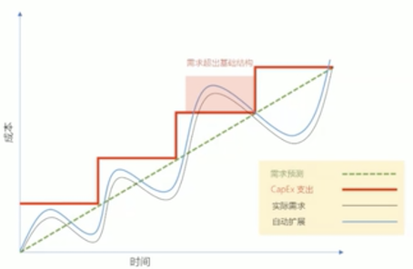
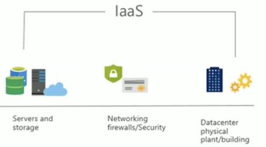
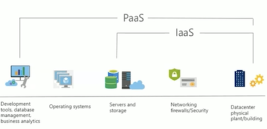
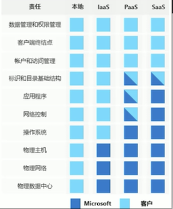

# Module 01: 云概念

### 第一课一学习目标

* 描述和了解云服务及其优势
* 了解在使用云服务时遇到的关键术语
* 了解公共、私有和混合云模型
* 理解基础架构既服务（IaaS)
* 理解平台理解既服务（PaaS) 
* 理解软件理解既服务（SaaS) 

### 资本支出 vs 运营支出 

* 资本支出（`CapEx`）是将资金提前用于有形基础设施，然后随 着时间的推移从税单中扣除这笔费用。**`CapEx`是一种前期成本， 其价值会随着时间的准移而降低。**
* 运营支出（`OpEx`）是将钱花在服务或产品上，并立即为其计费。 你可以在同一年从税单中扣除这笔费用。**没有前期成本，你用的时候就为服务或产品买单。**

### 公有云

公有云由云服提供商拥有，它为通过安全网络连接（通常是通过互联网连接到云服务）的多个组织和提供资源和服务

### 私有云 

私有云由使用该云资源的组织拥有和运营。 他们在自己的数据中心中创建云环境，并为组织内的用户提供对计算资源的自助访问。本组织仍然是所有者，对具提供的服务的运作负全部责任。 

### 混合云

混合云结合了公共云和私有云，使您能够在最合适的位置运行应用程序 

### 云模型比较 

**公共云**： 

* 没有资本支出．您不必购买新服务器即可扩展．
*  敏捷。应用程序可以快速访问，并在需要时取消配置 
*  基于消耗的模型。组织只需为其使用的内容付费，并在`OpEx`模型下运行。 

**私有云**： 

* 控制。组织可以完全控制资源。 
* 安全。组织可以完全控制安全性． 

**混合云：** 

* 灵活性．最灵活的方案。使用混合云设置，组织可以确定是在私有云中还是在公共云中运行其应用程序。
*  合规。组织保持跟据需要遵守严格的安全、合规性或法律要求的能力。 

**关键概念和术语**

* 云服务具有某些特征和注意事项，例如： 
* 高可用性 
* 可伸缩性 
* 弹性＆敏捷 
* 容错 
* 灾难恢复 
* 全球茬盖 
* 预测成本的考虑 
* 安全 

### IaaS

IaaS 是云计算中最基本的类型，使用IaaS,您可以从运提供商处按现收现付的方式租用IT基础架构服务以及虚拟机（Vm) 存储， 网络和操作系统。它是一种即时计算基础设施，通过互联网进行管理和配置

### PaaS

PaaS 为构建，测试和部署软件应用程序提供了一个环境.PaaS的目标是帮助尽快创建应用程序， 而不必关注管理基础应用结构

### SaaS

 SaaS 是最终为客户集中管理和托管的软件， 它允许用户通过互联网链接和使用基于云的应用程序。常见的实例包括电子邮件，日历和办公软件， 如Microsoft Office 365
 
##  云服务比较 

* **IaaS 灵活性**。IaaS 是最灵活的云服务，因为您可以控制配置和管理运 行应用程序的硬件。 

* **PaaS 生产效率**。用户只能专注于应用程序开发，因为所有平台管理都由 云提供商处理。作为服务与分布式团队合作更容易，因为该平台可以通过 互联网访问，并且可以更轻松地在全球范围内使用。 

* **SaaS 现收现付定价模式。** 无论用户使用该软件的数最多少，他有都会为其在订阅模型上使用的软件付费，通常是按月或按年付费。 

### 管理职责

* IaaS高要对所有云服务进行址多的用户管理。用户负责管理操作系统、数据和应用程序。
* PaaS需要更少的用户管理。云提供商管理操作系统，用户负责他们运行和存储的应用程序和数据。 
* SaaS所需的管理最少。云提供商负责管理一切，终用户只使用软件.

An organization that hosts its infrastructure <mark>_in a private cloud_</mark>  can decommission its data center.

* Instructions: Review the underlined text. If it makes the statement correct, select "No change is needed". If the statement is incorrect, select the answer choice that makes the statement correct. 
* A. No change is needed. 
* B. in a hybrid cloud 
* **C. in the public cloud** 
* D. on a Hyper-V host 

What are two characteristics of the public cloud? Each correct answer presents a complete solution. NOTE: Each correct selection is worth one point. 

* A. dedicated hardware 
* B. unsecured connections 
* C. limited storage 
* **D. metered pricing** 
* **E. self-service management**

