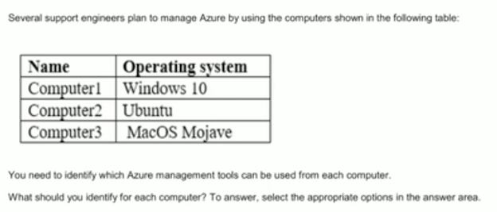
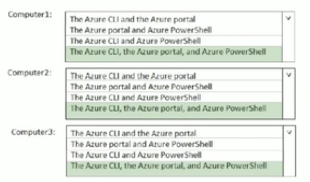

# 核心Azure 服务

### 第一课一学习目标 

* 了解和描述Azure核心体系结构组件
* 了解和描述核心Azure服务和产品
* 了解和描述Azure解决方案
* 了解和描述Azure管理工具 

## Azure核心体系结构组件

### 区域

* Azure 由位于全球各地的数据中心组成， 按国家/地区对这些数据中心进行组织并提供给最终用户
* 就区域中心而言，一个区域是地区上的一个地理区域，其实包含一个但可能多个数据中心，这些数据中心距离较近，并与低延迟网络联网

### 区域－一续 

* 特殊`Azure `区域：
* Azure还具有一些特殊区域，您可能希望在为合规性或法律目的构建 
* 应用程序时使用这些区域．特殊区域是： 
	* Azure政府 
	* Azure德国 
	* Azure China 2lVianet 
* 区域对： 
* 每个Azure区域都与同一地理位且中的另一个区域（如美国、欧洲或亚洲）配对。此方法允许跨地理区域复制资源（如虚拟机（VM）存储）, 以帮助减少因影响两者的自然灾害、断电或物理网络中断等事件而中断的可能性区域一次． 

### 地区 

* 地区是一个独立的市场，通常包含两个或多个区域，可保留数据驻留和合规性 边界 
* 地理位置允许具有特定数据驻留和合规性需求的客户关闭其数据和应用程序 
* 地区分为美洲、欧洲、亚太、中东和非洲 

### 可用区域 

* 可用区是Azure区域中物理上 独立的位置。
* 每个可用区由一个或多个配备独立电源、冷却和网络的数据中心 组成。 
* 可用区设置为隔离边界。 
* 如果一个可用区出现故障，另一个区域将继续工作。 

### 可用性集

* 可用性集是一种在需要高影响维护事件或 发生硬件故障时帮助确保应用程序保持联机的方法 
* 可用性集由**更新域和故障域**组成： 
* **更新域**。
	* 当维护事件发生时（如应用了 性能更新或关键安全修补程序），将通过更新域对更新进行排序。 
* **故障域**。
	* 故障域提供了数据中心中不同硬件之间工作负载的物理分离。 

### 资源组

* 资源组是Azure中资源的管理单元。 
* 将资源组视为一个容器，允许您在单个可管理单元中聚合和管理应用程序所需的所有资源 

### Azure资源管理器 

* Azure资源管理器是一个管理层，在其中创建、配置、管理和删除资源组及其中的所有资源 
* 使用Azur额资源管理器，您可以： 
	* 部署应用程序资源
	* 组织资源 
	* 控制访问和资源 

## Azure服务和产品

### Azure计算服务 
Azure计算是用于运行基于云的应用程序的按需计算服务。它提 供计算资源，如磁盘、处理器、内存、网络相操作系统。 

* 资源可按需使用，通常可以在几分钟甚至几秒钟内提供。您只需为所使用的资源付费， 且只需使用这些资源即可。 
* 在Azure中执只计算的两种常见服务类型是虚拟机和容器。 

### Azure 计算服务一容器服务 

* 容器是一种虚拟化环境。但足，与虚拟机不同，它们不包括操作系统。容器是轻量级的并且设计为创建、扩展相动态停止。

容器的`Azure `服务示例包括： 

* `Azure`容器实例。允许您上传容器的`PaaS`产品，然后它将为您运行 
* `Azure Kubernetes Service`。用于管理大量容器的容器协调器服务 

### Azure网络服务 

Azure上的网络允许您连接云和本地基础结构和服务。
 
 
 
* Azure虚拟网络。在云中创建和使用虚拟机的工aaS服务 

 
 
* Azure负载均衡器。专为自动缩邝相同的虚拟机而设计 

 
 
* VPN网关。PaaS提供用于构建、部署和扩展企业级web、移动和API应用 

 

* Azure应用程序网关。基于事件创建基础结构 

 

* 内容交付网络CDN。基于事件创建基础结构 

### 程序网关 VS. Azure负载均衡器

 
 
  
  
> Traditional load balancers operate at the **transport layer (OSI layer 4 - TCP and UDP) and route traffic based on source IP address and port,** to a destination IP address and port.

> **Application Gateway can make routing decisions based on additional attributes of an HTTP request,** for example URI path or host headers. For example, you can route traffic based on the incoming URL. So if `/images` is in the incoming URL, you can route traffic to a specific set of servers (known as a pool) configured for images. If `/video` is in the URL, that traffic is routed to another pool that's optimized for videos.

## Azure存储服务一数据类别 

* **结构化数据**。遵循架构的数据，因此所有数据都具有相同的字段属性。结构化数据可以存储在包含行和列的数据库表中。**结构化数据的示例包括传感器数据或财务数据。**
* **半结构化数据**。数据的组织程度不如结沟化数据，也不是以关系格 式存储的，这意味着字段不完全适合表、行和列。**称为非关系或 N0SQL数据**。 
* **非结构化数据**。没有指定结构的数据。这也意味着对它可以包含的 数据类型没有限制。例如，**blob可以保存PDF文档、JPG图像、 JSON文件或视频内容**。 

### Azure存储服务一Azure服务 

`Azure`存储是一种可用于存储文件、消息、表和其他类型信息的服务。 

* `Blob`存储。对它可以容纳的数据类型没有限制。Blobs 具有高度的可扩展性
* **磁盘存储**。为虚拟机、应用程序和其他服务提供磁盘 
* **文件存储**。Azure文件在云中提供完全托管的文件共享 
* **存档存储**。很少访问的数据的存储设施 
* **Azure 队列**：用于在应用程序组件之间进行可靠的消息传送的消息传送存储。

存档存储将提供一个**冷存储选项**，面向希望降低其长期存储但很少访问的数据的存储成本。**存档存储将与热存储层和冷存储层并存，并将默认提供 256 位的静态 AES 加密**。

Azure 存储提供了不同的访问层，允许以最具成本效益的方式存储 Blob 对象数据。 可用的访问层包括：

* 热：适用于存储经常访问的数据。
* 冷：适用于存储不常访问且存储时间至少为 30 天的数据。
* 存档：适用于存储极少访问、存储时间至少为 180 天且延迟要求（以小时计）不严格的数据。

以下注意事项适用于不同的访问层：

* 在帐户级别只能设置热和冷访问层。 存档访问层在帐户级别不可用。
* 在上载期间或上载后，可以在 blob 级别设置热、酷和存档层。
* 冷访问层中的数据可容许略低的可用性，但仍需类似于热数据的高持久性、检索延迟和吞吐量特征。 对于冷数据，略低的可用性服务级别协议 (SLA) 和较高的访问成本（与热数据相比）对于更低的存储成本而言是可接受的折衷。
* 存档存储脱机存储数据，其存储费用最低，但数据解冻和访问费用最高

  

**只有 Blob 存储或常规用途 v2 (GPv2) 帐户支持在热层、冷层和存档层之间将对象存储数据分层。 常规用途 v1 (GPv1) 帐户不支持分层。**

## Azure解决方案

### Azure应用商店 

* Azure应用商店是Azure上的一项服务，可帮助最终用户与 Microsoft合作伙伴、独立软件供应商（ISV)以及提供其解决 方案和服务的初创企业连接，这些解决方案和服务经过优化以在 Azure上运行 
* Azure应用商店允许客户（主要是IT专业人员和云开发人员） 查找、尝试、购买和提供来自数百家领先服务提供商的应用程序和 服务，这些提供商都已认证在Azure上运行。在编写本报告时， 这包括超过8,000个列表 

### 物联网 

互联网允许了到可在线能力的项目访问有价值的信息。这种设备获取然后中继信息以进行数据分析的能力称为物联网（`IoT`）

 
* **微软物联网中心**。完全管理的全球物联网软件即服务 (`SaaS`）解决方案，可轻松大规模连接、监控和管理您的物联网资产 
* **`Azure IoT`中心。** 托管在云中的托管服务，作为物联网应用程序与其管理的设备之间双向通信的消息中心 。

### 大数据和分析

大数据是指大量的数据，变得越来越难以理解，或因此作出决定。 `Azure`中的一些大数据和分析服务包括： 

* **`Azure SQL`数据仓库**：基于云的企业数据仓库，利用大规模并行处理（mpp)在pb级数据中快速运行复杂的查询 
* **`Azure HDlnsight(hadoop)`:面向企业的完全托管的开源分析服务**。它是一种云服务，可以更轻松、更快速、更经济高效地处理海量数据 
* **`Azure Data Lake Analytics`：一种简化大数据的按需分析作业服务**。您可以编写查询来转换数据并提取有价值的见解，而不是部署、 配置和调整硬件。 

### 人工智能 

人工智能（Al)在云计算的背景下，是基于广泛的服务，其核心是机器学习．机器学习是一种数据科学技木，它允许计算一机使用现有数据米预测未来的行为、结果和趋势。使用机器学习，计算机在没有明确编程的情况下学习。`Azure`中的一些Al服务包括： 

* **Azure机器学习服务**。提供基于云的环境，用于开发、培训、 测试、部署、管理和跟踪机器学习模型 
* **Azure机器学习工作室**。协作的拖放可视化工作区，您可以在其 中构建、测试相部署机器学习解决方案，而无需编写代码 

### 无服务器计算 

无服务器计算是一个云托管的执行环境，它运行您的代码，但抽象底层宿主环境。`Azure`中的一些无服务器服务包括： 

* `Azure Functions`。关注运行服务的代码，而不是基础平台或基础结构。基于事件创建基础结沟。 
* `Azure Logic Apps`。云服务，可帮助您在需要跨企业或组织集成应用、数据、系统和服务时自动执行任务、业务济假和工作流。 
* `Azure Event Grid`。 `Azure`事件网格，一种完全托管的智能事件路由服务，它使用`发布一订阅`模型来统一事件消耗。 (Sharepoint)

### DevOps 

DevOps允许您创建、构建相释放管道，为您的应用程序提供持续集成、 交付和部署。它汇集了人员、流程和技术，自动化了软件交付，为您的用户提供持续的价值 

* Azure  DevOps服务：提供开发协作工具，包括管道、Git 存储库、 看板以及广泛的自动化和基于云的负载测试 
* Azure开发测试实验室：允许您在Azure中快速创建环境，同时最大限度地减少浪费并控制成本 

## Azure管理工具 

您可以使用广泛的工具相平台配置和管理Azure。其中一些工具是： 

* `Azure`门户。通过网络浏览器访问的网站 
* `Azure PowerShell`。命令外壳脚本语言 
* `Azure`命令行接口（`Azure CLI`）。适用于Windows、 Linux 或MacOS操作系统的跨平台命令行脚本程序 
* `Azure Cloud Shell`。门户中基于浏览器的脚本环境。 

