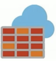
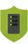
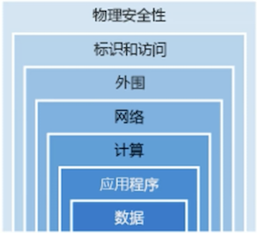
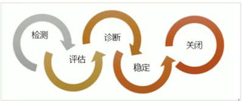
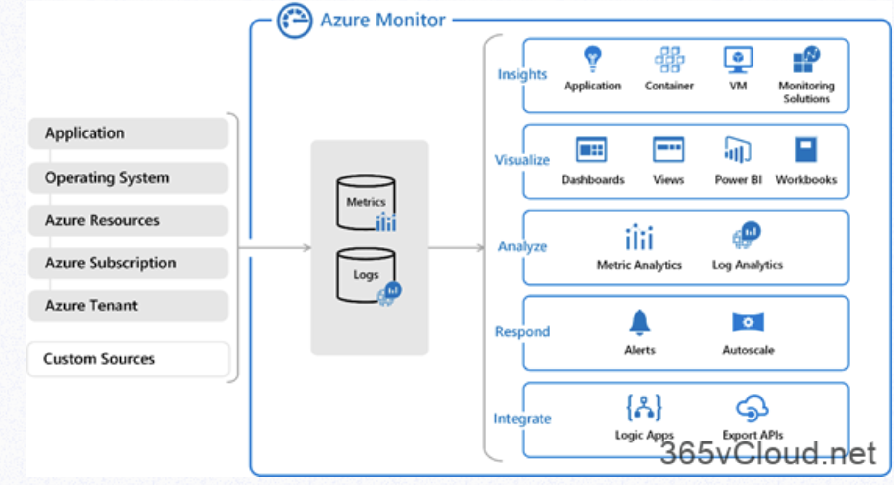
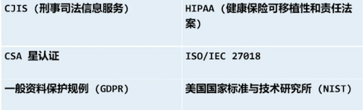

# 安全性，隐私，合规性和信任

### 第一课一学习目标 

* 了解并描述述如何保护`Microsoft Azure`中的网络连接。 
* 了解和描述核心`Azure`标识服务。
* 了解和描述安全工具和功能。 
* 了解和描述`Azure`治理方法。 
* 了解和描述`Azure`中的监视和报告。 
* 了解和描述Azure中的隐私、合规性和数据保护标准。 

## 保护`Microsoft Azure`中的网络连接

### Azure防火墙 

* 防火墙是一种服务，它根据每个请求的原始`IP`地址授予服务器访问权限
* `Azure`防火墙是一种基于云的托管网络安全服务，可保护`Azure`虚拟网络资源。它是一个完全有状态的防火墙，**是一项具有内置高可用性和不受限制的云可伸缩性的服务**。 
* Azure防火墙包括许多功能，包括
	* 内置高可用性 
	* 不受限制的云可扩展性 
	* **入站和出站筛选规则** 
	* Azure监视器日志记录 

### 网络安全组 

* 网络安全组（Nsg）允许您筛选`Azure`虚拟网络中与`Azure` 资源之间的网络流量。**`NSG`可以包含多个入站和出站安全规则， 使您能够按源和目标IP地址、端口和协议筛选进出资源的流量**。 
* 网络安全规则属性：
	*  网络安全组可以在Azure订阅限制中包含所需数量的规则。 
	*  创建网络安全组时，Azure会创建一系列默认规则，以提供基准安全级别。不能删除默认规则，**但可以通过创建优先级较高 的新规则来覆盖这些规则**。 

### Azure DDoS保护 

* 分布式拒绝服务（`DDoS`）攻击试图使应用程序的资源不堪重负，使应用程序对合法用户的响应速度变慢或没有响应。 
* `Azure DDoS`保护服务通过在`Azure`网络边缘擦除流量来保护`Azure`应用程序，以免影响服务的可用性。 
* `Azure DDoS`保护提供以下服务层： 
	* **基本**。作为Azure平台的一部分，将自动启用”基本服务层”。 
	* **标准**。标准服务层提供了专门针对`Microsoft Azure`虚拟网络资源进行调整的其他缓解功能。 

### 选择Azure网络安全解决方案 

**深度防御**

一种分层方法，提供多层次的保护，以便在攻击者通过一层时提供进一步的保护。应用于计算系统的一个常见安全概念是深度防御， 这实质上是一种提供安全的分层方法。 

### 选择Azure网络安全解决方案一层 

* **边界网络层**。网络外国层是关于保护组织免受基于网络的对您的资源的攻击。某些选项是使用**`Azure DDoS`保护和`Azure`防火墙**`。 
* **网络**层。在这一层，重点是**限制所有资源的网络连接，并且只允许所需内容**。默认倩况下，某些选项是拒绝的、限制入站互联网访问平口限制出立占的。 
* **结合服务。**您还可以组合多个Azure网络和安全服务C．下面是一 些示例：
	* 网络安全组和 Azure防火墙 
	* 应用程序网关WAF和Azure防火墙。 

> **选择Azure网络安 全解决方案一层**

> **共同责任**

> 随着计算环境从客户控制的数据中心转移到云数据中心， 安全责任也在转移。安全性现在是云提供商和客户共同关心的问题。 

## `Azure`标识服务

### 身份验证和授权 
在谈论身份和访问时应该理解的两个基本概念是**身份验证**和**授权**： 

* **身份验证**是建立要访问资源的人员或服务的身份的过程。它涉及向一方提出合法凭据的质疑行为，并为创建身份和访问控制使用的安 全主体提供了基础。如果他们是他们说的那个人，它就建立起来了。 
* **授权**是建立经过身份验证的人员或服务具有何种访问级别的过程。 它指定了允许他们访问的数据以及他们可以用这些数据做什么。 

### Azure活动目录 

* `Azure Active Directory`(Azure AD) 是一种基于`Microsoft `云的标识和访问管理服务。Azure可帮助组织的员工登录并访问资源 
* `Azure AD`提供的服务包括：
* 认证
* 单点登录(SSO)
* 应用程序管理 
* 企业对企业（B2B)身份服务
* 企业对客户（B2C身份服务

### Azure多重身份验证 

* Azure多重身份验证（MFA）通过要求两个或多个元素进行完 全身份验证，为您的身份捌共了额外的安全性。**这些要素分为三类**： 
* 你知道的事情：这可能是密码，也可能是安全问题的答案。 
* 您佣有的东西：这可能是接收通知的移动应用，也可能是生成令牌的设备。 
* 您的身份：这通常是某种生物特征，例如在许多移动设备上使 用的指纹或人脸扫描.

## 安全工具和功能

### Azure安全中心 

* Azure安全中心是一种监视服务，可在Azure和本地的 所有服务中提供威胁保护。 
* **Azure安全中心可以**： 
	* 根据您的配置、资源和网络提供安全建议。 
	* 监视本本地和云工作负载中的安全设置，并在新服务联机时自动将所需的安全性应用于这些服务。

### Azure 安全中心使用方案 

* 您可以在检测、评估和诊断事件响应的各个阶段中使用安全中心

使用安全中心建议增强安全性． 

### Azure密钥库 

* Azure密钥保管库是用于存储应用程序机密的集中式云服务。`Key Vault`可帮助您控制应用程序的机密，方法是将其保存在一个中心位置，并提供安全访问、权限控制和访问日志记录。 
* 密钥保管库使用方案： 
	* 秘密管理 
	* 密钥管理 
	* 证书管理 
	* 由硬件安全模块（Hsm)支持的存储机密 

### 锁 

* 锁定可帮助您防止意外删除或修改Azure资源。您可以从 Azure门户中管理这些锁。 
* 您可能需要锁定订阅、资源组或资源，以防止组织中的其他用户 意外删除或修改关键资源。您可以将锁定级别设置为：
	*  ”不删除”。授权用户仍然可以读取和修改资源，但不能删PL亥资 源。 
	*  只读。**授权用户可以读取资源，但不能删除或更新资源**。应用此锁类似于将所有授权用户限制为”读取器“角色授予的权限。 

### Azure信息保护 (AIP)

* `Microsoft Azure`信息保护是一种基于云的解决方案，可帮助组织。<mark>**通过应用标签对其文档和电子邮件进行分类并提供（可选）帮助保护。** </mark>
* 标签可以应用： 
	* 由定义规则和条件的管理员自动执行 
	* 用户手动操作 
	* 两者的结合，在这里为用户提供了建议 
* 使用场景 
	* 用户保存包含信用卡号的	`Microsoft Word`文档。 
	* 此时将显示一个自定义工具提示，建议将该文件标记为"`"机密"\"`"  所有员工”，这是管理员配置的标签。 
	* 此标签对文档进行分类并对其进行保护。 

### Azure高级威胁防护 

* Azure高级威胁保护（`Azure ATP`）是一种基于云的安全解决方案，可识 别、检测并帮助您调查针对您的组织的高级威胁、受损身份和恶意内部操作。 
* Azure ATP由以下组件组成： 
	* `Azure ATP`门户。`Azure ATP`有自己的门户，您可以通过该门户监视和 响应可疑活动 
	* `Azure ATP`传感器（`Azure ATP Sensor`): `Azure ATP`传感器直接安装在域控制器上。 
	* `Azure ATP`云服务。`Azure ATP`云服务在`Azure`基础结构上运行。 

## `Azure`中的监视和报告

### Azure策略 

* Azure策略是Azure中的一项服务，用于创建、分配和管理策略。这些策略对您的资源强制执行不同的规则和效果，以便 这些资源始终符合您的企业标准和服务级别协议（SLA)。 
* 使用`Azure`策略，提供以下内容： 
	* `Azure`策略使用策略和计划来运行资源评估，并扫描不符合您创建的策略的资源。 
	* `Azure`策略附带了许多内置的策略和计划定义，您可以在存储、 网络、计算、安全中心和监视等类别下使用这些定义。 

If a resource group named RG1 has a delete lock, _only a member of the global administrators_ group can delete RG1. 

Instructions: Review the underlined text. If it makes the statement correct, select "No change is needed". If the statement is incorrect, select the answer choice that makes the statement correct.
 
 * A. No change is needed 
 * B. **the delete lock must be removed before an administrator** 
 * C. an Azure policy must be modified before an administrator 
 * D. an Azure tag must be added before an administrator 

### Azure 顾问安全帮助 

* `Azure` 顾问通过与`Azure`安全中心集成来提供安全建议。 
* **查看”顾问”仪表板的”安全”选项卡上的安全建议**。 
* 单击更深入的安全中心建议，以改进和增强您的安全治理。 

## `Azure`中的监视和报告

### Azure监视器 

* Azure监视器通过提供全面的解决方案，用于收集、分析 **云环境和本地环境**中的遥测数据并对其采取行动，从而最大限度地提高应用程序的可用性和性能。 
* 一旦创建Azure订阅并开始添加资源，Azure监视器就会开始收集数据： 
* 活动日志。记录创建或修改资源的时间。
* 指标告知。显示资源的执行清况及其消耗的资源。 
* 通过在资源设置下启用”诊断”并将代理添加到计算资源可以将正在收集的数据扩展到资源的实际操作中。 

### Azure服务运行状况 

* `Azure` 服务运行状况是一组经验，可在出现`Azure` 服务问题时提供个性化的指导和支持。它可以通知您，帮助您了解问题的影响，并在问题解决后随时更新。 
* `Azure`服务运行状况由以下部分组成： 
	* `Azure`状态。提供Azure服务运行状况状态的全局视图。 
	* 服务运行状况。**可自定义的仪表板，用于跟踪使用`Azure` 服务的区域中的状态**。
	* `Azure`资源运行状况：**当Azure服务问题影响您的资源诊断并获取支持**。 

### 监视应用程序和服务 

* 只有当数据监视能够提高您对计算环境操作的可见性时，它才有用。 
* Azure监视器与其他Azure服务集成，以提供强大的监视功能。 
* 您可以将监视松散地分为四类： 
	* **分析**。对容器和虚拟机使用Azure监视器，对应用程序使用Azure 应用程序见解。 
	* **响应**。主动响应使用Azure警报收集的数据中确定的关键条件，或使用Azure监视器指标自动缩放。 
	* **可视化**：可视化项目，如图表和表格，或`Power BI` 
	* **集成**：将Azure监视器与其他系统集成并构建自定义解决方案.

### 合规性条款和要求 

Microsoft提供了所有云服务提供商中最全面的合规性产品（包括认证和认证）。一些合规性产品包活： 

### 微软隐私声明 

* 解释`Microsoft`处理的个人数据、如何处理这些数据以及用于何种目的。 
* 适用于`Microsoft`与用户和`Microsoft产品（如Microsoft 服务、网站、应用程序、软件、服务器和设备）的交互。 
* 旨在提供有关`Microsoft`如何在具产品和服务中处理个人数据的开放性和诚实性 
	* 有关详细信息，请查看`Microsoft`隐私声明中的隐私声明。 

### 服务信任门户 

* **服务信任门户（STP) 叫是`Microsoft`公共网站，用于发布与 `Microsoft` 云服务相关的审计报告和其他合规性信息**。 
* 它还承载合规性管理器服务。 
* STP是信任中心的配套功能，允许您： 
	* 在单个页面上访问Microsoft云服务的审计报告。 
	* 访问合规性只指南，帮助您了解如何使用`Microsoft`云服务功能来管理符合各种法规的法规。 
	* 访问信任文档，帮助您了解`Microsoft`云服务如何帮助保护您的数据。 

### 合规性管理 

* 法规遵从性管理器是信任门户中基于工作流的风险评估，使您能够跟踪、分配和验证组织的法规遵从性活动 
* 它提供了与`Microsoft`专业服务和`Microsoft`云服务（如 Microsoft Office 365、 Microsoft Dynamics 365和Azure) 相关的详细信息。 
* 合规性管理器提供以下功能： 
	* 使您能够分配、跟踪和记录合规性和评佑相关活动。 
	* 提供合规性评分，帮助您跟踪进度夯湘角定审核的优先级。 
	* 提供一个安全的存储库，用于上传和管理与合规性活动相关的证据和其他工件。 

### Azure政府服务 

* `Microsoft Azure`政府可满足美国联邦机构、州相地方政府及其解决方案提供商的安全和合规性需求。 
* `Azure`政府：
	* 是`Microsoft Azure`服务的单独实例。 
	* 提供与非美国政府部署的物理隔离，并提供经过筛选的美国人员。处理受某些政府法规和要求约束的数据，如`FedRAMP`、NIST、800.171 (DIB）、ITAR、irs 1075、DoD L4和CJIs。 

### Azure德国服务 

* `Microsoft Azure`德国基于Miorosoft信任的安全、隐私、合规 性和透明度的云原则。 
* **它使数据驻留在传输过程中和德国处于静止状态，并在德国数据中心之间实现数据复制，以实现业务连续性**。 
* 两个数据中心中的客户数据由数据受托人`T-Systems International`控制。该受托人是一家独立的德国公司，也是德国电信的子公司。 
* **任何需要数据驻留在德国的人都可以使用此服务**。 

### Azure China 21Vianet 

* 由21Vianet (Azure China 2lVianet）运营的Microsoft Azure是位于中国的云服务的物理分离实例。 
* 作为首家按照政府法规在中国提供的外国公共云服务提供商，Azure 中国`21Vianet`按照中国法规对所有系统和法规的要求，提供了信任中心主题中所讨论的世界级安全性。基于其体系结构的应用程序。 
