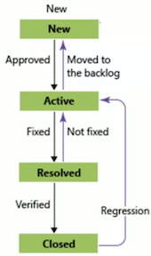

# Azure定价和支持

## Azure Subscription

### Azure Subscriptions 

* Allows resources to be created and managed 
* Links to Azure Active Directory for **authentication** and **authorization** 
* **Multiple subscriptions can be created by the account holder** 

### Subscription Options 

* Pay-As-You-Go 
* Azure Free Account 
	* 12 months (with limitations) 
	* $260 credit for a month 
	* 25+ free services 
*  Member offers 

### Subscription Considerations 

* Service limits for each subscription type 
* Service limit increases can be requested
* Some service limits cannot be increased 

### Subscription billing boundary

### Management Groups （管理组）

* Group Azure objects in a collections Subscriptions or other management groups
*  Manage policies, access, and compliance for the entire group 

* Azure 管理组是用于管理多个Azure 订阅的访问，策略和合规性的容器
* 管理组允许您对Azure 资源进行层次结构进行排序，从而提供了超出订阅的进一步分类级别

 
##  第三课：规划和管理成本 

### 购买Azure产品和服务 

* Azure产品和服务的可用采购选项所附带的三种主要客户类型是： 
	* 企业。企业客户与Azure二签署企业协议，承诺他们将在Azure服务上花费协商金额，通常每年支付这些金额。 
	* 直接上网。Web直接客户通过Azure网站注册Azure0
	* 云解决方案提供商（`Csp)`通常是客户雇佣的`Microsoft`合作伙伴公司， 以便在Azure之上构建解决方案。Azure使用的付款和计费是通过客户的cCSP进行的。 

* Azure中的产品和服务按类别（如计算和网络）进行排列，这些类别具有您可以提供的各种资源．

### Azure成本管理 

Azure成本管理是一科Azure 产品，它提供了一组用于监视、 分配和优化Azure成本的工具 
 
 * 报告。生成报告 
 * 数据丰富。通过使用标记对资源 进行分类来改进问责制 
 * 预算。监控资源需求趋势、消费率和成本模式 
 * 提醒。根据您的戍本和使用预算获取警报 
 * 建议。接收建议，以消除空闲 资源并优化预配的Azure资源 

###  Azure免费帐户 

* Azure免费帐户为订阅 者提供200美元的 Azure信用额度，他们可以在30天的试用期内用于付费Azure产品。 
* 一旦您使用了200美元 的信用额度或达到了试用版的终点，Azure将暂停您的帐户，除非您注册了付费帐户。 

### 影响成本的因素 

影响成本的因素有三个： 

* **资源类型**：成本是特定于资源的，因此仪表跟踪的使用情况和与资源关联的仪表数取决于资源类型。 
* **服务**：企业、`Web Director`和`CSP`客户之间的Azure使用率和计费周期可能有所不同。
*  **位置**：`Azure`基础结构是全局分布的，并且提供持定`Azure` 产品、服务和资源的位置之间的使用成本可能会有所不同 

### Azure产品的定价计算器成本 

您可以选择Azure产品

* 帮助您估计所需的需求，并根据您的具体要求对其进行配置 
* `Azure`提供了与您的选择和配置相关的成本的详细估计 

### 等成本降至最低 

* 以下最佳实践指南可帮助最大限度地降低`Azure`成本： 
	* **执行成本分析**。使用`Azure`定价和总体拥有成本计算器使用使用
	* **支出限制**。通过免费试Azure顾问监视使用情况。落实建议用客户和一些基于信用的Azure订阅使用 
	* 使用`Azure`预订。要获得折扣，提前付款预订产品和资源。1年或3年的预付费，比现收现付成本节省高达72% 
	* 选择低成本的地点和地区。如果可能，请使用低成本位置
	* 应用标记来标识成本所有者。使用标签识别使用情况所有者 

### 总拥有成本（TCO)计算器 

* 用于估算可通过迁移到`Azure`实现的成本节约的工具 
* 报告将本地基础架构的成本与使用`Azure`产品和服务在云中托管基础结构的成本进行了比较 

## 第四课：服务级别协议（SLA) 

* **`SLA`记录了定义`Azure`性能标准的特定术语**
* **`SLA`定义了微软对Azure服务或产品的承诺**
* 每个Azure产品和服务都有单独的 SLA 
* `SLA`还定义了如果服务或产品不能满足指定的可用性承诺会发生什么情况 

### Azure 产品和服务的SLA 

* Azure产品和服务的SLA的三个关键特征： 
* 性能目标、正常运行时间和连接性保证：**正常运行时间或连接速率，如可用性**
* 性能目标范围：典型的SLA指定的绩效口标承诺范围从99.9 (3个9)到 99.99 (4个9）不等 
* 服务积分：如果服务未能满足ALS正常运行时间保证，则应支付给您的每月服务费的百分比 
* 有关单个产品和服务的特定Azure SLA的洋细信息，请参阅服务级别协议 

### 改进应用程序SLA

* Azure客户可以使用SLA来评估其Azure解决方案如何满足其业务需求以及客户和用户的需求。通过创建自己的SLA，组织可以设置性能目标以适合其特定的`Azure`应用程序。这称为应用程序SLA。・
* 定义应用程序`SLA`的注意事项： 
	* **自我修复**：您的Azure解决方案应该是自我诊断和自我修复 
	* **响应时间**：很难以足够快的速度响应故障，以满足`4`个9以上的`SLA` 性能目标 
	* **现实地实现**：恢复的时间窗口越小（例如，每小时或每天），公差就越紧，成本也越高 

### 改进应用程序SLA一继续 

下表列出了不同SLA级别在不同持续时间内可能累积的停机时间 

### 复合SLA 

* 在编写本文时, 写入`Azure SQL`数据库的应用服务web应用具有以下`SLA`: 
	* 应用服务`Web`应用的支持率为`99.95 `
	* 问： 数据库为`99.99` 此应用程序的最大停机时间是多少？
	* 答： 此应用的复合`SLA`为 
	* `99 .95 x99 .99%=99 .95`。 

* 这低于单个SLA。但是，您可以构造‘LA来改进整个应用程序 SLA。 

### 服务信用额度

`SLA`还描述了当`Azure`产品或服务无法履行其适用SLA的规范时，Microsoft将如何响应。 
 
 
 
##  第五课：Azure中的服务生命周期 

 

### 公共和私人预览功能 

* `Microsoft`提供`Azure`功能的预览，以用于评估目的。 
* 使用`Azure`预览，您可以测试测试版和其他预发布功能、广品、 服务、软件和区域。
* 两种类型的Azure预览模式：
	* **私人预览**。Azure功能可用于某些Azure客户进行评估 
	* **公共预览**。Azure功能可供所有Azure客户用于评估目的 

### 如何访问预览功能 

* 查看可用于评估的预览功能列表，这些功能可在`Azure Preview  Features` 
* 要预览功能, 请选择适用功能的”使用“按钮
*  门户预览功 
*  访问特定于Azure门户的预览功能`Portal Preview Features page.`
	*  典型的门户预览功为`Azure`门户界面提供了性能、导航和辅助功能改进 

### 通常情况

* 成功评估和测试功能后，可能会将其作为`Azure`默认产品、服务或功能集的一部分发布给客户 
* 组件和产品的错误会经历其生命周期， 就像在图形中一样。 
* 一旦该功能满足特定条件，该功能 将发布给所有`Azure`客户，此版本将参考一般可用性。 

 

## 考试信息辅导 

* `https ://www.microsoft .com/en-us/learning/exam-az -900.aspx ` 

### 考试情况说明 

* 85 mins
* 40-66 (44)
* 选择和拖拽
* 通过分数700

### Microsoft Azure AZ一900考试中的模块 

* 在AZ一900考试中，您可以预期来自4个模块的问题。在进行AZ一900考试准 备之前，需要了解这些模块。你可以在下面看到它们。 

* 云概念（巧一20%) 
* 核心Azure服务（30一35%) 
* 安全，隐私 合规和信任（25一30%) 
* Azure定价和支持（25一30%) 
