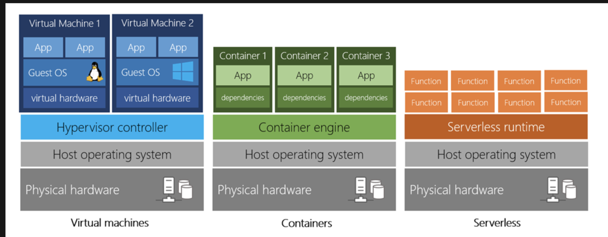
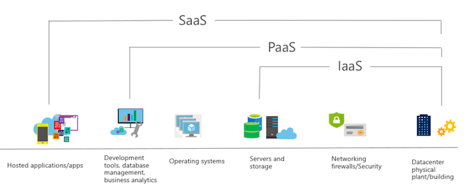
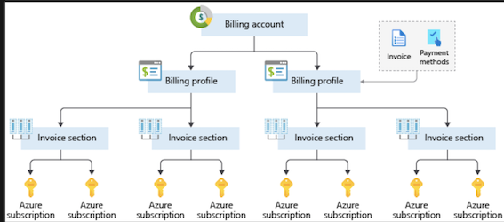
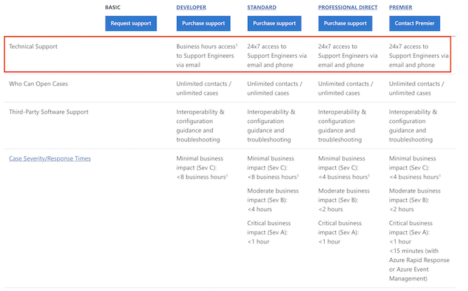
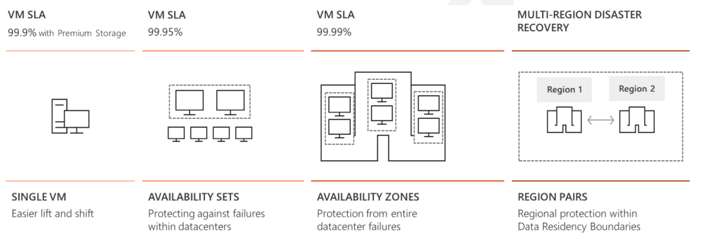
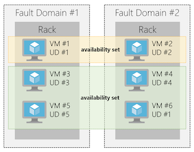
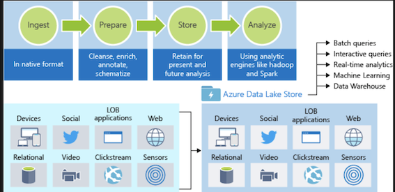
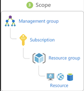
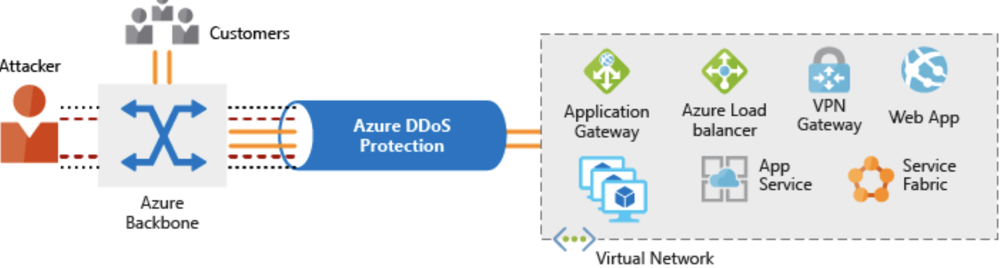

# Az900 Fundamentals

## Cloud Concepts - Principles of cloud computing

### 1.What is cloud computing?

* **Compute power** - such as Linux servers or web applications
* **Storage** - such as files and databases
* **Networking** - such as secure connections between the cloud provider and your company
* **Analytics** - such as visualizing telemetry and performance data

**Compute power** 

VMs aren't the only computing choice - there are two other popular options: **containers** and **serverless computing**.



* **Containers** provide a consistent, isolated execution environment for applications. They're similar to VMs except they **don't require a guest operating system**
* **The serverless model** differs from VMs and containers in that you only pay for the processing time used by each function as it executes.

### 2.Benefits of cloud computing

* It's cost-effective
* It's scalable
	* **Vertical scaling, also known as "scaling up"**, is the process of adding resources to increase the power of an existing server
	* **Horizontal scaling, also known as "scaling out"**, is the process of adding more servers that function together as one unit.
* It's elastic
* It's current
* It's reliable
* It's global
* It's secure

### 3.Compliance terms and requirements

Provider need help you **comply with regulations and standards**

* Criminal Justice Information Services (CJIS).
* Cloud Security Alliance (CSA)
* General Data Protection Regulation (GDPR)
* EU Model Clauses
* Health Insurance Portability and Accountability Act (HIPAA)
* International Organization for Standardization (ISO) 
* Multi-Tier Cloud Security (MTCS) Singapore
* Service Organization Controls (SOC)
* National Institute of Standards and Technology (NIST)
* UK Government G-Cloud.

### 4.Economies of scale

**Economies of scale** is the ability to do things more efficiently or at a lower-cost per unit when operating at a larger scale. This cost advantage is an important benefit in cloud computing.

### 5.Capital expenditure (CapEx) versus operational expenditure (OpEx)

* **Capital Expenditure (CapEx): CapEx is the spending of money on physical infrastructure up front**, and then deducting that expense from your tax bill over time. **CapEx is an upfront cost, which has a value that reduces over time**.

* **Operational Expenditure (OpEx): OpEx is spending money on services or products now and being billed for them now**. You can deduct this expense from your tax bill in the same year. There's no upfront cost. You pay for a service or product as you use it.

**OpEx cloud computing costs**

* Leasing software and customized features
* Scaling charges based on usage/demand instead of fixed hardware or capacity.
* Billing at the user or organization level.

**Benefits of CapEx**: **Your costs are fixed**, meaning you know exactly how much is being spent. 

**Benefits of OpEx** **is particularly appealing if the demand fluctuates or is unknown**. Cloud services are often said to be **agile.**

### Cloud deployment models

### 6.Explore the three categories of cloud computing

**Infrastructure as a service (IaaS)**

IaaS is commonly used in the following scenarios:

* Migrating workloads. 
* Test and development. 
* Storage, backup, and recovery.

**Platform as a service (PaaS)**

The goal of PaaS is to help you create an application quickly without managing the underlying infrastructure.

* Development framework.
* Analytics or business intelligenc

**Software as a service (SaaS)**

* **IaaS requires the most user management of all the cloud services**. The user is responsible for managing the operating systems, data, and applications.
* **PaaS requires less user management**. The cloud provider manages the operating systems, and the user is responsible for the applications and data they run and store.
* **SaaS requires the least amount of management**. The cloud provider is responsible for managing everything, and the end user just uses the software.


You're developing an application and want to focus on building, testing, and deploying. You don't want to worry about managing the underlying hardware or software. => PaaS



## Create an Azure account 

### 1.What is the Azure free account?

The Azure free account includes free access to popular Azure products for 12 months, 200 USD credit to spend for the first 30 days, and access to more than 25 products that are always free

### 2.Understand Azure billing

**Azure subscription**

* <mark>An Azure subscription is a logical container used to provision resources in Azure</mark>. 
* It holds the details of all your resources like virtual machines (VMs), databases, and more. <mark>When you create an Azure resource like a VM, you identify the subscription it belongs to</mark>

**Create additional Azure subscriptions** (for resource or billing management purpose)

* Environments
* Organizational structures
* Billing

You might also need additional subscriptions due to:

* Subscription limits:

**Customize billing to meet your needs**

* If you have multiple subscriptions, you can organize them into **invoice sections**. 
* Each invoice section is a line item on the invoice that shows the charges **incurred that month** <mark>(monthly)</mark>



### 3.Azure support options

**Azure support plans**

* Developer: Non-critical workloads + 1 business day response
* Standard: Production workloads + 1-hour response for critical cases
* 	Professional Direct： Business-critical workloads +   case 1-hour response + priority tracking of critical cases




## Core Cloud Services - Introduction to Azure

Cloud computing is the delivery of computing services over the Internet using a `pay-as-you-go` pricing model

**Why should I move to the cloud?**

* Teams are delivering new features to their users at record speeds.
* End users expect an increasingly rich and immersive experience with their devices and with software.

### Tour of Azure services

### 1.Compute

* **Azure Virtual Machines** :	Windows or Linux virtual machines (VMs) hosted in Azure
* **Azure Virtual Machine Scale Sets**: Scaling for Windows or Linux VMs hosted in Azure
* **Azure Kubernetes Service**： Enables management of a cluster of VMs that run containerized services
* **Azure Service Fabric**： Distributed systems platform. Runs in Azure or on-premises
* **Azure Batch**： Managed service for parallel and high-performance computing applications
* **Azure Container Instances**	： Run containerized apps on Azure without provisioning servers or VMs
* **Azure Functions**: An event-driven, serverless compute service

### 2.Networking

* **Azure Virtual Network**:	Connects VMs to incoming Virtual Private Network (VPN) connections
* **Azure Load Balancer**: Balances inbound and outbound connections to applications or service endpoints
* **Azure Application Gateway**: Optimizes app server farm delivery while increasing application security
* **Azure VPN Gateway**: Accesses Azure Virtual Networks through high-performance VPN gateways
* **Azure DNS** : Provides ultra-fast DNS responses and ultra-high domain availability
* **Azure Content Delivery Network** : Delivers high-bandwidth content to customers globally
* **Azure DDoS Protection**: Protects Azure-hosted applications from distributed denial of service (DDOS) attacks
* **Azure Traffic Manager**: Distributes network traffic across Azure regions worldwide
* **Azure ExpressRoute**: Connects to Azure over high-bandwidth dedicated secure connections
* **Azure Network Watcher**: 	Monitors and diagnoses network issues using scenario-based analysis
* **Azure Firewall**: Implements high-security, high-availability firewall with unlimited scalability
* **Azure Virtual WAN**: Creates a unified wide area network (WAN), connecting local and remote sites

### 3.Storage

* **Azure Blob storage**: Storage service for very large objects, such as video files or bitmaps
* **Azure File storage**: File shares that you can access and manage like a file server
* **Azure Queue storage**: A data store for queuing and reliably delivering messages between applications
* **Azure Table storage**: A NoSQL store that hosts unstructured data independent of any schema

### 4.Databases

* **Azure Cosmos DB**	: Globally distributed database that supports NoSQL options
* **Azure SQL Database**: Fully managed relational database with auto-scale, integral intelligence, and robust security
* **Azure Database for MySQL**: Fully managed and scalable MySQL relational database with high availability and security
* **Azure Database for PostgreSQL**: **Fully managed and scalable PostgreSQL** relational database with high availability and security
* **SQL Server on VMs**: 	Host enterprise SQL Server apps in the cloud
* **Azure Synapse Analytics**: Fully managed data warehouse with integral security at every level of scale at no extra cost
* **Azure Database Migration Service**: Migrates your databases to the cloud with no application code changes
* **Azure Cache for Redis**: Caches frequently used and static data to reduce data and application latency
* **Azure Database for MariaDB**: Fully managed and scalable MariaDB relational database with high availability and security

### 5.Web

* **Azure App Service**	: Quickly create powerful cloud web-based apps
* **Azure Notification Hubs**: Send push notifications to any platform from any back end.
* **Azure API Management**: Publish APIs to developers, partners, and employees securely and at scale.
* **Azure Cognitive Search**: 	Fully managed search as a service.
* **Web Apps feature of Azure App Service**: Create and deploy mission-critical web apps at scale.
* **Azure SignalR Service**: Add real-time web functionalities easily.

### 6.Internet of Things

* **IoT Central**: Fully-managed global IoT software as a service (SaaS) solution that makes it easy to connect, monitor, and manage your IoT assets at scale
* **Azure IoT Hub**: Messaging hub that provides secure communications between and monitoring of millions of IoT devices
* **IoT Edge**:  Push your data analysis models directly onto your IoT devices, allowing them to react quickly to state changes without needing to consult cloud-based AI models.

### 7.Big Data

* **Azure Synapse Analytics**: Run analytics at a massive scale using a cloud-based Enterprise Data Warehouse (EDW) that leverages massive parallel processing (MPP) to run complex queries quickly across petabytes of data
* **Azure HDInsight**	: Process massive amounts of data with managed clusters of Hadoop clusters in the cloud
* **Azure Databricks**: Collaborative Apache Spark–based analytics service that can be integrated with other Big Data services in Azure.

### 8.Artificial Intelligence

* Azure Machine Learning Service	
* Azure Machine Learning Studio	

### 9.DevOps

* **Azure DevOps**: Azure DevOps Services (formerly known as Visual Studio Team Services, or VSTS), provides development collaboration tools including **high-performance pipelines, free private Git repositories, configurable Kanban boards, and extensive automated and cloud-based load testing**
* **Azure DevTest Labs**	: Quickly create on-demand Windows and Linux environments you **can use to test or demo your applications directly from your deployment pipelines**

### 10.Create a website hosted in Azure

**What is an App Service?**

Azure App Service is an `HTTP-based` service that enables you to build and host many types of web-based solutions without managing infrastructure

**What is the Microsoft Azure Marketplace?**

The Microsoft Azure Marketplace is an **online store that hosts applications** that are certified and optimized to run in Azure. Many types of applications are available, ranging from AI + Machine Learning to Web applications


**What is scale?**

**Scale refers to adding network bandwidth, memory, storage, or compute power to achieve better performance.**

* **Scaling up**, or vertical scaling means to increase the memory, storage, or compute power on an existing virtual machine.
* **Scaling out**, or horizontal scaling means to add extra virtual machines to power your application.

### 11.Access an App Service using Azure Cloud Shell

```
az account list --output table
az group list --output table

az resource list \
    --resource-group [sandbox resource group name] \
    --resource-type Microsoft.Web/sites

az webapp stop \
    --resource-group [sandbox resource group name] \
    --name <web app name>

az webapp start \
    --resource-group [sandbox resource group name] \
    --name <web app name>
```   
  
##  Core Cloud Services - Azure architecture and service guarantees 

### 1.Understand Datacenters and Regions in Azure

**A region** is a geographical area on the planet containing at least one, but potentially multiple datacenters that are nearby and networked together with a low-latency network.

Things to know about regions

* **Some services or virtual machine features are only available in certain regions**, such as specific virtual machine sizes or storage types. => <mark>(So multiple regions do not support HA)</mark>
* There are also some global Azure services that do not require you to select a region, such as **Microsoft Azure Active Directory, Microsoft Azure Traffic Manager, or Azure DNS**.

**Special Azure regions**:

* **US DoD Central, US Gov Virginia, US Gov Iowa and more**: These are physical and logical network-isolated instances of Azure for US government agencies and partners. 
* **China East, China North and more**: These regions are available through a unique partnership between Microsoft and **21Vianet**, whereby Microsoft does not directly maintain the datacenters.


### 2.Understand Availability Zones in Azure

* Each Availability Zone is **made up of one or more datacenter**s equipped with independent power, cooling, and networking. 
* It is set up to be an **isolation boundary.** 
* If one zone goes down, the other continues working.
*  **Availability Zones are connected through high-speed, private fiber-optic networks**.

		
Availability Zones are primarily for VMs, managed disks, load balancers, and SQL databases

Azure services that support Availability Zones fall into two categories:

* **Zonal services**– you pin the resource to a specific zone (for example, virtual machines, managed disks, IP addresses)
* **Zone-redundant services** – platform replicates automatically across zones (for example, **zone-redundant storage, SQL Database**).

### 3.What is a region pair?

* **Each Azure region is always paired with another region within the same geography** (such as US, Europe, or Asia) at least 300 miles away.
*  **This approach allows for the replication of resources** (such as virtual machine storage) across a geography that helps reduce the likelihood of interruptions due to events
*  **If a region in a pair was affected by a natural disaster, for instance, services would automatically fail over to the other region in its region pair.**
	
* Additional advantages of region pairs include:
	* If there's an extensive Azure outage
	* Planned Azure updates are rolled out to paired regions
	* Data continues to reside within the same geography as its pair

**Things to know about regional pairs**:

* Physical isolation. 
* Platform-provided replication
* Region recovery order
* Sequential updates.
* Data residency

### 4.Understand Service-Level Agreements for Azure

* SLAs describe Microsoft's commitment to providing Azure customers with specific performance standards.
* There are SLAs for individual Azure products and services.
* SLAs also specify what happens if a service or product fails to perform to a governing SLA's specification.
	
There are three key characteristics of SLAs for Azure products and services:

* Performance Targets
* Uptime and Connectivity Guarantees
* Service credits
	
> Uptime and Connectivity Guarantees： For example, the SLA for the Azure Cosmos DB (Database) service SLA offers 99.999 percent uptime	
Service Credits: 

SLAs also describe how Microsoft will respond if an Azure product or service fails to perform to its governing SLA's specification.

### 5.Calculating downtime

`99.95 percent × 99.99 percent = 99.94 percent`



If the **expected percentage of time for a simultaneous failure is 0.0001 × 0.001,** the composite SLA for this combined path of a database or queue would be:

```
1.0 − (0.0001 × 0.001) = 99.99999 percent
```

Therefore, if we add the queue to our web app, the total composite SLA is:

```
99.95 percent × 99.99999 percent = ~99.95 percent
```

### 6.Improve your app reliability in Azure

* Understand your app requirements
* **Resiliency** is the ability of a system to recover from failures and continue to function. It's not about avoiding failures, but responding to failures in a way that avoids downtime or data loss
* Cost and complexity vs. high availability
	* **Availability** refers to the time that a system is functional and working. 

### 7.Azure management options

Tools that are commonly used for day-to-day management and interaction include:


## Manage services with the Azure portal 

* **Azure portal** for interacting with Azure via a Graphical User Interface (GUI)
* **Azure PowerShell** and Azure Command-Line Interface (CLI) for command line and automation-based interactions with Azure
* **Azure Cloud Shell** for a web-based command-line interface
* **Azure mobile app** for monitoring and managing your resources from your mobile device


### 1.Azure PowerShell

Azure PowerShell is a module that you can install for Windows PowerShell or PowerShell Core, which is **a cross-platform version of PowerShell that runs on Windows, Linux, or macOS**.
	
### 2.Azure CLI

Azure CLI is a **cross-platform command-line program** that connects to Azure and executes administrative commands on Azure resources. **Cross-platform means that it can be run on Windows, Linux, or macOS.** 
 
```
az vm create \
  --resource-group MyResourceGroup \
  --name TestVm \
  --image UbuntuLTS \
  --generate-ssh-keys \
  ...
```

### 3.Azure Cloud Shell
	
browser-accessible shell for managing Azure resource

### Manage services with the Azure portal 

The **Azure Marketplace** is often where you start when creating new resources in Azure. **The Marketplace allows customers to find, try, purchase, and provision applications and services from hundreds of leading service providers**, all certified to run on Azure.

### 4.Azure Portal dashboards

Azure dashboards are stored as **JSON files,** which allow them to be uploaded and downloaded to share with other members of the Azure directory.

* These default web parts are
* Dashboard controls
* All resources tile
* Quickstarts + tutorials tile
* Service Health tile
* Marketplace tile

**Azure Advisor provides advice on which of these topics:**

* Best practices and security for your services, Azure Advisor is a free service built into Azure that provides recommendations on high availability, security, performance, and cost.

### 5.Access public and private preview features

Microsoft offer previews of Azure features for evaluation purposes. With Azure Preview Features, you can test beta and other pre-release features, products, services, software, and regions.

Some of the common areas you will see previews for include:

* New storage types
* New Azure services, such as Machine Learning enhancements
* New or enhanced integration with other platforms
* New APIs for services

Once a feature has been evaluated and tested successfully, it might be released to customers as part of Azure's default product set. This release is referred to as **General Availability (GA)**.

**Feature preview categories**

There are two types of previews available:

* **Private Preview**. An Azure feature marked "private preview" **is available to specific Azure customers for evaluation purposes.** This is typically by invite only and issued directly by the product team responsible for the feature or service.
* **Public Preview**. **An Azure feature marked "public preview" is available to all Azure customers for evaluation purposes**. These previews can be turned on through the preview features page as detailed below.

## Azure compute options

### 1.Essential Azure compute concepts

There are four common techniques for performing compute in Azure:

* Virtual machines
* Containers
* Azure App Service
* Serverless computing

**What is Azure App Service?**

**Azure App Service is a `platform-as-a-service` (PaaS) offering in Azure that is designed to host enterprise-grade web-oriented applications.**

**Scaling VMs in Azure**

* Availability sets
* Virtual Machine Scale Sets
* Azure Batch

**availability sets?**

An **availability set** is a logical grouping of two or more VMs that help keep your application available during **planned or unplanned maintenance**.

* **A planned maintenance event**: is when the underlying Azure fabric that hosts VMs is updated by Microsoft. 
	* A planned maintenance event is done to patch security vulnerabilities, improve performance, and add or update features
	* VMs are put into different **update domains**. 
	* **Update domains indicate groups of VMs and underlying physical hardware that can be rebooted at the same time**
* **Unplanned maintenance events** involve a **hardware failure in the data center**, such as a power outage or disk failure. 
	* VMs that are part of an availability set automatically **switch to a working physical server so the VM continues to run**.
	* The group of virtual machines that share common hardware are in the same **fault domain**

**With an availability set, you get:**

* Up to t**hree fault domains** that each have a server rack with dedicated power and network resources
* **Five logical update domains** which then can be increased to a **maximum of 20**



**What are virtual machine scale sets?**

Azure Virtual Machine Scale Sets let you create and manage a group of identical, load balanced VMs.

**What is Azure Batch?**

Azure Batch enables **large-scale job scheduling** and compute management with the ability to scale to tens, hundreds, or thousands of VMs.

When you're ready to run a job, Batch does the following:

* Starts a pool of compute VMs for you
* Installs applications and staging data
* Runs jobs with as many tasks as you have
* Identifies failures
* Requeues work
* Scales down the pool as work completes

### 2.Containers in Azure

Azure supports Docker containers (a standardized container model), and there are several ways to manage containers in Azure.

* Azure Container Instances (ACI)
* Azure Kubernetes Service (AKS)

**Azure Container Instances**

* Azure Container Instances (ACI) offers the fastest and simplest way to run a container in Azure.
* It is a **PaaS offering that allows you to upload your containers** and execute them directly with automatic elastic scale.

**Azure Kubernetes Service**

### 3.Explore Azure App Service

Azure App Service enables you to build and host web apps, background jobs, mobile backends, and RESTful APIs in the programming language of your choice without managing infrastructur

**This platform as a service (PaaS) allows you to focus on the website and API logic while Azure handles the infrastructure to run and scale your web applications.**

**Types of web apps**

* **Web Apps**: App Service includes full support for hosting web apps 
* **API Apps**: Much like hosting a website, you can build REST-based Web APIs using your choice of language and framework. 
* **WebJobs**: WebJobs allows you to run a program (.exe, Java, PHP, Python, or Node.js) or script (.cmd, .bat, PowerShell, or Bash) in the same context as a web app
* **Mobile Apps**: Use the Mobile Apps feature of Azure App Service to quickly build a back-end for iOS and Android apps.

### 4.Explore Serverless computing in Azure

Serverless computing encompasses three ideas: 

* **Abstraction of servers,**
* **Event-driven scale**
* **micro-billing:**

Azure has two implementations of serverless compute:

* **Azure Functions**, which can execute code in almost any modern language.
* **Azure Logic Apps**, which are designed in a **web-based designer and can execute logic triggered by Azure services without writing any code**.

**Azure Logic Apps**

Where Functions execute code, Logic Apps execute workflows designed to automate business scenarios and built from **predefined logic blocks**.

* You create Logic App workflows using a visual designer on the Azure portal or in Visual Studio. 
* The workflows are persisted as a **JSON file with a known workflow schema**.

As an example, let's say a ticket arrives in ZenDesk. You could:

1. Detect the intent of the message with cognitive services
2. Create an item in SharePoint to track the issue
3. If the customer isn't in your database, add them to your Dynamics 365 CRM system
4. Send a follow-up email to acknowledge their request


Quiz: The photo-sharing app is event driven and needs to handle unpredictable demand. Serverless computing is a good fit for this situation because it is **event-based and can scale instantly to process spikes in traffic**. It should also be a cost-effective choice because you will pay for compute time only when processing user data.

## Azure data storage options 

### 1.Benefits of using Azure to store data

* Automated backup and recovery:
* Replication across the globe:
* Support for data analytics
* Encryption capabilities: 
* Multiple data types
* Data storage in virtual disks
* **Storage tiers**: storage tiers to prioritize access to data based on frequently used versus rarely used information.

**Types of data**

* Structured data.
* Semi-structured data： Semi-structured data is also referred to as `non-relational` or `NoSQL data`.
* Unstructured data： 

### 2.How Azure data storage can meet your business storage needs

* **Azure SQL Database**
* **Azure Cosmos DB**: Azure Cosmos DB is a **globally distributed database service**. It supports schema-less data that lets you build highly responsive and Always On applications to support constantly changing data.
* **Azure Blob storage**: 

### 3.Azure Data Lake Storage

* The Data Lake feature allows you to perform analytics on your data usage and prepare reports. 
* **Data Lake is a large repository that stores both structured and unstructured data**.

Azure Data Lake Storage combines the scalability and cost benefits of object storage with the reliability and performance of the Big Data file system capabilities



### 4.Azure Files

Azure Files offers **fully managed file shares** in the cloud that are accessible via the **industry standard Server Message Block (SMB) protocol**

* **Any number of Azure virtual machines or roles can mount and access the file storage share simultaneously.**
* Azure Files uses the Server Message Block (SMB) protocol that ensures the data is encrypted at rest and in transit.


### 5.Azure Queue

Azure Queue storage is a service for storing large numbers of messages that can be accessed from anywhere in the world.

You can use queue storage to:

* Create a backlog of work and to pass messages between different Azure web servers.
* Distribute load among different web servers/infrastructure and to manage bursts of traffic.
* Build resilience against component failure when multiple users access your data at the same time.

### 6.Disk Storage

* When working with VMs, you can use standard SSD and HDD disks for less critical workloads, 
* Premium SSD disks for mission-critical production applications. 

### 7.Storage tiers

* **Hot storage tie**r: optimized for storing data that is accessed frequently.
* **Cool storage tier**: optimized for data that are infrequently accessed and stored for at least 30 days.
* **Archive storage tier**: for data that are rarely accessed and stored for at least 180 days with flexible latency requirements.

### 8.Encryption and replication

**Encryption for storage services**

* Azure Storage Service Encryption (SSE) 
	*  It encrypts the data before storing it and decrypts the data before retrieving it. 
* Client-side encryption 
	* is where the data is already encrypted by the client libraries.
	* Azure stores the data in the encrypted state at rest, which is then decrypted during retrieval.

**Replication for storage availability:**

**Azure provides regional and geographic replications**


### 9.Azure data storage benefit

* Cost effectiveness
* Reliability
* Storage types
* Agility

## Azure networking options 

### 1.What's an Azure region?

A region is one or more Azure data centers within a specific geographic location.

### 2.What's a virtual network?

A virtual network is a logically isolated network on Azure

* Virtual networks can be segmented **into one or more subnets**. Subnets help you organize and secure your resources in discrete sections
* **Software enables you to treat a virtual network just like your own network. Azure maintains the physical hardware for you.**

### 3.What's a network security group?

**Network security group, or NSG**, **allows or denies inbound network traffic** to your Azure resources. Think of a network security group as a **cloud-level firewall for your network.**

### 4.What is Azure Load Balancer?

Load Balancer supports **inbound and outbound scenarios**, provides l**ow latency and high throughput**, and scales up to millions of flows for all **Transmission Control Protocol (TCP) and User Datagram Protocol (UDP) applications**

### 5.Azure Application Gateway

If all your traffic is HTTP, a potentially better option is to use Azure Application Gateway. Application Gateway is a load balancer designed for web applications. 

It uses Azure Load Balancer at the transport level (TCP) and applies sophisticated URL-based routing rules to support several advanced scenarios.

**Here are some of the benefits of using Azure Application Gateway over a simple load balancer:**

* Cookie affinity.
* SSL termination.
* Web application firewall
* URL rule-based routes.
* Rewrite HTTP headers

### 6.What about DNS?

You can bring your own DNS server or use Azure DNS, a hosting service for DNS domains that runs on Azure infrastructure.

### 7.Reduce latency with Azure Traffic Manager

Latency refers to the time it takes for data to travel over the network. Latency is typically measured in milliseconds.

* Scale out to different regions
* Use **Traffic Manager** to route users to the **closest endpoint**
	* **Traffic Manager uses the DNS server that's closest to the user to direct user traffic to a globally distributed endpoint**.
	* Traffic Manager doesn't see the traffic that's passed between the client and server. Rather, it directs the client web browser to a preferred endpoin

### 8.Compare Load Balancer to Traffic Manager

**Load Balancer and Traffic Manager both help make your services more resilient, but in slightly different ways.** 

* When Load Balancer **detects an unresponsive VM**, it directs traffic to other VMs in the pool. 
* Traffic Manager **monitors the health of your endpoints**. When Traffic Manager finds an unresponsive endpoint, it directs traffic to the next closest endpoint that is responsive.

## Security, responsibility, and trust in Azure

### 1.Data

* Stored in a database
* Stored on disk inside virtual machines
* Stored on a SaaS application such as Office 365
* Stored in cloud storage

### 2.Application

* Ensure applications are secure and free of vulnerabilities.
* Store sensitive application secrets in a secure storage medium.
* Make security a design requirement for all application developme

**Compute**

* Secure access to virtual machines.
* Implement endpoint protection and keep systems patched and current.

**Networking**

* Limit communication between resources.
* Deny by default.
* Restrict inbound internet access and limit outbound, where appropriate.
* Implement secure connectivity to on-premises networks.

**Perimeter**

* Use distributed denial of service (DDoS) protection to filter large-scale attacks before they can cause a denial of service for end users.
* Use perimeter firewalls to identify and alert on malicious attacks against your network.

**Identity and access**

* Control access to infrastructure and change control.
* Use single sign-on and multi-factor authentication.
* Audit events and changes.

### 3.Get tips from Azure Security Center

**Azure Security Center**

* Provide security recommendations
* Monitor security settings across on-premises and cloud workloads
* Continuously monitor all your services, and perform automatic security assessment
* Use machine learning to detect and block malware from being installed on your virtual machines and services
* Analyze and identify potential inbound attacks
* Provide just-in-time access control for ports, reducing your attack 

**Available tiers**

* **Free.：**  limited to assessments and recommendations
* **Standard**. 
	* provides a full suite of security-related services including
		*  continuous monitoring, 
		*  threat detection, 
		*  just-in-time access control for ports, and more.

**Usage scenarios**

* Use Security Center for incident response.
	* Detect. Review the first indication of an event investigation
	* Assess. Perform the initial assessment to obtain more information about the suspicious activit
	* Diagnose.

**Use Security Center recommendations to enhance security.**

* A **security policy** defines the **set of controls** that are recommended for resources within that specified subscription or resource group
* Security Center analyzes the security state of your Azure resources. 

### 4.Identity and access

**Authentication and authorization**

* **Authentication** is the process of establishing the identity of a person or service looking to access a resource 
* **Authorization is the process of establishing what level of access an authenticated person or service has**. It specifies what data they're allowed to access and what they can do with it.
* Authentication =>  identity
* Authorization => level of access

### 5.What is Azure Active Directory?

Azure AD is a cloud-based identity service. **It has built in support for synchronizing with your existing on-premises Active Directory** or can be used stand-alone.

* Authentication. 
* Single-Sign-On (SSO).
* Application management.
* Business to business (B2B) identity services. 
* Business-to-Customer (B2C) identity services. 
* Device Management.

### 6.Providing identities to services

Azure AD addresses this problem through two methods: 

* Service principals: **A service principal is an identity that is used by a service or application. And like other identities, it can be assigned roles**.
* Managed identities for Azure services.

#### Role-based access control

Roles assigned at a higher scope, like an entire subscription, are inherited by child scopes, like service instances.Role-based access control

**Privileged Identity Management**



.Azure AD Privileged Identity Management (PIM) is an **additional, paid-for offering** that provides 

* Oversight of role assignments, 
* Self-service, 
* Just-in-time role activation 
* Azure AD and Azure resource access reviews.

### 7.Encryption

**What is encryption?**

* **Symmetric encryption** uses the same key to encrypt and decrypt the data. (When the data needs to be retrieved, the same key is used, and the data is decrypted.)
* **Asymmetric encryption** uses a **public key and private key pair**. 
	* Either key can encrypt but a single key can't decrypt its own encrypted data. 
	* Asymmetric encryption is used for things like Transport Layer Security (TLS) (used in HTTPS) and data signing.

Encryption is typically approached in two ways:

* Encryption at rest
* Encryption in transit


**Encryption in transit**

* Secure transfer can be handled by several different layers. It could be done by encrypting the data at the application layer prior to sending it over a network.
 	* HTTPS is an example of application layer in transit encryption.
 	* You can also set up a secure channel, **like a virtual private network (VPN)**, at a network layer, to transmit data between two systems.

### 8.Encryption on Azure

* Azure Storage Service Encryption
* Azure Disk Encryption
* Encrypt databases

**Transparent data encryption (TDE)** helps protect Azure SQL Database and Azure Data Warehouse against the threat of malicious activity.

TDE encrypts the storage of an entire database by using a symmetric key called the database encryption key

**Encrypt secrets**

 In Azure, we can use **Azure Key Vault** to protect our secrets.
 
**Azure Key Vaul**t is a centralized cloud service for storing your application secrets.It is useful for a variety of scenarios:

* **Secrets management**: store and tightly control access to tokens, passwords, certificates, Application Programming Interface (API) keys,
* Key management
* Certificate management: **public and private Secure Sockets Layer/ Transport Layer Security (SSL/ TLS) certificates**
* Store secrets backed by hardware security modules (HSMs)

**The benefits of using Key Vault include:**

* Centralized application secrets.
* Securely stored secrets and keys. 
* Monitor access and use.
* Simplified administration of application secrets.: **Easier to enroll and renew certificates from public Certificate Authorities (CAs)**
* Integrate with other Azure services.


### 9.Overview of Azure certificates
	
Types of certificates

* **Service certificates** are used for **cloud services**
* **Management certificates** are used for **authenticating with the management API**

#### Service certificates

* Service certificates are attached to cloud services and enable **secure communication to and from the service**. 
* For example, if you deploy a web site, you would want to supply a certificate that can authenticate an exposed HTTPS endpoint

#### Management certificates

Management certificates allow you to authenticate with the classic deployment model

#### Using Azure Key Vault with certificates

You can store your certificates in Azure Key Vault - much like any other secret.

* You can create certificates in Key Vault, or import existing certificates
* You can securely store and manage certificates without interaction with private key material.
* You can create a policy that directs Key Vault to manage the life cycle of a certificate.
* You can provide contact information for notification about life-cycle events of expiration and renewal of certificate.
* You can automatically renew certificates with selected issuers

### 10.Protect your network

**A layered approach** provides multiple levels of protection, so that if an attacker gets through one layer, there are further protections in place to limit further attack.

### 11.What is a Firewall?

A firewall is a service that grants server access based on the originating IP address of each request. You create firewall rules that specify ranges of IP addresses

To provide inbound protection at the perimeter, you have several choices.

* **Azure Firewall**:  
	* Azure Firewall provides **inbound protection** for non-HTTP/S protocols. Examples of non-HTTP/S protocols include: Remote Desktop Protocol (RDP), Secure Shell (SSH), and File Transfer Protocol (FTP)
	* It also provides **outbound, network-level protection** for all ports and protocols, and application-level protection for outbound HTTP/S.
* **Azure Application Gateway**: 
	* is a load balancer that includes a Web Application Firewall (WAF) 
* **Network virtual appliances (NVAs)** are ideal options for non-HTTP services or advanced configurations, and are similar to hardware firewall appliances.


### 12.Stopping Distributed Denial of Service (DDoS) attacks

When you combine Azure DDoS Protection with application design best practices, you help provide defense against DDoS attacks



Azure DDoS Protection provides the following service tiers:

* **Basic**: Always-on traffic monitoring and real-time mitigation of common network-level attacks
* Standard:  DDoS standard protection can mitigate the following types of attacks:
	* Volumetric attacks:  Flood the network layer with a substantial amount of seemingly legitimate traffic.
	* Protocol attacks: render a target inaccessible,by exploiting a weakness in the layer 3 and layer 4 protocol stack.
	* Resource (application) layer attack: disrupt the transmission of data between hosts.

	
### 13.Controlling the traffic inside your virtual network

**Virtual network security**

For communication between virtual machines, Network Security Groups (NSGs) are a critical piece to restrict unnecessary communication.

n NSG can contain multiple inbound and outbound security rules that enable you to filter traffic to and from resources by source and destination IP address, port, and protocol


**Network integration**

* **Virtual private network (VPN) connections are a common way of establishing secure communication channels between networks**. Connections between Azure Virtual Network and an on-premises VPN device are a great way to provide secure communication between your network and your VNet on Azure.
* To provide a dedicated, private connection between your network and Azure, you can use **Azure ExpressRoute**.
* ExpressRoute connections improve the security of your on-premises communication by sending this traffic over the **private circuit instead of over the public internet**

### 14.Protect your shared documents

**Azure Information Protection**: by protecting sensitive information such as **emails and documents with encryption,** **restricted access and rights**, and **integrated security in Office apps**

**Microsoft Azure Information Protection (sometimes referred to as AIP)** is a cloud-based solution that helps **organizations classify and optionally protect documents and emails by applying labels**.

* Labels can be applied automatically based on rules and conditions.
* Labels can also be applied manually. 
* You can also guide users to choose recommended labels with a combination of automatic and manual steps.

After your content is classified, you can track and control how the content is used. For example, you can:

* Analyze data flows to gain insight into your business
* Detect risky behaviors and take corrective measures
* Track access to documents
* **Prevent data leakage or misuse of confidential information**

### 15.Azure Advanced Threat Protection

**Azure Advanced Threat Protection (Azure ATP)** is a cloud-based security solution that identifies, detects, and helps you investigate advanced threats, compromised identities, and **malicious insider actions directed at your organization**.

**Azure ATP is capable of detecting known malicious attacks and techniques, security issues, and risks against your network.**

* Azure ATP portal
* Azure ATP sensor

**Azure ATP sensors are installed directly on your domain controllers.** The sensor monitors domain controller traffic without requiring a dedicated server or configuring port mirroring.

* Azure ATP cloud service

### 16.Application Lifecycle Management Solutions

The **Microsoft Security Development Lifecycle (SDL)** introduces security and privacy considerations throughout all phases of the development process

* Provide training
* Define security requirements
	* Factors that influence security requirements include, but are not limited to:
		* Legal and industry requirements
		* Internal standards and coding practices
		* Review of previous incidents
		* Known threats
* Define metrics and compliance reporting
* Perform threat modeling
* Establish design requirements
* Define and use cryptography standards
* Manage security risks from using third-party components
* Use approved tools
* Perform Static Analysis Security Testing
* Perform Dynamic Analysis Security Testing
* Perform penetration testing
* Establish a standard incident response process
* incident response plan should:
	* Include who to contact if a security emergency occurs
	* Establish the protocol for security servicing (including plans for code inherited from other groups within the organization and for third-party code)
	* Be tested before it is needed

### Quiz

1. Which of these options helps you most easily disable an account when an employee leaves your company? (SSO)

## Apply and monitor infrastructure standards with Azure Policy

### 1.Define IT compliance with Azure Policy

* Azure Policy is an Azure service you use to create, assign and, manage policies. 
* These policies enforce different rules and effects over your resources so that those resources stay compliant with your corporate standards and service level agreements. 

**Creating a policy**

* Create a policy definition
* Assign a definition to a scope of resources
* View policy evaluation results

Here are some of the most common policy definitions you can apply.

* Allowed Storage Account SKUs	
* Allowed Resource Type	
* Allowed Locations	
* Allowed Virtual Machine SKUs	
* Not allowed resource types	

* The policy definition itself is represented as a JSON file 
* Applying Azure policy

```
# Register the resource provider if it's not already registered
Register-AzResourceProvider -ProviderNamespace 'Microsoft.PolicyInsights'
```

**Assign a definition to a scope of resources**

* This **scope could range from a full subscription down to a resource group.** Policy assignments are inherited by all child resources. 
* This inheritance means that **if a policy is applied to a resource group, it is applied to all the resources within that resource group**

When that happens, Azure Policy will take a specific action based on the assigned effect

* Deny	
* Disabled	
* Append
* Audit, AuditIfNotExists
* DeployIfNotExists	

**Removing a policy definition**

```
Remove-AzPolicyAssignment -Name 'audit-vm-manageddisks' -Scope '/subscriptions/<subscriptionID>/resourceGroups/<resourceGroupName>'
```

### 2.Organize policy with initiatives

Managing a few policy definitions is easy, but once you have more than a few, **you will want to organize them. That's where `initiatives` come in**.

* **`Initiatives` work alongside policies in Azure Policy.**
* An `initiative definition` is a **set or group of policy definitions** to help track your compliance state for a larger goal.

**`initiative assignment` is an initiative definition assigned to a specific scope**

**Defining initiatives** Example: Policy definition

* Monitor unencrypted SQL Database in Security Center
* Monitor OS vulnerabilities in Security Center
* Monitor missing Endpoint Protection in Security Center

### 3.Enterprise governance management

**Access management occurs at the Azure subscription level.**

This control allows an organization to configure **each division of the company in a specific fashion based on their responsibilities and requirements**. 

Azure Management Groups are containers for managing **access, policies, and compliance across multiple Azure subscriptions**

### 4.Define standard resources with Azure Blueprints

To help you with auditing, traceability, and compliance of your deployments, **use Azure Blueprint artifacts and tools**.

Azure Blueprints is a declarative way to **orchestrate the deployment of various resource templates and other artifacts**, such as:

* Role assignments
* Policy assignments
* Azure Resource Manager templates
* Resource groups

The process of implementing Azure Blueprint consists of the following high-level steps:

* Create an Azure Blueprint
* Assign the blueprint
* Track the blueprint assignments

* With Azure Blueprint, **the relationship between the blueprint definition (what should be deployed) and the blueprint assignment (what was deployed) is preserved**
* The Azure Blueprints service is backed by the globally distributed Azure Cosmos database. Blueprint objects are replicated to multiple Azure regions.

### 5.How is it different from Resource Manager templates?

The **Azure Blueprints service is designed to help with environment setup**. This setup often consists of a set of resource groups, policies, role assignments, and Resource Manager template deployments.

**Resource Manager template**

* Nearly everything that you want to include for deployment in Blueprints can be accomplished with a Resource Manager template
* Resource Manager template is a document that doesn't exist natively in Azure

There's no need to choose between a Resource Manager template and a blueprint. Each blueprint can consist of zero or more Resource Manager template artifacts.

### 6.How it's different from Azure Policy

* A policy can be included as one of many artifacts in a blueprint definition. 
* Blueprints also support using parameters with policies and initiatives.

### 7.Explore your service compliance with Compliance Manager

Microsoft takes this management seriously and provides full transparency with four sources:

* Microsoft Privacy Statement
* Microsoft Trust Center
* Service Trust Portal
* Compliance Manager

**Microsoft Privacy Statement**

The Microsoft privacy statement explains what personal data Microsoft processes, how Microsoft processes it, and for what purposes.

**What is the Microsoft Trust Center?**

**Trust Center** is a website resource containing information and details about how Microsoft implements and supports security, privacy, compliance, and transparency in all Microsoft cloud products and services. 

**What is the Service Trust Portal?**

The Service Trust Portal (STP) hosts the Compliance Manager service, and is the Microsoft public site for publishing audit reports and other compliance-related information relevant to Microsoft's cloud services.

**Compliance Manager**

Compliance Manager is a workflow-based risk assessment dashboard within the Service Trust Portal that enables you to track, assign, and verify your organization's regulatory compliance activities related to Microsoft professional services and Microsoft cloud services such as Office 365, Dynamics 365, and Azure

Compliance Manager provides the following features:

* Detailed information provided by Microsoft to auditors and regulators 
* Information that Microsoft compiles internally for its compliance with regulations
* An organization's self-assessment of their own compliance
* Enables you to assign, track, and record compliance and assessment-related activities,
* Provides a Compliance Score to help you track your progress
* Provides a secure repository in which to upload and manage evidence
* Produces richly detailed reports in Microsoft Excel

Compliance Manager provides ongoing risk assessments with a reference of risk-based scores for regulations and standards displayed in a dashboard view

### 8.Monitor your service health

* Azure Monitor
* Azure Service Health

**Azure Monitor can collect data from a variety of sources**

* Application monitoring data	
* Guest OS monitoring data	
* Azure resource monitoring data	
* Azure subscription monitoring data	
* Azure tenant monitoring data	

### 9.Diagnostic settings

**Activity Logs** record when resources are created or modified and **Metrics** tell you how the resource is performing and the resources that it's consuming.
 
You can extend the data you're collecting into the actual operation of the resources by enabling diagnostics and adding an agent to compute resources. Under resource settings, you can enable Diagnostics

* Enable guest-level monitoring
* **Performance counters**: collect performance data
* **Event Logs**: enable various event logs
* **Crash Dumps**: enable or disable
* **Sinks**: send your diagnostic data to other services for more analysis
* **Agent**: configure agent settings

### 10.Getting more data from your apps

* Application Insights
* Azure Monitor for containers
* Azure Monitor for VMs 

### 11.Responding to alert conditions

* Alerts
* Autoscale

**Visualize monitoring data**

* Dashboards
* Views
* Power BI

### 12.Azure Service Health

Azure Service Health is a suite of experiences that provide personalized guidance and support when issues with Azure services affect you

* It can notify you, **help you understand the impact of issues**, and keep you updated as the issue is resolved
* Also help you **prepare for planned maintenance and changes that could affect the availability of your resource**

Azure Service Health is composed of the following views.

* **Azure Status** provides a global view of the health state of Azure services. 
* **Service Health** provides you with a customizable dashboard that tracks the state of your Azure services in the regions
* **Resource Health** helps you diagnose and obtain support when an Azure service issue affects your resources.

## Control and organize Azure resources with Azure Resource Manager 

### 1.What are resource groups?

* Resource groups are a fundamental element of the Azure platform. 
* A resource group is a logical container for resources deployed on Azure.
*  All resources must be in a resource group and a resource can only be a member of a single resource group
*  Many resources can be moved between resource groups with some services having specific limitations or requirements to move
* **Resource groups can't be nested**

**Logical grouping**

* Resource groups exist to help manage and organize your Azure resources.

**Life cycle**

If you delete a resource group, all resources contained within are also deleted

**Authorization**

Resource groups are also a scope for applying role-based access control (RBAC) permissions. 

**You can manage and apply the following resources at resource group level**

* Metering and billing
* Policies
* Monitoring and alerts
* Quotas
* Access control

### 2.Use resource groups for organization

* Consistent naming convention
* You might put all resources that are core infrastructure into this resource group
* You could organize them by environment (prod, qa, dev).
* You could organize them by department (marketing, finance, human resources).

There are a few factors that can play into the strategy you use to organize resources: 

* authorization, 
* resource life cycle, 
* billing.

### 3.Use tagging to organize resources

Azure properties a resource has the following properties:

* department (like finance, marketing, and more)
* environment (prod, test, dev)
* cost center
* life cycle and automation (like shutdown and startup of virtual machines)


**A resource can have up to 50 tags**. The name is limited to 512 characters for all types of resources except storage accounts, which have a limit of 128 characters.

* Tags **aren't inherited from parent resources**. 
* **Not all resource types support tags**, and tags can't be applied to classic resources. 

```
az resource tag --tags Department=Finance \
    --resource-group msftlearn-core-infrastructure-rg \
    --name msftlearn-vnet1 \
    --resource-type "Microsoft.Network/virtualNetworks"
```

### Use policies to enforce standards

### 4.What is Azure Policy?

* Azure Policy is a service you can use to create, assign, and manage policies. 
* These policies apply and enforce rules that your resources need to follow. 
* Policies can enforce things such as only allowing specific types of resources to be created, or only allowing resources in specific Azure regions

**Use policies to enforce standards**

* You could use policy to restrict which **Azure regions you can deploy resources to**
* You could use policy to **restrict which types of virtual machine sizes can be deployed**.
* You could also use policy to **enforce naming conventions**.


### 5.Secure resources with role-based access control

**How RBAC defines access**

RBAC uses an allow model for access. When you are assigned to a role, RBAC allows you to perform specific actions, such as read, write, or delete.

### 6.Use resource locks to protect resources


**What are resource locks?**

* Resource locks can set to either **Delete** or **Read-only**. 
* **Delete** will allow all operations against the resource but block the ability to delete it. 
* **Read-only** will only allow read activities to be performed against it, blocking any modification or deletion of the resource.
* **Resource locks can be applied to** 
	* subscriptions, 
	* resource groups, 
	* individual resources, 
	* are inherited when applied at higher levels.

> When a resource lock is applied, you must first remove the lock in order to perform that activity

**Even if you are an owner of the resource, you must still remove the lock before you'll actually be able to perform the blocked activity.**

## Predict costs and optimize spending for Azure 

### 1.Purchase Azure products and services

**Usage meters**

**The meters track the resources' usage, and generate a usage record that is used to calculate your bill**.


The key takeaway is that resources are **always charged based on usage**. 

For example, if you de-allocate a VM then you will not be billed for compute hours, I/O reads or writes or the private IP address since the VM is not running and has no allocated compute resources. **However you will incur storage costs for the disks**.


### 2.Factors affecting costs

* Resource type
* Services
* Location


### 3.Azure billing zones


**Bandwidth refers to data moving in and out of Azure datacenters**. 

* Most of the time inbound data transfers (data going into Azure datacenters) are free. 
* **Outbound data transfers** (data going out of Azure datacenters), the **data transfer pricing is based on Billing Zones**.
	* In most zones, the first outbound 5 gigabytes (GB) per month are free. After that amount, you are billed a fixed price per GB.	

### 4.Estimate costs with the Azure pricing calculator

**Azure pricing calculator**

* Region
* Tier
* Billing Options	
* Support Options	
* Programs and Offers	
* Azure Dev/Test Pricing	

**Try out the Azure pricing calculator**

* **Products.**: This tab has all the Azure services listed and is where you'll add or remove services to **put together** your estimate.
* **Example Scenarios**:  You can add all the components of the entire scenario to estimate the cost.
* **Saved Estimates**. This tab has all of your previously saved estimates. We'll go through this process in a moment

### 5.Predict and optimize with Cost Management and Azure Advisor

**Azure Advisor** is a free service built into Azure that provides **recommendations** on **high availability, security, performance, operational excellence, and cost**

Advisor makes cost recommendations in the following areas:

* Reduce costs by eliminating unprovisioned Azure ExpressRoute circuits
* Buy reserved instances to save money over pay-as-you-go.
* Right-size or shutdown underutilized virtual machines.
	* Usage for 14 days and then identifies underutilized virtual machines
	* Virtual machines whose average CPU utilization is 5 percent or less and network usage is 7 MB or less for four or more days are considered underutilized virtual machines
	* Average CPU utilization threshold is adjustable up to 20 percent

As an Azure customer, Azure Reservations offer discounted prices if you, **make upfront commitments on compute capacity**

**Azure Cost Management**

You can see **historical breakdowns of what services you are spending your money** on and how it is tracking against budgets that you have set. 

**You can set budgets, schedule reports, and analyze your cost areas.**

The ways that Cost Management help you plan for and control your costs include: 

* Cost analysis, 
* budgets, 
* recommendations, 
* exporting cost management data.

**Azure Cost Management and Billing accounts(types and scope)** 

* **Microsoft Online Services Program**
* **Enterprise Agreement**: A billing account for an Enterprise Agreement is created when your organization signs an Enterprise Agreement (EA) to use Azure.
* **Microsoft Customer Agreement**: A billing account for a Microsoft Customer Agreement is created


### 6.Estimate the Total Cost of Ownership with the Azure TCO calculator

The pricing calculator and cost management advisor can help you predict and analyze your spend for new or existing services.

If you are starting to migrate to the cloud, a useful tool you can use to predict your cost savings is the **Total Cost of Ownership (TCO) calculator**

Define your workloads

* Servers	
* Databases	
* Storage
* Networking	

Adjust assumptions


### 7.Save on infrastructure costs

**Use Azure credits**

Visual Studio subscribers can activate a monthly credit benefit that allows you to experiment with, develop, and test new solutions on Azure

Much credit you receive for your specific subscription level.

* $50 per month for Visual Studio Professional
* $150 per month for Visual Studio Enterprise

**Use spending limits**

* When your Azure usage results in charges that use all the included monthly credit, the services that you deployed **are disabled and turned off for the rest of that billing period**. 
* Once a new billing period starts, assuming there are credits available, the resources are reactivated and deployed.
* The spending limit feature is specific to subscriptions that include a monthly Azure credit allotment.

**Use reserved instances**

* Using reserved instances is a fantastic way to potentially **save up to 70 to 80 percent off the pay-as-you-go cost**
* You commit to reserved instances in one-year or three-year terms.

**Choose low-cost locations and regions**

**Research available cost-saving offers**

**Right-size underutilized virtual machines**

**Deallocate virtual machines in off hours**

You can also use the **auto-shutdown feature** on a virtual machine to schedule automated shutdowns.

**Delete unused virtual machines**

**Migrate to PaaS or SaaS services**

PaaS services typically provide substantial savings in both resource and operational costs

### 8.Save on licensing costs

**Azure Hybrid Benefit for Windows Server**

* Many customers have invested in Windows Server licenses and would like to repurpose this investment on Azure
* Azure Hybrid Benefit gives customers the right to use these licenses for virtual machines on Azure.

**Azure Hybrid Benefit for SQL Server**

Azure Hybrid Benefit for SQL Server is an Azure-based benefit that enables you to use your SQL Server licenses with active Software Assurance to pay a reduced rate.

**Use Dev/Test subscription offers**

The Enterprise Dev/Test and Pay-As-You-Go (PAYG) Dev/Test offers are a benefit you can take advantage of to save costs on your non-production environments

* non-production workloads: must be covered under a Visual Studio subscription
*  This benefit allows you to save money on your Windows, SQL Server, and other Microsoft virtual machine workloads.

**Bring your own SQL Server license**

**Use SQL Server Developer Edition**

**Use constrained instance sizes for database workloads**