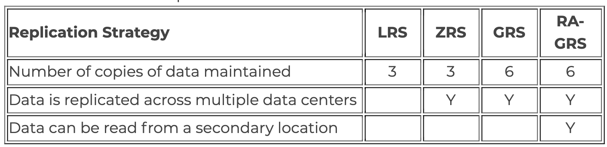

1. You create a resource group named `RG1` in `Azure Resource Manager`. You need to **prevent the deletion** of the resources in RG1. Which setting should you use? To answer, select the appropriate setting in the answer area.
	* **Locks**
2. Your Azure environment contains multiple Azure virtual machines.
You need to ensure that a virtual machine named VM1 is accessible from the Internet over HTTP. Solution: You modify a DDoS protection plan. Does this meet the goal?
	* **No** (**firewall should be configured not DDOS**)
3. An Azure administrator plans to run a PowerShell script that creates Azure resources. You need to recommend which computer configuration to use to run the script.
Solution: Run the script from a computer that runs Linux and has the Azure CLI tools installed. Does this meet the goal?
	* **No** (Azure CLI /= PowerShell)
4. What is required to use **Azure Cost Management?** ***
	* A. a Dev/Test subscription
	* B. Software Assurance
	* C. **an Enterprise Agreement (EA)** 
	* D. a pay-as-you-go subscription
 
5. Match the Azure service to the correct description.
	* **Azure Machine Learning:** Use past tranining to provide prediction that have high probability
	* **Azure IoT**: process data from millions sensors
	* **Azure AI Bot**: Provides a digitial online assitant that provides speech support
	* **Azure Functions**: Provides serverless computering functionalities

6. You need to ensure that when Azure Active Directory (Azure AD) users connect to Azure AD from the Internet by using an anonymous IP address, **the users are prompted automatically to change their password**.
Which Azure service should you use?
	* A. Azure AD Connect Health
	* B. Azure AD Privileged Identity Management 
	* C. Azure Advanced Threat Protection (ATP) 
	* **D. Azure AD Identity Protection**
7. Your Azure environment contains multiple Azure virtual machines.
You need to ensure that a virtual machine named VM1 is accessible from the Internet over HTTP. Solution: You modify an Azure firewall. Does this meet the goal?
	* Yes
8. For each of the following statements, select Yes if the statement is true. Otherwise, select No.
	* Two Azure subscriptions can be merged into a single subscription by creating a support request. **(False)**
	*  A single Microsoft account can be used to manage multiple Azure subscriptions. **(True)**
	*  A company can store resources in multiple subscriptions. **(True)**
9. For each of the following statements, select Yes if the statement is true. Otherwise, select No.
 * A platform as a service (PaaS) solution that hosts web apps in Azure provides full control of the operating systems that host applications. **(No)** 
 * A platform as a service (PaaS) solution that hosts web apps in Azure provides the ability to scale the platform automatically . **(Yes)**
 * A platform as a service (PaaS) solution that hosts web apps in Azure provides professional development services to continuously add features to custom applications. **(Yes)**
10. Your network contains an **Active Directory forest.** The forest contains 5,000 user accounts.
Your company plans to migrate all network resources to Azure and to decommission the on-premises data center.
You need to recommend a solution to minimize the impact on users after the planned migration. What should you recommend?

	* 	A. Implement Azure Multi-Factor Authentication (MFA)
	* 	**B. Sync all the Active Directory user accounts to Azure Active Directory (Azure AD)** 
	* 	C. Instruct all users to change their password
	* 	D. Create a guest user account in Azure Active Directory (Azure AD) for each user
 
11. You have several virtual machines in an Azure subscription. You create a new subscription. The virtual machines cannot be moved to the new subscription. 
	* A. No change is needed
	* **B. The virtual machines can be moved to the new subscription**
	* C. The virtual machines can be moved to the new subscription only if they are all in the same resource group 
	* D. The virtual machines can be moved to the new subscription only if they run Windows Server 2016.

12. Your company plans to purchase Azure.The company’s support policy states that the Azure environment must provide an option to access support engineers **by phone or email**. You need to recommend which support plan meets the support policy requirement.
Solution: Recommend a **Basic** support plan. Does this meet the goal?
	* No **(STANDARD, PROFESSIONAL DIRECT, PREMIER meet, developer no phone)**
13. Your company plans to deploy an Artificial Intelligence (AI) solution in Azure. What should the company use to build, test, and deploy predictive analytics solutions?
 * A. Azure Logic Apps
 * **B. Azure Machine Learning Studio** 
 * C. Azure Batch
 * Use **Azure Batch** to run large-scale parallel and high-performance computing (HPC) batch jobs efficiently in Azure.
 	 * Azure Batch creates and manages a pool of compute nodes (virtual machines), installs the applications you want to run, and schedules jobs to run on the nodes.
	 * Developers can use Batch as a platform service to build SaaS applications or client apps where large-scale execution is required.
 * D. Azure Cosmos DB
 
14. You plan to map a network drive from several computers that run Windows 10 to Azure Storage. You need to create a storage solution in Azure for the planned mapped drive.
What should you create?

	* A. an Azure SQL database
	* B. a virtual machine data disk
	* **C. a Files service in a storage account** 
		* Windows 10 run SMB so File service in Storage account  
	* D. a Blobs service in a storage account

15. Your Azure trial account expired last week. You are now unable to _create additional Azure Active Directory (Azure AD) user accounts_. **Instructions: Review the underlined text**. If it makes the statement correct, select “No change is needed”. If the statement is incorrect, select the answer choice that makes the statement correct.

	* A. No change is needed
	* B. start an existing Azure virtual machine 
	* **C. access your data stored in Azure**
	* D. access the Azure portal

16. For each of the following statements, select Yes if the statement is true. Otherwise, select No.
	* Azure provides flexibility between capital expenditure (CapEx) and operational exponditure (OpEx).  **(Yes)**
	* If you create two Azure virtual machines that use the B2S size, each virtual machine will always generate the same monthly costs. **(No)**
	* When an Azure virtual machine is stopped, you continue to pay storage costs associated to the virtual machine. **(Yes)**

17. Match the Azure service to the correct definition.
  * Azure Advisor : A tool that provides guidance and recommendations to improve an Azure environment
  * Azure Cognitive Services: A simplified tool to build intelligent Artificial Intelligence (AI) 
  * Azure Application Insights: Applications Monitors web applications
  * Azure DevOps:  An integrated solution for the deployment of code 
  		* pipeline, repo, load tesing, kanban dashboards 

18. You plan to deploy a critical line-of-business application to Azure. The application will run on an Azure virtual machine.
You need to recommend a deployment solution for the application. **The solution must provide a guaranteed availability of 99.99 percent**.
What is the minimum number of virtual machines and the minimum number of availability zones you should recommend for the deployment? To answer, select the appropriate options in the answer area.
  * **2 VMs**
  * **2 AZs**

19. For each of the following statements, select Yes if the statement is true. Otherwise, select No.
	* Most Azure services are introduced in private preview before being introduced in public preview and then in general availability. （**True**)
	* Azure services in public preview can be managed only by using the Azure CLI  (**False**)
	* The cost of an Azure service in private preview decreases when the service becomes generally available (**False**)

20. The company’s support policy states that the Azure environment must provide an option to access support engineers by phone or email. You need to recommend which support plan meets the support policy requirement.
Solution: Recommend a **Standard** support plan. Does this meet the goal?
	* Yes

21. _Resource groups_ provide organizations with the ability to manage the compliance of Azure resources **across multiple subscriptions**. **Instructions**: Review the underlined text. If it makes the statement correct, select “No change is needed”. If the statement is incorrect, select the answer choice that makes the statement correct.

	* A. No change is needed
	* B. **Management groups**
		* Management Groups. From the Microsoft Documentation: Azure Management Groups are containers for **managing access, policies and compliance across multiple Azure subscriptions**.
	* C. Azure policies
	* D. Azure App Service plans

22. What are two characteristics of the public cloud? Each correct answer presents a complete solution. NOTE: Each correct selection is worth one point.
	* 	A. dedicated hardware
	* 	B. unsecured connections 
	* 	C. limited storage
	* 	D. **metered pricing**
	* 	E. **self-service management**

23. Match the term to the correct definition.

	* **Azure Government**: An organization that defines standards used by the United States government.  
	* **GDPR**: A European policy that regulates data privacy and data protection.  
	* **ISO**: An organization that defines international standards across all industries. 
	* **NIST**: A dedicated public cloud for federal and state agencies in the United States.  

24. Which Azure service should you use to correlate events from multiple resources into a centralized repository?
	*  A. Azure Event Hubs
	*  B. Azure Analysis Services 
	*  C. **Azure Monitor**:
		* **Azure Monitor** aggregates metrics for Azure services and exposes them in a single interface.
		* **Log data collected by Azure Monitor** (formerly Azure Log Analytics) is stored in a Log Analytics workspace, which is based on Azure Data Explorer. (linux academy)
	*  D. **Azure Log Analytics** 
		*  **Site Log Analytics Consolidate the Activity Log** from multiple Azure subscriptions into one location for analysis  
25. An Azure administrator plans to run a **PowerShell script** that creates Azure resources. You need to recommend which computer configuration to use to run the script.
Solution: Run the script from a computer that runs macOS and has PowerShell Core 6.0 installed. Does this meet the goal?
	* A. Yes

26. You need to implement a database solution that meets the following requirements:
 * Can add data concurrently from multiple regions
 * Can store JSON documents
 		* **Azure Cosmos DB is a great way to store unstructured and JSON data**. Combined with Azure Functions, Cosmos DB makes storing data quick and easy with much less code than required for storing data in a relational database. 

27. An organization that hosts its infrastructure in a _private cloud_ can decommission its data center.

	* A. No change is needed. 
	* B. in a hybrid cloud
	* **C. in the public cloud**
	* D. on a Hyper-V host

28. When you are implementing a software as a service (SaaS) solution, you are responsible for _configuring high availability._

	* A. No change is needed.
	* B. defining scalability rules
	* C. installing the SaaS solution 
	* **D. configuring the SaaS solution**

29. You have an Azure environment that contains 10 virtual networks and 100 virtual machines. You need to **limit the amount of inbound traffic** to all the Azure virtual networks.
What should you create?

	* A. one network security group (NSG) 
	* B. 10 virtual network gateways
	* C. 10 Azure ExpressRoute circuits 
	* **D. one Azure firewall**
		* NSG just block or open a port, **Azure Firewall can "limit the amount of traffic"**, because it's a stateful firewall. 

30. Your Azure environment contains multiple Azure virtual machines.
You need to ensure that a virtual machine named VM1 is accessible **from the Internet over HTTP**. Solution: You modify an _Azure firewall_. Does this meet the goal?
	* A. **Yes**

31. Which two types of customers are eligible to use **Azure Government** to develop a cloud solution? Each correct answer presents a complete solution. NOTE: Each correct selection is worth one point.

	* A. a Canadian government contractor
	* B. a European government contractor
	* C. **a United States government entity**
	* D. **a United States government contractor** 
	* E. a European government entity

32. For each of the following statements, select Yes if the statement is true. Otherwise, select No. NOTE: Each correct selection is worth one point.

	* To implement an Azure Multi-Factor Authentication (MFA) solution, you must deploy a federation solution or sync on-premises identities to the cloud. **(No)**
	* Two valid methods for Azure Multi-Factor Authentication (MFA) are picture identification and a passport number. **(No)**
	* Azure Multi-Factor Authentication (MFA) can be required for administrative and non-administrative user accounts.  **(Yes)**

33. For each of the following statements, select Yes if the statement is true. Otherwise, select No
   * All the Azure resources deployed to a single resource group must share the same Azure region. **(False)**
   * 	If you assign a tag to a resource group, all the Azure resources in that resource group are assigned to the same tag. **(False)**
   *  If you set permissions to a resource group, all the Azure resources in that resource group inherit the permissions. **(True)**

34. You need to view a list of **planned maintenance events** that can affect the availability of an Azure subscription. Which blade should you use from the Azure portal? To answer, select the appropriate blade in the answer area.
 * **Help and support**

35. To what should an application connect to retrieve security tokens?
	* A. an Azure Storage account
	* B. **Azure Active Directory (Azure AD)**
	* C. a certificate store
	* D. an Azure key vault

36. For each of the following statements, select Yes if the statement is true. Otherwise, select No.
	* An Azure service in private preview is released to all Azure customers.  **(No)**
	* An Azure service in public preview is released to all Azure customers. **(Yes)**
	* An Azure service in general availability is released to a subset of Azure customers. **(No)**

37. Each business unit requires 20 different Azure resources for daily operation. All the business units require the same type of Azure resources. You need to recommend a solution to **automate the creation of the Azure resources**. What should you include in the recommendations?

	* A. **Azure Resource Manager templates** 
	* B. virtual machine scale sets
	* C. the Azure API Management service 
	* D. management groups 

38. _Azure policies_ provide a common platform for deploying objects to a cloud infrastructure and for implementing consistency across the Azure environment.

	* A. No change is needed
	* B. Resource groups provide
	* C. **Azure Resource Manager provides** 
		* Deploy application resource
		* Organize resources
		* Controll access and resources
	* D. Management groups provide
		* **Manage access, policies, and compliance across multiple subscrptions**

39. An Azure administrator plans to run a **PowerShell script** that creates Azure resources. You need to recommend which computer configuration to use to run the script.
**Solution**: Run the script from a computer that runs Chrome OS and uses Azure Cloud Shell. Does this meet the goal?
	* **No** (Azure PowerShell is a module that you can install for Windows PowerShell)
		* Powershell command could be on Chrome but **PowerShell script** cannot
		* **Powershell command /= PowerShell script**

	
40. When planning to migrate a public website to Azure, you must plan to _pay monthly usage costs_.
	
	* A. **No change is needed**
	* B. Deploy a VPN
	* C. pay to transfer all the website data to Azure
	* D. reduce the number of connections to the website

41. You have an on-premises network that contains several servers. You plan to migrate all the servers to Azure.
You need to recommend a solution to ensure that some of the servers are available if a single Azure data center goes offline for an extended period. What should you include in the recommendation?

	* A. **fault tolerance**
	* B. elasticity
	* C. scalability
	* D. low latency

42. For each of the following statements, select Yes if the statement is true. Otherwise, select No.

	*  The Service Level Agreement (SLA) guaranteed uptime for paid Azure services is at least 99.9 perent. **（Yes)**
    *    Companies can increase the Service Level Agreement (SLA) guaranteed uptime by adding Azure resources to multiple regions.  **（Yes)**
    *    Companies can increase the Service Level Agreement (SLA) guaranteed uptime by purchasing multiple subscriptions.    **(No)**

43. Each correct selection is worth one point.

	* **Azure Databricks** : **A big data analysis service** for machine learning
	* Azure Functions : Provides the platform for serverless code
	* Azure App Service: Hosts web app 
	* Azure Application Insights : Detects and diagnoses anomalies in web apps

44. A team of **developers** at your company plans to deploy, and then remove, 50 customized virtual machines each week. Thirty of the virtual machines run Windows Server 2016 and 20 of the virtual machines run Ubuntu Linux. You need to recommend which Azure service will minimize the administrative effort required to deploy and remove the virtual machines. What should you recommend?
	* 	A . Azure virtual machine scale sets
	* 	B . Microsoft Managed Desktop
	* 	**C . Azure DevTest Labs**
		*  Azure DevTest Labs **enables developers on teams to efficiently self-manage virtual machines (VMs) and PaaS resources without waiting for approvals**.
	* 	D . Azure Reserved Virtual Machine (VM) Instances

45. Your company plans to request an **architectural review** of an Azure environment from Microsoft. The company currently has a Basic support plan. You need to recommend a new support plan for the company. The solution must minimize costs. Which support plan should you recommend?
	* **A . Premier**: Architectural support such as **design reviews, performance tuning, configuration and implementation assistance delivered**
	* B . Developer
	* C . Professional Direct:  Architectural guidance
	* D . Standard

46. Your company has an Azure subscription that contains the following unused resources:
	* 20 user accounts in Azure Active Directory (Azure AD)
	* Five groups in Azure AD
	*  10 public IP addresses
	*  10 network interfaces
	*  You need to reduce the Azure costs for the company. **Solution: You remove the unused public IP addresses.**Does this meet the goal?
	*  **Yes**
		*  You remove the unused network interfaces. **No** **Network Interface are not charged**
		*  You remove the unused user accounts. **No**

47. When you need to **delegate permissions** to several Azure virtual machines simultaneously, you must _deploy the Azure virtual machines to the same Azure region_
	* A . No change is needed.
	* B . by using the same Azure Resource Manager template
	* **C . to the same resource group**
	* D . to the same availability zone
48. You plan to create an Azure virtual machine. You need to identify which storage service must be used to store the data disks of the virtual machine.
   * **Blobs**
49. Your Azure environment contains multiple Azure virtual machines.
You need to ensure that a virtual machine named VM1 is accessible from the Internet over HTTP. **Solution:** You modify an **Azure Traffic Manager profile**. Does this meet the goal?
	* **No** (LB, Application Gateway)
	* Azure Traffic Manager is a **DNS-based traffic** load balancer that enables you to **distribute traffic**
50. Your company plans to deploy several web servers and several database servers to Azure.You need to recommend an Azure solution to limit the types of connections from the web servers to the database servers. What should you include in the recommendation?

	* 	**A. network security groups (NSGs)** 
	* 	B. Azure Service Bus
	* 	C. a local network gateway
	* 	D. a route filter
51.  Azure Advisor provides recommendations on how to improve the security of an Azure Active Directory (Azure AD) environment.
  * **False**
52. Azure Advisor provides recommendations on how to reduce the cost of running Azure virtual machines.
  * True
53. Azure Advisor provides recommendations on how to configure the network settings on Azure virtual machines.
  * **False**
  * Azure Advisor is a free service built into Azure that provides recommendations on **high availability, security, performance, and cost**.
54. You plan to deploy a critical line-of-business application to Azure. The application will run on an Azure virtual machine. You need to recommend a deployment solution for the application. The solution must provide a guaranteed availability of **99.99 percent**. What is the minimum number of **virtual machines and the minimum number** of availability zones you should recommend for the deployment?
 * 1
 * **2**
 * 4
 * 7 
55. Your company plans to purchase Azure. The company’s support policy states that the Azure environment must provide an option to access support engineers by phone or email. You need to recommend which support plan meets the support policy requirement. Solution: **Recommend a Premier support plan**.
 * **True**
56. A _________ is owned by a cloud services provider (also known as a hosting provider).
	* Public Cloud
57. You plan to migrate a web application to Azure. The web application is accessed by external users.
You need to recommend a **cloud deployment solution to minimize the amount of administrative effort** used to manage the web application. What should you include in the recommendation?
	* platform as a service (PaaS)
58. You have an on-premises network that contains 100 servers.
You need to recommend a solution that provides additional resources to your users. **The solution must minimize capital and operational expenditure costs**. What should you include in the recommendation?
	* **a private cloud**
		* A move to public cloud wrong: because migrating to the public cloud the infrastructure doesn't provide additional resources and has a lot of OpEx (Operational expenditure) and a starting Cap.
		* Creating an hybrid cloud from an on-premises network means that we have to create a public cloud, wich has an high OpEx
59. A support engineer plans to perform several Azure management tasks by using the Azure CLI. You install the CLI on a computer. **You need to tell the support engineer which tools to use to run the CLI**.
Which **two tools should you instruct the support engineer to use?** Each correct answer presents a complete solution. NOTE: Each correct selection is worth one point.
	* **Command Prompt**
	* Azure Resource Explorer
	* **Windows PowerShell**
	* Windows Defender Firewall
	* Network and Sharing Center
60. You plan to store 20 TB of data in Azure. The data will be accessed **infrequently and visualized by using Microsoft Power BI**. You need to recommend a storage solution for the data.
Which two solutions should you recommend? Each correct answer presents a complete solution. NOTE: Each correct selection is worth one point.
 * **Azure Data Lake**
 * Azure Cosmos DB
 * **Azure SQL Data Warehouse**
 * Azure SQL Database
 * Azure Database for PostgreSQL
61. You need to identify the type of failure for which an **Azure availability zone can be used to protect access to Azure services**.
What should you identify?
	* a physical server failure
	* an Azure region failure
	* a storage failure
	* **an Azure data center failure**
62. You need to deploy an Azure environment that supports the planned migration. Solution: You create an Azure App Service and Azure SQL databases.Does this meet the goal?
 * Yes
63. Your company plans to migrate all its data and resources to Azure. The company’s migration plan states that only **platform as a service (PaaS)** solutions must be used in Azure. You need to deploy an Azure environment that supports the planned migration. **Solution: You create an Azure App Service and Azure virtual machines that have Microsoft SQL Server installed.** Does this meet the goal?
  * No (Virtual Machine is not a PaaS, hence no is correct)
64. Your company plans to migrate all its data and resources to Azure. The company’s migration plan states that only platform as a service (PaaS) solutions must be used in Azure. You need to deploy an Azure environment that supports the planned migration. **Solution: You create an Azure App Service and Azure Storage accounts.**
 * **No** (**Azure Storage Accounts are IaaS**)
65. Your company hosts an accounting named App1 that is used by all the customers of the company. **App1 has low usage during the first three weeks of each month and very high usage during the last week of each month**. Which benefit of Azure Cloud Services supports cost management for this type of usage pattern? 
	* high availability
	* high latency
	* **elasticity**
	* load balancing
66. Which cloud deployment solution is used for **Azure SQL databases**? ***
  * **Platform as a Service (PaaS)**
67. To achieve a hybrid cloud model, a company must always migrate from the private cloud model.
 * No
68. A company can extend the capacity of its internal network by using the public cloud.
  * **Yes**
69. In a public cloud model, only guest users at your company can access the resources in the cloud.
  * No
70. You plan to migrate several servers from an on-premises network to Azure. You need to identify the primary benefit of using a public cloud service for the servers. What should you identify?
	* The public cloud is owned by the public, not a private corporation
	* The public cloud is a crowd-sourcing solution that provides corporations with the ability to enhance the cloud
	* All public cloud resources can be freely accessed by every member of the public
	* **The public cloud is a shared entity whereby multiple corporations each use a portion of the resources in the cloud**
71. You plan to deploy several Azure virtual machines. You need to ensure that the services running on the virtual machines are available if a single data center fails. Solution: **You deploy the virtual machines to two or more scale sets**. Does this meet the goal?
	* No **(Apply Availability Zone)**
72. You plan to deploy several Azure virtual machines. You need to ensure that the services running on the virtual machines are available if a single data center fails. Solution: You deploy the virtual machines to **two or more availability zones**.
 * Yes
73. You plan to deploy several Azure virtual machines. You need to ensure that the services running on the virtual machines are available if a **single data center fails**. Solution: You deploy the virtual machines to two or more regions. ???
 * No **(Azure have paired regions, not all regions can pair to each other)**
74. You have 1,000 virtual machines hosted on the Hyper-V hosts in a data center. You plan to migrate all the virtual machines to an Azure pay-as-you-go subscription. You need to identify which expenditure model to use for the planned Azure solution. Which expenditure model should you identify?
	* **operational**
	* capital
	* elastic
	* scalable
75. Your company has an on-premises network that contains multiple servers. The company plans to reduce the following administrative responsibilities of network administrators:
  * Backing up application data
  * Replacing failed server hardware
  * Managing physical server security
  * Updating server operating systems
  * Managing permissions to shared documents
  * The company plans to migrate several servers to Azure virtual machines. You need to identify which administrative responsibilities will be reduced after the planned migration. Which two responsibilities should you identify?
  		*  **Replacing failed server hardware**
  		*  Backing up application data
  		*  **Managing physical server security**
  		*  Updating server operating systems
  		*  Managing permissions to shared documents
76.  You have an Azure environment. You need to create a new Azure virtual machine from an **Android laptop**. Solution: You use PowerShell in **Azure Cloud Shell**.
	* **Yes** (From Android OS in portal.azure.com in a web brwoser, you can launch Azure Cloud Shell and select bash or Powershell, then create a Storage as a prerequisite)

77. You have an Azure environment. You need to create a new Azure virtual machine from an Android laptop. Solution: You use the **PowerApps portal**.
	* **No**(Power apps is not part of Azure.)

78. You have an Azure environment. You need to create a new Azure virtual machine from an Android laptop.Solution: You use the **Azure Portal**.
	* **Yes** web browser (https://portal.azure.com)

79. Data that is copied to an Azure Storage account is maintained automatically in **at least three copies**.
	* **Yes**
	* Your data in Microsoft Azure is always replicated to **ensure durability and high availability**. Azure Storage will maintain **at least 3 copies of your data**, either within the same data center, **locally redundant storage (LRS), or a second data center, either zone-redundant storage (ZRS), geo-redundant storage (GRS), or read-access geo-redundant storage (RA-GRS)**.
	* 
80. All data that is copied to an Azure Storage account is backed up automatically to another Azure data center.
	* **No（Not all, only for  zrs, grs, ra-grs)**
81. An Azure Storage account can contain up to 2 TB of data and up to one million files
	* **No**
	* Maximum storage account capacity: **5 PiB**
82. Only virtual machines that run Windows Server can be created in availability zones.
	* **No**
83. Availability zones are used to replicate data and applications to multiple regions.
	* **No**
84. An Azure region _contains one or more data centers that are connected by using a low-latency network_.
	* No change is needed.
85. You plan to deploy 20 virtual machines to an Azure environment. To ensure that a virtual machine named VM1 cannot connect to the other virtual machines, _VM1 must be deployed to a separate virtual network_.
	* No change is needed.
86. When you need to delegate permissions to several Azure virtual machines simultaneously, you must deploy the Azure virtual machines to _the same Azure region._
	* **to the same resource group**
	* When you need to **delegate permissions to several Azure virtual machines simultaneously**, you must deploy the Azure virtual machines to the **same resource group**
87. One of the benefits of Azure SQL Data Warehouse is that _high availability_ is built into the platform.
	* **No change is needed.**

88. You have a virtual machine named VM1 that runs Windows Server 2016. VM1 is in the East US Azure region. Which Azure service should you use from the Azure portal to view service failure notifications that can affect the availability of VM1?
	* Azure Service Fabric
		* **Distributed system platform, runs in azure or on-premise** 
		* **Azure Monitor(Azure Notification Hubs)**
	* Azure virtual machines
	* Azure Advisor
89. You have an Azure environment that contains multiple Azure virtual machines.You plan to implement a solution that enables the client **computers on your on-premises network to communicate to the Azure virtual machines**.You need to recommend which Azure resources must be created for the planned solution.
	* **a virtual network gateway**
		* A virtual network gateway defines the Azure network side of a site-to-site virtual private network.
	* a load balancer
	* an application gateway
	* **a virtual network**
		* Azure Virtual Network enables many types of Azure resources, such as Azure Virtual Machines (VM), to securely communicate with each other, the internet, and on-premises networks.
	* a gateway subnet
90. Your company plans to move several servers to Azure. The company’s compliance policy states that a **server named FinServer must be on a separate network segment**. You are evaluating which Azure services can be used to meet the compliance policy requirements. Which Azure solution should you recommend?
	* **a virtual network for FinServer** and another virtual network for all the other servers
91. Your company plans to migrate all its network resources to Azure.
You need to start the planning process by exploring Azure.What should you create first?
	* **a subscription**
92.  You have an on-premises application that **sends email notifications automatically based on a rule**.You plan to migrate the application to Azure. You need to recommend a serverless computing solution for the application. What should you include in the recommendation?
	* **a logic app**
		* **Azure Logic Apps**: Automate and orchestrate tasks, business processes, and workflows when you need to integrate apps, data, systems
93. You plan to deploy a website to Azure. The website will be accessed by users worldwide and will host large video files.
You need to recommend which Azure feature must be used to provide the best video playback experience. What should you recommend?
	* a content delivery network (CDN)
94. Your company plans to deploy several million sensors that will upload data to Azure. You need to identify which Azure resources must be created to support the planned solution. Which two Azure resources should you identify? Each correct answer presents part of the solution.
	* Azure Queue storage
	* Azure IoT Hub
95. An Azure region _**contains one or more data centers that are connected by using a low-latency network**_.
	* No change is needed
96. If a resource group named RG1 has a delete lock, _**only a member of the global administrators group can delete RG1**_.
	* the delete lock must be removed before an administrator
97. This question requires that you evaluate the underlined text to determine if it is correct.Azure Germany can be used by **_legal residents of Germany only_**.
	* **Any user or enterprise that requires its data to reside in Germany**
98. After you create a virtual machine, you need to modify the **_network security group (NSG)_** to allow connections from TCP port 8080 to the virtual machine.
	* No change is needed
99. Which Azure service should you use to store certificates?
	* Azure Key Vault
100. you have a resource group named RG1.You plan to create virtual networks and app services in RG1.**You need to prevent the creation of virtual machines only in RG1**.What should you use?
	* **An Azure policy**(lock?)
		*  You can set the lock level to **CanNotDelete** or **ReadOnly**
101. What can Azure Information Protection encrypt?
	* documents and email messages
		* (Desc）:Azure Information Protection: by protecting sensitive information such as **emails and documents with encryption,** **restricted access and rights**, and **integrated security in Office apps**
102. What should you use to evaluate whether your company’s Azure environment meets regulatory requirements?
	* the Security Center blade from the Azure portal
		* **Security Center**: Monitoring service that provides threat protection across all of your services both in Azure, and on-premises.  
103. Your company implements _Azure policies_ to automatically add a watermark to **Microsoft Word documents that contain credit card information**.
	* **Azure Information Protection(AIP-> Doc, email)**
		* Classify and protect docs and email with encrypt
		* Use label to apply classification
		* **Automatically based on rules/cond and manually by users**
104. From _Azure Monitor_, you can view which user turned off a specific virtual machine during the last 14 days.
	* **Azure Activity Log**
		* The **Azure Activity log** is a **platform log** that provides insight into **subscription-level events** that have occurred in Azure
		* **When resources are created or modified**
105. You have an Azure virtual network named VNET1 in a resource group named RG1. **You assign an Azure policy specifying that virtual networks are not an allowed resource type in RG1**. VNET1 is _deleted automatically_.
	* **continues to function normally**
	* vnet1 continues working normally. But you cannot create more networks.

106. Your company has an Azure environment that contains resources in several regions. A company policy states that administrators **must only be allowed to create additional Azure resources in a region in the country** where their office is located. You need to create the Azure resource that must be used to meet the policy requirement.
	* an Azure policy
		* Allowed **storage account** / **VM** SKUs
		* Allowd **Locations / Resource Types**
107. _Authorization_ is the process of verifying a user’s credentials.
	* Authentication
108.  You need to configure an Azure solution that meets the following requirements:
	✑ Secures websites from attacks ✑ Generates reports that contain details of attempted attacks What should you include in the solution?
	* DDoS protection

109. Your company plans to migrate all on-premises data to Azure. You need to identify whether Azure complies with the company’s regional requirements. What should you use?
	* **Trust Center** is a website resource containing information and details about how Microsoft implements and supports security, privacy, compliance, and transparency in all Microsoft cloud products and services.
	* **One-stop for security, privacy, and compliance documents**
110. Azure Key Vault is used to store secrets for Azure Active Directory (Azure AD) user accounts.
	* No change is needed
	* **Azure Key Vault enables Microsoft Azure applications** and users to store and use several types of secret/key data
111. You attempt to create several managed Microsoft SQL Server instances in an Azure environment and receive a message that you must increase your Azure subscription limits. What should you do to increase the limits?
	* Create a new support request
112. Your company has 10 offices. You plan to generate several billing reports from the Azure portal. Each report will contain the Azure resource utilization of each office. Which Azure Resource Manager feature should you use before you generate the reports?
	* **Tags** 
113. You deploy an Azure resource. The resource becomes unavailable for an extended period due to a service outage. Microsoft will _automatically refund your bank account._
	* **automatically credit your account**
114. A support plan solution that gives you **best practice information, health status and notifications, and 24/7 access to billing information** at the lowest possible cost is a _Standard_ support plan.
	* **Basic**: 24x7 access to billing and subscription support, online self-help, documentation, whitepapers, and support forums
115. Which cloud deployment solution is used for Azure virtual machines and Azure SQL databases? 
	* **Infrastructure as a Service (Iaas)**
116. A company can extend the capacity of its internal network by using the public cloud
	* Yes
117. Azure resources can only access other resources in the same resource group.
	* **No**
118. If you delete a resource group, all the resources in the resource group will be deleted.
	* **Yes**
119. A resource group can contain resources from multiple Azure regions.
	* **Yes**
120. Azure Advisor provides recommendations on how to improve the security of an Azure Active Directory (Azure AD) environment.
	* **No**
121. **Azure Advisor provides recommendations on how to reduce the cost of running Azure virtual machines**. *** 
	* Yes
122. If you have Azure resources deployed to every region, you can implement availability zones in all the regions.
	* **No**
123. You have an Azure environment that contains 10 web apps. To which URL should you connect to manage all the Azure resources? To answer, select the appropriate options in the answer area
	* https://portal.azure.com
124. A cloud-based service that leverages massively parallel processing (MPP) to quickly **run complex queries across petabytes of data in a relational database**
	* Azure SQL Data Warehouse
125. An open-source framework for the distributed processing and analysis of big data sets in clusters
	* Apache Hadoop in **Azure HDInsight**
126. Monitor the health of Azure services:
	* Monitor
127. Browse available virtual machine images:
	* Marketplace
128. View security recommendations:
	* **The Secuirty Center**
		* Security recommendations
		* Monitor Security settings
		* Security assessment to identify potential vulnerability
		* Detect and block malware installed on VMs
		* Analyze and identify inbound attack
		* provdide in-time access control for ports
	* **Advisor: recommendations for improvement, HA, Security, Performance, cost**
129. You plan to create an Azure virtual machine. You need to identify which storage service must be used to **store the data disks of the virtual machine**.
	* Blobs
	* Page blobs can be used to store random access files that are up to 8TB in size. **Virtual hard drives (VHDs) that serve as disks for virtual machines are stored in page blobs**.
130. What is guaranteed in an Azure Service Level Agreement (SLA)? *** 
	* **feature availability(uptime + connectivity)**
131. Your company has 10 departments.The company plans to implement an Azure environment.You need to ensure that each department can use a **different payment option for the Azure services it consumes**. What should you create for each department?
	* a subscription
132. Your company plans to migrate to Azure. The company has several departments. All the Azure resources used by each department will be managed by a department administrator.
You need to recommend an Azure deployment that provides the ability to segment Azure for the departments. The solution must minimize administrative effort.
	* multiple subscriptions
	* multiple resource groups (is also ok)
133. Authorization to access Azure resources can be provided only to Azure Active Directory (Azure AD) users.
	* No
134. Identities stored in Azure Active Directory (Azure AD), third-party cloud services, and on-premises Active Directory can be used to access Azure resources.
	* Yes
135. Azure Advisor can generate a list of Azure virtual machines that are **protected by Azure Backup**.
	* **No** (Azure Advisor provides recommendations on virtual machines that are NOT backed up)
136. If you implement the security recommendations provided by Azure Advisor, your company's secure score will decrease **
	* **No**
137. To maintain Microsoft support, you must implement the security recommendations provided by Azure Advisor within a period of 30 days. **
	* **No**
138. Azure Firewall will encrypt all the network traffic sent from Azure to the Internet. *** 
	* **No** (provides **inbound protection** for non-HTTP/S protocols. Examples of non-HTTP/S protocols include: Remote Desktop Protocol (RDP), Secure Shell (SSH), and File Transfer Protocol (FTP))
139.  A network security group (NSG) will encrypt all the network traffic sent from Azure to the Internet.
	* No **(security rules filter traffic)**
140. Azure virtual machines that run Windows Server 2016 can encrypt the network traffic sent from the virtual machines to a host on the internet. *** 
	* **Yes** (vm can encrypt)
141. Monitor threat by using sensors:
	* **Azure Advanced Threat Protection (ATP)**
	* Detect ATP advanced threat (**compromised ids, malicious insiders**) 
		* Azure ATP portal
		* Azure ATP sensor
		* Azure ATP CloudService
142. From Azure Service Health, an administrator can view the health of all the services deployed to an Azure environment and all the other services available in Azure.
	* Yes
		* **Azure status** / **Service Health** / **Resource Health** 
143. From Azure Service Health, an administrator can create a rule to be alerted if an Azure service fails.
	* **Yes**
	*  Can notify you, help you understand the impact of issues
144. From Azure Service Health, an administrator can prevent a service failure from affecting **a specific virtual machine**.
	* **No**
		* Service Health: **Can notify you, help you understand the impact of issues**
		* Help you prepare for planned maintenance and changes
145.  If your company uses an Azure free account, you will only be exposed to a subset of Azure services.
	* **No** (we can use all services in free trail)
146. All Azure free accounts expire after a specific period.
	* **Yes** (free account expires after 12 months)
147. You can create up to 10 Azure free accounts by using the same Microsoft account.
	* **No** 
148.  Each Azure subscription can contain multiple account administrators.
	* **Yes** 
		* You can have **1 Account Administrator and 1 Service Administrator, but you can have 200 Co-Administrators per subscription**
149.  Each Azure **subscription** can be managed by using a Microsoft account only. *** 
	* Yes
150. An Azure resource group contains multiple Azure subscriptions.
	* **No**
151.  In Azure Active Directory Premium, at least 99.9 percent availability is guaranteed.
	* **Yes**
152. The Service Level Agreement (SLA) for Azure Active Directory Basic is the same as the SLA for Azure Active Directory Free.
	* **No**
153. All Azure services in private preview must be accessed by using a separate Azure portal.
	* **No** (private preview will be using the same Azure portal)
154.  Azure services in **public preview** can be used in production environments.
	* **No**: Public review is a beta version that can be tested 
155. Azure services in public preview are subject to a Service Level Agreement (SLA)
	* **No** (**SLA is not applicable for Public Preview ONLY GA**)

156. All paying Azure customers can claim a credit if their monthly uptime percentage is below the guaranteed amount in the Service Level Agreement (SLA). 
 *  **(Yes)**
156. Can run massively parallel data transformation and processing programs across petabytes of data
	* **Azure Data Lake Analytics**
		* **Easily develop and run massively parallel data transformation and processing programs** in U-SQL, R, Python, and .NET over petabytes of data"
	* I believe it should be **data warehouse**
157. How many management tools are available in Azure?
	* Azure CLI
	* Portal
	* Cloud Shell
	* Mobile App
158. How many disk a VM have by default
	* 2
159. What is the default size of Windows OS Disk ***
	* **100G**
160. Which VM templates support Nested Virtualization in Azure	

	* **E-series**

161. Azure virtual machine：**IaaS**  / Azure SQL Server: **PaaS**
162. Each correct match is worth one point.
	* **Disaster Recovery**:   A cloud service that can be recovered after it Occurs 
	* **Fault tolerance**: A cloud service that remains available after it occurs 
	* **Low latency**: A cloud service that can be accessed quickly to the Internet 
	* **Dynamic scalability**: A cloud service that performs quickly when it increases 
163. You plan to extend your company's network to Azure. The network contains a VPN appliance that uses an IP address of `131.107.200.1`.You need to create an Azure resource that identifies the VPN appliance.Which Azure resource should you create? To answer, select the appropriate resource in the answer area.
	 * **Local network gateway**
	 * A local network gateway **represents the hardware or software VPN device in your local network**. Use this with a connection to set up a site-to-site VPN connection between an **Azure virtual network and your local network**.
164. You have an Azure web app.You need to manage the settings of the web app from an iPhone.What are two Azure management tools that you can use
	 * the Azure portal  (Azure portal -> Azure Cloud Shell)
	 * Azure Cloud Shell
165. You have an application that is comprised of an Azure web app that has a Service Level Agreement (SLA) of 99.95 percent and an Azure SQL database that has an SLA of 99.99 percent. The composite SLA for the application is the product of both SLAs, which equals 99.94 percent.
	*  No change is needed (`0.9995*0.9999*100 = 99.94`)
166. What should you use to evaluate whether your company's Azure environment meets regulatory requirements?
	* The **Security Center blade from the Azure portal** allows you to check the compliance of your Azure Environment with the commonly practiced regulatory standards, which the question is refering to
	* Security Center -> Regulatory Compliance (under "Policy & Compliance").
	* **Compliance Manager from the Service Trust Portal**
167. Each correct selection is worth one point.
	* Authorization to access Azure resources can be provided only to Azure Active Directory (Azure AD) users.   **(No)**
	* Identities stored in Azure Active Directory (Azure AD), third-party cloud services, and on-premises Active Directory can be used to access Azure resources.  **(Yes)**
	* Azure has built-in authentication and authorization services that provide secure access to Azure resources.  **(Yes)**
		* Authentication
		* SSO
		* Device/Application Management
		* B2B/B2C identity services 
168. You need to recommend an Azure solution that encrypts the administrative credentials during the deployment.
	* Azure Key Vault
169. Each correct selection is worth one point.
	* A Standard support plan is included in an Azure free account.   **(No)**
	* A Premier support plan can only be purchased by companies that have an Enterprise Agreement (EA).   **(Yes)**
	* Support from MSDN forums is only provided to companies that have a pay-as-you-go subscription.    **(No)**

170. How should you calculate the monthly uptime percentage? 
	* **Monthly Uptime %= (Maximum Available Minutes - Downtime Minutes) / (Maximum Available Minutes) * 100**

171. Each correct selection is worth one point.
	* By creating additional resource groups in an Azure subscription. additional costs are incurred.      **(NO)**
	* By copying several gigabits of data to Azure from an on-premises network over a VPN. additional data transfer costs are incurred.    **(NO)**
		* **Most of the time inbound data transfers (data going into Azure datacenters) are free**. 
	* By copying several GB of data from Azure to an on-premises network over a VPN, additional data transfer costs are incurred.  **(Yes)**
		* In most zones,**the first outbound 5 gigabytes (GB) per month are free. After that amount, you are billed a fixed price per GB**.
172. In which Azure support plans can you open a new support request? ***
	* **Premier, Professional Direct, Standard, and Developer only (No Basic)**
173. You can create an Azure support request from _support.microsoft.com_.
	*  the Azure portal
174. Hot Area:
	* An Azure free account has a spending limit.  (Yes) 
	* An Azure free account has a limit for the amount of data that can be uploaded to Azure.
		* (**Yes**) Azure free account has a 5 GB blob storage limit and a 5 GB file storage limit. 
	* An Azure free account can contain an unlimited number of web apps. 
		* (**No**) Azure free account has a limit of 10 web, mobile or API apps 
175. Hot Area:
	* Storing 1 TB of data in Azure Blob storage will always cost the same, regardless of the Azure region in which the data is located.  **(No)**
	* When you use a general-purpose v2 Azure Storage account, you are only charged for the amount of data that is stored. All read and write operations are free.  **(No)**
	* Transferring data between Azure Storage accounts in different Azure regions is free. **(No)**
		* **Usage metrics / resource type / Services / Location** 
		* **Billing zone (in free, out cost)**
176. You have an Azure subscription named Subscription1. You sign in to the Azure portal and create a resource group named RG1.
From Azure documentation, you have the following command that creates a virtual machine named VM1. `az vm create --resource-group RG1 --name VM1 -- imageUbuntuLTS --generate-ssh-keys -` , You need to create VM1 in Subscription1 by using the command. Solution: From the Azure portal, **launch Azure Cloud Shell** and select PowerShell. Run the command in Cloud Shell.
	* **Yes**
177.  Solution: From a computer that runs Windows 10, install Azure CLI.  **From PowerShell**, sign in to Azure and then run the command.. 
	* **No**
177. Solution: From a computer that runs Windows 10, install Azure CLI. **From a command prompt**, sign in to Azure and then run the command.
	* **Yes**
178. If Microsoft plans to end support for an Azure service that does NOT have a successor service, Microsoft will provide notification at **_least 12 months_** before.
	* A. No change is needed.
