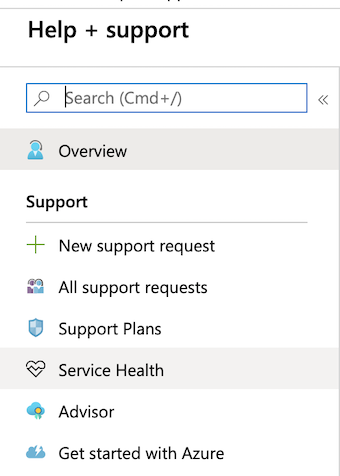
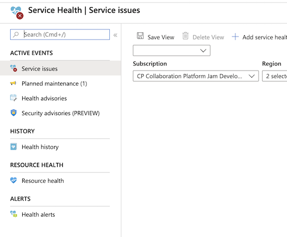
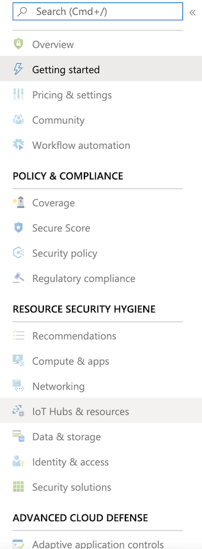

* If you assign a tag to a resource group, all the Azure resources in that resource group are assigned to the same tag. (**False**)
* If you set permissions to a resource group, all the Azure resources in that resource group inherit the permissions. (**True**)

```
resource group => (Tags: No) , (Permission: Yes)  => resource 
```

* **Planned Maintenance events**
	* **Help and support**  => **Service Health** => **Planned Maintenance**


* When planning to migrate a public website to Azure, you must plan to **_pay monthly usage costs_**.

* **Premier**: Architectural support such as **design reviews, performance tuning, configuration and implementation assistance delivered**


* Reduce the Azure costs for the company
	* **Remove public IP addresses => Yes**
	* **Remove unused network interfaces => No**
	* **Remove the unused user accounts => No** 


* Deploy the virtual machines to two or more regions => single data center fails
	* **No (Azure have paired regions, not all regions can pair to each other and not all regions have multi-AZ)**


* **Azure Cloud Shell => Web Browser => bash + powershell**

* One of the benefits of Azure SQL Data Warehouse is that **high availability** is built into the platform.

* What should you use to evaluate whether your company’s Azure environment **meets regulatory requirements**?
	* The **Security Center blade from the Azure portal**
	* **Security Center** => **Regulatory Compliance (Policy&Compliance)** => **Meets regulatory requirements**


* From **Azure Activity Log**, you can view which user turned off a specific virtual machine **during the last 14 days**.

* Your company plans to migrate all on-premises data to Azure. You need to identify whether Azure complies with the company’s regional requirements. What should you use? => **Trust Center**

* **You can implement availability zones in all the regions. => No**

* Azure Advisor can generate a list of Azure virtual machines that are protected by Azure Backup.
	* **No (Azure Advisor provides recommendations on virtual machines that are NOT backed up)**

* Each Azure subscription can contain multiple account administrators.
	* **Yes**
		* **You can have 1 Account Administrator and 1 Service Administrator, but you can have 200 Co-Administrators per subscription**

* **A Premier support plan can only be purchased by companies that have an Enterprise Agreement (EA). (Yes)**

* An Azure free account has a limit for the amount of data that can be uploaded to Azure.
	* **(Yes) Azure free account has a 5 GB blob storage limit and a 5 GB file storage limit**.

## Portal

### Service Health






### Security Center




