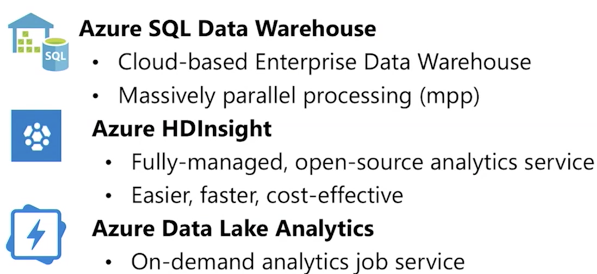

# AZ-900: Microsoft Azure Fundamentals 1

Video Location:

https://jam4.sapjam.com/groups/uHgOt7YolZ5NzRYGR3LGat/documents/vTljn7CJCKiVxbOI8lZaZY/video_viewer

## AZ VM Services

## AZ Storage Accounts

## AZ Database Services

## Artifical Intelligence

## Big data and analytics

## Serverless Computing

## DevOps 

## Azure MarketPlace

## Azure Management Tool

## Azure Access Control Management

## Directory Difference

## Azure Active Directory

