# AZ-900: Microsoft Azure Fundamentals 2

## Azure Security Service

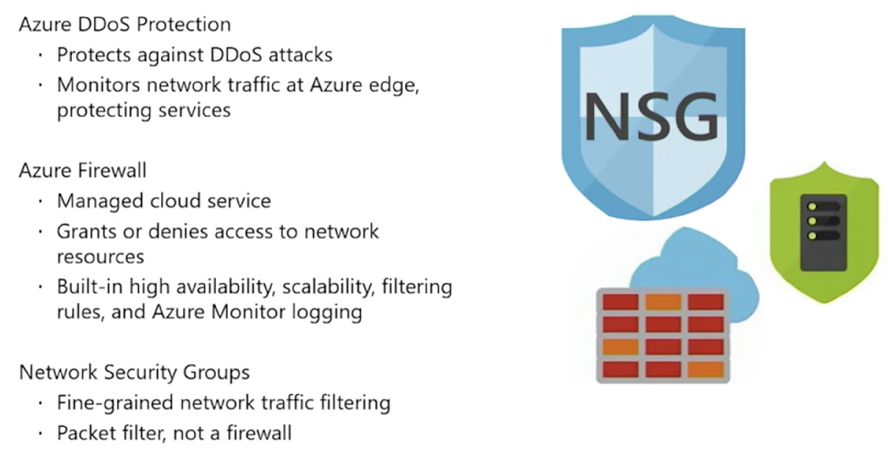

## Azure Security Center

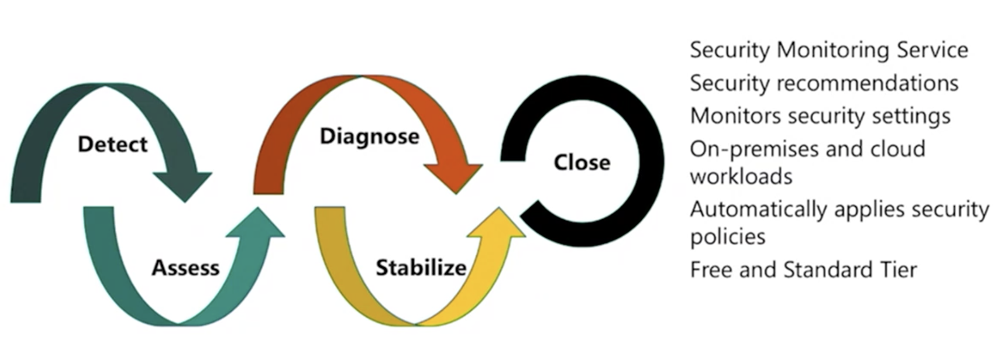

## Azure Key Vault

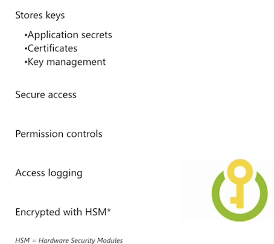

## Azure Information Protection

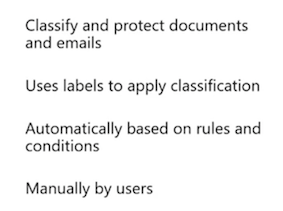

## Azure Advanced Threat Protection (Azure ATP)

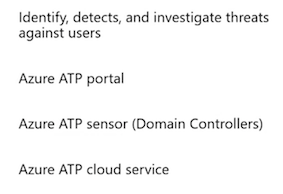

## Azure Monitoring

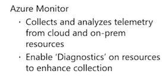

## Governance

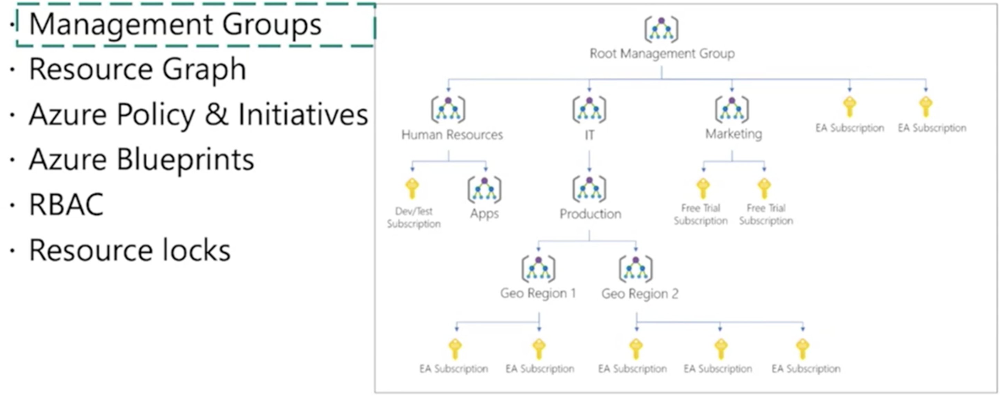

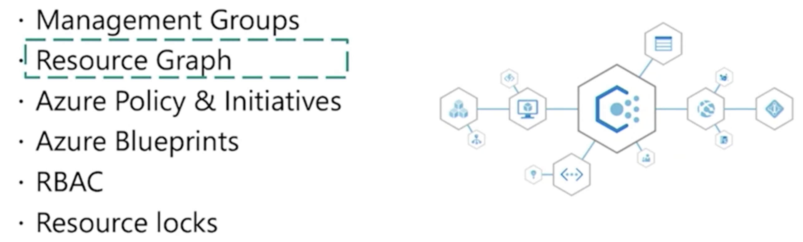

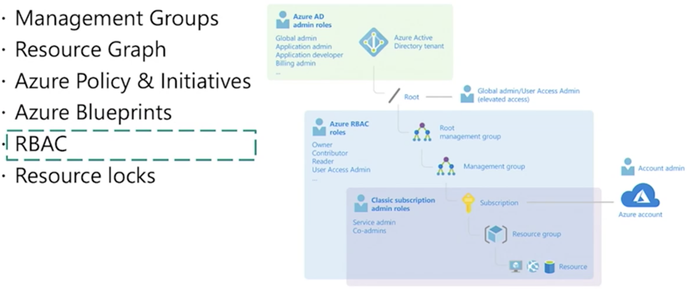

## General Availability

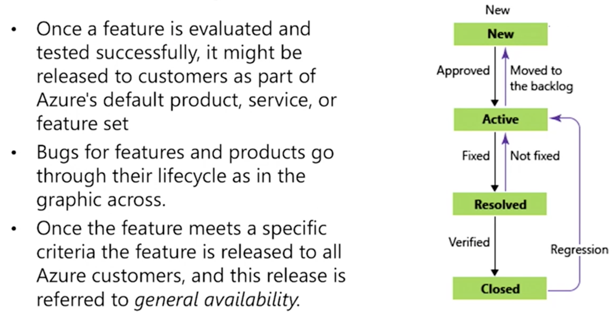

## Privacy & Compliance

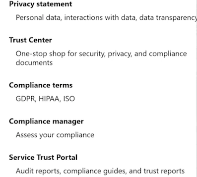

## Management Group

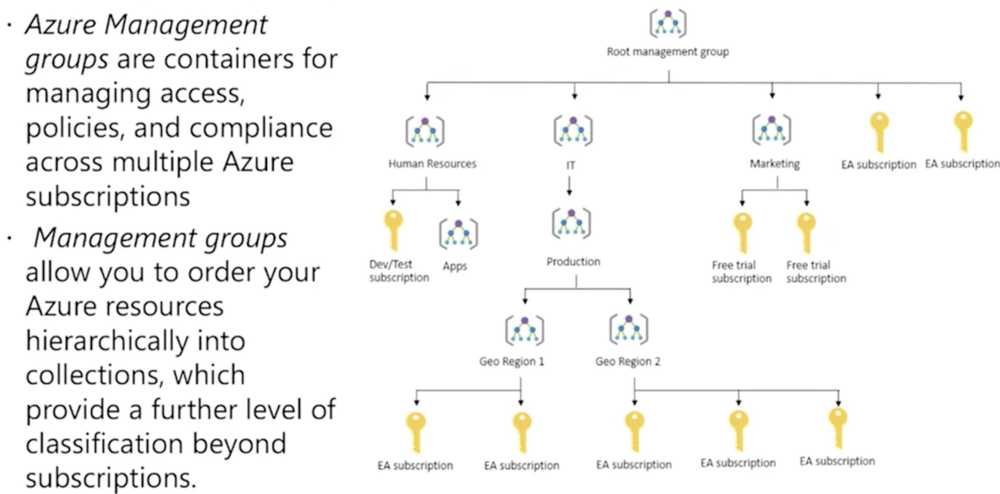

## Azure Hierarchy

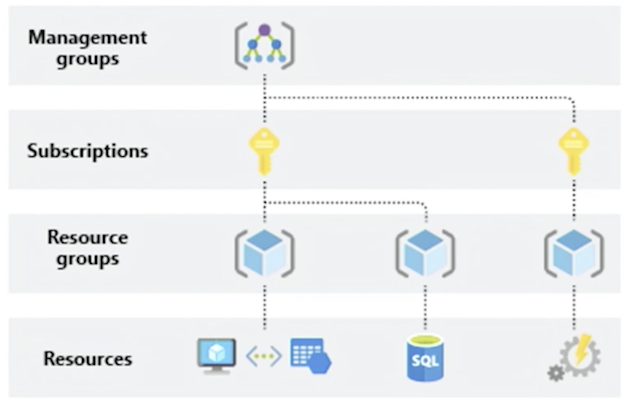

## Azure Subscriptions

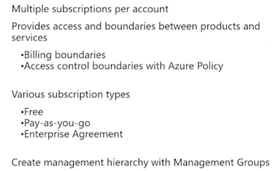

## Pricing & purchasing

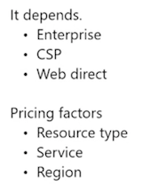

## Pricing Tools

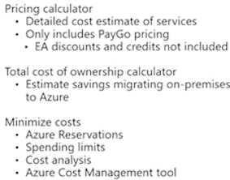

## Azure Support Plans

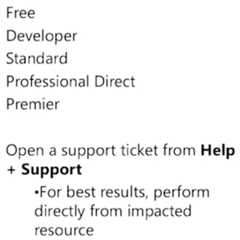

## Azure SLAs

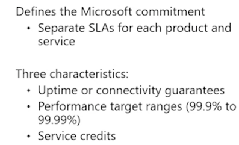

## Composite SLAs

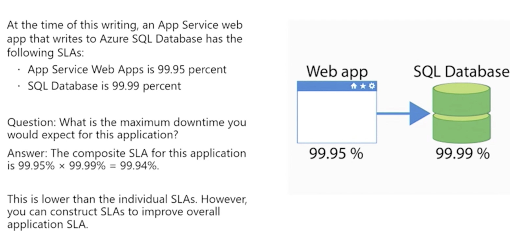
