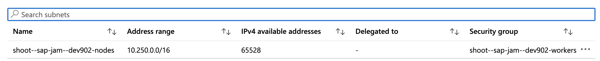
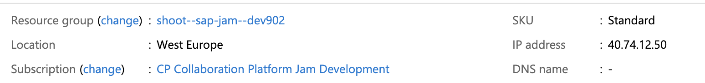
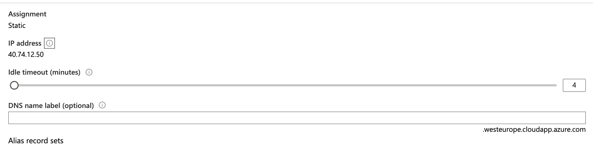
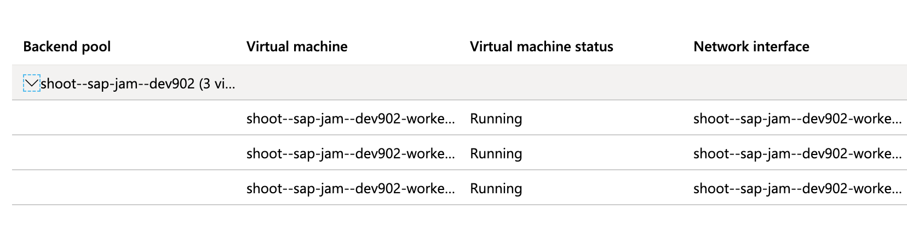

# Networking concepts

## Understand Azure networking components

### Azure Active Directory 

* A **directory**, a directory listing of **users** and **groups** and **authentication components** which provide the identity and management solution for **Microsoft Azure**, as well as the **identity and management solution** for its underlying infrastructure or infrastructures that reside on top of Azure, such as **Office 365**. 
* **Azure Active Directory is your authentication authorization solution** for your resources that are stored in Azure, and it is built completely into Microsoft Azure. 

## Networking components 

### The IP address 

Every resource in Azure has an IP address if it's going to be accessed remotely or internally as part of Azure. 

**Your virtual machines, your software applications, your websites, you can assign IP addresses to those resources.**

### The IP subnets

The IP addresses will reside within IP subnets. 

All of our IP addresses will reside in a subnet, and the functionalities of using a subnet which you use in your on-premises solution is something that we consistently apply within Azure, and we do create subnets and organize those subnets together as part of our Azure infrastructure. 

**Those IP subnets are actually organized in a virtual network.** 

### Virtual network

**Overall networking solution in Azure will be your virtual network.** 

You can have one or more virtual network, and **each virtual network can contain one or more IP subnets**. 

Those virtual network will then contain all of your resources that you're going to create in Azure, such as your **databases and your virtual machines and your servers and all of the various components that will live in your Azure subscription**.

### Virtual network gateways

**Virtual networks can access each other and be connected to an on-premises solution using virtual network gateways.** 

A virtual network gateway will be the gatekeeper to your virtual network and can connect to other virtual network gateways to provide connectivity between multiple virtual networks. 

### load balancers

The load balancers will allow you to balance the load and ensure that connectivity from the external world, so **connectivity from either an on-premises solution or users that are out in the internet that need to access your resources that are stored in Azure**, that that access can be quick and can be highly available because you can implement one or more load balancers. 

###  Virtual private network. 

If users need to access your Azure resources and those resources are accessed through the internet, they will be using a VPN connection to access those Azure resources. 

There're two types of VPNs in Azure:

* **Site-to-site VPN**
	* A site-to-site VPN is a connectivity between two networks; now, **one of those networks would be a Azure network, and the other network may be a on-premises or a data-center network.**

* **Point-to-site VPN**
	* A point-to-site VPN is configured when you have just **several users or several administrators that need to remotely access the Azure resources through that secured link**, then you would create a VPN for them, and you would create a point-to-site VPN for them, which would allow them to use the VPN client application to establish that tunnel. 
	* It is not a permanent connection; it is an on-demand connection when the remote user needs to connect to the Azure resources.  

### ExpressRoute (ExpressRoute circuit) 

**An ExpressRoute circuit is a dedicated connection between a various resource and Azure.**

That resource can be either a private, a public, or a Microsoft resource. A Microsoft resource is an Office-365 subscription. 

* Imagine if you needed a **dedicated link between your Office-365 subscription and your Azure environment**, you can create that dedicated link, which is an ExpressRoute link. 

* If you wanted to have a **dedicated connection between your on-premises datacenter and your Azure resources**, that would be a private ExpressRoute circuit. 

* A dedicated connection is, actually, a dedicated physical link. So you would have a supported provider, which is a supported telecom provider, which would provide the physical infrastructure for your internal infrastructure to connect to Azure. 
* Within Azure we create the object that is associated to that, which is called the **ExpressRoute**. 
* ExpressRoute provides that fast, dedicated connectivity; as well, it comes at a higher cost. So there's no cost, besides the hosting cost of Azure, but this cost here of the ExpressRoute is a dedicated networking cost, which is outside of Microsoft's costs

### Front Door service

One of those services that is used for denial, DoS attacks, DDoS attacks

### DNS Zone 

A DNS Zone can be created and hosted in Azure. Just like **third-party hosting provider**, now it can be created in Azure

### Firewall (Newer version `Network Security Group`)

The Azure firewall is a mechanism for providing `security rules` for **inbound access into your Azure infrastructure**. 

So if you have your resources that are secured in Azure and you want them to be accessible from the internet, **you may want to specify a number of rules and access rules, and you want to establish from where and who and what IP addresses** can establish connections to your resources through this firewall

## Manage virtual networks

* 1. **Address space** is vast enough to contain those subnets

* 2.**Subnet**

* 3. **Denial of Service protection**
* 4. **DNS servers**
* 5. **Peerings**
	* Connect multiple virtual networks together, you can peer them together
* 6. **Service endpoints**（VPCe)
	* Specific servicing needs for your virtual network, different services that need to connect to those virtual networks. You can create an endpoint for those virtual networks
* 7. **automation script**
	* This is specific to any resource in Azure. There's an automation option, so you can actually automate the deployment of resources in Azure.

## Create Public Ip address

## Manage a load balancer

### Health probes

Health probe are an essential element of configuring your load balancer to specify **the availability of that load balancer**

### Back end pool

Back end pool is those resources that I'm going to publish through this load balancer.

* **Virtual machines**
* **Availability sets** which are essentially sets of virtual machines 

### front end IP configuration

public IP address

### inbound NAT rules. 

**NAT rules are for network address translation.**

And basically translate an internal IP address which is a non publicly routable through the Internet to a publicly routable IP address. 

An IP address that can be accessed from the Internet.

### Load balancer can have multiple roles or functionalities. 

* It can behave as a **balancer for multiple links or multiple servers** to ensure availability.
* **It can translate internal resources to an external public IP address.**