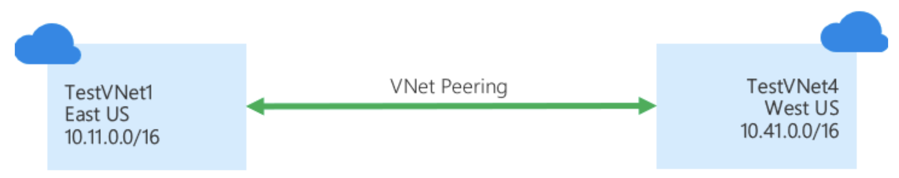
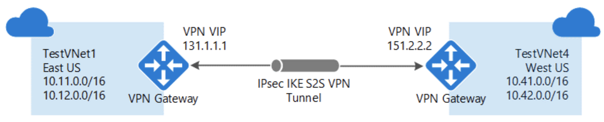
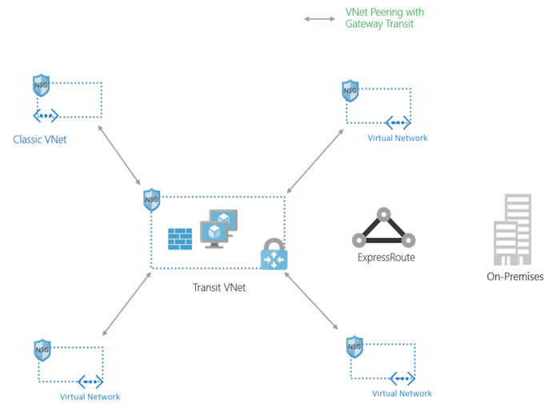

# Choosing between Azure VNet Peering and VNet Gateways

As customers adopt Azure and the cloud, they need fast, private, and **secure connectivity across regions** and **Azure Virtual Networks (VNets)**. 

Based on the type of workload, customer needs vary. For example, if you want to ensure data replication across geographies you need a high bandwidth, low latency connection. 

Azure offers connectivity options for VNet that cater to varying customer needs, and you can **connect VNets via VNet peering or VPN gateways**.

## VNet peering

**VNet peering** enables you to seamlessly connect Azure virtual networks. 

**Once peered, the VNets appear as one**, for connectivity purposes. 

The traffic between virtual machines in the peered virtual networks is routed **through the Microsoft backbone infrastructure**, much like traffic is **routed between virtual machines in the same VNet**, through **private IP addresses only**. 

**No public internet is involved.** 

**You can peer VNets across Azure regions**, too – all with a single click in the Azure Portal.

* **VNet peering** - connecting VNets within the **same Azure region**
* **Global VNet peering** - connecting VNets **across Azure regions**

To learn more, look at our documentation overview "[Virtual network peering](https://docs.microsoft.com/en-us/azure/virtual-network/virtual-network-peering-overview)" and "[Create, change, or delete a virtual network peering](https://docs.microsoft.com/en-us/azure/virtual-network/virtual-network-manage-peering)."

## VPN gateways

A VPN gateway is a specific type of VNet gateway that is used to **send traffic between an Azure virtual network and an on-premises location over the public internet**. 

You can also use a **VPN gateway to send traffic between VNets**. 

**Each VNet can have only one VPN gateway.**

To learn more, look at our documentation overview "[What is VPN Gateway?](https://docs.microsoft.com/en-us/azure/vpn-gateway/vpn-gateway-about-vpngateways)" and "[Configure a VNet-to-VNet VPN gateway connection by using the Azure portal.](https://docs.microsoft.com/en-us/azure/vpn-gateway/vpn-gateway-howto-vnet-vnet-resource-manager-portal)"

## Which is best for you?

While we offer two ways to connect VNets, based on your specific scenario and needs, you might want to pick one over the other.

### VNet Peering

provides a low latency, high bandwidth connection useful in scenarios **such as cross-region data replication and database failover scenarios.** 

**Since traffic is completely private and remains on the Microsoft backbone**, customers with strict data policies prefer to use VNet Peering as public internet is not involved. 

Since there is **no gateway in the path, there are no extra hops, ensuring low latency connections**.

### VPN Gateways 

Provide a limited bandwidth connection and is useful in scenarios where **encryption is needed**, but bandwidth restrictions are tolerable. In these scenarios, customers are also not as latency-sensitive.

## VNet Peering and VPN Gateways can also co-exist via `gateway transit`

**Gateway transit** enables you to **use a peered VNet’s gateway for connecting to on-premises** instead of **creating a new gateway for connectivity**. 

As you increase your workloads in Azure, you need to scale your networks across regions and VNets to keep up with the growth.

**Gateway transit allows you to share an ExpressRoute or VPN gateway with all peered VNets** and lets you manage the connectivity in one place. Sharing enables cost-savings and reduction in management overhead.

With gateway transit enabled on VNet peering, **you can create a transit VNet that contains your VPN gateway, Network Virtual Appliance, and other shared services.** 

As your organization grows with new applications or business units and as you spin up new VNets, **you can connect to your transit VNet with VNet peering**. 

This prevents adding complexity to your network and reduces management overhead of managing multiple gateways and other appliances.

## Differences between VNet Peering and VPN Gateways

  					 | VNet Peering  |  VPN Gateways
------------- | -------------  | -------------
**Cross-region support?**  | Yes – via Global VNet Peering   | Yes
**Cross-Azure Active Directory tenant support**？  | Yes         |  Yes
**Cross-subscription support?**  | Yes   | Yes
**Cross-deployment model support?**  | Yes  | Yes
**Limits**		| You can keep up to 500 VNets with one VNet | Each VNet can only have one VPN Gateway. 
**Pricing**  | 	`Ingress/Egress` charged. | `Gateway + Egress` charged.
**Encrypted?** | 	Software level encryption is recommended  | Yes, custom IPsec/IKE policy can be created and applied to new or existing connections.
**Bandwidth limitations?** | No bandwidth limitations.  |  Varies based on type of Gateway from 100 Mbps to 1.25Gps.
**Private?**  | Yes, no Public IP endpoints. Routed through Microsoft backbone and is completely private. No public internet involved.  | Public IP involved.
**Transitive relationship** | If VNet A is peered to VNet B, and VNet B is peered to VNet C, VNet A and VNet C cannot currently communicate | If VNet A, VNet B, and VNet C are connected via VPN Gateways and BGP is enabled in the VNet connections, transitivity works.
**Typical customer scenarios** | Data replication, database failover, and other scenarios needing frequent backups of large data.  | Encryption specific scenarios that are not latency sensitive and do not need high throughout.
**Initial setup time** | It took me 24.38 seconds, but you should give it a shot!  | 30 mins to set it up

## Conclusion

Azure offers VNet peering and VNet gateways to connect VNets. Based on your unique scenario, you might want to pick one over the other. We recommend VNet peering within region/cross-region scenarios.

 
