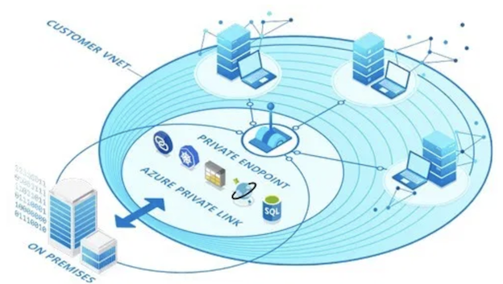
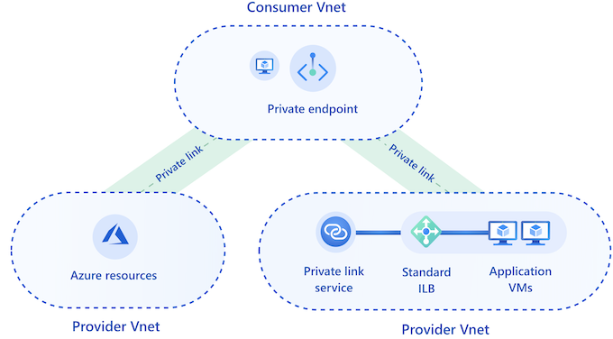
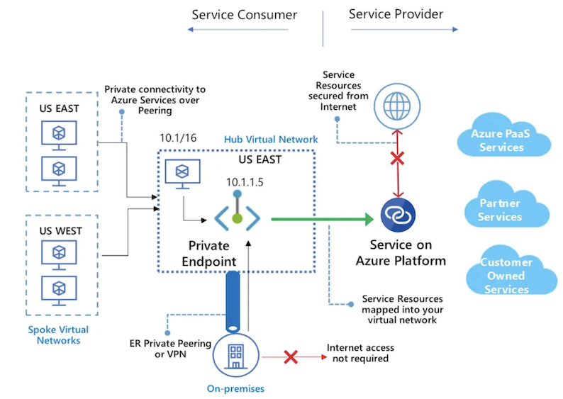
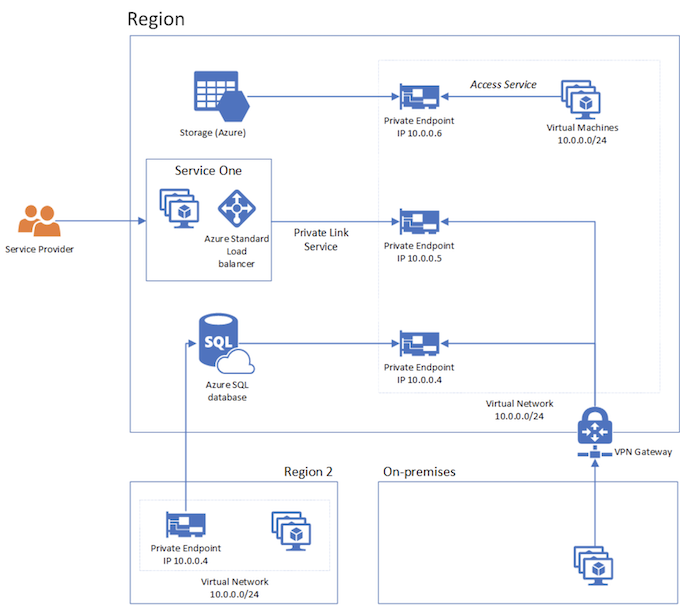
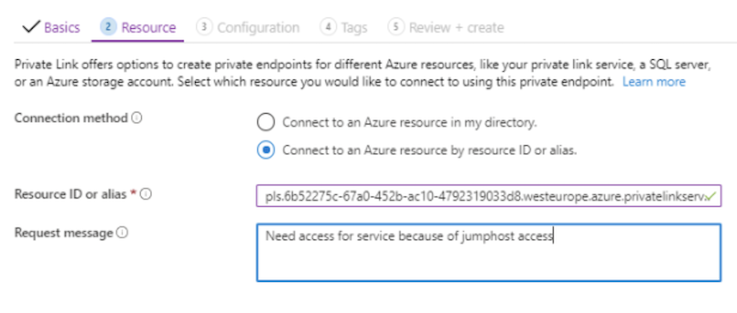
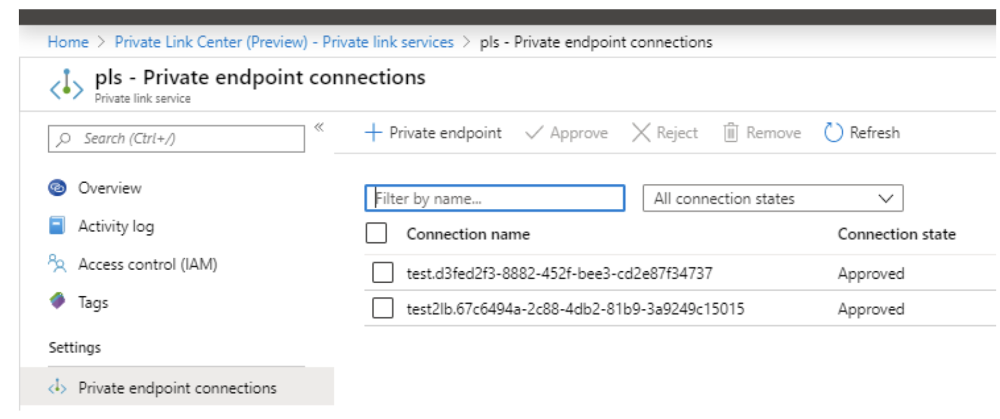
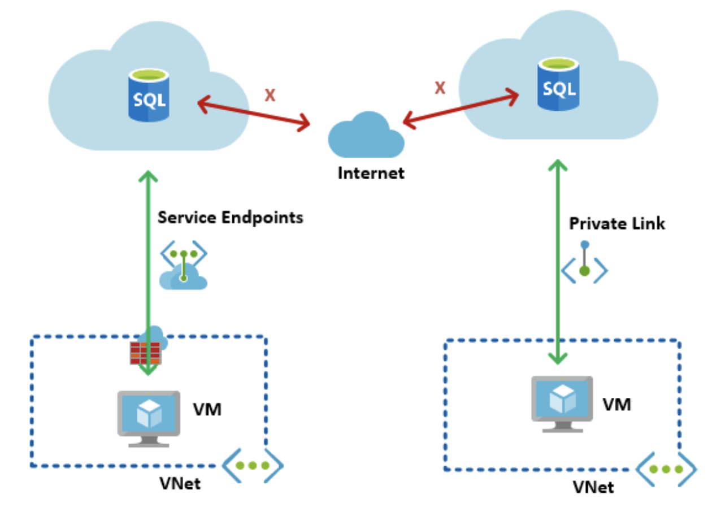
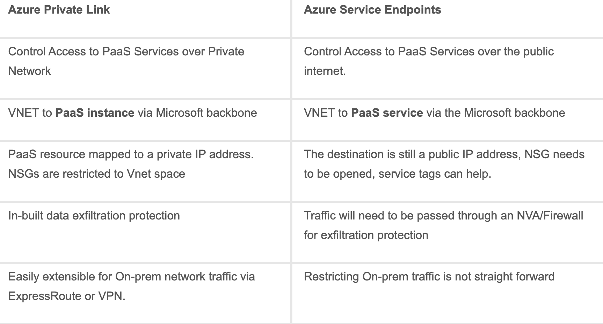

# Azure Private Link vs Azure Service Endpoints

* Azure Private links and Endpoints
* Azure Private Link vs Azure Service Endpoints
* Azure Private Link Overview

## Azure Private links and Endpoints

**Build and allow private connections between resources with Private Link**

**Azure Private Link** is a secure and scalable way to create, share, and connect to Azure. 

**All data that flows from a provider to a consumer is isolated from the internet and stays on the Microsoft back end**

One of the new features that was released from Microsoft the last couple of weeks was something called **Azure Private Link**. 

Private Link is a new feature which allows you to securely connect to PaaS services or a custom service internally from within a **VNET**. 

By default, PaaS services such as **Storage** or **Web Apps** are **publically available using FQDN**. For instance if you had a **storage account** and you wanted to access it from an on-premises environment the traffic would go out to the internet and then to the FQDN of the storage solution, which was regardless if you have a VPN connection to Microsoft Azure.

## What about Service Endpoints?

Now up until now, Microsoft has also had other solutions for connecting to PaaS services securely from the inside using Service Endpoints.

Now unlike Service Endpoints, **Private Endpoints can be published across tenants meaning that I can as a service provider publish endpoints into another tenant** and also **Service Endpoints connections are still using the public FQDN while Private Links are internally routed**.

As of the preview is now, the following services are supported for Private Links

* Azure SQL
* Azure SQL Datawarehouse
* Azure Cosmos DB
* Azure Data Lake Gen 2
* Azure Storage
* Private Link Service (Which can be any service from for instance a service provider behind a standard load balancer)
* More services planned, but are coming in a later stage.

Now an interesting piece about the last part here is that **Private Link Serivce** allows **service providers to provide services within a customer VNET**. 

The services they can provide can be anything that is supported behind a Azure Internal **Standard Load Balancer**, which can be anything TCP related service.

**NB**: It is important to note that Private Link Services can only be **TCP based & IPv4 based**.

As seen beneath here is an example of a service connection using Private Endpoint within a customer tenant, where they are **consuming services from both PaaS and a Private Link Service from a Service Provider.** 

**When you create a Private Endpoint you essentially create a NIC with a Private IP within your VNET which is then connected to a backend service running within the MSP vNET.**

When you setup a connection to a 

* **Private Link is can either be done Automatically** (If you have the correct permissions) 
* or **Manually (Last part is if you are going to connect to a service provider service)** 
* And **creating a private link within a VNET also generates an DNS name** which the service is attached to.

*Here I am connecting to a private link at a MSP(Managed Service Provider) using a resource ID.*

This is an example of how a **service provider has multiple connections to different tenants with a private links.**

Only issue now is that there is not a good way to describe the connection, unless the customer uses a specific naming standard on their end.

In this you need to create a **service endpoint** which you then attach to a **service endpoint** using a **resource ID** which you can get from your service provider. 

**The Private Link service itself cannot be created using the Portal, only Private Endpoints** so you can only create the private link using the API or PowerShell as listed here –> https://docs.microsoft.com/en-us/azure/private-link/create-private-link-service-powershell

### And some quick Q&A

* **Does the Private Endpoints require a custom subnet?** No they can be in any type of subnet
* **Can I connect to Private Endpoint trough a VNET Peering?** Yes that is supported, but as of now you will need to Deploy a single VM on the peered Virtual Network to enable the connectivity to the service
* **Do I need to have the Private Endpoint and the service in the same region?** No you can have for instance a Private Link or a service from an MSP in one region and the Private Endpoint in another region.
* **What other services will be supported moving forward?** The following services will be added support for Azure Cosmos DB, Azure MySQL, Azure PostgreSQL, Azure MariaDB, Azure Application Service, and Azure Key Vault

## Azure Private Link vs Azure Service Endpoints

* **Service endpoint** uses the **public IP address of the PaaS Service when accessing the service**
* **Private Link** introduces a **private IP for a given instance of the PaaS Service** and the **service is accessed via the private IP**

With the architecture, there are additional features that come with Private Link that can’t be achieved via the Service Endpoints. **With the private link, you can `restrict` access per instance whereas with private endpoints you don’t get that capability**

## Azure Private Link Overview

**The key features that Azure Private Link provides are below:**

* **Access to Azure PaaS Services from Vnets, On-prem Networks and Peered networks**
* Traffic traverse within Microsoft backbone.
* No need to provision gateways or virtual appliances, the service provides a private IP in your network.
* Private Link IP’s in a VNET can be connected to services from any Azure Location.
* Works across AD Tenants.

**What benefits can customers get out of this service?**

* Customers always want to connect to the cloud services privately and keep all the network traffic private. This can be easily achieved by using Azure Private Link.
* It helps the customers to satisfy with the company security and compliance requirements.
* It helps customers to prevent data exfiltration.