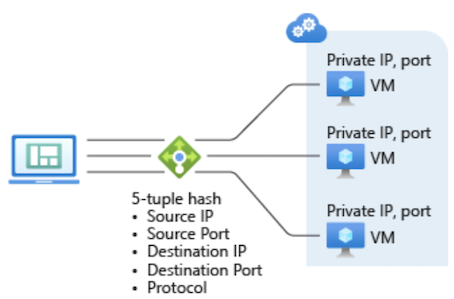
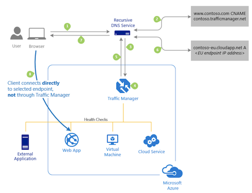
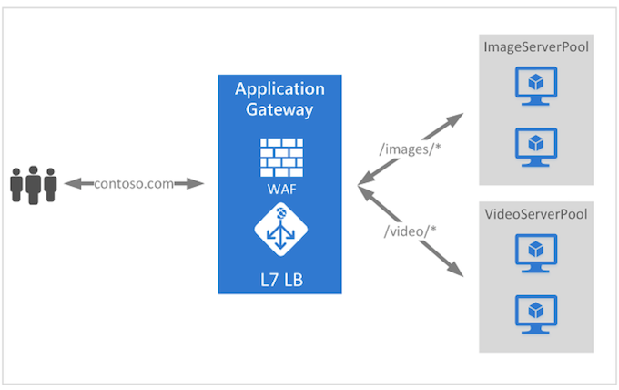

# Azure Load Balancer vs Azure Application Gateway vs Azure Traffic Manager

If we have a workload within a **availability set** or **vm scale set** then we can use traditional **azure load balancer** .

If we want to send a **specific traffic to a specific pool** then we can use **Azure Application Gateway** , like `“/image”` request to `image server` .

If we want to **balance load between cross environment based on routing method **then we can use **traffic manager** . 

In this post I will describe about Azure Application Gateway , Traffic Manager and Load Balancer and WAF (Web Application Firewall)

## Azure Load Balancer

* Load-balance incoming internet traffic to your VMs. **This configuration is known as a `public load balancer`**.
* Load-balance traffic across VMs inside a virtual network. Y**ou can also reach a load balancer front end from an on-premises network in a hybrid scenario.** Both scenarios use a configuration that is known as an **`internal load balancer`**.
* **Port forward traffic to a specific port on specific VMs** with inbound **network address translation (NAT) rules**.
* Provide **outbound connectivity** for VMs inside your virtual network by using a **public load balancer**.

## Traffic Manager

**Let’s say you want to balance load between two endpoint where your first endpoint is in Azure and 2nd endpoint is in on-prem .**

In this scinario we can use Traffic Manager . Traffic Manager allows you to control the distribution of user traffic for service endpoints in different datacenters. Service endpoints supported by Traffic Manager include Azure VMs, Web Apps, and cloud services. You can also use Traffic Manager with **external, non-Azure endpoints**.

When using a vanity domain with Azure Traffic Manager, you must use a `CNAME` to point your `vanity domain name` to your Traffic Manager domain name. 

**DNS standards do not allow you to create a CNAME at the ‘apex’ (or root) of a domain.** 

Thus you cannot create a CNAME for ‘contoso.com’ (sometimes called a ‘naked’ domain). You can only create a CNAME for a domain under ‘contoso.com’, such as ‘www.contoso.com’. To work around this limitation, **we recommend using a simple HTTP redirect to direct requests for ‘contoso.com’ to an alternative name such as ‘www.contoso.com’**.

### Routing Method :

* **Priority**: Select **Priority** when you want to use a primary service endpoint for all traffic, and provide backups in case the primary or the backup endpoints are unavailable.
* **Weighted**: Select **Weighted** when you want to distribute traffic across a set of endpoints, either evenly or according to weights, which you define.
* **Performance**: Select **Performance** when you have endpoints in different geographic locations and you want end users to use the “closest” endpoint in terms of the lowest network latency.
* **Geographic**: Select **Geographic** so that users are directed to specific endpoints (Azure, External, or Nested) based on which geographic location their DNS query originates from. This empowers Traffic Manager customers to enable scenarios where knowing a user’s geographic region and routing them based on that is important. Examples include complying with data sovereignty mandates, localization of content & user experience and measuring traffic from different regions.

## Azure Application Gateway (Like AWS ALB)

Azure Application Gateway is a web traffic load balancer that enables you to manage traffic to your web applications.

**Traditional load balancers operate at the transport layer (OSI layer 4 – TCP and UDP) and route traffic based on source IP address and port, to a destination IP address and port. **

But with the Application Gateway you can be even more specific. For example, **you can route traffic based on the incoming URL. So if `/images` is in the incoming URL, you can route traffic to a specific set of servers (known as a pool) configured for images. If `/video` is in the URL, that traffic is routed to another pool optimized for videos.**

